# kmux — Specification

> **Status:** v0.4 · **Last updated:** 2026-10-08
>
> **Reference model:** [`reference/kmux/index.html`](../reference/kmux/index.html). Open it in a browser and try it.
> The model is the source of truth for kmux's design and behaviour. This document summarises what the model shows and lists what it doesn't answer yet. If the two disagree, the model wins, and this document should be fixed.
>
> **Related:** [kanna spec](kanna-spec.md), the CLI that drives kmux.

## Table of Contents

1. [Summary](#1-summary)
2. [What the Model Captures](#2-what-the-model-captures)
3. [Layout](#3-layout)
4. [Panes](#4-panes)
5. [Menus and Shortcuts](#5-menus-and-shortcuts)
6. [Moving Panes and Tabs](#6-moving-panes-and-tabs)
7. [Control Protocol](#7-control-protocol)
8. [Not Yet Decided](#8-not-yet-decided)
9. [Glossary](#9-glossary)

---

## 1. Summary

kmux is a desktop **mux**: one window of tabs, each split into **panes** that show terminals, web pages or iOS apps. Panes have no chrome. Everything is done through menus, shortcuts and dragging, or by other programs through the **control protocol**.

UI actions and protocol requests go through the same core, so a click and a `kanna` command always behave the same way.

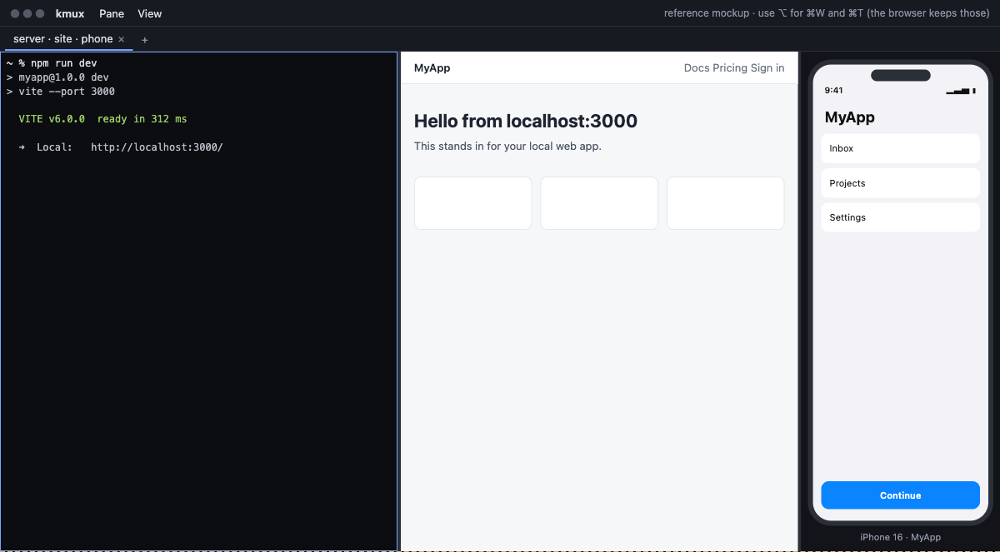

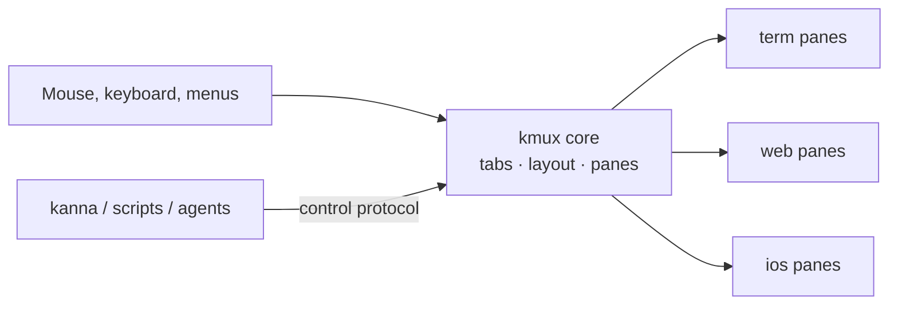

---

## 2. What the Model Captures

| Characteristic | Captured? | Notes |
|----------------|:---------:|-------|
| Look: chromeless panes, tabs, menus | ✅ | |
| Layout behaviour: splits, sizes, dragging, moving | ✅ | |
| Pane lifecycle and error states | ✅ | |
| Shortcuts and menus | ✅ | The browser reserves ⌘W and ⌘T, so the model also accepts ⌥ in place of ⌘. |
| Control-protocol commands and replies | ✅ | The model's console (marked **MOCKUP ONLY**) stands in for kanna. It is not part of kmux. |
| Real terminals, web views and simulators | ❌ | Simulated. See [section 8](#8-not-yet-decided). |
| Transport (socket), persistence, performance | ❌ | See [section 8](#8-not-yet-decided). |

---

## 3. Layout

### 3.1 Structure

A window holds **tabs**. Each tab holds a tree of **splits** (`row` = side by side, `column` = stacked) with panes at the leaves.

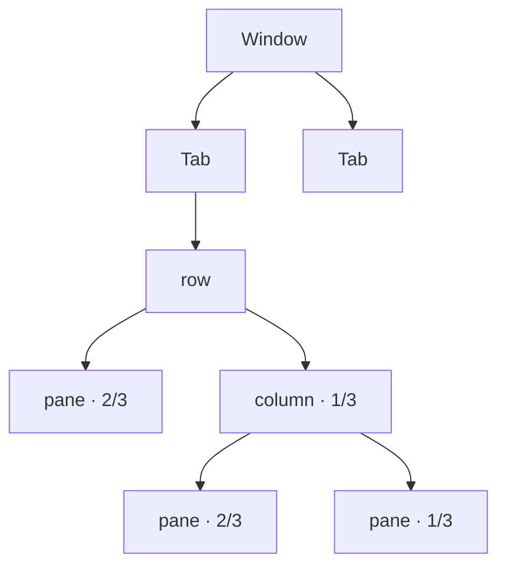

- A tab's title lists its pane names, e.g. `site · server · phone`.
- An empty tab offers buttons to open a terminal, web or iOS pane.
- Closing a tab closes its panes.

### 3.2 Sizes

Every size is a **fraction of its parent split**. The fractions in a split always add up to 1, and they stay proportional when the window is resized.

| Action | Rule |
|--------|------|
| New split | The new pane gets `size` (default **1/2**) of the focused pane's space. |
| Split direction | `right` or `down` when given. Otherwise (`auto`), side by side if the focused pane is wider than it is tall, stacked if not. |
| Same-direction parent | The new pane becomes a sibling in that split, not a nested split, so three "split right"s give three columns. |
| New pane focus | The new pane takes focus. |
| Close | The siblings share the freed space in proportion to their sizes. A split left with one child disappears. |
| Resize | The pane gets the new fraction, and its siblings share the rest in proportion to their sizes. |
| Divider drag | Snaps to ¼, ⅓, ½, ⅔ or ¾ when within 1.5% of one. A tooltip shows both fractions, e.g. `2/3 \| 1/3`. Panes can't be dragged below 80 px. |

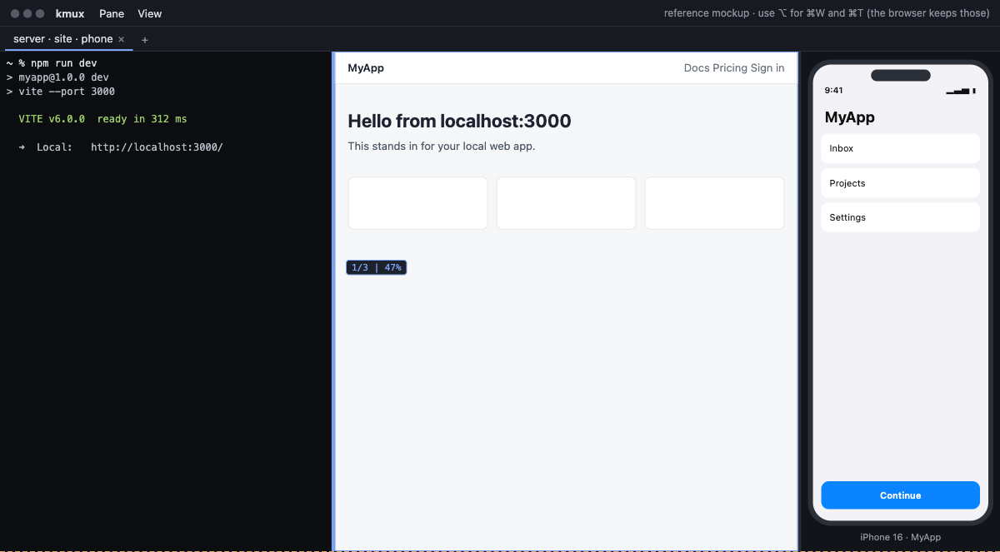

### 3.3 Arrange

`arrange` replaces the active tab's layout with a given tree (see [7.2](#72-layout-trees)):

- Children without a size share whatever space is left. If every child has a size and they add up to less than 1, they are scaled up to fill the space.
- If the sizes add up to more than 1, the request is rejected and nothing changes.
- Panes in the tab that the tree doesn't mention move to a new tab called `unarranged`.

---

## 4. Panes

### 4.1 No chrome

- Panes have no header, title or border.
- A **✕** close button appears in the top-right corner while the pointer is over the pane.
- The focused pane has a thin accent outline, shown only when the tab has more than one pane.
- Errors and exits are shown inside the pane itself (see below).

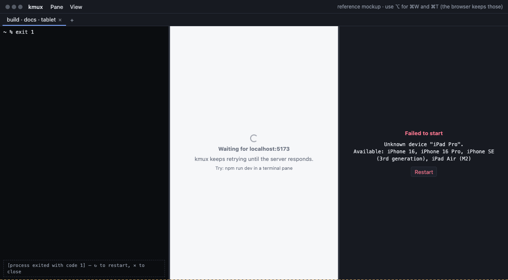

### 4.2 Types

| Type | Shows | Behaviour in the model |
|------|-------|------------------------|
| `term` | A shell or command, in a Ghostty terminal | Runs `cmd` if given. Ctrl+C interrupts. `exit [code]` moves the pane to **exited** and shows the code. |
| `web` | A web page | No address bar. **Open URL** (⌘L) shows a floating address field. A `localhost` URL whose server isn't up shows "Waiting for …" and loads once the server responds. |
| `ios` | An app in the native iOS Simulator | Shows "Booting \<device\>…", then the app. Clicks are forwarded to the simulator. An unknown device fails and lists the available devices. |

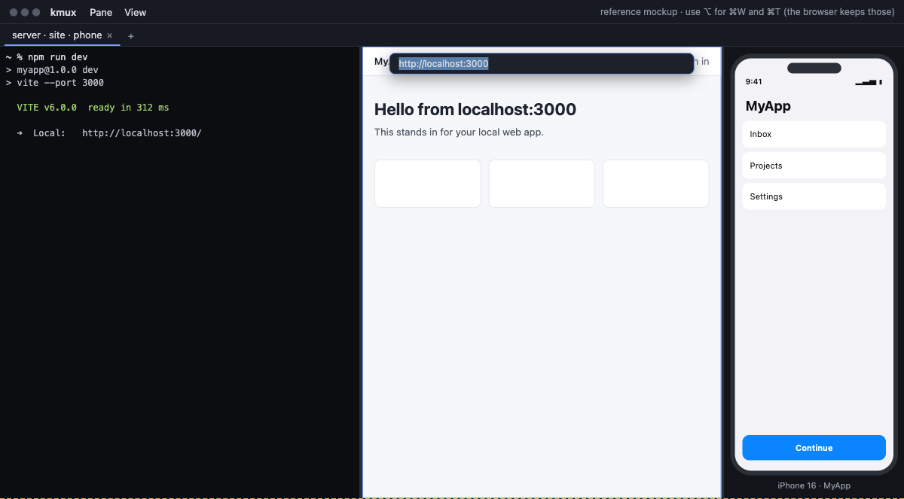

### 4.3 Lifecycle

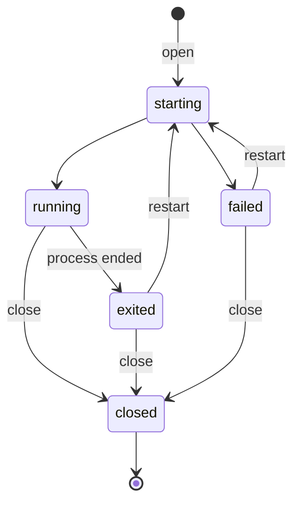

`open`, `restart` and `navigate` wait until the pane is **running** or **failed** before replying, unless the request sets `wait: false`.

---

## 5. Menus and Shortcuts

| Action | Shortcut | Where in the UI |
|--------|----------|-----------------|
| Split right (new terminal) | ⌘D | Pane menu, right-click |
| Split down (new terminal) | ⇧⌘D | Pane menu, right-click |
| New web / iOS pane right or below | — | Pane menu, right-click |
| Next / previous pane | ⌘] / ⌘[ | Pane menu, right-click |
| Open URL (web panes) | ⌘L | Pane menu, right-click |
| Zoom / unzoom | ⇧⌘↩ | Pane menu, right-click |
| Restart | ⌘R | Pane menu, right-click |
| Close pane | ⌘W | Pane menu, right-click, hover ✕ |
| New tab | ⌘T | View menu, **+** |
| Next / previous tab | ⇧⌘] / ⇧⌘[ | View menu |

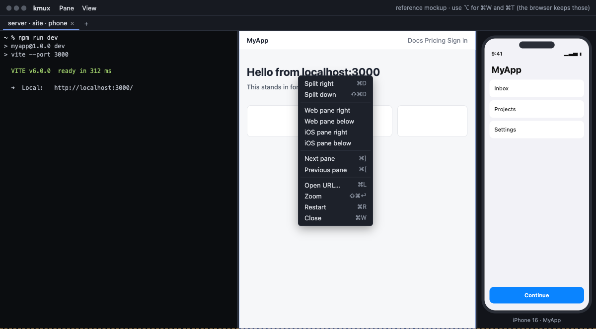

- Pane order is reading order: left to right, top to bottom. Both pane and tab navigation wrap around.
- Each tab remembers its last focused pane.
- Moving to a pane also moves keyboard input to it.
- Zoom makes one pane fill the tab. Moving focus to another pane cancels it.

---

## 6. Moving Panes and Tabs

**Tabs:** drag one along the tab bar. A marker shows where it will land.

**Panes:** hold ⌘ and drag a pane. A highlight shows where it will land:

| Drop on | Result |
|---------|--------|
| Near an edge of another pane | The pane docks on that side and takes half of the other pane's space. The nearest edge wins. |
| The centre of another pane (the middle 40% across and down) | The two panes swap places. |
| A tab | The pane moves to that tab as a new column. All columns then share the width equally. |
| **+** | The pane moves to a new tab. |

If moving a pane leaves its old tab empty, that tab is removed.

**Docking on an edge:** dragging `phone` near the left edge of `server` highlights the left half.

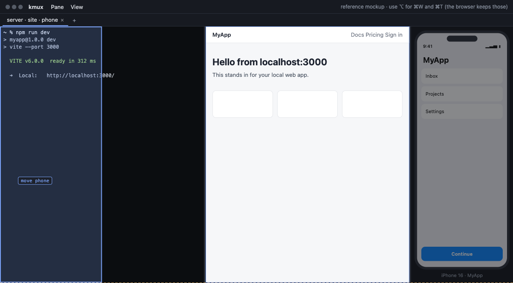

**Swapping:** dragging it to the centre of `server` highlights the whole pane.

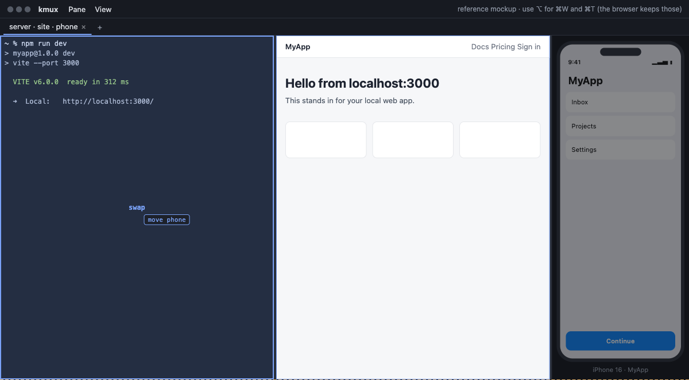

**Moving to a new tab:** dragging it onto **+** highlights the button.

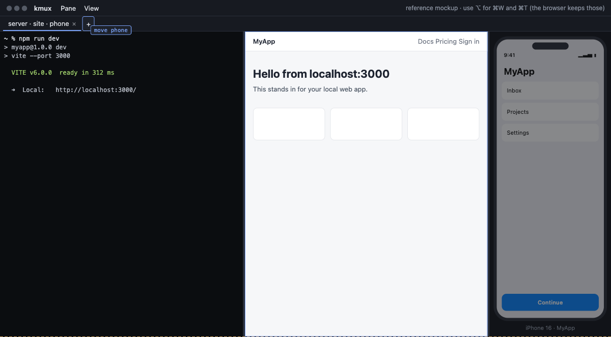

---

## 7. Control Protocol

Each request is `{ id, cmd, args }`. Each reply is `{ id, ok: true, … }` or `{ id, ok: false, error: { code, message } }`. A pane can be referred to by its ID (`p2`) or its name (`site`).

### 7.1 Commands

| `cmd` | `args` | Notes |
|-------|--------|-------|
| `capabilities` | — | Pane types and features. |
| `open` | `type`, `url` / `cmd` / `cwd` / `app` / `device`, `name?`, `split?` (`right` / `down` / `auto`), `size?`, `tab?`, `wait?` | See [3.2](#32-sizes). |
| `arrange` | `layout` (tree) | See [3.3](#33-arrange). |
| `move` | `pane`, then either `to` + `side` (`left` / `right` / `top` / `bottom` / `swap`) or `tab` (ID or `new`) | See [section 6](#6-moving-panes-and-tabs). |
| `resize` | `pane`, `size` | Fails if the pane fills its tab. |
| `list` | — | Tabs (with layout trees) and all panes. |
| `focus` | `pane` | Switches to the pane's tab. |
| `zoom` | `pane` | Toggles zoom. |
| `close` / `restart` | `pane` | |
| `send` | `pane`, `text` | `term` panes only. Runs `text` as a typed line. |
| `navigate` | `pane`, `url` | `web` panes only. |

### 7.2 Layout trees

```json
{ "split": "row", "children": [
    { "pane": "server", "size": "2/3" },
    { "split": "column", "children": [ { "pane": "site" }, { "pane": "phone", "size": "1/3" } ] }
] }
```

A size can be written as a fraction (`"1/3"`), a percentage (`"25%"`) or a decimal (`0.25`). `list` and replies always use the simplest fraction, e.g. `"1/3"`.

### 7.3 Errors

| `code` | When |
|--------|------|
| `bad_request` | Unknown command or argument, invalid fraction, or resizing a pane that fills its tab. |
| `not_found` | Unknown pane or tab. |
| `name_taken` | Pane name already in use. |
| `wrong_type` | `send` to a non-terminal pane, or `navigate` to a non-web pane. |
| `layout_invalid` | Malformed tree, a pane listed twice, or sizes adding up to more than 1. |
| `start_failed` | The pane went to **failed**. The message says why. |

---

## 8. Not Yet Decided

The model doesn't answer these yet. Each one needs either a decision from you or a model that covers it.

| # | Question | Needs |
|---|----------|-------|
| 1 | ~~Tech stack~~ **Decided: native macOS app, with Ghostty as the terminal.** | A prototype that embeds Ghostty, a web view and the simulator. Reuse earlier kanna-v3 work where possible. |
| 2 | ~~iOS pane~~ **Decided: the native iOS Simulator.** How it sits in a pane (mirrored into the pane, or the real Simulator window kept over it) is still open. | Prototype. |
| 3 | **Transport:** Unix socket path, permissions, one request per connection or a persistent connection? | Decision. |
| 4 | **Events:** can clients subscribe to changes (pane exited, URL changed)? | Decision, then extend the model. |
| 5 | **Pane identity:** without chrome, is the tab title enough to tell panes apart, or should the name show on hover? | Your call, then try it in the model. |
| 6 | **Tab commands:** should the protocol let clients rename, reorder and focus tabs? | Decision, then extend the model. |
| 7 | **Persistence:** should layouts survive an app restart? | Decision. |
| 8 | **Multiple windows: required.** How windows are created and moved between, and how clients target a window, still need designing. | Extend the model. |
| 9 | **Web navigation:** back/forward history and keyboard shortcuts? | Your call. |
| 10 | **Performance:** targets for pane start time, input latency and memory per pane. | A benchmark utility (the rdd "performance reference"). |

---

## 9. Glossary

| Term | Meaning |
|------|---------|
| **Mux (multiplexer)** | An app that shows several separate sessions in one window. |
| **Chrome** | The UI around content, such as title bars, headers and borders. kmux panes have none. |
| **Pane** | One area of a tab that shows one thing. |
| **Split** | A group of panes side by side (`row`) or stacked (`column`). |
| **Layout tree** | The nested splits and panes in a tab. |
| **Zoom** | Temporarily showing one pane over the whole tab. |
| **Control protocol** | The JSON requests that other programs use to drive kmux. |
| **Reference model** | The mockup in `reference/kmux/` that defines how kmux should look and behave. |
| **iOS Simulator** | Apple's tool, part of Xcode, for running iPhone apps on a Mac. |
