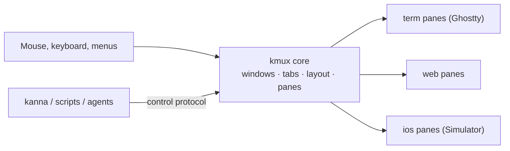
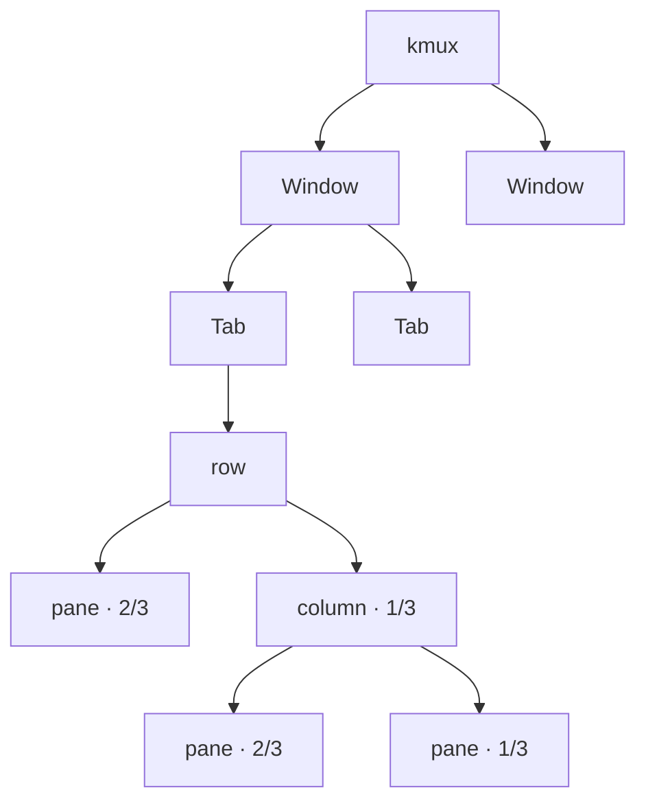
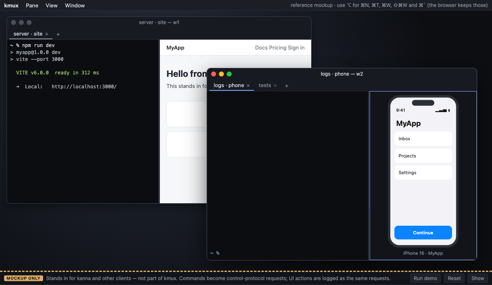
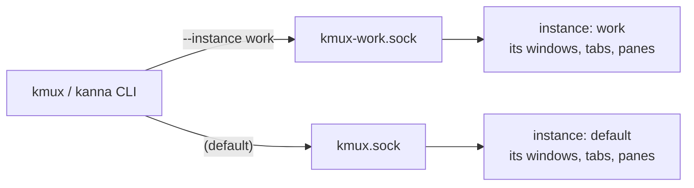
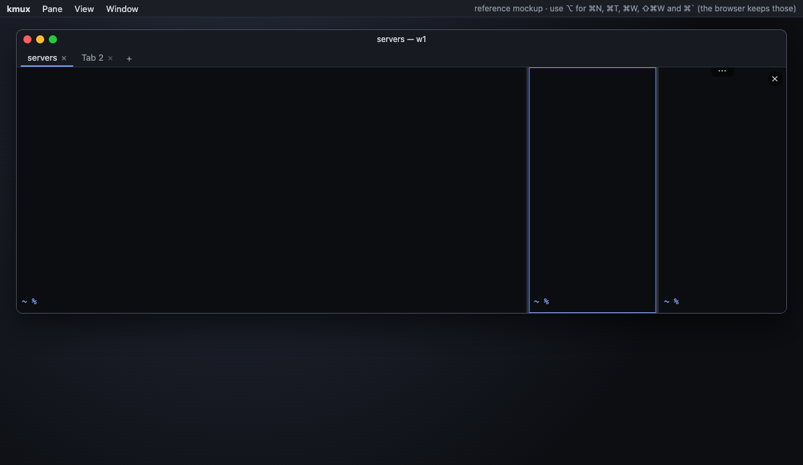
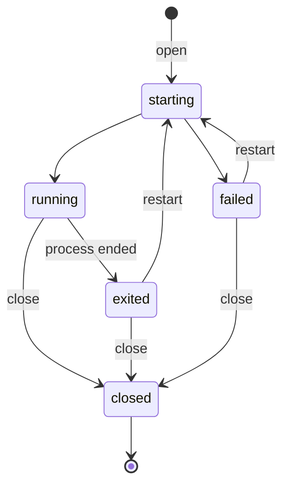
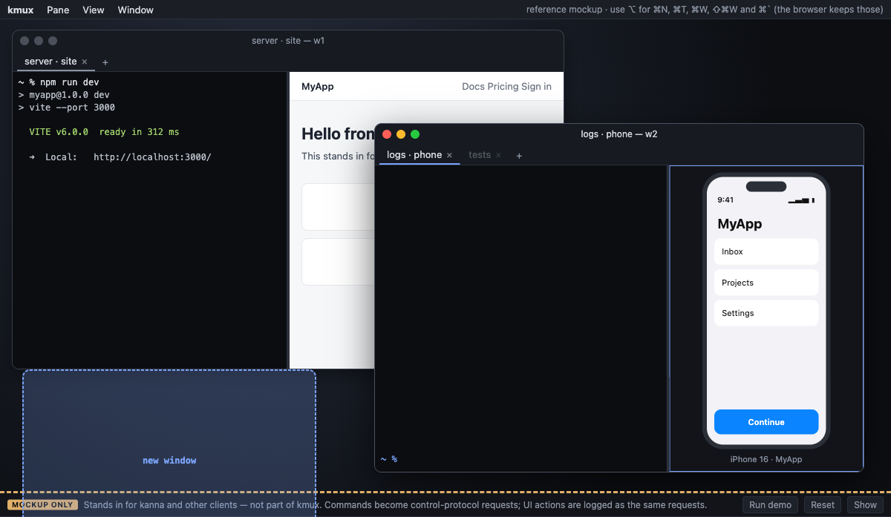

# kmux — Specification

> **Status:** v0.6 · **Last updated:** 2026-10-08
>
> **Reference model:** [`reference/kmux/index.html`](../reference/kmux/index.html). Open it in a browser and try it.
> The model is the source of truth for kmux's design and behaviour. This document summarises what the model shows and lists what it doesn't answer yet. If the two disagree, the model wins, and this document should be fixed.
>
> **Related:** the [kanna spec](../../kanna-v4/docs/kanna-spec.md) (separate kanna repo), a CLI that can drive kmux and other muxes. kmux also has its own `kmux` CLI (`crates/kmux`).

## Table of Contents

1. [Summary](#1-summary)
2. [What the Model Captures](#2-what-the-model-captures)
3. [Windows, Tabs and Layout](#3-windows-tabs-and-layout)
4. [Panes](#4-panes)
5. [Menus and Shortcuts](#5-menus-and-shortcuts)
6. [Moving Windows, Tabs and Panes](#6-moving-windows-tabs-and-panes)
7. [Control Protocol](#7-control-protocol)
8. [Decisions and Open Questions](#8-decisions-and-open-questions)
9. [Glossary](#9-glossary)

---

## 1. Summary

kmux is a native macOS **mux**. It has one or more windows of tabs, and each tab is split into **panes** that show Ghostty terminals, web pages or the iOS Simulator. Panes have no chrome. Everything is done through menus, shortcuts and dragging, or by other programs through the **control protocol**.

UI actions and protocol requests go through the same core, so a click and a `kanna` or `kmux` command always behave the same way. Several **instances** of kmux can run at once, each with its own windows and socket ([3.4](#34-instances)).




---

## 2. What the Model Captures

| Characteristic | Captured? | Notes |
|----------------|:---------:|-------|
| Look: windows, tabs, chromeless panes, menus | ✅ | |
| Layout behaviour: splits, sizes, dragging, moving | ✅ | Includes moving between windows. |
| Pane lifecycle and error states | ✅ | |
| Shortcuts and menus | ✅ | The browser keeps ⌘N, ⌘T, ⌘W, ⇧⌘W and ⌘\`, so the model also accepts ⌥ in place of ⌘. |
| Control-protocol commands and replies | ✅ | The model's console (marked **MOCKUP ONLY**) stands in for kanna. It is not part of kmux. |
| Real terminals, web views and simulators | ❌ | Simulated. See [section 8](#8-decisions-and-open-questions). |
| Transport (socket), persistence, performance | ❌ | See [section 8](#8-decisions-and-open-questions). |

---

## 3. Windows, Tabs and Layout

### 3.1 Structure

kmux has any number of **windows**. A window holds **tabs**. Each tab holds a tree of **splits** (`row` = side by side, `column` = stacked) with panes at the leaves.





- **Key window:** one window is the key (front) window. Shortcuts, menus and protocol requests without a `window` act on it. Clicking a window makes it key.
- **Focus:** each window remembers its focused pane and zoom state, and each tab remembers its last focused pane.
- **Titles:** new tabs are named `Tab 1`, `Tab 2`, … in each window. Double-click a tab to rename it: Enter or clicking away saves, Escape cancels. Clients rename tabs with `rename-tab`. A window's title is its active tab's title.
- **Empty containers close:** closing a tab's last pane closes the tab, and closing a window's last tab closes the window. With no windows left, kmux offers to open a new one.
- **Closing a tab or window** closes all of its panes.
- **New windows** cascade down and to the right of the key window.

### 3.2 Sizes

Every size is a **fraction of its parent split**. The fractions in a split always add up to 1, and they stay proportional when the window is resized.

| Action | Rule |
|--------|------|
| New split | The new pane gets `size` (default **1/2**) of the focused pane's space. |
| Split direction | `right` or `down` when given. Otherwise (`auto`), side by side if the focused pane is wider than it is tall, stacked if not. |
| Same-direction parent | The new pane becomes a sibling in that split, not a nested split, so three "split right"s give three columns. |
| New pane focus | The new pane takes focus, and its window becomes key. |
| Close | The siblings share the freed space in proportion to their sizes. A split left with one child disappears. |
| Resize | The pane gets the new fraction, and its siblings share the rest in proportion to their sizes. |
| Divider drag | Snaps to ¼, ⅓, ½, ⅔ or ¾ when within 1.5% of one. A tooltip shows both fractions, e.g. `2/3 \| 1/3`. Panes can't be dragged below 80 px. |


### 3.3 Arrange

`arrange` replaces a window's active tab layout with a given tree (see [7.2](#72-layout-trees)):

- The tree can name panes from any window, and those panes move into this tab.
- Children without a size share whatever space is left. If every child has a size and they add up to less than 1, they are scaled up to fill the space.
- If the sizes add up to more than 1, the request is rejected and nothing changes.
- Panes in the tab that the tree doesn't mention move to a new tab called `unarranged`.

### 3.4 Instances

An **instance** is one running copy of the kmux app, with its own windows and its own control socket. Several can run side by side, for example one per project.



- **Names:** the default instance is called `default`. Other names use letters, digits, `-` and `_` (up to 32).
- **Sockets:** all in `~/Library/Application Support/kmux/`. The default instance listens on `kmux.sock`, and one named `work` on `kmux-work.sock`.
- **Starting one:** `kmux --instance work …` starts `work` if it isn't running. In the app, **kmux → New Instance** starts one named `2`, `3`, ….
- **Telling them apart:** a named instance shows its name in its window titles (`Tab 1 — w1 · work`) and at the top of the kmux menu. `capabilities` reports the instance name.
- **Inside a pane:** terminals get `KMUX_INSTANCE`, `KMUX_SOCKET` and `KMUX_PANE`, so `kmux` run in a pane controls the instance that owns it.
- **Quitting:** an instance removes its socket when it quits, including when it is sent SIGTERM, SIGINT or SIGHUP.

### 3.5 Staying in the background

kmux launches in front by default. With `--bg` (on the app or the CLI, or `KMUX_BG=1`), for tests and scripts that start kmux over and over:

- kmux launches without becoming the active app.
- While it isn't the active app, windows it opens or focuses go **just behind** the front window of the app in use, not on top of it. Once the user switches to kmux, windows come to the front as usual.

---

## 4. Panes

### 4.1 No chrome

- Panes have no header, title or border.
- While the pointer is over a pane, a **⋯** drag handle appears at the top centre, as in Ghostty. There is no close button: close a pane with ⌘W, the Pane menu, or by right-clicking it.
- The focused pane has a thin accent outline, shown only in the key window and only when the tab has more than one pane.
- Errors and exits are shown inside the pane itself (see below).




### 4.2 Types

| Type | Shows | Behaviour in the model |
|------|-------|------------------------|
| `term` | A shell or command, in a Ghostty terminal | Runs `cmd` if given. Ctrl+C interrupts. `exit [code]` moves the pane to **exited** and shows the code. |
| `web` | A web page | No address bar. **Open URL** (⌘L) shows a floating address field. A `localhost` URL whose server isn't up shows "Waiting for …" and loads once the server responds. No back/forward history unless the pane is opened with `history` (`kmux open web URL --history`); then **Back** and **Forward** in the Pane menu and `navigate` with `back` or `forward` move through it. |
| `ios` | An app in the native iOS Simulator | Shows "Booting \<device\>…", then the app. Clicks are forwarded to the simulator. An unknown device fails and lists the available devices. |


### 4.3 Lifecycle



`open`, `restart` and `navigate` wait until the pane is **running** or **failed** before replying, unless the request sets `wait: false`.

---

## 5. Menus and Shortcuts

The menu bar has **Pane**, **View** and **Window** menus. Right-clicking a pane opens the Pane menu for that pane: a terminal shows it unless the program running in it uses the mouse, and a web pane adds it below the browser's own items. Right-clicking a tab offers **Move tab to new window** and **Close tab**.

| Action | Shortcut | Where in the UI |
|--------|----------|-----------------|
| Split right (new terminal) | ⌘D | Pane menu |
| Split down (new terminal) | ⇧⌘D | Pane menu |
| New web / iOS pane right or below | — | Pane menu |
| Next / previous pane | ⌘] / ⌘[ | Pane menu |
| Open URL (web panes) | ⌘L | Pane menu |
| Back / forward (web panes opened with history) | — | Pane menu |
| Zoom / unzoom | ⇧⌘↩ | Pane menu |
| Move pane to new window | — | Pane menu |
| Restart | ⌘R | Pane menu |
| Close pane | ⌘W | Pane menu |
| New tab | ⌘T | View menu, **+** |
| Next / previous tab | ⇧⌘] / ⇧⌘[ | View menu |
| New window | ⌘N | Window menu |
| Close window | ⇧⌘W | Window menu, red title-bar button |
| Next / previous window | ⌘\` / ⇧⌘\` | Window menu, or pick a window from the list in the Window menu |
| Move tab to new window | — | Window menu, tab right-click |
| New instance | — | kmux menu ([3.4](#34-instances)) |


- Pane order is reading order: left to right, top to bottom. Pane, tab and window navigation all wrap around.
- Moving to a pane also moves keyboard input to it.
- Zoom makes one pane fill the tab. Moving focus to another pane cancels it.

---

## 6. Moving Windows, Tabs and Panes

**Windows:** drag a window by its title bar, and resize it from its bottom-right corner.

**Tabs:** drag a tab:

| Drop on | Result |
|---------|--------|
| A position in any window's tab bar | The tab moves there. A marker shows where it will land. |
| The desktop (outside every window) | The tab moves to a new window at that spot. |



**Panes:** drag a pane by its **⋯** handle. This works within a window and between windows. A highlight shows where it will land:

| Drop on | Result |
|---------|--------|
| Near an edge of another pane | The pane docks on that side and takes half of the other pane's space. The nearest edge wins. |
| The centre of another pane (the middle 40% across and down) | The two panes swap places. |
| A tab | The pane moves to that tab as a new column. All columns then share the width equally. |
| A window's **+** | The pane moves to a new tab in that window. |
| The desktop | The pane moves to a new window at that spot. |

When a move leaves a tab or window empty, it closes ([3.1](#31-structure)).

**Docking on an edge:** dragging `phone` near the left edge of `server` highlights the left half.


**Swapping:** dragging it to the centre of `server` highlights the whole pane.


**Moving to a new tab:** dragging it onto **+** highlights the button.


---

## 7. Control Protocol

Each request is `{ id, cmd, args }`. Each reply is `{ id, ok: true, … }` or `{ id, ok: false, error: { code, message } }`.

- A pane can be referred to by its ID (`p2`) or its name (`site`). Tabs (`t1`) and windows (`w1`) are referred to by ID.
- IDs are never reused while kmux is running.
- Wherever `window` appears, it can be a window ID or `new`. Leaving it out means the key window.

### 7.1 Commands

| `cmd` | `args` | Notes |
|-------|--------|-------|
| `capabilities` | — | The instance name, pane types, features and the commands this kmux supports. |
| `open` | `type`, `url` / `cmd` / `cwd` / `app` / `device`, `history?` (web only, default off), `name?`, `split?` (`right` / `down` / `auto`), `size?`, `tab?`, `window?`, `wait?` | See [3.2](#32-sizes). The reply includes the pane's window and tab. |
| `arrange` | `layout` (tree), `window?` | See [3.3](#33-arrange). |
| `move` | `pane`, plus one of: `to` + `side` (`left` / `right` / `top` / `bottom` / `swap`); `tab` (ID, or `new` with optional `window`); `window` (ID or `new`) | See [section 6](#6-moving-windows-tabs-and-panes). Moving to a window adds the pane to that window's active tab. |
| `move-tab` | `tab`, `window?`, `index?` | Reorders a tab or moves it to another window, or to a new one. |
| `rename-tab` | `tab`, `title` | The title can't be empty. |
| `resize` | `pane`, `size` | Fails if the pane fills its tab. |
| `list` | — | Windows (with the key window marked, and each window's focused and zoomed pane), their tabs and layout trees, and all panes. |
| `focus` | one of `pane`, `tab`, `window` | Brings it to the front and makes its window key. |
| `zoom` | `pane` | Toggles zoom. |
| `close` | one of `pane`, `tab`, `window` | Closes it and everything inside it. |
| `restart` | `pane` | |
| `send` | `pane`, `text` | `term` panes only. Runs `text` as a typed line. |
| `navigate` | `pane`, plus `url`, `back: true` or `forward: true` | `web` panes only. `back` and `forward` need a pane opened with `history`. |

### 7.2 Layout trees

```json
{ "split": "row", "children": [
    { "pane": "server", "size": "2/3" },
    { "split": "column", "children": [ { "pane": "site" }, { "pane": "phone", "size": "1/3" } ] }
] }
```

A size can be written as a fraction (`"1/3"`), a percentage (`"25%"`) or a decimal (`0.25`). `list` and replies always use the simplest fraction, e.g. `"1/3"`.

### 7.3 Errors

| `code` | When |
|--------|------|
| `bad_request` | Unknown command or argument, invalid fraction, or resizing a pane that fills its tab. |
| `not_found` | Unknown pane, tab or window. |
| `name_taken` | Pane name already in use. |
| `wrong_type` | `send` to a non-terminal pane, or `navigate` to a non-web pane. |
| `layout_invalid` | Malformed tree, a pane listed twice, or sizes adding up to more than 1. |
| `start_failed` | The pane went to **failed**. The message says why. |

### 7.4 The `kmux` CLI

`kmux` (in `crates/kmux`) sends one protocol request per command and prints the reply for people, or as JSON with `--json`. It is meant to be easy for people and agents to discover:

- `kmux` or `kmux help` lists every command with a one-line summary. `kmux help COMMAND` (or `COMMAND --help`) shows usage, options and examples. `kmux commands --json` describes everything for scripts.
- If kmux is running, help marks the commands it doesn't support with `[not in the running kmux]`. Help never starts kmux.
- Mistakes say what to do next: a "did you mean", the usage line, or `kmux list` to find names and IDs.
- `--instance NAME` picks an instance. Without it, the CLI uses `$KMUX_SOCKET`, then `$KMUX_INSTANCE`, then the default. `kmux instances` lists the running instances.
- Commands start kmux if it isn't running: in front, or behind other windows with `--bg`.
- Exit codes: 0 ok, 1 failed, 2 bad usage, 3 kmux not reachable, 4 not found, 5 not supported by the running kmux.

```text
$ kmux open --name logs --split right --size 1/3 --cmd "tail -f app.log"
opened p3 (logs) in window w1, tab t1: running
$ kmux instances
* default  1 window, 3 panes
  work     2 windows, 4 panes
```

---

## 8. Decisions and Open Questions

### 8.1 Decided

| Topic | Decision |
|-------|----------|
| Platform | A native macOS app (AppKit). |
| Terminal | Ghostty (GhosttyKit), reusing kanna-v3's build pipeline and terminal view. Start from **upstream Ghostty**: kanna-v3's fork existed to stream terminals from a daemon, and kmux has no persisted terminals for now. |
| iOS pane | The iOS Simulator's screen is **embedded in the pane** with native UI, not a separate Simulator window placed over it. A spike (`spikes/ios-sim`) shows this works: the device's framebuffer IOSurface in a layer, clicks sent as touches, up to 61 frames/s, 35–39 ms from tap to screen update. **Deferred:** not part of the first native builds. |
| Transport | A **persistent connection** over the Unix socket: a client keeps one connection open and sends many requests over it. Messages are **newline-delimited JSON** (one request or reply per line), answered in order. Each instance has its own socket in `~/Library/Application Support/kmux/` (`kmux.sock` for the default instance), or `$KMUX_SOCKET`, readable only by the user. |
| Shortcuts | Come from the user's **Ghostty config**, as in kanna-v3, with the shortcuts in [section 5](#5-menus-and-shortcuts) as defaults. |
| Pane commands | A `term` pane's `cmd` is a shell command line, run by the user's login shell. |
| Process model | kmux is a single app that runs its own terminals and listens on the control socket itself. Later, we fork our own mux and move to a kanna-v3-style app-plus-daemon. |
| Reuse | Copy the kanna-v3 pieces kmux needs and trim them, without depending on v3. |
| kanna CLI | Rust. |
| kmux CLI | Rust, sharing the socket client with kanna (`crates/kmux-client`). Commands, help and parsing come from one table. Checked by having a fresh agent use it cold. |
| Repos | kmux (app, CLI, model, spec) and kanna are separate repos. kanna depends on kmux's `kmux-client` crate. |
| Instances | Several at once, one socket each ([3.4](#34-instances)). |
| Events | **None for now.** Clients that need to notice changes poll `list`. Events would let a client react straight away (a server pane exited, a command sent with `send` finished, a page moved) and can be added later. |
| Pane identity | No pane names on hover. Panes stay chromeless; `kmux list` shows names. |
| Persistence | None. Windows and layouts don't survive a restart. |
| Web navigation | Back/forward history is **off by default** and turned on per pane with `history` (`--history` in the CLI). There are no history shortcuts, because ⌘[ and ⌘] move between panes. |
| Performance | Measured by the benchmark utility, `kmux-bench` ([8.3](#83-performance)). |
| Background | kmux launches in front; `--bg` keeps it behind the user's windows, for tests ([3.5](#35-staying-in-the-background)). |
| Tab titles | Plain names (`Tab 1`, …) that users rename by double-clicking and clients rename with `rename-tab`. Listing pane names didn't scale. |
| Pane dragging | From a ⋯ handle shown on hover at the top of the pane, as in Ghostty, instead of ⌘-drag. |
| Model and app in sync | The protocol cases in `tests/kmux-protocol/` run against both the reference model and the native core. |
| Multiple windows | Required. Modelled in [3.1](#31-structure), [section 6](#6-moving-windows-tabs-and-panes) and [section 7](#7-control-protocol). |

### 8.2 Open

None right now.

### 8.3 Performance

`kmux-bench` (`crates/kmux-bench`) is kmux's performance reference. It starts its own kmux in the background on a private socket, measures it, saves the results under `target/bench/`, and fails if a result is above its target in `bench/targets.json`.

| Measure | How | Target | First results (2026-10-08) |
|---------|-----|--------|----------------------------|
| Pane start | `open` a terminal until it is running, and until its first output is on screen (includes the login shell starting) | first output p95 ≤ 150 ms | running p50 13 ms; first output p50 48 ms, p95 52 ms |
| Typing latency | A real key event until the character is in the terminal's text (`cat` echoes it through the tty). Doesn't count drawing the frame (up to one frame more). | p95 ≤ 5 ms | p50 0.2 ms, p95 0.6 ms |
| Memory | The app's footprint before and after 10 idle shell panes | ≤ 15 MB per terminal pane | 9 MB per pane; the app with one pane is 163 MB |

```sh
cargo build --release && target/release/kmux-bench      # --starts N --keys N --panes N --json
```

Web panes' memory isn't counted: WebKit runs each page in its own process.

---

## 9. Glossary

| Term | Meaning |
|------|---------|
| **Mux (multiplexer)** | An app that shows several separate sessions in one window. |
| **Chrome** | The UI around content, such as title bars, headers and borders. kmux panes have none. |
| **Key window** | The front window. It receives shortcuts and requests that don't name a window. |
| **Pane** | One area of a tab that shows one thing. |
| **Split** | A group of panes side by side (`row`) or stacked (`column`). |
| **Layout tree** | The nested splits and panes in a tab. |
| **Zoom** | Temporarily showing one pane over the whole tab. |
| **Control protocol** | The JSON requests that other programs use to drive kmux. |
| **Reference model** | The mockup in `reference/kmux/` that defines how kmux should look and behave. |
| **Ghostty / GhosttyKit** | A fast terminal emulator, and the library build of it that kmux embeds. |
| **iOS Simulator** | Apple's tool, part of Xcode, for running iPhone apps on a Mac. |
| **Instance** | One running copy of the kmux app, with its own windows and socket. |
| **Socket** | The Unix-domain socket file a kmux instance listens on for control-protocol requests. |
| **Daemon** | A background process that keeps running when the app quits. kmux may move terminals into one later. |
