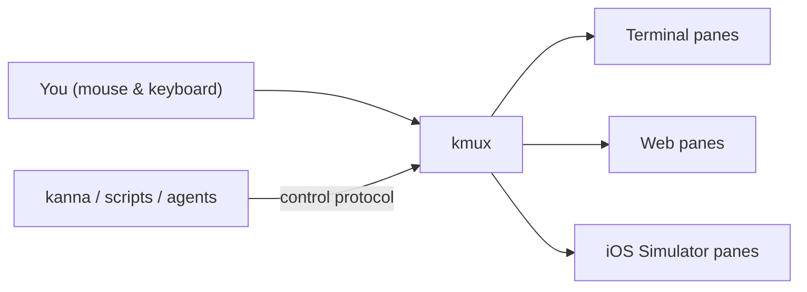
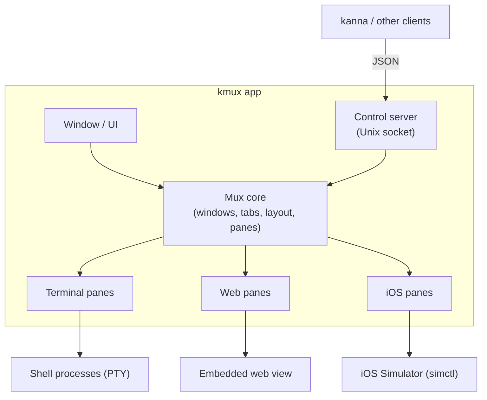
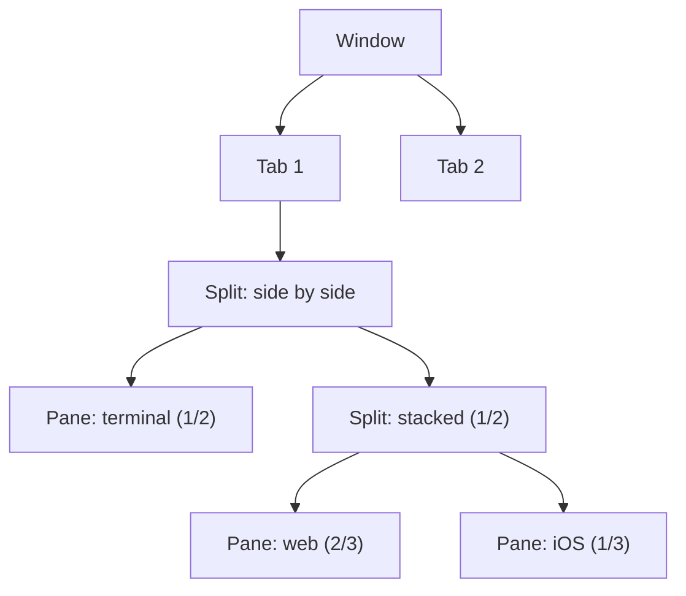
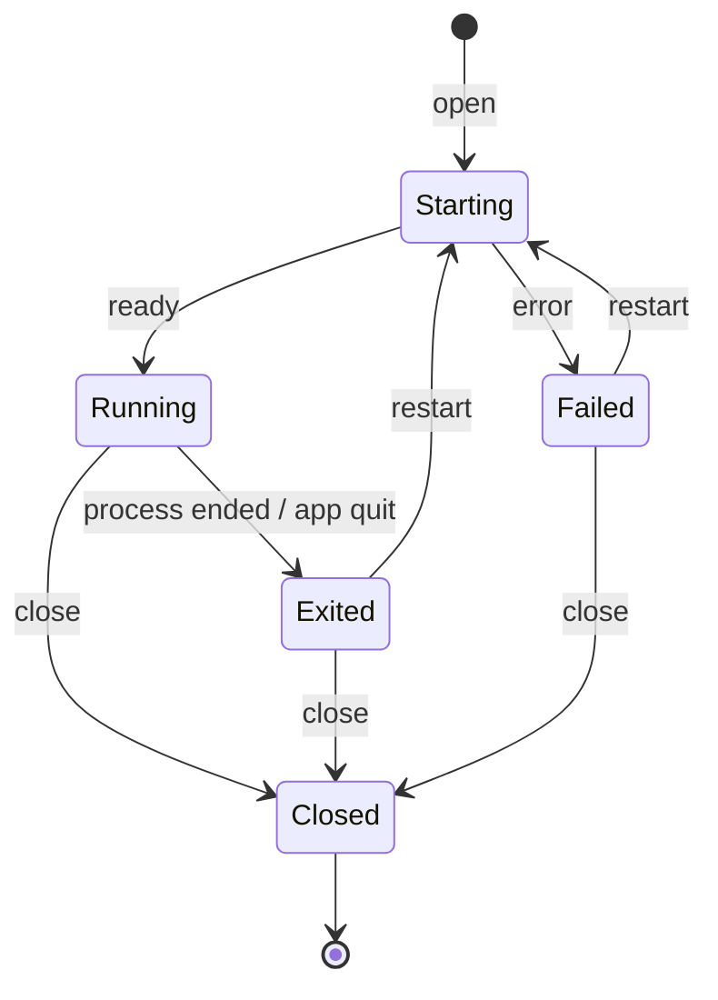
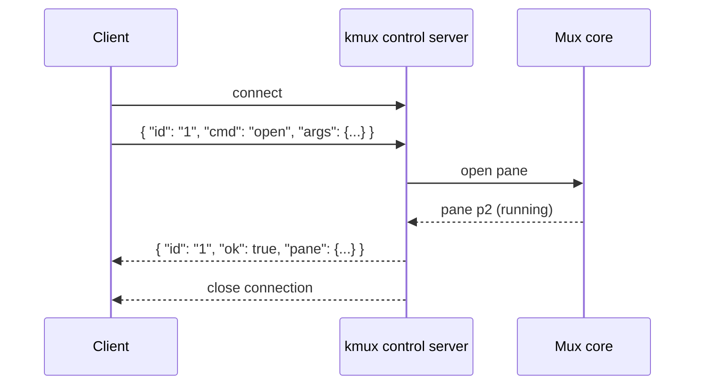

# kmux — Specification

> **Status:** Draft v0.3 · **Last updated:** 2026-10-08
>
> Items marked **[Assumption]** are guesses made to fill gaps. Confirm or correct them, and see [Open Questions](#10-open-questions).
>
> **Related:** [kanna spec](kanna-spec.md), the CLI that can drive kmux.

## Table of Contents

1. [Summary](#1-summary)
2. [Goals and Non-Goals](#2-goals-and-non-goals)
3. [How It Fits Together](#3-how-it-fits-together)
4. [Windows, Tabs and Panes](#4-windows-tabs-and-panes)
5. [Pane Types](#5-pane-types)
6. [Pane Lifecycle](#6-pane-lifecycle)
7. [Sizing](#7-sizing)
8. [Control Protocol](#8-control-protocol)
   - 8.1 [Connection](#81-connection)
   - 8.2 [Commands](#82-commands)
   - 8.3 [Layout Trees](#83-layout-trees)
   - 8.4 [Errors](#84-errors)
9. [Platform Requirements](#9-platform-requirements)
10. [Open Questions](#10-open-questions)
11. [Glossary](#11-glossary)

---

## 1. Summary

kmux is a desktop **mux**: one window that shows terminals, web views and iOS simulations side by side, each in its own **pane**.

kmux works on its own. You can open, split and resize panes by hand. Other programs can control it through a local **control protocol**. The [`kanna`](kanna-spec.md) CLI is the main one, but anything that speaks the protocol can drive it.



---

## 2. Goals and Non-Goals

### Goals

| # | Goal |
|---|------|
| G1 | Show terminals, web views and iOS simulations together in one window. |
| G2 | Be fully usable by hand, without kanna. |
| G3 | Let everything you can do by hand also be done through the control protocol. |
| G4 | Size panes as fractions that stay proportional when the window is resized. |

### Non-Goals (for now)

- Reimplementing a terminal emulator, browser or Xcode. kmux embeds these.
- Android emulators. **[Assumption]**
- Remote control from other machines. **[Assumption]**

---

## 3. How It Fits Together



- **The mux core is the single source of truth.** Clicks in the UI and protocol commands go through the same core, so they never disagree.
- **Pane types are plug-ins to the core.** Every type follows the same lifecycle ([section 6](#6-pane-lifecycle)), so the core doesn't need to know what's inside a pane.

---

## 4. Windows, Tabs and Panes

A **window** holds **tabs**. Each tab is divided into **panes** by **splits**, and splits can be nested.



That tab looks like this:

```text
┌──────────────────────┬──────────────────────┐
│                      │                      │
│                      │  web: localhost:3000 │
│  terminal: npm dev   │                      │
│                      ├──────────────────────┤
│                      │  iOS: iPhone 16      │
└──────────────────────┴──────────────────────┘
```

Each pane has:

| Field | Meaning |
|-------|---------|
| `id` | Assigned by kmux, e.g. `p3`. Never reused while the app is running. |
| `name` | Optional, set by you or a client, e.g. `server`. Must be unique. |
| `type` | `term`, `web` or `ios`. |
| `state` | See [section 6](#6-pane-lifecycle). |
| `title` | What the pane's header shows. |

**By hand:** you can split, resize by dragging dividers, move, zoom (temporarily fill the tab) and close panes, much like in iTerm or tmux. **[Assumption]** Exact keyboard shortcuts are still to be decided.

---

## 5. Pane Types

| Type | Shows | Backed by | Options |
|------|-------|-----------|---------|
| `term` | An interactive shell or command | A PTY running a process | `cmd`, `cwd`, `env` |
| `web` | A web page or local web app | An embedded web view | `url` |
| `ios` | A running iOS app | The Xcode iOS Simulator, shown inside the pane | `app` (path or bundle ID), `device` |

- **term:** runs your default shell unless `cmd` is given. When the process exits, the pane stays open and shows the exit code.
- **web:** for `localhost` URLs, keeps retrying until the server is up. **[Assumption]**
- **ios:** boots the device if needed, installs and launches the app, and forwards mouse and keyboard input to it.

---

## 6. Pane Lifecycle



| State | Meaning |
|-------|---------|
| Starting | Shell launching, page loading or simulator booting. |
| Running | Ready to use. |
| Exited | The thing inside ended. The pane stays open so you can see why. |
| Failed | It never started. The error is shown in the pane and returned to the client. |
| Closed | The pane is gone. |

---

## 7. Sizing

kmux stores every size as a **fraction** of its parent split, never as pixels.

- When the window is resized, every pane keeps its proportions.
- Dragging a divider by hand updates the stored fractions.
- New splits default to `1/2`.
- Each pane has a minimum size, so it never shrinks below a usable size. **[Assumption]** The minimum is about 10 columns × 3 rows of text. When a fraction would go below it, kmux uses the minimum instead.

```text
Window 1200px wide                    Window 600px wide
┌──────────────────┬────────┐         ┌─────────┬────┐
│     2/3          │  1/3   │   →     │   2/3   │1/3 │
└──────────────────┴────────┘         └─────────┴────┘
```

---

## 8. Control Protocol

### 8.1 Connection

| Item | Value |
|------|-------|
| Transport | Unix domain socket |
| Location | `~/Library/Application Support/kmux/kmux.sock`, or the path in `$KMUX_SOCKET` |
| Access | Current user only (file permissions `0600`) |
| Format | One JSON request and one JSON reply per connection |



### 8.2 Commands

Wherever `pane` appears below, it can be a pane ID (`p2`) or a name (`site`).

| `cmd` | `args` | Returns |
|-------|--------|---------|
| `capabilities` | — | Supported pane types and features. |
| `open` | `type`, type options ([section 5](#5-pane-types)), `name?`, `split?` (`right`/`down`/`auto`), `size?` (fraction), `tab?` (bool), `wait?` (bool, default true) | The new pane. |
| `arrange` | `layout` (a layout tree, see [8.3](#83-layout-trees)) | The resulting layout. |
| `resize` | `pane`, `size` (fraction) | The updated layout. |
| `list` | — | All windows, tabs and panes. |
| `focus` | `pane` | — |
| `close` | `pane` | — |
| `restart` | `pane` | The pane. |
| `send` | `pane` (`term` only), `text` | — |
| `navigate` | `pane` (`web` only), `url` | — |

Example:

```json
// request
{ "id": "1", "cmd": "open", "args": { "type": "web", "url": "http://localhost:3000", "name": "site", "split": "right", "size": "1/3" } }

// reply
{ "id": "1", "ok": true, "pane": { "id": "p2", "name": "site", "type": "web", "state": "running" } }
```

### 8.3 Layout Trees

`arrange` takes a tree of splits and panes. `row` means side by side and `column` means stacked. A child without a `size` shares whatever space is left in its group.

This tree:

```json
{
  "split": "row",
  "children": [
    { "pane": "server", "size": "2/3" },
    { "split": "column", "children": [
        { "pane": "site" },
        { "pane": "phone", "size": "1/3" }
    ]}
  ]
}
```

produces:

```text
┌─────────────────────────────┬──────────────┐
│                             │     site     │
│        server (2/3)         │    (2/3)     │
│                             ├──────────────┤
│                             │ phone (1/3)  │
└─────────────────────────────┴──────────────┘
```

Rules:

- The sizes in a group can't add up to more than 1.
- Every pane named in the tree must exist.
- **[Assumption]** Open panes not named in the tree are moved to a new tab, not closed.

### 8.4 Errors

Failed replies look like `{ "id": "1", "ok": false, "error": { "code": "...", "message": "..." } }`.

| `code` | When |
|--------|------|
| `bad_request` | Unknown command, missing argument or invalid fraction. |
| `not_found` | The pane doesn't exist. |
| `name_taken` | Another pane already has that name. |
| `wrong_type` | E.g. `send` to a web pane. |
| `layout_invalid` | Sizes add up to more than 1, or the tree is malformed. |
| `start_failed` | The pane failed to start (e.g. Xcode missing, unknown device). The message explains why. |

---

## 9. Platform Requirements

| Requirement | Why |
|-------------|-----|
| macOS | The iOS Simulator only runs on macOS. **[Assumption]** kmux is macOS-only at first. |
| Xcode | Only needed for `ios` panes. |

---

## 10. Open Questions

1. **Tech stack:** Electron, Tauri or native Swift? This decides how web views and the simulator are embedded.
2. **iOS pane:** show the simulator's screen inside the pane, or position the real Simulator window over it?
3. **Own CLI:** should kmux ship a small CLI of its own, or rely on kanna?
4. **Persistence:** should layouts survive an app restart?
5. **Events:** should clients be able to subscribe to changes (pane exited, URL changed) instead of polling `list`?
6. **Reading content:** should the protocol expose terminal text or screenshots, for example so AI agents can read panes?
7. **Multiple windows:** how does a client target a specific window or tab?

---

## 11. Glossary

| Term | Meaning |
|------|---------|
| **Mux (multiplexer)** | An app that shows several separate sessions in one window. |
| **Pane** | One rectangular area in the window showing one thing. |
| **Split** | Dividing a space into panes side by side (`row`) or stacked (`column`). |
| **Layout tree** | The nested structure of splits and panes in a tab. |
| **Control protocol** | The JSON messages other programs use to drive kmux. |
| **PTY (pseudo-terminal)** | The operating-system mechanism that lets an app host a real shell. |
| **Web view** | A browser engine embedded inside an app. |
| **iOS Simulator** | Apple's tool, part of Xcode, for running iPhone apps on a Mac. |
| **`simctl`** | Apple's command-line tool for controlling the iOS Simulator. |
| **Unix domain socket** | A private connection point that lets two programs on the same machine talk. |
| **Bundle ID** | An iOS app's unique identifier, e.g. `com.example.myapp`. |
