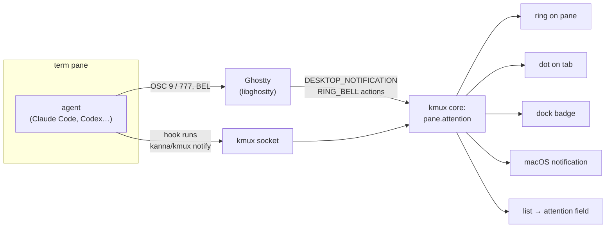
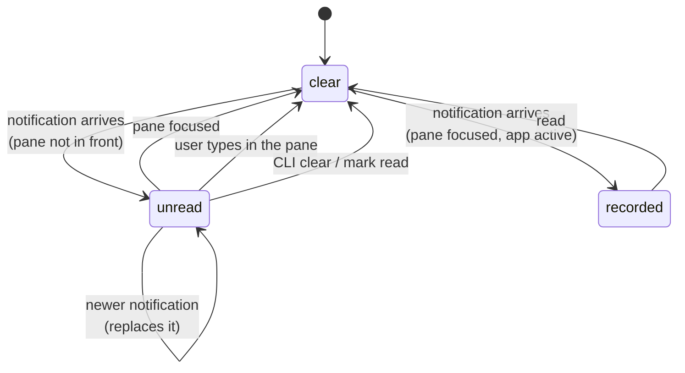
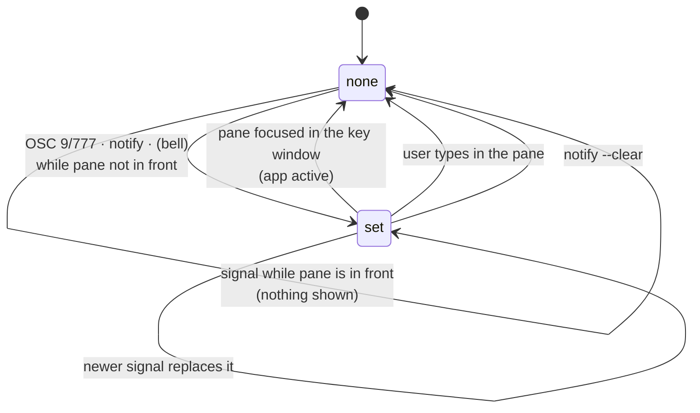
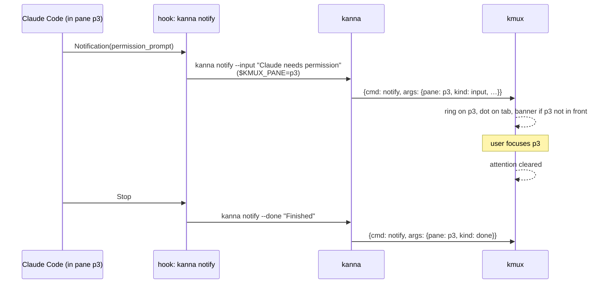

# Agent Attention — What cmux Does and What kmux Should Do

> Research for the kmux roadmap question "what's agent attention for?", 2026-10-09. Nothing here is implemented.
>
> **How each fact was found:**
> - **[verified]** I read it in kmux's source or Ghostty's source (Ghostty `a806905ea`, the copy kmux builds against in `~/work/kmux/target/ghostty-source`), or ran it (`cmux --help`, v0.64.25 installed).
> - **[cmux docs]** cmux's README, `docs/*.md` or cmux.com.
> - **[clean room]** A subagent read cmux's source and reported the behaviour in plain words. I never saw the code.
> - **[general knowledge]** Not checked against a primary source in this session.

## Table of Contents

1. [Answer in Brief](#1-answer-in-brief)
2. [What cmux's Agent Attention Is](#2-what-cmuxs-agent-attention-is)
3. [How Agents Signal It](#3-how-agents-signal-it)
4. [What Ghostty Does, and What kmux Does Today](#4-what-ghostty-does-and-what-kmux-does-today)
5. [Proposal for kmux](#5-proposal-for-kmux)
6. [What Belongs to kanna](#6-what-belongs-to-kanna)
7. [Open Questions](#7-open-questions)
8. [Glossary](#8-glossary)
9. [Sources](#9-sources)

---

## 1. Answer in Brief

**What it's for:** you run several agents in several panes, and you can only watch one. Agent attention tells you **which pane wants you now**: either the agent is blocked on you (a permission prompt or a question) or it has finished its turn. cmux shows this as a ring on the pane, a badge in the sidebar, a macOS notification and a "jump to the next unread" shortcut.

| Question | Answer |
|---|---|
| What is it? | A per-pane "unread" state with a message, set by the program in the pane and cleared when you look at the pane. |
| How do agents set it? | Terminal escape sequences (OSC 9, 99, 777), the `cmux notify` CLI, and agent hooks that cmux installs for Claude Code, Codex and about 17 others. |
| How is it shown? | A blue ring and flash on the pane, an unread badge and status glyph per workspace in the sidebar, a dock badge, macOS banners, a notifications panel, and ⌘⇧U. |
| Does kmux have it? | **No.** Ghostty already turns OSC 9/777 and the bell into actions, but kmux ignores those actions **[verified]**. |
| Recommendation | kmux adds a small, agent-agnostic `attention` state per pane: it is set by OSC 9/777, by a new `notify` command and optionally by the bell. It is shown as a ring that reuses the focus outline, a dot on the tab, a dock badge and a macOS notification, and it is reported in `list`. Agent-specific wiring (hooks, "running / needs input / done") belongs to **kanna**. |

---

## 2. What cmux's Agent Attention Is

### 2.1 The user's view

| Element | What it shows | Source |
|---|---|---|
| **Pane ring** | A rounded ring, about 2 pt, in the accent colour (blue by default) with a soft glow, on a pane that has an unread notification. The colour can be changed and the ring turned off. | [cmux docs], [clean room] |
| **Pane flash** | When a notification arrives, the ring flashes harder: a double blink of about 0.9 s by default. `cmux trigger-flash` and ⌘⇧H flash it on demand. | [clean room], [verified] `--help` |
| **Sidebar** | Each workspace row has an unread count badge and a preview of the latest notification. A compact mode shows one glyph per workspace, the loudest state across its agents: amber dot for needs input, pulsing dot for running, red triangle for error, blue dot for unread, grey check for idle or done. | [cmux docs], [clean room] |
| **Workspace order** | A workspace that gets a notification can move to the top of the sidebar (a setting). | [clean room] |
| **Dock** | A badge with the unread count, which can be turned off. | [clean room] (not in the docs) |
| **macOS notification** | A native banner. Clicking it focuses the pane. Sounds are configurable per agent and per alert type. | [cmux docs], [clean room] |
| **Notifications panel** | A history of notifications, opened with ⌘I (or ⌘⇧I; the docs disagree). | [cmux docs] |
| **Jump** | ⌘⇧U jumps to the latest unread. ⌃⌘U marks the current one as oldest and jumps to the next. The CLI equivalent is `cmux jump-to-unread`. | [cmux docs], [verified] `--help` |
| **Workspace lanes** | Each workspace is placed in a lane (todo, working, needs attention, review, done), inferred from agent state, PRs and the git tree, or pinned by hand. | [cmux docs] |

### 2.2 Its life cycle

There is effectively **one live notification per pane**: a new one replaces the old **[clean room]**.

- **Cleared by:** focusing the pane, typing in it, "Mark Workspace as Read", or the CLI (`notify --clear`, `clear-notifications`, `mark-notification-read`, `dismiss-notification`). A Claude Code session that ends clears its pane **[clean room]**.
- **Pane already in front:** if the target pane is focused and the app is active, the notification is still recorded, but there is no banner, flash or reordering, and no sound unless you opt in **[clean room]**. Settings can also hide banners whenever cmux is the active app.
- **Muting:** each workspace can be muted, and subagent notifications are suppressed by default **[clean room]**.

---

## 3. How Agents Signal It

### 3.1 Signals at a glance

| Signal | What it is | cmux | Ghostty (and so kmux's engine) |
|---|---|---|---|
| **OSC 9** `ESC ] 9 ; body BEL` | iTerm2's notification | ✅ notification | ✅ parsed, becomes a desktop-notification action **[verified]** |
| **OSC 777** `ESC ] 777 ; notify ; title ; body BEL` | rxvt's notification | ✅ notification | ✅ same action **[verified]** |
| **OSC 99** | kitty's notification protocol (ids, subtitles, …) | ✅ cmux's Ghostty fork adds it **[clean room]** | ⚠️ parsed but **not implemented**: logged as an unimplemented OSC **[verified]** |
| **BEL** (`\a`) | The terminal bell | Sound, plus the pane is marked unread and flashes when it is not in front. **No notification record.** **[clean room]** | ✅ becomes a ring-bell action, at most one per 100 ms **[verified]** |
| **OSC 9;4** | ConEmu progress bar | Ignored **[clean room]** | ✅ becomes a progress-report action **[verified]** |
| **OSC 133** command finished | Shell integration | Ignored **[clean room]** | ✅ becomes a command-finished action **[verified]** |
| **`cmux notify`** | CLI or socket method `notification.create`: title, subtitle, body, `--clear`, aimed at a workspace or surface | ✅ | — |
| **Agent hooks** | cmux installs hooks that call back into cmux | ✅ | — |

### 3.2 Agent hooks in cmux

cmux treats hooks as the source of truth. On a pane running a hook-integrated agent it **drops the raw OSC notifications** **[clean room]** and runs Claude Code with its own notifications turned off (`preferredNotifChannel` set to `notifications_disabled`), so nothing arrives twice.

**Claude Code** (a wrapper injects hooks with `--settings`) **[clean room]**, **[cmux docs]**:

| Claude Code hook | cmux state | Notification |
|---|---|---|
| `SessionStart` | registers the session; idle | — |
| `UserPromptSubmit`, `PreToolUse` | **running**, and clears needs input | — |
| `PreToolUse` for AskUserQuestion or ExitPlanMode | **needs input** | yes |
| `Notification` with `permission_prompt` | **needs input** | "Permission" alert |
| `Notification` with `idle_prompt` (the roughly 60 s nag) | waiting | only if the turn hasn't already finished |
| `Stop` | **idle** (or waiting, if background work is pending) | "Completed", with a summary from the transcript |
| `SubagentStop` | no change | none (telemetry only) |
| `PermissionRequest` | approval UI in the sidebar ("Feed") | — |
| `SessionEnd` | clears the pane | — |

**Codex:** `cmux hooks setup` writes `~/.codex/hooks.json` (SessionStart, UserPromptSubmit and Stop, plus tool and permission events), or the wrapper passes `-c hooks.<event>=…` for one run. Older docs show Codex's `notify = [...]` setting calling `cmux notify` **[cmux docs]**, **[clean room]**.

**Others:** `cmux hooks setup` covers codex, grok, opencode, gemini, cursor, copilot, amp, kiro and others **[verified]** `cmux hooks --help`. Ollama has no hooks: cmux watches its output for the `>>>` prompt **[clean room]**.

### 3.3 What the agents offer on their own

| Agent | Mechanism | Detail |
|---|---|---|
| Claude Code | `Notification` hook | Fires when Claude needs permission or has been idle waiting for input. Its matcher values include `permission_prompt`, `idle_prompt` and `agent_needs_input`; input has `session_id`, `cwd` and the message. No pane ID field, but hooks inherit the agent's environment, so `$KMUX_PANE` is there **[docs via subagent]**, **[general knowledge]** for env inheritance. |
| Claude Code | `Stop`, `SubagentStop`, `UserPromptSubmit` | End of each turn, end of a subagent, and a new prompt **[docs via subagent]**. |
| Claude Code | Built-in terminal notifications, `preferredNotifChannel` | `auto` picks by `TERM_PROGRAM`; other values are `terminal_bell`, `iterm2`, `iterm2_with_bell`, `kitty`, `ghostty` and `notifications_disabled`. kmux panes get `TERM_PROGRAM=ghostty` from libghostty **[verified]**. Exactly which sequence the `ghostty` channel sends (OSC 777 or OSC 9) is **unconfirmed**. |
| Codex | `notify = ["prog", …]` in `~/.codex/config.toml` | Runs the program with a JSON argument (`type: "agent-turn-complete"`, the last message, …) **[general knowledge]**. |
| Codex | `[tui] notifications` | The TUI sends OSC 9 for turn complete and approval requested **[general knowledge]**. |
| Codex | Hooks (`hooks.json`) | Exist per cmux's docs; I didn't check Codex's own docs. |

**Takeaway:** the escape sequences give a good baseline with **zero setup**. A Claude Code or Codex pane in kmux already emits OSC 9/777 today; kmux just drops it. Hooks add the finer distinction between "needs input" and "done" and the "running" state.

---

## 4. What Ghostty Does, and What kmux Does Today

### 4.1 libghostty (the engine kmux embeds) [verified]

| Input | libghostty core | Ghostty's own macOS app (not in kmux) |
|---|---|---|
| OSC 9 / OSC 777 | If `desktop-notifications` is on (the default), it sends `GHOSTTY_ACTION_DESKTOP_NOTIFICATION` with a title and body. It allows **at most one per second app-wide**, and identical content at most every 5 s. | Posts a macOS user notification (with sound, subtitle = pane title). It is shown only if the window isn't key or the surface isn't focused, removed when the surface gains focus, and clicking it focuses the surface. |
| BEL | Sends `GHOSTTY_ACTION_RING_BELL`, at most one per 100 ms. | `bell-features`: `attention` (bounce the dock icon once, **on** by default), `title` (🔔 in the title until refocused, **on**), `border` (a border on the pane, **off**), `system`, `audio`. |
| OSC 133 with `notify-on-command-finish` | Sends `GHOSTTY_ACTION_COMMAND_FINISHED` (exit code, duration). | Bells or notifies when a long command ends (off by default). |
| OSC 9;4 | Sends `GHOSTTY_ACTION_PROGRESS_REPORT`. | Progress bar on the surface. |
| OSC 99 | Parsed, then dropped ("unimplemented OSC callback"). | — |

The bell and notification **UI is the app's job** (the "apprt"); libghostty only raises the actions.

### 4.2 kmux today [verified]

- `GhosttyRuntime.action_cb` (`apps/kmux/Sources/Kmux/Terminal/GhosttyRuntime.swift`) handles `SHOW_CHILD_EXITED` itself and passes every other surface action to `AppController.ghosttyAction`.
- `ghosttyAction` (`apps/kmux/Sources/Kmux/AppController.swift`) handles only mux keybindings (`NEW_SPLIT`, `GOTO_SPLIT`, `TOGGLE_SPLIT_ZOOM`, `NEW_TAB`, `GOTO_TAB`, `NEW_WINDOW`, `CLOSE_WINDOW`, `GOTO_WINDOW`). **Everything else returns `false` and is dropped**, including:

| Ignored action | What we lose |
|---|---|
| `DESKTOP_NOTIFICATION` | OSC 9/777 from Claude Code, Codex, scripts: the main attention signal. |
| `RING_BELL` | No bell at all: no sound, no dock bounce, no 🔔. |
| `COMMAND_FINISHED` | `notify-on-command-finish` from the user's Ghostty config does nothing. |
| `PROGRESS_REPORT` | OSC 9;4 progress. |
| `SET_TITLE`, `PWD` | Not attention, but relevant later (e.g. an agent's title as a notification subtitle). |

- kmux reads the user's Ghostty config, so `desktop-notifications` and `bell-features` are already parsed. kmux just doesn't act on them.
- Terminals get `KMUX_PANE`, `KMUX_SOCKET` and `KMUX_INSTANCE` (`ContentHost.swift`), so a hook running inside a pane already knows which pane and which kmux to report to.
- The app bundle is `dev.kanna.kmux` (`scripts/build-kmux.sh`), which macOS needs before kmux can post user notifications. All instances share that bundle ID.
- `PaneView` already has a 2 pt accent-coloured outline layer used for focus, which is the natural place for an attention ring.

---

## 5. Proposal for kmux

### 5.1 Principles

1. **Agent-agnostic.** kmux knows "this pane wants you, and here's the message". It does not know Claude Code from Codex. (The kmux spec's events are "none for now"; this stays polling-friendly.)
2. **Chromeless.** Nothing is added while nothing needs you. The indicator appears only on a pane that wants you and goes away when you look at it. That is the same rule as the existing exit and failure notices.
3. **Works with zero setup** for anything that already emits OSC 9/777. Hooks make it better but aren't required.
4. **Same core for UI and protocol**, as the spec requires: the reference model and protocol cases gain the same state.

### 5.2 The state

Each pane gets an optional `attention`:

| Field | Values | Notes |
|---|---|---|
| `kind` | `notify` (default), `input` (blocked on you), `done` (finished) | OSC sets `notify`. A `notify` request can set `input` or `done`, so a hook can say which. The indicator could vary by kind (open question 2). |
| `title`, `body` | strings | From OSC 777 title and body, OSC 9 body, or the request. |
| `at` | timestamp | Lets clients sort, and lets jump order panes oldest first. |

A signal for the pane that is already in front (focused, key window, app active) is **not** stored. That differs from cmux, which records it for its history panel; kmux has no history panel, so storing it would only light up a ring the user is already looking at.

### 5.3 How it's shown

| Where | What | Chrome when nothing needs you? |
|---|---|---|
| **Pane** | Reuse the focus outline layer as an **attention ring**, in a distinct colour, with one short pulse on arrival. In a tab with one pane, show it too (unlike the focus outline, which only appears when the tab has more than one pane). | None |
| **Tab bar** | A small dot before the title of a tab with an attention pane, when that tab isn't active. | None |
| **Window** | Nothing new. A background window's tab shows the dot. | None |
| **Dock** | Badge with the number of panes needing attention (`NSApp.dockTile.badgeLabel`). Plus one dock bounce (`requestUserAttention(.informationalRequest)`) when kmux isn't active, following Ghostty's `bell-features = attention`. | None |
| **macOS notification** | `UNUserNotificationCenter`: the title, the body, and the subtitle "*tab title* · *pane name or ID*" (plus the instance name for named instances). Posted only when the pane isn't in front. Clicking it focuses the pane. Removed when the pane is looked at. Respects Ghostty's `desktop-notifications`. | n/a |
| **Jump** | **Pane ▸ Jump to Attention** (⇧⌘U, matching cmux): focus the oldest pane needing attention, across tabs and windows. | n/a |

**`--bg` instances** (tests) never post macOS notifications, bounce or badge the dock. They still keep the state and report it in `list`, so tests can check it.

### 5.4 Protocol and CLI

| Change | Shape | Notes |
|---|---|---|
| `list` | Each pane gains `attention: null \| {kind, title, body, at}` | The cheapest way for kanna (which polls) to see it. |
| New `notify` | `pane`, `title?`, `body?`, `kind?` (`notify`/`input`/`done`), `clear?` | Sets or clears it. `term` and other panes alike, so a script can flag a web or iOS pane too. `desktop: false` could set the ring without a banner. |
| New `focus-attention` (or `focus` with `attention: true`) | — | The protocol side of ⇧⌘U. Fails with `not_found` if nothing needs attention. |
| `capabilities` | Adds `attention` to features | So kanna knows whether the running kmux supports it. |
| CLI `kmux notify` | `kmux notify [--pane P] [--title T] [--body B] [--input\|--done] [--clear]` | `--pane` defaults to `$KMUX_PANE` and the socket to `$KMUX_SOCKET`, so a hook is just `kmux notify --done --title "Claude finished"`. |
| CLI `kmux attention` | Lists the panes needing attention; `--jump` focuses the oldest | A filtered `list`, which is easy for an agent or script to discover. |

I'd use **`notify`** rather than `attention` as the verb, because it's cmux's name, and **`attention`** as the state's name. A later events stream (`attention.set`, `attention.cleared`) would let kanna stop polling. That fits the spec's "events can be added later".

### 5.5 The bell and the other Ghostty actions

| Action | Proposal |
|---|---|
| `RING_BELL` | Honour `bell-features`: `system` plays the beep, `attention` bounces the dock. A bell in a pane that isn't in front **also sets `attention`** (kind `notify`, no title), which is what cmux does. `title` (🔔) has nowhere to go, since panes have no titles; the ring replaces it. |
| `DESKTOP_NOTIFICATION` | Sets `attention` as above. libghostty's one-per-second limit applies before kmux sees it. That is fine for a banner, but it can drop a second pane's notification arriving within a second. Worth knowing; probably acceptable. |
| `COMMAND_FINISHED` | Follow Ghostty's `notify-on-command-finish` config (off by default): set `attention` with kind `done`. Cheap, and useful for long builds. |
| `PROGRESS_REPORT` | Out of scope here. It is a "status" feature, not attention (cmux ignores it too). |

### 5.6 Order of work

1. Handle `DESKTOP_NOTIFICATION` and `RING_BELL`, add the state, the ring and `list.attention`. This gives the zero-setup baseline.
2. Add the `notify` command and CLI, and clear-on-focus and on typing.
3. Add the tab dot, dock badge, macOS notification and ⇧⌘U.
4. Optionally `COMMAND_FINISHED`, and events.

Each step needs the reference model, the protocol cases and the spec updated with it.

---

## 6. What Belongs to kanna

kanna drives several muxes (kmux, tmux, cmux) and is where agent knowledge already lives. kmux should stay a mux.

| Concern | Owner | Why |
|---|---|---|
| Attention state, ring, dock, banners, jump | **kmux** | It's UI and focus, which only the mux can do. |
| Parsing OSC 9/777 and the bell | **kmux** (via Ghostty) | It's in the terminal. |
| Installing hooks for Claude Code, Codex, … | **kanna** | Agent-specific and changes with each agent's releases. One hook command (`kanna notify`) can target any backend. |
| Mapping agent events to `input` / `done` | **kanna** | For example `Notification(permission_prompt)` → `input`, `Stop` → `done`, `UserPromptSubmit` → clear. |
| Turning off the agent's own OSC when hooks are on (`preferredNotifChannel: notifications_disabled`) | **kanna** | Avoids double notifications. kmux can't tell a hook-integrated pane from any other. |
| Agent status ("running", "idle"), summaries from transcripts, approvals UI, lanes | **kanna** (later, if ever) | This is cmux's sidebar and Feed: product features well beyond attention, and they need chrome kmux deliberately doesn't have. |
| Mux-neutral mapping | **kanna** | `kanna notify` → kmux `notify`, cmux `cmux notify`, tmux `display-message` plus a bell. |

---

## 7. Open Questions

1. **The bell.** Should a bell in a background pane set attention (as cmux does), or only beep and bounce? Shells and editors ring it for small things (tab completion, for instance), so this could be noisy.
2. **One look or two?** Should `input` and `done` look different, for example amber for needs input and accent blue for done, as cmux's compact glyphs do? Or one ring for everything (simpler, more chromeless)?
3. **Clear on typing?** cmux clears when you type in the pane. It's natural, but scrolling or copying from a pane without typing would leave the ring on until you focus it. Focusing already clears it, so typing may be moot.
4. **macOS notifications on by default?** They need a one-time permission prompt. Should kmux ask on first use, or only after a setting is turned on?
5. **Claude Code's `ghostty` channel.** Does Claude Code in a kmux pane (`TERM_PROGRAM=ghostty`) send OSC 777 or OSC 9 today, and does it work? This can be tested once step 1 lands. There are reports that Claude Code's Ghostty notifications only work when the channel is set to `iterm2`.
6. **kanna hooks: install globally or per launch?** cmux does both (a wrapper injecting `--settings`, or `cmux hooks setup`). kanna launching agents itself would favour per launch.

---

## 8. Glossary

| Term | Meaning |
|---|---|
| **Agent attention** | A pane's program telling the user "I need you": blocked on input, or finished. |
| **OSC** | Operating System Command: an escape sequence `ESC ] number ; … BEL` that a program prints to talk to the terminal rather than to draw text. |
| **OSC 9 / 777 / 99** | Desktop-notification escape sequences from iTerm2, rxvt and kitty respectively. |
| **OSC 9;4** | ConEmu's progress-bar sequence (shares the number 9). |
| **OSC 133** | Shell-integration marks for prompt and command start and end. They let a terminal know when a command finished. |
| **BEL** | The bell character (`\a`, 0x07). |
| **Action** (Ghostty) | A callback from libghostty asking the host app to do something UI-related (notify, ring the bell, split, …). |
| **apprt** | Ghostty's "application runtime": the native app around libghostty (Ghostty's macOS app, or kmux for us). |
| **Hook** (agent) | A command an agent runs at a lifecycle event, e.g. Claude Code's `Notification` and `Stop`, or Codex's `notify`. |
| **Surface** | cmux's (and Ghostty's) word for one terminal or browser view; roughly a kmux pane. |
| **Workspace** | cmux's sidebar entry, roughly a kmux tab. |
| **Ring** | The highlighted border cmux draws on a pane that needs attention. |
| **Clean room** | A subagent reads a competitor's code and reports only behaviour, so whoever implements kmux never sees the code. |

## 9. Sources

- **kmux [verified]:** `apps/kmux/Sources/Kmux/Terminal/GhosttyRuntime.swift` (`action_cb`), `apps/kmux/Sources/Kmux/AppController.swift` (`ghosttyAction`), `apps/kmux/Sources/Kmux/PaneView.swift` (focus outline), `apps/kmux/Sources/Kmux/ContentHost.swift` (`KMUX_PANE` env), `scripts/build-kmux.sh` (bundle ID), `docs/kmux-spec.md`.
- **Ghostty `a806905ea` [verified]:** `include/ghostty.h` (action list), `src/terminal/osc.zig` and `src/terminal/stream.zig` (OSC 9/777 → notification, OSC 99 unimplemented), `src/Surface.zig` (rate limits, bell throttle), `src/config/Config.zig` (`desktop-notifications`, `bell-features`, `notify-on-command-finish`), `src/termio/Exec.zig` (`TERM_PROGRAM=ghostty`), `macos/Sources/Ghostty/Ghostty.App.swift` and `SurfaceView_AppKit.swift` (Ghostty app's notification and bell handling).
- **cmux [verified]:** `cmux --help`, `cmux notify --help`, `hooks --help`, `jump-to-unread --help`, `trigger-flash --help`, `events --help`, `mark-notification-read --help` (v0.64.25).
- **cmux [cmux docs]:** github.com/manaflow-ai/cmux README.md, docs/notifications.md, docs/agent-hooks.md, docs/configuration.md, docs/cli-contract.md, docs/events.md, docs/agent-session-tracking-spec.md (a draft spec); cmux.com/docs/notifications, cmux.com/docs/api, cmux.com/docs/keyboard-shortcuts.
- **cmux [clean room]:** cmux main branch and `/Applications/cmux.app/Contents/Resources/bin/cmux-claude-wrapper` and `cmux-codex-wrapper`, read by a subagent and reported as behaviour only.
- **Claude Code:** code.claude.com/docs/en/hooks.md, hooks-guide.md, terminal-config.md (via a subagent).
- **Codex:** general knowledge only. developers.openai.com/codex wasn't reachable from the subagent.
