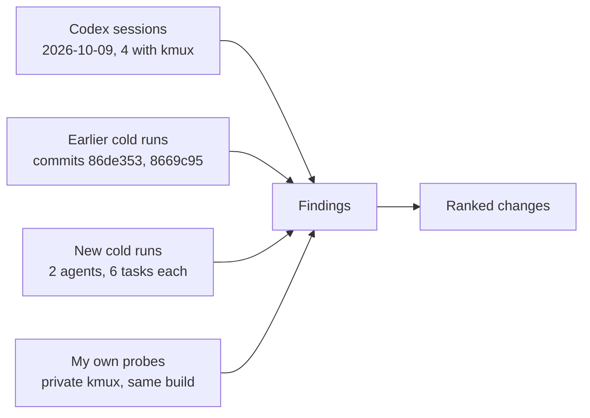
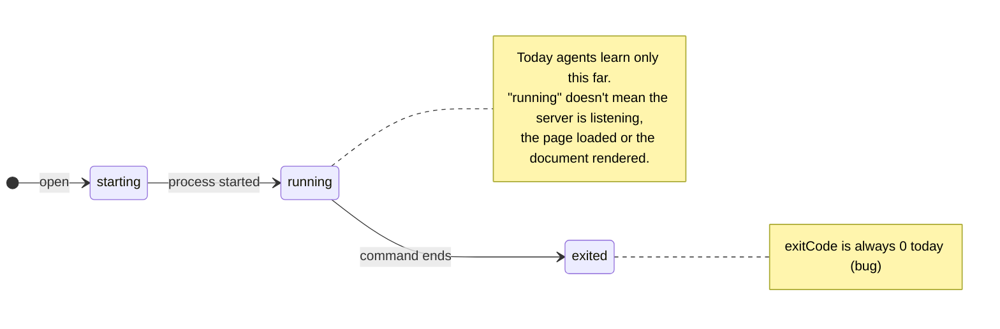

# kmux — Improving the CLI from Evidence

> Research for the kmux roadmap, 2026-10-09. Roadmap question: "let's look at how we can improve our CLI without adding meaningless features." Every change below is tied to something an agent actually tripped on. Where a point comes from general knowledge rather than something I ran or read, it says so.

## Table of Contents

1. [Summary](#1-summary)
2. [Where the evidence comes from](#2-where-the-evidence-comes-from)
3. [What agents need vs what exists](#3-what-agents-need-vs-what-exists)
4. [Recommended changes, ranked](#4-recommended-changes-ranked)
5. [Tempting features to reject](#5-tempting-features-to-reject)
6. [Questions for you](#6-questions-for-you)
7. [Appendix: stumble log](#7-appendix-stumble-log)
8. [Glossary](#8-glossary)

---

## 1. Summary

The CLI is good at **doing** things: every agent opened, split, arranged and closed panes without trouble, which matches the earlier cold runs. It is weak at **finding out what happened**. When a task needs a check ("did the page load?", "did the tests pass?", "is the server up yet?"), agents leave kmux for `curl`, `tee` to a file, or computer use (screenshots of the app).

There are three findings that matter most:

1. **Pane exit codes are wrong.** Every `--cmd` pane reports `exited (0)`, even after `exit 3` or failing tests. This is a bug, not a missing feature, and it breaks the only result signal kmux has today.
2. **There is no way to read a pane.** The app can already do it: hidden `debug.text`, `debug.web` and `debug.md` commands return a terminal's screen, a page's URL and text, and a markdown pane's rendered text. Promoting them to a `kmux read` command is the cheapest big win.
3. **There is no way to wait for a result.** "Running" only means the process started. Agents need to wait until a command exits, or until some text appears, such as "Serving on".

**Recommendation:** fix the exit code, then add `read` and `wait`. After that, make a set of small honesty fixes: report success, return non-zero exit codes on failure, and say what `arrange` moved. Together these turn "start it and hope" into "start it, wait, and check", without browser automation, events or new pane types.

| # | Change | Kind | Cost | Main evidence |
|---|--------|------|------|---------------|
| 1 | Report the real exit code of `--cmd` panes | Bug fix | S–M | Verified: `exit 3`, `false` and failing tests all show `exited (0)` |
| 2 | `kmux read PANE` | New command | S | The top wish in both cold runs; Codex 11-28 fell back to screenshots; your roadmap note on snapshots |
| 3 | `kmux wait PANE --exit \| --text TEXT` | New command | M | Cold run: the server wasn't listening yet, and test results were read via `tee` |
| 4 | Web panes report whether the page loaded | Fix | S–M | Verified: a page with nothing listening shows `running` |
| 5 | Honest feedback and exit codes | Fixes | XS | `send` prints nothing; `navigate` to a missing file exits 0; `help raw` says unknown; a URL hint suggests `--cmd` |
| 6 | `navigate` resolves paths like links do, and md back/forward is documented | Fix | S | Verified: `navigate spec api.md` resolved against the shell's directory, not the doc's |
| 7 | `open --next-to PANE --side …` | Option | S | Cold run: splits landed on whatever pane had focus |
| 8 | `restart PANE --cmd NEW` | Option | S | Both cold runs: one agent guessed `restart --cmd` before reading the help |
| 9 | `arrange` says what it moved | Output | XS | Cold run: the agent's own shell went to a tab called "unarranged" without warning |
| 10 | A failed `open` leaves no broken pane behind | Fix | S | Verified: `open md /nonexistent.md` exits 1 but leaves a `failed` pane in the layout |
| 11 | Tell agents kmux exists | Docs | XS | 3 of 4 Codex sessions reached for computer use until told "use the kmux CLI" |

Cost: XS is under an hour, S is up to half a day, M is one to two days. These are estimates from reading the code, not measured.

---

## 2. Where the evidence comes from



| Source | What it is | What it showed |
|--------|------------|----------------|
| **Codex sessions** (`~/.codex/sessions/2026/10/09/`, from 11-28 to 11-56) | Real use by Codex ("Luna") against your own kmux | **11-28:** "Open the roadmap with kmux". `open md` replied `running`, but the pane was blank, and `list` showed the md pane as `(shell)`. With no CLI way to see the pane, the agent fell back to screenshots and accessibility trees, then to clicking the app's menus. You had to say "use kmux cli" twice. **11-44:** it worked first time once the agent was told to use the CLI. **11-51:** on "use kmux to rename our tab", the agent searched its tools for kmux, found none, and used computer use until told "it's a cli". **11-56:** the same thing happened with "move the roadmap pane"; after that, `move` worked first time. Sessions from earlier in October use an older kmux CLI (`kmux down`, `surface`) and were skipped. |
| **Earlier cold runs** (commits 86de353 and 8669c95, 2026-10-08) | Fresh Haiku agents with only the help to go on | Every *layout* goal was reached with no wrong guesses. The fixes made then were clearer replies and help text. Those tasks never asked the agent to *check* a result, which is why the gaps below didn't show up. |
| **New cold runs** (this report) | Two fresh agents (A: Haiku, B: Sonnet), each with a private background kmux, a toy project and 6 tasks: server and page side by side, a spec with links, tests in a pane, a layout, find and close a stray pane, change of plan and recovery | Both finished every task, and neither could confirm a result inside kmux. B used `curl` and `tee` to a file, and logged 13 stumbles. A read the server's source and `tee`'d to a file, and logged 5 stumbles, including guessing `restart --cmd`. Both put "read a pane" first in their wishes. |
| **My probes** | The same build (`~/work/kmux/target`) on a private socket | Confirmed the exit-code bug, the `navigate` path bug, `send`'s silence, `running` web panes with nothing to show, the leftover failed pane and `help raw`. |

---

## 3. What agents need vs what exists

| Need (seen in the evidence) | Exists today? | Notes |
|-----------------------------|---------------|-------|
| Start things in panes and lay them out | **Yes** | `open`, `arrange`, `move`, `resize` all worked first or second time |
| Find a pane by what it runs | **Yes** | `list` shows each pane's command, URL or file. Both cold runs found the stray `tail -f` straight away. |
| Know whether a command **succeeded** | **Broken** | `exitCode` exists in the protocol and in `list`, but it is always 0 ([4.1](#41-report-the-real-exit-code)) |
| **Read** what a pane shows | **Hidden** | `debug.text` (the terminal's visible screen), `debug.web` (URL and `innerText`), `debug.md` (rendered text). Only reachable through `kmux raw`. |
| **Wait** for an exit, or for text to appear | No | `open` waits for `running`, which only means the process started |
| Know whether a web page **loaded** | No | Web panes are `running` whether or not anything answered |
| Follow a link in a markdown pane | Partly | `navigate` takes a file, but resolves relative paths from the wrong place |
| Put a new pane next to a **named** pane | No | `open` always splits the focused pane. `move --to` exists, but needs a second command. |
| Change a pane's command and keep its place | No | `restart` reruns the same command |
| Know it should use kmux at all | No | Nothing tells an agent kmux is there |
| Pixel snapshot of a pane | Hidden | `debug.snapshot` (a window, for tests). This is your roadmap item, and is separate from this report. |



---

## 4. Recommended changes, ranked

Ranked by how much they unblock agents, divided by cost. Items 1–3 are one theme: **close the loop**.

### 4.1 Report the real exit code

- **Evidence (verified):** `open --cmd 'exit 3'`, `--cmd false`, `--cmd 'sleep 1; exit 7'` and `./run-tests.sh` (one test fails, exit 1 when run directly) all show `exited (0)` in `list` and in `list --json`. Cold-run B also misread an exit status, because there was nothing reliable to read.
- **Likely cause (not verified):** commands run as `$SHELL -c CMD` inside Ghostty's `exec -l` wrapper (`GhosttyRuntime.attach`), and the code that Ghostty's `child_exited` reports is the wrapper's, not the command's. From general knowledge, on macOS Ghostty starts commands through `/usr/bin/login`, which doesn't pass the child's status on.
- **Change:** report the command's own status. One way is to have kmux's wrapper write `$?` somewhere kmux can read it (an OSC sequence, or a file per pane) before it exits. Add a protocol case for `exit 3 → exitCode 3`.
- **Cost:** S–M (finding the cause is most of it).
- **Example:**

  ```text
  $ kmux open --name tests --cmd ./run-tests.sh
  opened p4 (tests) in window w1, tab t1: running
  $ kmux list
  p4    tests  term  exited (1)  ./run-tests.sh
  ```

### 4.2 `kmux read PANE`

- **Evidence:** This was the first wish in both cold runs. Cold-run B: "There is no way to read a pane's output, screen, exit status or web page content/title", so it used `curl` for task 1 and `tee` to a file for task 3. Cold-run A reported the page's heading from `server.py`'s source, not from the pane. Codex 11-28: the agent used screenshots to find out the md pane was blank. Your roadmap: "we definitely want agents to be able to snapshot pane contents."
- **Change:** a `read` command (`kmux read PANE`) that replies by pane type, built from the existing `debug.*` handlers:

  | Pane | Reply |
  |------|-------|
  | `term` | The visible screen as text, plus state and exit code. `--lines N` for scrollback (later, M). |
  | `web` | URL, title, load state and the page's `innerText` |
  | `md` | File path and rendered text, with diagrams shown as `[diagram: flowchart]` |
  | `ios` | State, app and device (text only; pixels belong to the snapshot work) |

  It prints plain text for people; with `--json`, it returns structured fields.
- **Cost:** S. The handlers exist. The work is moving them out of `debug.`, adding a protocol case and writing help. Scrollback is extra.
- **Example:**

  ```text
  $ kmux read tests
  tests (p4) exited (1)
  ...
  AssertionError: 90 != 91 : discount should be 10%
  Ran 3 tests in 0.000s
  FAILED (failures=1)
  $ kmux read site
  site (p5) http://localhost:8781/ loaded "Widget Shop"
  Widget Shop
  3 widgets in stock
  ```

### 4.3 `kmux wait PANE --exit | --text TEXT`

- **Evidence:** Cold-run B: `open … --cmd "python3 server.py 8792"` returned `running`, but a `curl` right after got nothing, so it retried. For the tests, the agent had no way to wait for them to finish other than polling a file.
- **Change:** a `wait` command that blocks until a pane's command exits, or until `TEXT` appears on its screen, with `--timeout` (default 60 s). It can be done in the CLI by polling `read` every 100 ms, so the app needs no event system. On success it prints the pane's state, and with `--exit` it also prints the exit code. A timeout returns a new exit code (6). Ask whether a failed command should change the CLI's exit code ([section 6](#6-questions-for-you)).
- **Cost:** M (the polling is small; most of the work is timeouts, exit codes and tests).
- **Example:**

  ```text
  $ kmux open --name server --cmd "python3 server.py 8781" && kmux wait server --text "Serving on"
  opened p3 (server) in window w1, tab t1: running
  server (p3) shows "Serving on" after 0.4 s
  $ kmux send shell "./run-tests.sh" && kmux wait tests --exit
  tests (p4) exited (1) after 1.2 s
  ```

### 4.4 Web panes report whether the page loaded

- **Evidence (verified):** `open web localhost:8799`, with nothing listening, replies `running`, and `debug.web` returns empty text. Cold-run B used `curl` to find out whether the page had loaded.
- **Change:** the web pane tracks its load: `loading`, then `loaded "Title"` or `failed: connection refused` (from WKWebView's navigation delegate). `list` shows it, `read` and `wait --text` use it, and `open web` waits for the first load to finish, as `open` already waits for `running`.
- **Cost:** S–M.

### 4.5 Honest feedback and exit codes

Small, verified, each a few lines:

| Today | Should be |
|-------|-----------|
| `kmux send p1 "ls"` prints nothing | `sent to p1` (every other command says what it did since 86de353) |
| `kmux navigate spec api.md` to a missing file: `… is failed: No such file …`, **exit 0** | Exit 1, and the pane stays on the file it was showing, not `failed` |
| `kmux help raw`: `unknown command "raw"` (exit 2), although `kmux help` lists `raw` | Show `raw`'s usage, which already exists in `main.rs` |
| `open --web http://…` → `unknown pane type "http://…" … To run a command use --cmd "http://…"` (cold-run A) | When the word looks like a URL: `to show a page: kmux open web http://…` |
| `kmux help` ends with "The running kmux supports every command" | Fine as is, but it isn't true of `raw` and `help` (cold-run B stumble 1) |
| `navigate` replies `p5 (spec) (/private/…/spec.md) is running` | `spec (p5) now shows docs/spec.md`: say what changed, and don't print two sets of brackets |

### 4.6 `navigate` follows links like the markdown pane does

- **Evidence (verified):** with a pane showing `docs/spec.md`, `kmux navigate spec api.md` opened `<shell's cwd>/api.md` and failed. The spec ([7.1](../kmux-spec.md#71-commands)) says a relative path is "resolved against the file it shows". The cause is the CLI: `commands.rs` makes the path absolute against its own directory (`absolute()`) before sending it. Cold-run B worked around this by `cat`-ing the spec and passing absolute paths.
- Also: `navigate spec --back` works on md panes, but the help says `--back` is "only for panes opened with `open web URL --history`", and the reply looks the same as any navigate. Cold-run B couldn't tell that it worked.
- **Change:** send relative paths through unchanged, so the app resolves them against the file the pane shows, as a click on the link would. Document md back/forward in `help navigate`.
- **Cost:** S.
- **Example:** `kmux navigate spec api.md`, then `kmux navigate spec --back`.

### 4.7 `open --next-to PANE --side left|right|top|bottom`

- **Evidence:** Cold-run B: "`open` splits relative to the focused pane, and focus moves after each open." Its first panes came out as `p1:1/2 | server:1/4 | web:1/4`, and the spec pane then split the web pane, so it needed `arrange` to fix the layout. B also tried `--split up` because `move` uses `--side top/bottom/left/right`, while `open --split` uses `right/down/auto`.
- **Reasoned, not observed:** an agent working inside your kmux splits whichever pane *you* have focused, and `open` takes your keyboard focus (`Core.open` sets `window.focused`). The CLI could default to the pane it runs in (`$KMUX_PANE`, which kmux already sets in its terminals) instead of the focused one.
- **Change:** add `--next-to PANE` to `open`, taking the same `--side` values as `move`. Accept `left` and `up` in `--split` too. Open questions on the default and on focus are in [section 6](#6-questions-for-you).
- **Cost:** S. `move --to --side` already does the placement.

### 4.8 `restart PANE --cmd NEW`

- **Evidence:** Cold-run A typed `kmux restart p4 --cmd "…8791"` before checking the help, and got `unexpected argument "--cmd"`. Cold-run B, task 6: to change the server's port it had to close the pane, open a new one (which landed elsewhere) and run `arrange` again. It wished for this option, or for a way to press Ctrl-C.
- **Change:** `restart` takes an optional `--cmd` (and `--cwd`), which replaces the command and keeps the pane's ID, name and place. Ctrl-C followed by retyping is what this replaces, so a general key-sending command isn't needed for this case.
- **Cost:** S.
- **Example:** `kmux restart server --cmd "python3 server.py 8792"`

### 4.9 `arrange` says what it moved

- **Evidence:** Cold-run B: "`arrange` silently moves every pane left out into a new tab titled 'unarranged'". That included the agent's own shell, and a second `arrange` made a second "unarranged" tab. Cold-run A's instance shows the same tab, with the agent's shell and the spec pane in it.
- **Change:** append a line such as `moved p1, spec to tab t3 "unarranged"`. Reuse an existing "unarranged" tab in the same window instead of making another.
- **Cost:** XS.

### 4.10 A failed `open` cleans up

- **Evidence (verified):** `kmux open md /nonexistent.md` exits 1 (`start_failed`), but leaves pane p4 in the layout, `failed`. An agent that retries leaves one broken pane per attempt.
- **Change:** on `start_failed` for `md` (missing file) and for argument errors, remove the pane. Keep failed `term` and `ios` panes, because their screen shows why they failed. Say in the error which happened.
- **Cost:** S.

### 4.11 Tell agents kmux exists

- **Evidence:** in 3 of the 4 Codex sessions, the agent started with computer use or a browser, and only switched when told "use kmux cli". Once it was using the CLI, it had no trouble.
- **Change (docs, not CLI):** add a short agent note (an `AGENTS.md` / `CLAUDE.md` snippet, or a kanna skill) along the lines of: "You're in kmux. To show or arrange things, use `kmux` (`kmux help`); `kmux read` to check panes." `$KMUX_PANE` lets an agent tell that it is running inside kmux. It doesn't help the Codex sessions, which ran from VS Code.
- **Cost:** XS.

### Already fixed

- `list` showed md panes' command as `(shell)` (Codex 11-28). This was fixed in d2f3d55 ("kmux list: show a markdown pane's file").

---

## 5. Tempting features to reject

| Feature | Why it's tempting | Why not (now) |
|---------|-------------------|---------------|
| `kmux run CMD` (open, wait, read and exit with its code) | It is the "run tests" task in one line | It is `open` + `wait --exit` + `read`. It would be a fourth way to run something (with `open --cmd`, `send` and `restart`). Add it only if agents keep writing that three-line sequence. |
| Browser automation (click, fill, eval JS, console) | cmux has it, and your roadmap asks about web view access | It is a large surface. No run needed it: `read` gives the text, and `curl` covered the rest. It is a separate design question (the roadmap's "web view access for agents"), not a CLI polish. |
| Event subscription (`kmux events`) | cmux-tui has it, and it is "possible later" in the spec | `wait` polling covers every observed need. Events serve long-lived clients such as kanna's UI, not one-shot CLI calls. |
| General key sending (`send --keys C-c`) | B asked for Ctrl-C | The real need, changing a running command, is met by `restart --cmd`. Raw keys make scripts depend on what program is running. Revisit if interactive TUIs show up in agent tasks. |
| Undo / reopen the last closed pane | B wanted it after closing the web pane by "mistake" | `open` + `arrange` restored the layout in two commands. Undo in a scripted, multi-client tool is hard to define. |
| Short flags (`-n`, `-s`) and aliases (`ls`, `rm`) | They are familiar from tmux | No agent tried them. Every alias is more to document and more "did you mean" noise. |
| Shell completions, fuzzy pickers, a TUI | Nice for people | Agents don't use them, and `kmux help` plus "did you mean" already got everyone there. Completions are cheap, so they could be added later for people, but no evidence asks for them. |
| Pane renaming (`rename PANE NEW`) | Names are how agents refer to panes | Nobody needed it. `--name` at open time was always enough. |
| Layout files in kmux (`kmux up`) | They are handy | kanna owns this (`kanna up`, kanna spec §6.3). |
| A pixel screenshot command in the CLI, before `read` | It is on your roadmap | Text is what agents can check cheaply, and it covers every observed need. Screenshots (low-res whole pane, high-res regions) are worth doing for diagrams, iOS and visual bugs, but as their own piece of work after `read`. |

---

## 6. Questions for you

1. **Exit code of `wait --exit`:** should `kmux wait tests --exit` itself exit non-zero when the tests fail, so that `kmux wait tests --exit && deploy` works? That would mix the pane's result into the CLI's own exit codes (1–5). The alternatives are a separate flag (`--status`) or printing the code only. **Default if you don't say:** print the code, and exit with it only when `--status` is given.
2. **Where new panes go:** should `open` without `--next-to` split the pane the CLI runs in (`$KMUX_PANE`) rather than the focused pane? This is better for agents inside kmux, but different for people typing `kmux open` in one pane while looking at another. **Default:** keep the focused pane, and add `--next-to`.
3. **Focus stealing:** should `open` from an agent leave your keyboard focus where it is (a `--no-focus` option, or never taking focus when run from another pane)? I haven't observed this, but it follows from the code.
4. **Scrollback in `read`:** is the visible screen enough for a first version? The tests' summary fitted on screen in every run, but a long build log won't.

---

## 7. Appendix: stumble log

### 7.1 Cold run B (Sonnet)

All 6 tasks were done. Tasks 1 and 3 were verified outside kmux.

| # | Stumble | Command / output | Fix |
|---|---------|------------------|-----|
| 1 | `raw` is listed in the help, but its help is unknown | `kmux help raw` → `unknown command "raw"` | 4.5 |
| 2 | No way to read a pane or check that the page loaded; used `curl` and `tee` | — | 4.2, 4.4 |
| 3 | Used bash's `${PIPESTATUS[0]}`, but the pane runs zsh | `exit=` (empty) | 4.1 (an exit code makes this unnecessary) |
| 4 | Captured the exit status of `cat` instead of the tests | `exit=0` | 4.1, 4.3 |
| 5 | md `--back` worked, but the help says it is web-only, and the reply was indistinguishable | `navigate spec --back` | 4.5, 4.6 |
| 6 | Followed a link by reading the file and passing an absolute path | — | 4.6 |
| 7 | Splits followed focus, which led to a messy layout | `p1:1/2 \| server:1/4 \| web:1/4` | 4.7 |
| 8 | `arrange` moved its own shell to "unarranged", twice | — | 4.9 |
| 9 | Guessed `--split up` | `split must be right, down or auto` | 4.7 |
| 10 | Couldn't change the server's port in place | close, open, re-arrange | 4.8 |
| 11 | `running` came before the server was listening | `curl` got nothing | 4.3 |
| 12 | No reopen after closing the web pane | — | Rejected (undo) |
| 13 | Wanted `open` with a position, not `open` then `arrange` | — | 4.7 |

### 7.2 Cold run A (Haiku)

All 6 tasks were done, but A never confirmed anything inside kmux. It took the page heading from `server.py`'s source, because its `curl` was blocked by its sandbox. It read the test results from a file it had `tee`'d into. It followed the spec's link by passing an absolute path to `navigate`.

| # | Stumble | Command / output | Fix |
|---|---------|------------------|-----|
| 1 | Guessed a `--web` flag | `open --name webpage --web http://localhost:8781` → `unknown pane type "http://localhost:8781" … To run a command use --cmd "http://localhost:8781"` | 4.5 (for a URL, the hint should be `kmux open web URL`) |
| 2 | Couldn't check that the page loaded, so it read the server's source instead | — | 4.2, 4.4 |
| 3 | **Guessed `restart --cmd`**, the exact option proposed in 4.8 | `restart p4 --cmd "…8791"` → `unexpected argument "--cmd"` | 4.8 |
| 4 | Used `tee` to a file to get test output and status | `--cmd "… ./run-tests.sh 2>&1 \| tee /tmp/test-output.txt"` | 4.1–4.3 |
| 5 | Put `cd DIR &&` in `--cmd` rather than using `--cwd` | — | None needed; harmless |

Its top three wishes were `read` (it suggested the name `kmux capture`), a web load check, and changing a pane's command in place. They match B's.

### 7.3 My probes

| Probe | Result |
|-------|--------|
| `open --cmd 'exit 3'` / `false` / `'sleep 1; exit 7'` / `./run-tests.sh` | All `exited (0)` |
| `send p1 ./run-tests.sh` | No output, exit 0 |
| `raw '{"cmd":"debug.text","args":{"pane":"tests"}}'` | The visible screen, including `FAILED (failures=1)`: the data `read` needs is there |
| `open web localhost:8799` (nothing listening) | `running`; `debug.web` → `{"text":"","url":"http://localhost:8799/"}` |
| `open md /nonexistent.md` | Exit 1, but pane p4 stays in the layout as `failed` |
| `navigate spec api.md` (spec shows `docs/spec.md`) | Opened `<cwd>/api.md`, so the pane went to `failed`; exit 0 |
| `navigate spec --back` | Back on `spec.md`: md history works |
| `help raw` | `unknown command "raw"`, exit 2 |
| Errors: `send` to a web pane, `navigate` a terminal, a duplicate `--name`, closing an unknown pane | All clear, with the right exit codes (1, 1, 1, 4) |

---

## 8. Glossary

| Term | Meaning |
|------|---------|
| **Cold run** | A test where a fresh agent, with no knowledge of kmux, does realistic tasks using only the CLI's help, and its stumbles are recorded. |
| **Computer use** | An agent operating the Mac's UI directly (screenshots, clicks, accessibility trees) instead of a CLI. |
| **Exit code** | The number a finished command returns: 0 for success, anything else for failure. |
| **`debug.*` commands** | Hidden control-protocol commands in the app, used by kmux's own tests. They are reachable with `kmux raw` but aren't documented. |
| **Scrollback** | Terminal output that has scrolled off the visible screen. |
| **Viewport** | The part of a terminal currently visible. |
| **`$KMUX_PANE`** | The environment variable kmux sets in each terminal, holding that pane's ID. |
| **Polling** | Asking repeatedly ("done yet?") instead of being told when something happens (events). |
| **WKWebView** | Apple's web view, which kmux's web panes use. |
