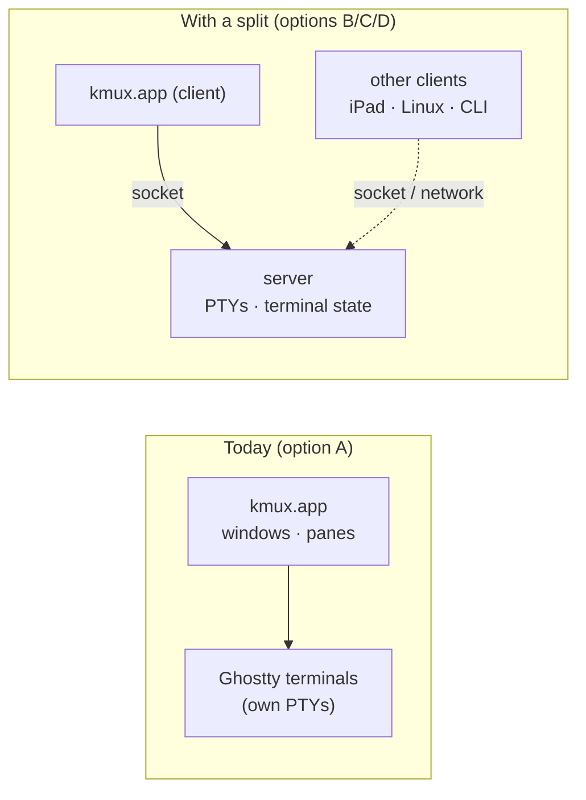
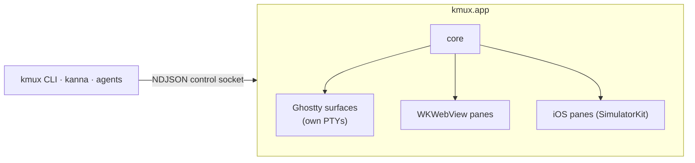
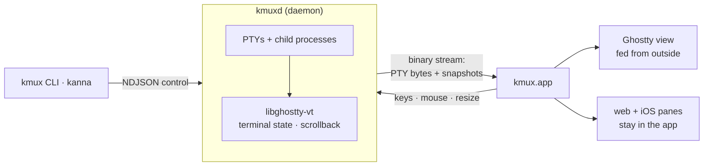
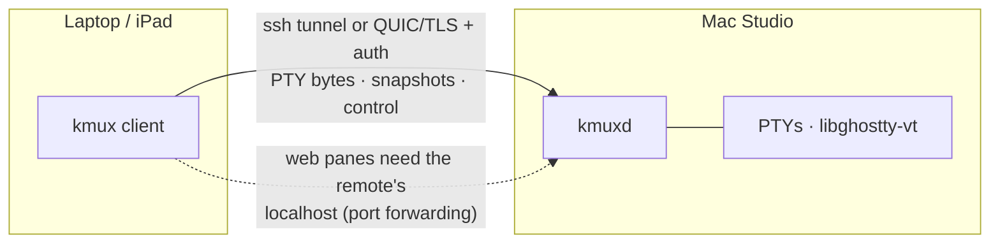
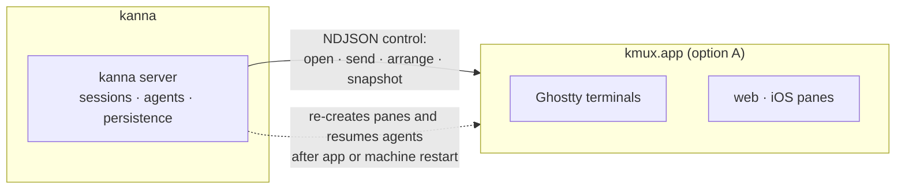

# kmux — Client/Server: A Discussion Paper

> Research for the kmux roadmap, 2026-10-09. This paper prepares a decision; it doesn't make one. The questions only you can answer are in [section 7](#7-questions-for-you), and [section 8](#8-default-recommendation) gives the default we'd pick if you don't say otherwise.

## Table of Contents

1. [Summary](#1-summary)
2. [What a split could solve](#2-what-a-split-could-solve)
3. [Prior art](#3-prior-art)
4. [Options for kmux](#4-options-for-kmux)
5. [Protocol: why NDJSON, and when not](#5-protocol-why-ndjson-and-when-not)
6. [Costs](#6-costs)
7. [Questions for you](#7-questions-for-you)
8. [Default recommendation](#8-default-recommendation)
9. [Glossary](#9-glossary)
10. [Sources](#10-sources)

---

## 1. Summary

Today kmux is one app. It owns its terminals, and when it quits they're gone; on restart it makes new ones. A **client/server split** would move the terminals into a separate **server** (a daemon) that keeps running, with the kmux window as a **client** that attaches to it.

- **What a split buys:** terminals that survive the app, attaching from another machine, and other front ends such as an iPad app, a Linux UI or a web UI.
- **What it costs:** a second process with its own lifecycle and upgrades, a wire protocol, twice the memory per terminal, and, the big one, a way to feed a Ghostty view from somewhere other than a local PTY. Upstream Ghostty can't do that today. kanna-v3 had to fork Ghostty to get it.
- **The context:** you've said kanna will own surviving app and machine restarts. That leaves kmux's case for a server weak *for now*. The strongest reasons left are remote attach and other front ends, and both are still "needs discussion".

---

## 2. What a split could solve

| # | Problem | Who benefits | How much (for kmux) | Owner |
|---|---------|--------------|---------------------|-------|
| 1 | **Terminals survive an app restart, crash or update.** A long build, a dev server or an agent session keeps running while kmux restarts. | Everyone running long jobs; agents mid-task | High value in general, but you've assigned it to kanna | **kanna** |
| 2 | **Terminals survive a machine restart.** This isn't really client/server: processes die with the machine, so it means *re-creating* sessions (cwd, command, agent resume). kanna-v3 did this with `resume --last` / `--continue`. | Agent users | Same as above | **kanna** |
| 3 | **Attach from another machine.** For example, the laptop shows panes running on the Mac Studio, like the Studio ⇄ laptop move this session did over ssh. | You, with two Macs | Medium; ssh + kmux on the remote machine covers much of it today | Open: kmux or kanna |
| 4 | **Several front ends.** An iPad/iPhone app, a Linux UI, a web UI, all showing the same sessions. | Mobile checking on agents; Linux users | Speculative until those apps are wanted | Open |
| 5 | **Crash isolation.** A WebKit, simulator or UI bug can't take the terminals down with it. | Everyone | Low to medium: WebKit already runs pages in separate processes; the iOS pane's private frameworks are the riskiest code in the app | kmux |
| 6 | **Headless use for agents and CI.** Run terminals with no window, for tests or for an agent on a server. | Agents, CI | Low: `--bg` and the control protocol already cover tests on a Mac; Linux CI would need a headless server | kmux or kanna |
| 7 | **Sharing sessions.** Two people watching or typing in one terminal. | Pairing, demos | Low; not asked for | — |

**Reading the table:** the high-value problems (1, 2) are kanna's by your decision. What's left for kmux is 3 and 4, both still undecided, plus some crash isolation (5).

---

## 3. Prior art

| Project | Where the server lives | What goes over the wire | Who renders | Reconnect |
|---------|------------------------|-------------------------|-------------|-----------|
| **tmux** | A server process per user, started by the first client, over a Unix socket | The server keeps each pane's grid and sends the client *terminal output* that redraws its view (it renders into the client's terminal) | Server composes, client's terminal displays | Detach/attach any time; client and server versions must match |
| **zellij** | Server per session, Unix socket | Serialized messages; the server renders the screen for the client | Server | Attach by session name; sessions can be resurrected after a reboot from saved layouts |
| **WezTerm mux** | `wezterm-mux-server`, reached through "domains": a Unix socket, ssh (it starts the server on the remote machine) or TLS | Binary length-prefixed messages carrying pane *content changes* (lines), not raw PTY bytes | Client renders natively (GPU) | Client re-attaches and receives the current state |
| **kitty** | No server; one app | Remote control is JSON over a socket, like kmux's protocol | App | None; `kitten ssh` only improves the remote shell |
| **mosh** | `mosh-server` on the remote machine, started over ssh | Its own UDP protocol that syncs *screen state*, not a byte stream, so it can skip stale frames | Client, with **local echo prediction** to hide lag | Survives network changes and sleep; no scrollback |
| **VS Code Remote** | A server installed on the remote machine over ssh | Its own RPC; terminals run on the server, and output is replayed from a buffer on reconnect | Client (xterm.js) | Reconnects and replays recent output |
| **Warp** | No terminal server; "Warpified" ssh sessions run a shell integration on the remote | Shell hooks plus its own blocks protocol | Client | — |
| **cmux** *(from our [comparison](cmux-comparison.md), not its source)* | The macOS app owns its panes. Separately, **cmux-tui** is a tmux-style Rust mux with a headless server and attaching clients on macOS and Linux, with `subscribe` for events. **`cmux ssh`** runs a Go daemon on the remote machine and even routes browser-pane traffic through it. | — | — | Restores layouts, cwd and best-effort scrollback after restart; live detach via a local tmux |
| **Superlogical** (Mitchell Hashimoto's new company) | A server-side mux built **on libghostty** | The client sends input like ssh; the server holds persistent session state | A "smart client" renders and scrolls locally | Disconnect and come back later |
| **kanna-v3** (ours) | `keeper` holds each PTY; **`kanna3d`** mirrors output into **libghostty-vt**, keeps an offset ring, fans out to clients and makes snapshots; an **edge** speaks QUIC for remote attach with a token | Length-prefixed binary frames (12-byte header) for output, input, snapshots and resizes; JSON inside control frames | Client: a **forked Ghostty** surface fed from outside (`ghostty_surface_process_output`, an "external I/O" backend) | Resumes from the last offset; overflow forces a fresh snapshot. Measured: daemon SIGKILL → repaint in 447 ms; the shell survives because the keeper holds the PTY |

**Lessons that carry over:**

- **What crosses the wire decides most of the design.**
  - Raw PTY bytes: VS Code, kanna-v3. Simple and exact, but a reconnecting client needs a snapshot plus the bytes since.
  - Screen state or diffs: mosh, WezTerm. Robust on bad networks, but the server must run a full terminal emulator.
  - Rendered output: tmux, zellij. A thin client, but it can't render natively.

  kanna-v3 did both: bytes for the live stream, Ghostty-native snapshots for reconnects.
- **Native rendering on the client needs a terminal view you can feed yourself.** That's why kanna-v3 forked Ghostty. Superlogical makes this a first-class libghostty use case, so upstream support may arrive. That's worth waiting for rather than forking again.
- **Version skew is the classic pain.** tmux's "server version mismatch" problem: after an app update, the old daemon is still running.
- **Remote is where the hard problems are:** latency (mosh's prediction), auth and encryption (WezTerm TLS, kanna-v3's QUIC with tokens), and starting the server remotely (WezTerm/VS Code/mosh all bootstrap over ssh).

---

## 4. Options for kmux

### Option A — No server (today)

- **Wire:** control requests only (NDJSON). Terminal bytes never leave the process.
- **Benefits:**
  - Simplest; upstream Ghostty unchanged.
  - Typing p95 0.6 ms; 9 MB per terminal pane.
  - One thing to install and upgrade.
- **Costs:** terminals die with the app; no remote attach; no other front ends.
- **Web and iOS panes:** unaffected.

### Option B — Local daemon owns the terminals

- **Wire:**
  - From daemon to app: PTY output bytes in order, with offsets, plus a terminal snapshot on attach or overflow.
  - From app to daemon: input, mouse and resize.
  - Control stays NDJSON.
  - Rendered frames never cross the wire.
- **Server side:** **libghostty-vt** runs in the daemon to keep each terminal's state and scrollback. kanna-v3's `vendor/libghostty-rs` already wraps it in Rust.
- **Benefits:** terminals survive app restarts, crashes and updates; a base for options C and D; better crash isolation.
- **Costs:**
  - **A Ghostty view fed from outside.** Upstream can't do this today; kanna-v3 had to fork (`ghostty_surface_process_output`). The spec decided to start from upstream precisely to avoid that fork.
  - Two copies of terminal state: the daemon's mirror and the view's. That's roughly ×2 memory per pane.
  - A daemon lifecycle: start, upgrade, version handshake, and handing PTYs to a new daemon version. kanna-v3's separate `keeper` existed for that.
  - About 0.1 ms more typing latency (section 6).
- **Web and iOS panes:** stay in the app. The daemon can only remember their URL, app and device. They are *not* served; after an app restart they're re-created, as today.

### Option C — Option B, reachable over the network

- **Wire:** the same as option B, over an encrypted, authenticated link. On a WAN, consider screen-state sync or local echo, as mosh does.
- **Benefits:** remote attach (problem 3) and the base for an iPad client (problem 4).
- **Costs:**
  - Everything in option B, plus auth, encryption, starting the server on the remote machine, and network resilience.
  - Web panes need port forwarding, which cmux does by routing browser traffic through its remote daemon.
  - **iOS panes can't follow at all** without streaming the simulator's screen as video and sending touches back. The simulator only runs on a Mac with Xcode.
  - A network-reachable terminal server is a remote shell by design, so its security bar is ssh's.

### Option D — kanna owns the server; kmux stays one app

- **Wire:** kmux's existing control protocol only.
- **How it works:** kanna remembers what should exist (layouts, cwd, commands, agent sessions) and re-creates it in kmux after a restart, resuming agents by session ID, as kanna-v3 did. That matches what you said: kmux makes new terminals on restart, and kanna has the advanced restart features.
- **Benefits:**
  - kmux stays simple: no Ghostty fork, no daemon.
  - Persistence lives where the agent and task knowledge already is.
  - Works for web and iOS panes too, because they're re-created rather than served.
- **Costs:**
  - The processes themselves don't survive a kmux restart, so a running build restarts. kanna can only resume what can be resumed.
  - If live survival is needed later, the server goes in kanna (kanna-v3's design), and kmux would need option B's "Ghostty view fed from outside" anyway.

### The options at a glance

| | A: none | B: local daemon | C: networked | D: kanna owns it |
|---|---|---|---|---|
| Terminals survive the app | ✗ re-created | ✓ live | ✓ live | ~ re-created by kanna, agents resumed |
| Remote attach | ✗ (use ssh) | ✗ | ✓ | ✗ in kmux |
| Other front ends | ✗ | ~ local only | ✓ | via kanna |
| Ghostty fork or upstream change needed | No | **Yes** | **Yes** | No (for kmux) |
| Memory per terminal | 1× | ~2× | ~2× | 1× |
| Web / iOS panes | in app | in app, re-created | web via forwarding, iOS ✗ | re-created by kanna |
| Complexity | low | high | very high | low for kmux |

---

## 5. Protocol: why NDJSON, and when not

**Why kmux uses NDJSON (one JSON object per line) for control:**

- Anyone can drive it: `nc -U kmux.sock`, `jq`, a shell script, any language's standard library, and, importantly, an agent reading and writing it directly.
- No schema compiler or generated code in the Swift, Rust and model builds.
- Control messages are small and rare (tens per second at most), so parsing cost doesn't show. Typing latency is 0.6 ms at p95 with JSON in the loop for scripted input.
- The same choice as JSON-RPC, LSP, MCP, the Chrome DevTools Protocol and cmux's socket API.

**Where it stops being right:** bulk or binary data.

- PTY output is arbitrary bytes. In JSON it must be escaped or base64-encoded (+33% size, plus encoding work on every chunk).
- A busy terminal can produce megabytes per second.
- Snapshots and images are binary too.

That traffic belongs on a **binary stream**. kanna-v3 already did exactly this: length-prefixed frames with a 12-byte header (length, kind, flags, channel). Output, input, snapshot and resize frames are raw bytes; control frames carry JSON.

| Format | Good at | Costs | Fit for kmux |
|--------|---------|-------|--------------|
| **NDJSON** | Readable, universal, agents can use it | Verbose; bytes need base64 | **Control** (keep) |
| **Length-prefixed binary frames** (+ JSON in control frames) | Raw bytes with no encoding, trivial to implement, streaming | Needs a tiny framing library per language | **PTY/snapshot stream** if we build B or C |
| **Protocol Buffers** | Typed schema, compact, good versioning rules, codegen for many languages | Codegen in every build; not human-readable, so agents and `nc` can't use it directly | Only if the protocol grows large and many third-party clients appear |
| **Cap'n Proto / FlatBuffers** | Zero-copy reads, very fast | Heavier tooling; benefits only show at high message rates | Overkill |
| **MessagePack / CBOR** | "Binary JSON": no schema, carries bytes natively | Not readable; little gain over JSON for small control messages | A possible payload for binary frames, not needed |

**Short answer to "why not protobuf?":** for control, readability and zero tooling matter more than compactness, and agents are clients. Protobuf's real advantages are schema evolution and codegen. They'd matter with many independent client implementations, which we don't have. Binary, if we need it, should be plain framing for byte streams, not a schema system for control.

---

## 6. Costs

| Cost | Detail |
|------|--------|
| **Complexity** | A daemon (start-on-demand, lifetime, logs), an attach/detach/reconnect state machine, snapshots and offsets, plus the Ghostty change. kanna-v3's stack needed four processes (keeper, kanna3d, edge, app) and a Ghostty fork. |
| **Latency** | Measured in kanna-v3 on this Mac: a one-byte echo through the daemon over a Unix socket took **0.069 ms p50 / 0.119 ms p99**; over loopback QUIC **0.38 / 0.66 ms**. Against today's 0.6 ms typing p95, a local daemon adds about 0.1 ms, which is invisible. Remote is dominated by the network (1–5 ms LAN, 20–150 ms WAN), where mosh-style local echo becomes worth it. |
| **Memory** | Terminal state lives twice, in the daemon's libghostty-vt mirror and in the client's view: roughly double today's 9 MB per terminal pane, plus a daemon process. |
| **Security** | Local: a user-only Unix socket, as today. Network: a terminal server *is* remote code execution for whoever authenticates, so it needs ssh-grade auth and encryption (ssh tunnel, or TLS/QUIC with keys or tokens), plus a decision about relays (kanna-v3 planned end-to-end encryption with relays seeing only ciphertext). |
| **Versioning** | After an app update the old daemon is still running (tmux's classic mismatch). Needs a version and capability handshake, and a way to upgrade the daemon without killing shells: hand the PTY file descriptors to the new daemon, which was kanna-v3's `keeper` design. |
| **Web and iOS panes** | Can't be served like terminals. Web panes are re-created (or port-forwarded when remote). iOS panes would need video streaming of the simulator to work remotely at all. |
| **Platform** | A Linux daemon is plausible (kanna-v3 built keeper and kanna3d for Linux). A Linux *client* is a separate UI project. |

---

## 7. Questions for you

1. **Should a running process ever outlive the kmux app**, or is "kmux re-creates, kanna resumes" (option D) the whole answer? The spec currently says *"Later, we fork our own mux and move to a kanna-v3-style app-plus-daemon"*. Keep that, or replace it with D?
2. **Is remote attach a kmux feature or a kanna feature?** For example, the laptop showing the Studio's panes.
3. **iPad/iPhone:** a viewer of terminals and agents only, or full panes? Same network only, or anywhere (which means a relay)?
4. **Ghostty:** would you carry a Ghostty fork again for live survival, or wait for upstream libghostty support? Superlogical makes upstream support for external I/O more likely.
5. **Linux:** do you mean a headless server on Linux machines, a Linux UI, or both?
6. **Network security, if we go remote:** ssh-only (tunnel through ssh, like WezTerm's ssh domains and mosh), or our own TLS/QUIC with tokens, like kanna-v3's edge?

---

## 8. Default recommendation

**Unless you say otherwise:** kmux stays a single app (**option A**), and restart survival is **option D**. kanna remembers sessions and re-creates and resumes them through kmux's existing control protocol. We'd also replace the spec's "move to an app-plus-daemon" line with that.

Keep NDJSON for control. If a byte stream is ever needed, add kanna-v3-style length-prefixed binary frames rather than protobuf.

Revisit options B and C only when remote attach or an iPad client becomes a real priority, and preferably once upstream libghostty can drive a view from outside, so we never carry a Ghostty fork again.

---

## 9. Glossary

| Term | Meaning |
|------|---------|
| **Client/server split** | Running terminals in a background server process, with windows (clients) that attach to it. |
| **Daemon** | A background process with no window that keeps running when the app quits. |
| **PTY** | Pseudo-terminal: the OS device a shell reads input from and writes output to. Whoever holds it keeps the shell alive. |
| **Attach / detach** | Connect a client to a running session, or disconnect while the session keeps running. |
| **Snapshot** | A copy of a terminal's current screen and scrollback, sent so a reconnecting client can catch up without replaying everything. |
| **libghostty / libghostty-vt** | Ghostty's terminal engine as a library; `-vt` is the part that parses output and keeps terminal state, without drawing. |
| **External I/O (Ghostty)** | Feeding a Ghostty view with bytes from somewhere other than its own PTY. kanna-v3 added this in a fork. |
| **NDJSON** | Newline-delimited JSON: one JSON object per line. kmux's control protocol. |
| **Length-prefixed frame** | A binary message that starts with its length, so raw bytes can be sent without escaping. |
| **Protobuf, Cap'n Proto, FlatBuffers, MessagePack, CBOR** | Binary serialization formats; the first three use a schema compiled into code, the last two are schemaless "binary JSON". |
| **QUIC** | A modern encrypted transport over UDP (used by HTTP/3); kanna-v3's edge used it for remote attach. |
| **Local echo prediction** | Showing typed characters before the server confirms them, to hide network lag (mosh). |
| **Version skew** | A client and server from different releases talking to each other. |

---

## 10. Sources

- kanna-v3 worktree (`~/.kanna/repos/kanna-v3/.kanna-worktrees/task-9a38409e`): `docs/plan.md`, `docs/research/slice1-latency.md`, `docs/research/slice2-recovery.md`, `docs/research/slice4a-ghostty-external-io.md`, `crates/kanna3-proto/src/lib.rs`.
- [cmux vs kmux comparison](cmux-comparison.md) (cmux details come only from there).
- [The Register: Mitchell Hashimoto's Superlogical](https://www.theregister.com/a/5281970), [libghostty overview](https://wikidocs.net/blog/@jaehong/8454/), [Ghostty discussion: session manager #3358](https://github.com/ghostty-org/ghostty/discussions/3358).
- [WezTerm multiplexing](https://wezterm.org/multiplexing.html).
- tmux, zellij, kitty, mosh, VS Code Remote and Warp: from their public documentation, summarised from general knowledge; details worth re-checking before any design work.
