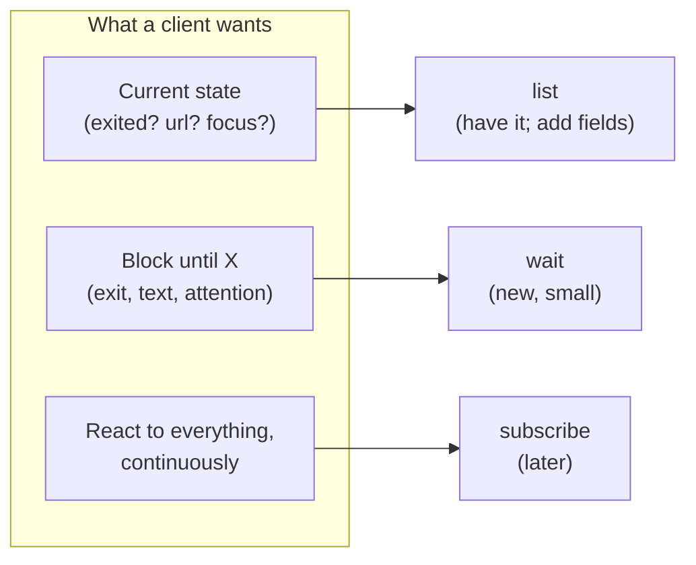
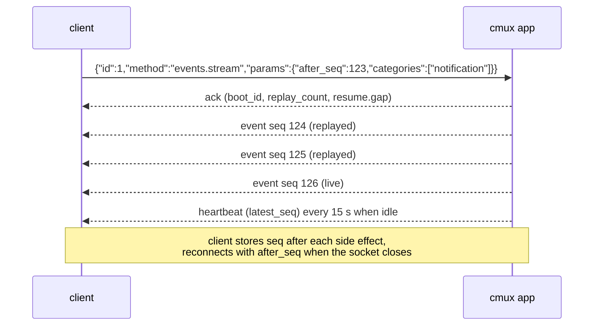
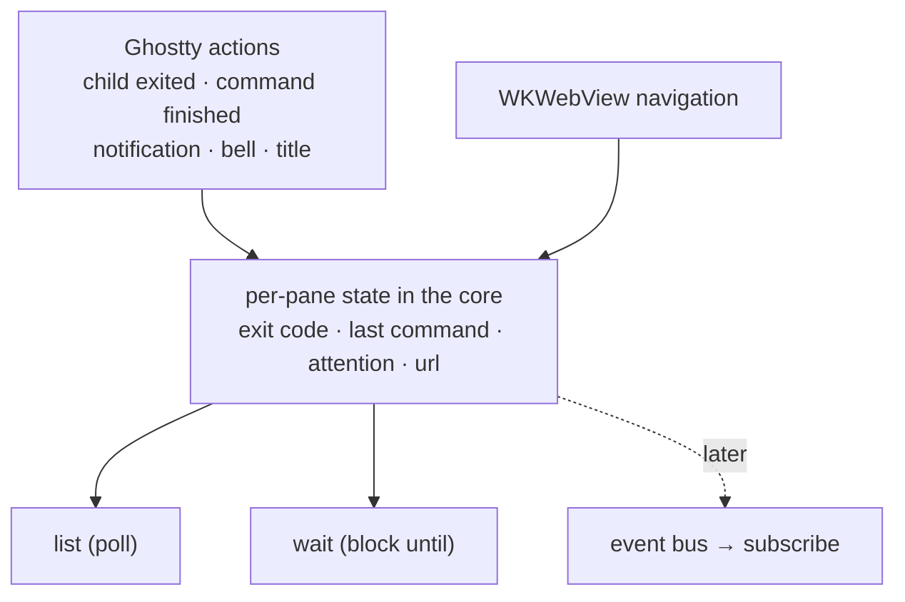
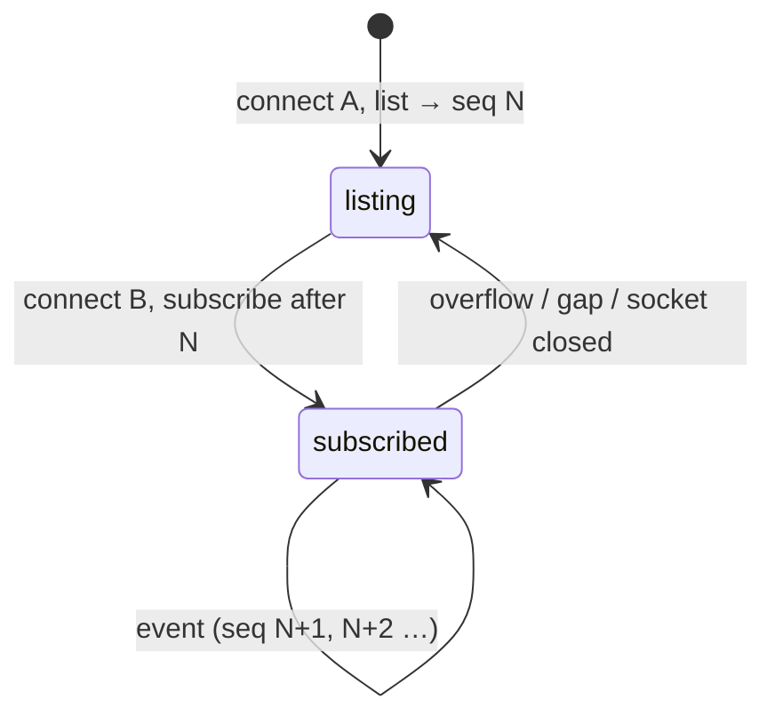

# Events and Subscriptions: cmux, Other Muxes, and kmux

> Research for the kmux roadmap question "what are events/subs for in cmux?", 2026-10-09.
> **Recommendation:** don't add a push event stream yet. When a client needs to notice changes, first add **retained state to `list`** and a blocking **`wait`** command; add `subscribe` only when a long-lived kmux client exists (a sidebar, a dashboard, kanna's Desk & Shelf UI). [Section 6](#6-the-minimal-design-if-we-add-them) gives the design to use then, so nothing done now has to be undone.

**Where facts come from:**

| Mark | Meaning |
|------|---------|
| **[docs]** | Read in cmux's published docs (`docs/events.md`, `docs/automations.md`, `docs/notifications.md`, `docs/cli-contract.md`, `cmux-tui/docs/protocol.md`, `cmux-tui/spec/events.md`) at cmux commit `ce6be93` (main, 2026-10-09), or in `cmux --help` from the installed v0.65 app. |
| **[clean room]** | Reported in plain words by a separate agent that read cmux's source. This document's author never saw cmux code. |
| **[verified]** | Checked in kmux's own code or in the GhosttyKit header kmux builds against. |
| **[general knowledge]** | From memory of the other projects, not re-checked. May be out of date. |

## Table of Contents

1. [Summary](#1-summary)
2. [What cmux offers](#2-what-cmux-offers)
3. [What cmux's clients use events for](#3-what-cmuxs-clients-use-events-for)
4. [Other muxes](#4-other-muxes)
5. [kmux: which needs polling `list` doesn't serve](#5-kmux-which-needs-polling-list-doesnt-serve)
6. [The minimal design, if we add them](#6-the-minimal-design-if-we-add-them)
7. [Is it worth it now?](#7-is-it-worth-it-now)
8. [Questions for you](#8-questions-for-you)
9. [Glossary](#9-glossary)

---

## 1. Summary

- **cmux has two separate event systems.** The macOS app has a **reconnectable event stream** (`cmux events`, socket method `events.stream`) with about 60 named events in 10 categories, sequence numbers, a replay buffer and a JSONL log on disk. **cmux-tui**, its tmux-style server, has a `subscribe` command that pushes events on the same connection, plus `attach-surface`, which streams a terminal's bytes. [docs]
- **What they're for:** cmux's events serve its *agent* features. Sidebars stay fresh without polling, the "Feed" shows agent permission requests, user rules ("automations") fire on "agent needs input", and Macs, phones and cloud machines mirror each other's notifications. The terminal's own output is **not** in the app's event stream. [docs]
- **The app's stream is notably missing** "a command finished with exit code N" and "text appeared in a pane". Neither of cmux's event systems reports a shell command's exit status. cmux answers those needs with hooks that agents call and with blocking commands (`browser wait`, cmux-tui's `terminal.wait` / `wait_exit`, `wait-for`). [docs; clean room]
- **For kmux,** most of the needs listed in the brief are either *state* (pane exited, URL, focus), which `list` can carry, or *"tell me when X"*, which a blocking `wait` request answers better for one-shot clients such as kanna and agents. A push stream only pays off for a client that stays connected and redraws or reacts continuously, and kmux has none yet.



---

## 2. What cmux offers

### 2.1 At a glance

| | **cmux app** (`events.stream`) | **cmux-tui** (`subscribe`) | **cmux-tui** (`attach-surface`) |
|---|---|---|---|
| Purpose | Observe the app: windows, workspaces, panes, notifications, agents | Keep a remote UI's tree in sync | Mirror one terminal or browser |
| Started by | One request; **the connection then carries only events** | One request; **events interleave with later replies** | One request per surface |
| Framing | NDJSON frames: `ack`, `event`, `heartbeat` | NDJSON lines `{event: …}` | NDJSON lines with base64 data |
| Filters | By event name and by category | Coarse vs. fine tree events | One surface |
| Ordering / resume | `seq` + `boot_id`; replay from a 4,096-event ring; `gap` flag when too old | No replay; resubscribe, then `list-workspaces` | VT snapshot first, then bytes, with no gap |
| Slow client | 1,024-event queue, then closed with `slow_consumer` | 4,096-event queue, then `overflow` and the subscription ends; titles coalesce | Output: reattach on `overflow`; browser frames: old ones skipped |
| Other | 15 s heartbeats; frames capped at 16 KiB; also written to `~/.cmuxterm/events.jsonl` (2 × 16 MiB) | No initial snapshot: subscribe, buffer, list, then drain | |

All rows: [docs].

### 2.2 The app's event stream



Every event has a common envelope: `seq`, `boot_id`, `id`, `name`, `category`, `source`, `occurred_at`, the window, workspace, pane and surface it concerns (when known) and an event-specific `payload`. [docs]

**Catalogue** (names from `docs/events.md`) [docs]:

| Category | Events | Notes |
|----------|--------|-------|
| window | created, focused, keyed, unkeyed, closed | "keyed" is the AppKit key window, kept separate from a focus *request*. |
| workspace | created, selected, closed, renamed, reordered, moved, action, prompt.submitted | Emitted from the model, so they cover UI, CLI, shortcuts and restore alike. |
| surface / pane | surface created, selected, focused, closed, moved, reordered, action, input_sent, key_sent; pane created, closed, focused, resized, swapped, broken, joined | Text sent through the API is **redacted**; only its length is given. |
| sidebar | metadata, progress, log: updated/cleared/appended; reset | Mirrors `set-status`, `set-progress`, `log`. |
| notification | requested, created, read, removed, cleared, plus "…_requested" for each socket command | Title and body are redacted by default. |
| feed / agent | feed.item received, completed, resolved; `agent.hook.<HookName>` (e.g. `agent.hook.Stop`); agent.message queued, delivered, read | Fed by agent hooks (`cmux hooks setup`). |
| browser | navigation, interaction, input | Emitted when a *command* completed, not on every page navigation. |
| app / config | focus override, simulated active, config.reloaded | Test and debug hooks. |

**Not in the catalogue:** terminal output, a process exiting, a shell command finishing with its exit status, a bell, a title change. [docs; whether the app tracks these internally: see [3.2](#32-clean-room-findings)]

### 2.3 cmux-tui's `subscribe` and `attach-surface`

cmux-tui is a separate, headless, tmux-like server. Its `subscribe` pushes a lower-level, terminal-centric set [docs]:

| Event | Carries |
|-------|---------|
| `surface-output` | "This surface has new output", **coalesced by a dirty flag, not the bytes**. Bytes need `attach-surface`. |
| `surface-exited` | A PTY child exited (an exit record is kept until the terminal is closed). |
| `title-changed` | The current title; a slow client keeps only the latest per surface. |
| `bell` | The terminal rang its bell. |
| `notification` | id, title, body, level, surface. |
| `agent-changed` | Agent state for a surface: working, blocked, idle, done, unknown, with its source (plugin, detected, socket, hook). |
| tree deltas, `tree-changed`, `layout-changed` | Workspace, screen, pane and tab added/closed/renamed; or a coarse "re-fetch the tree". |
| client and pairing events, `overflow`, `empty` | Who is attached; "you fell behind"; "the last workspace closed". |

`attach-surface` sends a VT snapshot, then the PTY's bytes in order, with no gap between the two. This is the tmux `%output` equivalent. [docs]

### 2.4 Things cmux uses *instead of* events

| Mechanism | What it does | Mark |
|-----------|--------------|------|
| `wait-for NAME` / `wait-for -S NAME` | A named semaphore between scripts (tmux's `wait-for`). | [docs] |
| `browser wait` | Block until a selector, text, URL, load state or JS predicate holds. | [docs] |
| `vm terminal wait --pattern REGEX` | Block until a cloud terminal's screen matches; relays cmux-tui's `terminal.wait`, which also has `terminal.wait_exit`. | [docs; clean room] |
| `set-hook EVENT COMMAND` | tmux-compatible hooks: run a command when an event happens. | [docs] |
| `pipe-pane --command` | Pipe a pane's text to a shell command. | [docs] |
| `automation` rules | In-process "when event X where Y, then notify / rpc / run / webhook", rate-limited, with cycle detection. | [docs] |
| `hooks setup` | Installs hooks into Claude Code, Codex, OpenCode and others so the *agent* reports its own lifecycle to cmux. | [docs] |

---

## 3. What cmux's clients use events for

### 3.1 From the docs

| Consumer | Uses | Why events, not polling |
|----------|------|-------------------------|
| **Extension sidebars** | Bootstrap from `extension.sidebar.snapshot`, then reduce `workspace`, `notification` and `sidebar` events. The docs say `workspace.prompt.submitted` exists "to keep derived state fresh without polling". | Many small changes; a sidebar redraws on each. |
| **Feed** (agent approvals) | `agent.hook.*` and `feed.item.*`: permission requests, questions and plans shown as cards the user can answer. | An agent is blocked until the user answers, so latency matters. |
| **Automations** | Rules on events such as `agent.needs_input`: notify, reorder workspaces, run a script, POST a webhook. | Reacting is the whole point. |
| **Notification mirroring** | A Mac reads a cloud machine's or another Mac's event stream and shows its notifications on the pane that displays that terminal. | Remote, long-lived, must not miss one (hence `seq` and replay). |
| **Remote TUI / mirrors** (cmux-tui) | Tree deltas, titles, exits and `attach-surface` bytes to draw a full UI elsewhere. | It *is* a UI; it needs every change. |
| **Audit** | `~/.cmuxterm/events.jsonl`. | After-the-fact. |

The pattern: **every consumer is long-lived** (a UI, a rules engine, a mirror). Short-lived scripts and agents use the CLI, hooks and `wait` commands instead.

### 3.2 Clean-room findings

A separate agent read cmux's source at `ce6be93` and reported the following in plain words. This document's author saw only that report.

| Finding | Mark |
|---------|------|
| The app's stream sits on an in-process **event bus**. The automation engine subscribes to the same bus; agent journal, auto-resume and agent messaging publish to it. | [clean room] |
| **Phones and mirrored devices do not use `events.stream`.** The app has a separate topic-based channel for them (terminal bytes, render grids, workspace updates, browser and simulator frames), with bounded per-connection queues, coalescing bytes and grids per surface. | [clean room] |
| OSC 9, 99 and 777 are parsed by **cmux's Ghostty fork** (it adds OSC 99) and become notification requests. With `cmux notify`, they land in the notification store, which emits `notification.created` with the text redacted. | [clean room] |
| **Shell integration** in the app reports "running" vs "prompt", cwd, TTY, git branch and PR over the socket, but **no exit status**, and none of it appears as an event. | [clean room] |
| cmux-tui injects Ghostty's shell integration (OSC 133) only for prompt handling. **Command start and finish are not exposed** to clients; the only exit information is per process (`surface-exited`, `terminal.wait_exit`). | [clean room] |
| cmux-tui has a newer public protocol, **`cmux.protocol/2`**, that applications are told to use instead of raw `subscribe`. Streams are named and each has its own sequence and cursor. `session.events` sends a snapshot then one batch of changes per transaction, with replay from a cursor. There's a filterable append-only journal, a `stream.cancel` unsubscribe, and a 256-message / 16 MiB queue per stream; a slow stream ends with reason `gap` without disturbing the others on the connection. | [clean room; from docs] |
| cmux-tui has blocking **`terminal.wait`** (until the screen matches a regex, woken by output, no polling) and **`terminal.wait_exit`** (exit code or signal). The macOS app's local terminals have neither. | [clean room; from docs] |
| cmuxd-remote only pushes tunnel data, EOF and error; it has no event catalogue. | [clean room] |

**What this adds:** even cmux, the most event-heavy mux here, does not tell clients that a shell command finished or what its exit status was. Its newest protocol moved toward **per-stream cursors with snapshot-then-changes**, and toward **server-side `wait` for text and exit**. Both point the same way as the recommendation below.

---

## 4. Other muxes

All of this section is **[general knowledge]** unless marked.

| Mux | Event mechanism | Delivery | Used for |
|-----|-----------------|----------|----------|
| **tmux control mode** (`tmux -CC`) | Notifications such as `%output %pane data`, `%window-add`, `%window-close`, `%layout-change`, `%session-changed`, `%window-renamed`, `%pane-mode-changed`, `%exit`; command replies wrapped in `%begin … %end` / `%error` | Text lines on the same stdin/stdout connection as commands; interleaved, so clients must parse both. Newer tmux adds `%pause` / `%continue` and `refresh-client -f pause-after=N` for slow clients, and `refresh-client -B` subscriptions to format strings. | iTerm2's native tmux integration: it *is* a full UI driven by the stream. Separately, tmux **hooks** (`set-hook pane-exited …`) and `wait-for` serve scripts. |
| **WezTerm** | No external event stream. `wezterm cli` is request/response (`list`, `get-text`, `send-text`). Events are **Lua callbacks inside the config** (`window-title`, `user-var-changed`, `bell`, `update-status`). | In-process. | Customising the UI from config; scripts poll `wezterm cli list`. |
| **kitty** | Remote control (`kitten @`) is JSON request/response; scripts poll `kitten @ ls`. **Watchers**: Python files loaded in-process with callbacks such as on_close, on_resize, on_focus_change, on_title_change and, in recent versions, command start/finish. `launch` can wait for the child to exit and return its status (flag name not re-checked). | In-process callbacks; blocking requests. | Personal automation; "run this and tell me how it ended". |
| **Ghostty** | No remote-control or event API for other processes (macOS has some App Intents / Shortcuts support in recent versions; not re-checked). Inside, it raises **actions** to the embedding app. | C callbacks into the host app. | Hosting apps (Ghostty.app, cmux, kmux) build features on them. |

**Ghostty actions kmux can already receive** [verified in the GhosttyKit header kmux builds]: `SHOW_CHILD_EXITED` (kmux uses it today, for **exited**), `COMMAND_FINISHED` (exit code and duration, from shell integration's OSC 133), `DESKTOP_NOTIFICATION` (OSC 9 / 777), `RING_BELL`, `SET_TITLE`, `PWD` and `PROGRESS_REPORT` (OSC 9;4). kmux ignores all but the first ([GhosttyRuntime.swift]). These are the raw material for most of the needs below, events or not.

**Lesson:** only tmux exposes a general external event stream, and it did so to let a *UI* (iTerm2) run on top. Everyone else gives scripts request/response plus blocking waits, and keeps event callbacks in-process.

---

## 5. kmux: which needs polling `list` doesn't serve

Polling `list` fails in three distinct ways, and they need different fixes:

1. **Latency/cost:** the change is visible in `list`, but you only see it on the next poll. Fine at 4 polls/s for a handful of panes; `list` is cheap and local.
2. **Transient:** the thing happens and leaves no state behind (a command finished but the shell is still running; a bell; a notification). Polling can't see it *at all*.
3. **Unbounded data:** text in a terminal. `list` can't carry it.

| Need | Today | Polling `list` | Best fix | Event worth it? |
|------|-------|----------------|----------|-----------------|
| A pane exited (and its code) | `list` shows state `exited` and `exitCode` [verified] | Works, with poll delay | `wait --pane p3 --until exited` | Only for live UIs |
| A command finished in a shell, with exit status | Not tracked | Transient: invisible | Record **last command** (exit code, duration, time) per pane from `COMMAND_FINISHED`, shown in `list`; `wait --until command-finished` | Yes, for UIs/automation |
| A web page navigated | `list` shows a web pane's current `url`, updated when a navigation commits, including the user's clicks [verified] | Works, with poll delay | Add the page **title**; `wait --until navigated` | Only for live UIs |
| Focus changed | `list` shows focused pane, key window | Works | — | Only for a sidebar |
| Text appeared in a pane | No reading at all | Impossible | **`wait --text REGEX`** evaluated server-side, plus a read-screen command (cmux-comparison item 1) | No: streaming text to match client-side is the wrong shape |
| An agent needs attention (OSC 9/777, bell, `notify`) | Ignored | Transient | Keep an **attention flag / last notification** per pane in `list` (cleared on focus); `wait --until attention` | Yes: it's cmux's core feature |
| Layout changed (pane opened, moved, closed by the user) | `list` | Works | — | Only for live UIs |

**Reading the table:** with three small additions (more retained per-pane state in `list`, a `wait` command, and handling three more Ghostty actions) every need is served for a one-shot client. A push stream adds value only for a client that stays connected: something that draws kmux's state elsewhere or runs rules continuously.



The core stays the single source either way: events, if added, are emitted from the same place that updates the state `list` reports, so the two can't disagree.

---

## 6. The minimal design, if we add them

### 6.1 Step 1, useful now: `wait`

```json
{"id":5,"cmd":"wait","args":{"pane":"build","until":"command-finished","timeout":600}}
{"id":5,"ok":true,"pane":"p3","event":"command-finished","code":1,"duration_ms":48210}
```

- `until`: `running`, `exited`, `command-finished`, `attention`, `navigated`, or `text` (with `match`, a regex over the visible screen).
- Returns the matching event's fields, or `{"ok":false,"error":{"code":"timeout"}}`.
- "Already true" conditions (`exited` on an exited pane) return at once; edge conditions (`command-finished`) wait for the *next* one, unless `after` (a sequence number from `list`) says otherwise.
- The connection is busy while it waits, as with `open`'s existing wait; kanna and the CLI already open one connection per command.
- CLI: `kmux wait build --until command-finished --timeout 10m`, exit 0 on match, 1 on timeout.

This is the same shape as `open`'s existing `wait`, cmux's `browser wait`, tmux's `wait-for` and kitty's wait-for-child.

### 6.2 Step 2, when a long-lived client exists: `subscribe`

**Same socket, same NDJSON, same request shape.** A subscription is opened by a request:

```json
{"id":9,"cmd":"subscribe","args":{"events":["pane.state","pane.command-finished","pane.attention"],"panes":["build"],"after":120}}
{"id":9,"ok":true,"seq":124,"replayed":4,"gap":false}
{"event":"pane.state","seq":121,"pane":"p3","window":"w1","tab":"t1","state":"exited","code":0}
{"event":"pane.attention","seq":125,"pane":"p5","kind":"notification","title":"Claude","body":"Needs input"}
```

| Decision | Choice | Why |
|----------|--------|-----|
| Connection | **A subscribed connection carries only events afterwards** (any later request gets `bad_request`). Open another connection for requests. | The cmux app does this. It keeps kmux-client's simple "send a line, read the reply" `call()` untouched, and the server's per-connection thread needs no reply/event interleaving. cmux-tui and tmux interleave and pay for it in client parsing. |
| Telling events from replies | Events have an `event` key and no `id` | Unambiguous even if we later allow interleaving. |
| Snapshot without a gap | `list` returns the current `seq`; subscribe with `after: seq` | The client lists on one connection, subscribes on another, and can't miss or double-count anything. Avoids cmux-tui's "subscribe, buffer, list, drain" dance. |
| Resume | `seq` per instance, plus an `instance_start` id; replay from a ring of the last **1,024** events; `gap: true` if `after` is too old or from an earlier start | Same contract as cmux's app, smaller ring. |
| Filters | `events` (names, or a prefix like `pane.`), `panes`, `windows` | Enough for a sidebar or a per-agent watcher. |
| Envelope | `event`, `seq`, `at` (ms), and the pane/tab/window it concerns, flat, beside the event's own fields | Matches `list`'s field names; no nested `payload`. |
| Back-pressure | Per-subscriber queue of **1,024**; latest-state events (`pane.title`, `focus`, `pane.output`) **coalesce** per pane; on overflow send `{"event":"overflow"}` and close. The client re-lists and resubscribes. | Both cmux systems and tmux's `pause-after` agree: never block the core on a slow reader, and never buffer without limit. |
| Frame size | Cap at 16 KiB; truncate text fields and add `truncated: true` | Notification bodies and titles come from programs in panes. |
| Liveness | None at first; a client detects a dead socket on read. Add heartbeats only if remote clients appear. | Local Unix socket. |
| Terminal output | **Not streamed.** At most a coalesced `pane.output` ("new output", ≤ 4/s per pane, no bytes). Byte streaming is a separate `attach` design, tied to [client/server](client-server.md). | Bytes are a different problem with different back-pressure; cmux-tui separates them too. |
| Privacy | `send` text is never echoed into events | Same as cmux's redaction; events can be logged. |

**First event catalogue** (each also visible as state in `list`):

| Event | Fields | Source in kmux |
|-------|--------|----------------|
| `pane.opened` / `pane.closed` | type, name | core |
| `pane.state` | state (`starting`, `running`, `exited`, `failed`), code or message | core lifecycle ([spec 4.3](../kmux-spec.md#43-lifecycle)); Ghostty `SHOW_CHILD_EXITED` |
| `pane.command-finished` | code, duration_ms | Ghostty `COMMAND_FINISHED` (needs shell integration) |
| `pane.attention` | kind (`notification`, `bell`), title, body | Ghostty `DESKTOP_NOTIFICATION`, `RING_BELL` |
| `pane.navigated` | url and title (web), path (md) | WKWebView `didCommit`; md pane path change |
| `pane.title` | title | Ghostty `SET_TITLE`, web page title (coalesced) |
| `focus` | window, tab, pane | core |
| `layout` | window, tab | core: split, move, arrange, resize, close. "Re-list this tab" rather than fine deltas |



### 6.3 Cost

| Piece | Size | Notes |
|-------|------|-------|
| Per-pane retained state (last command, attention) + three more Ghostty actions | Small | Needed by every option, including plain `list`. |
| `wait` | Small | A continuation table on the main actor, keyed by pane and condition; resumed when the state changes. |
| `subscribe` | Medium | An event ring, per-connection writer queue with coalescing and overflow, filter matching, protocol cases in `tests/kmux-protocol/` and in the reference model (which must emit the same events for UI actions). |
| Reference model | Medium | The model is the source of truth; every event has to exist there too. This is the main reason to wait. |

---

## 7. Is it worth it now?

**No push stream now.** Reasons:

- **No consumer.** kanna "stores nothing between commands" ([kanna spec §3]); it's a one-shot CLI, and so are agents calling `kmux`. One-shot clients want `wait`, not a stream.
- **The useful part is the state, not the stream.** Exit code, last command, attention and URL are what clients actually want, and once kmux records them, `list` and `wait` serve them.
- **Every event has to be modelled.** The reference model and shared protocol cases make each event real work, twice.
- **It can be added later without breaking anything.** The design in [6.2](#62-step-2-when-a-long-lived-client-exists-subscribe) is additive: a new command, and new fields in `list`.

**Do now or soon (cheap, independent of events):**

1. Handle Ghostty's `COMMAND_FINISHED`, `DESKTOP_NOTIFICATION` and `RING_BELL` and keep the results per pane; show them in `list`.
2. Add `wait` (6.1) when the first script or agent needs "tell me when this finishes".

**Revisit `subscribe` when** any of these happens: kanna grows a long-lived UI (the Desk & Shelf plan); someone wants a sidebar or menu-bar indicator of agents needing attention outside kmux's own window; automation rules à la cmux are wanted; or kmux goes client/server ([client-server.md](client-server.md)), where a remote UI needs a stream anyway.

---

## 8. Questions for you

1. **Attention:** should kmux show "this pane wants you" itself (cmux's ring, a dot on the tab), given panes are chromeless? Events only matter for attention if *something* displays it.
2. **`wait` first?** Is there a script or agent workflow today that would use `kmux wait --until command-finished` or `--until attention`? If yes, that's the first thing to build.
3. **Shell integration:** `COMMAND_FINISHED` needs Ghostty's shell integration (OSC 133) in the pane's shell. kmux launches commands through the user's login shell; is relying on Ghostty's automatic injection acceptable?
4. **Agent hooks:** cmux gets most of its agent events from installing hooks into Claude Code and others. Is that kanna's job, kmux's, or nobody's?
5. **Reading text:** "text appeared" really needs a read-screen command first (cmux-comparison item 1). Should that come before any event work?

---

## 9. Glossary

| Term | Meaning |
|------|---------|
| **Event** | A message the server sends without being asked, when something happens. |
| **Subscription** | A client's request to receive events, usually filtered. |
| **Polling** | Asking for the current state repeatedly (here, `list`) and comparing. |
| **NDJSON** | Newline-delimited JSON: one JSON object per line. kmux's protocol. |
| **Sequence number (`seq`)** | A counter on each event, so a client can tell what it has seen and resume. |
| **Replay buffer / ring** | The last N events kept in memory so a reconnecting client can catch up. |
| **Gap** | The client asked to resume from an event the server no longer has; it must re-read the state. |
| **Back-pressure** | What a server does when a client reads events more slowly than they're produced. |
| **Coalescing** | Replacing several pending events of the same kind with only the latest. |
| **Heartbeat** | A periodic message on an idle stream to show the connection is alive. |
| **tmux control mode** | `tmux -CC`: a text protocol that lets another program (iTerm2) act as tmux's UI. |
| **OSC 9 / 99 / 777** | Terminal escape sequences a program prints to post a desktop notification. |
| **OSC 133** | Shell-integration escape sequences marking prompt, command start and command end (with exit status). |
| **Ghostty action** | A callback GhosttyKit makes into the app that embeds it (title changed, bell, child exited…). |
| **Shell integration** | Scripts a terminal injects into the shell so it reports prompts, commands and the working directory. |
| **Feed (cmux)** | cmux's panel of agent permission requests, questions and plans the user can answer. |
| **Automation (cmux)** | A user rule: when event X happens where Y, notify / run / call / POST. |
| **Clean room** | Learning what another project does through someone else's plain-words report, never its code. |
