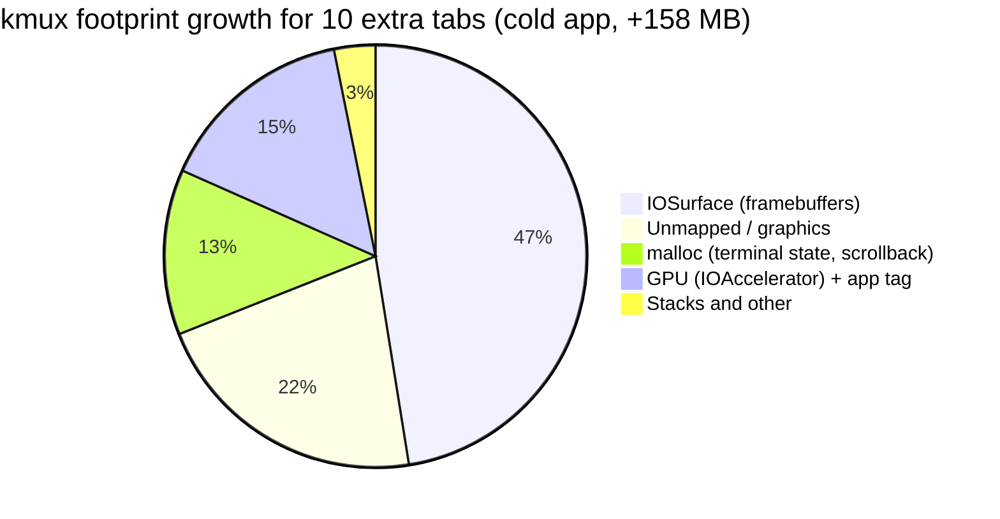
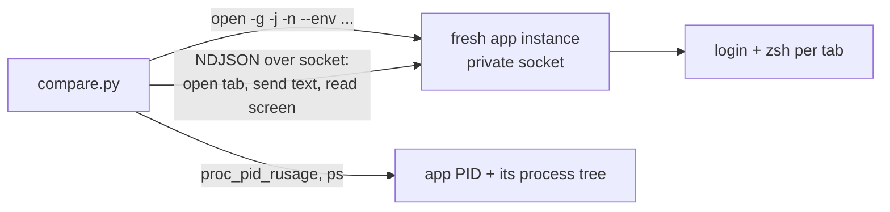

# kmux vs cmux: Quick Performance Comparison

> Research for the roadmap question "do a performance comparison with cmux (just quick and dirty)". Measured 2026-10-09 on one machine: Apple M5, 16 GB, macOS 26.2, login shell zsh. kmux at `5497305`; cmux 0.64.25 (106).

**Status: half done.** kmux is fully measured, and so are both app bundles. **cmux's runtime numbers are still missing.** The script for them is ready, but it has not been run (see [Why cmux wasn't launched](#4-why-cmux-wasnt-launched)).

## Contents

1. [Results at a glance](#1-results-at-a-glance)
2. [What kmux should fix](#2-what-kmux-should-fix)
3. [Method](#3-method)
4. [Why cmux wasn't launched](#4-why-cmux-wasnt-launched)
5. [Caveats](#5-caveats)
6. [Re-running](#6-re-running)
7. [Glossary](#7-glossary)

---

## 1. Results at a glance

Each number is the median of 3 fresh launches. Each launch had N = 10 extra idle shell tabs, the user's own zsh, and a 20 MB text file for `cat`. The "kmux hidden" and "kmux shown" columns are the same app launched in two ways: hidden (`open -j`), or shown behind the front app.

| Measure | kmux hidden | kmux shown | cmux |
|---|---|---|---|
| **App bundle on disk** | 27.5 MB (arm64 only) | same | **552 MB** (universal: x86_64 + arm64) |
| Launch → control socket answers | 206 ms | 182 ms | not measured |
| Launch → first pane runs a command | 754 ms | 731 ms | not measured |
| **Memory: app with its first window** | 38.5 MB | 38.3 MB | not measured |
| **Memory: + 10 idle shell tabs** | 206.7 MB | 206.8 MB | not measured |
| Memory per extra tab (cold app) | 16.8 MB | 16.9 MB | not measured |
| Helper processes (not counting shells) | 0 | 0 | not measured (from its docs, expect 0 at idle, plus short-lived shell-integration jobs) |
| New tab → command output (incl. zsh startup) | p50 485 ms, p95 534 ms | p50 477 ms, p95 511 ms | not measured |
| New tab → `open` returns | 19 ms | 18 ms | not measured |
| Idle CPU, app + 11 tabs | 0.3 % | 0.3 % | not measured |
| `cat` 20 MB (time inside the shell) | 201 ms (~100 MB/s) | 228 ms (~88 MB/s) | not measured |
| Socket send → text echoed on screen | p50 0.3 ms, p95 0.6 ms | p50 0.3 ms, p95 0.7 ms | not measured |
| Typing latency (real key event) | 0.6 ms p95 (from `kmux-bench`) | — | **can't be measured fairly from outside** ([5](#5-caveats)) |

**Where cmux's 552 MB goes:**

| Part | Size |
|---|---|
| Main executable (universal) | 277 MB |
| `Resources/bin` (the `cmux` CLI at 89 MB, `cmux-tui` at 74 MB, `cmux-cua` at 24 MB, a `ghostty` CLI at 12 MB, and others) | 199 MB |
| `cmux Computer Use.app` and a system extension | 32 MB |
| Markdown viewer, localizations, Sparkle, Sentry, Iroh, and the rest | ~44 MB |

kmux is a single 27 MB arm64 executable plus an icon.

**Takeaways so far:**

- **Disk size: kmux is about 20× smaller.** Most of the gap is features kmux doesn't ship (TUI, computer use, agent wrappers) plus cmux's universal binary. It isn't a sign that cmux is inefficient.
- **The shell decides pane-open time, not the app.** kmux's `open` returns in about 18 ms. The other ~460 ms is the user's `zsh -l -i` startup, which takes 380–470 ms on its own outside any terminal. cmux's numbers will be dominated by the same cost. cmux also wraps zsh startup (`ZDOTDIR`) with its own integration, so expect it to add something on top.
- **kmux's idle cost is close to zero:** 0.3 % CPU and no helper processes.
- **kmux's memory is mostly per-tab framebuffers**, which tabs nobody is looking at don't need. See [2](#2-what-kmux-should-fix).



## 2. What kmux should fix

| # | Finding | Evidence | Suggested change |
|---|---|---|---|
| 1 | **Hidden tabs keep their GPU framebuffers.** IOSurface memory grows by about 7.5 MB per tab, even for tabs that are never shown. | `footprint` of a cold kmux: IOSurface goes from 8.7 MB with 1 pane to 84 MB with 11 (window at its default size). | Release a surface's IOSurfaces (or shrink them to 1×1) while its tab isn't visible, and recreate them on show. This would bring the cold per-tab cost from about 17 MB down toward 8 MB. Check first whether Ghostty exposes a cheap way to do this, and measure how much it slows tab switching. |
| 2 | **`kmux-bench`'s memory figure is optimistic.** It reports 7.6–9 MB per pane, but a cold app costs about 17 MB per tab. | `kmux-bench`'s baseline is taken after about 15 panes have already been opened and closed, with two windows, so caches are warm (baseline 153 MB). Here the baseline is 38 MB. | Have `kmux-bench` also report the cold figure: fresh app, then +N tabs. Otherwise the 15 MB target in `bench/targets.json` passes while the cold case fails it. |
| 3 | No leak found. | 3 cycles of opening and closing 10 tabs: 38 → 210 → 55 → 186 → 61 → 200 → 61 MB. Memory comes back after close, apart from about 20 MB of first-use caches. | None. |
| 4 | Pane open and throughput are fine. | `open` returns in 18 ms. `cat` runs at about 90–100 MB/s, which is the Ghostty engine and the same in any libghostty app. | None for now. Revisit once cmux's numbers are in. |

## 3. Method



Both apps are measured from the outside, the same way:

- **Launch.** Each run starts a new instance with `open -g -j -n` (background, hidden, new instance), passing a private socket path in the environment.
  - kmux: `KMUX_SOCKET`, `KMUX_BG=1`.
  - cmux: `CMUX_SOCKET_PATH` with `CMUX_ALLOW_SOCKET_OVERRIDE=1`, `CMUX_SOCKET_MODE=allowAll`, `CMUX_DISABLE_SESSION_RESTORE=1`, and a throwaway `HOME`, `CFFIXED_USER_HOME` and `XDG_CONFIG_HOME`.
  - The app is stopped by PID at the end of the run.
- **Driving.** Each app is driven over its own control socket:
  - kmux: `open`, `send`, and `debug.text` (the visible screen);
  - cmux: `surface.create`, `surface.send_text`, `surface.read_text` (the visible screen).
- **Readiness.** "Ready" means a typed `printf 'M%sK\n' 123` has printed `M123K`. The typed line shows `M%sK`, so only real output matches. Tab-open time therefore includes the shell reading its rc files and running a command. That is the same for both apps.
- **Memory.** `proc_pid_rusage` `phys_footprint`, which is what Activity Monitor calls Memory. It is taken for the app process, and separately for its helpers. Helpers are its process tree plus any new processes from its bundle or new WebKit processes that appear after launch. Shells (`login`, `zsh`) are counted apart. Readings are taken 3 s after startup and 5 s after the last tab opens.
- **Idle CPU.** User + system CPU time of the app and its whole tree over 30 s, with 11 idle tabs.
- **Throughput.** In the first pane, the shell times `/bin/cat` of a 20 MB file (ASCII with some SGR colour) using `$EPOCHREALTIME`. `cat` blocks until the terminal has read the pty, so this is the terminal's input speed. The outside wall time to the end marker is recorded too. 3 runs per launch.
- **Socket send → echo.** `exec /bin/cat` runs in a tab, then 30 words are sent over the socket, each timed until it appears twice (once from the tty echo, once from cat).
- **Disk.** `du -sk` of the `.app`.

Results are saved as JSON: `bench/cmux-compare/results-kmux-hidden.json` and `results-kmux-visible.json`. Each file has every run and every sample.

## 4. Why cmux wasn't launched

cmux was not running, so the safety rules allowed launching it only if it would stay behind the user's work. Before launching, I had a subagent read cmux's source and report in plain words; I didn't read it myself (clean room). It found:

- **At startup, cmux un-hides itself and orders its first window front,** then asks to activate, even when launched with `open -g -j`. There is no flag that prevents this. Only the debug-only test path differs. Socket commands with `focus=false` don't bring windows forward, but that comes too late.
- **cmux's preferences (UserDefaults) are written to the real `~/Library/Preferences/com.cmuxterm.app.plist`**, even with a redirected home. The script backs that file up and restores it, but it is still a write to the user's real state.
- A second cmux instance kills itself and activates the first. The script refuses to start cmux if one is already running.

The user and the main Claude session were working on this screen, so I did not launch cmux. `compare.py` won't run cmux unless it is given `--allow-cmux-front`.

## 5. Caveats

| Caveat | Effect |
|---|---|
| **No cmux runtime numbers yet** | The comparison is incomplete until someone runs it when the screen is free (see [6](#6-re-running)). |
| The cmux driver is untested | Its method and parameter names come from cmux's docs plus the subagent's plain-words report. Expect small fixes on the first run. |
| Hidden vs shown windows | A hidden or covered Ghostty surface doesn't draw frames. When run, cmux will show a window and kmux (in the default mode) won't. For a fair cmux run, use `--visible` for both apps, so both windows exist on screen behind the front app. Shown kmux used the same memory as hidden kmux and was about 10 % slower at `cat`. |
| Same shell, different wrappers | Both apps use the login shell from the passwd database (`/usr/bin/login` → zsh). cmux adds its own zsh integration through `ZDOTDIR`, and git/PR watchers. That is real cmux behaviour, so it counts, but it isn't the terminal engine. |
| Config | No `~/.config/ghostty/config` exists, so both use Ghostty's defaults. cmux forces a few settings of its own (for example `term=xterm-256color` and shell-integration off) and may add a theme. Scrollback is not overridden. |
| **Typing latency** | There's no fair black-box way to measure it. A real key event has to reach the focused window of the app under test. That means taking focus from the user, and Accessibility permission to post `CGEvent`s. kmux's 0.6 ms comes from its own `debug.key` (a real `NSEvent` injected in-process), and cmux has no equivalent. The socket send → echo number skips the keyboard path. It is a proxy, not typing latency. |
| Window size | Footprint scales with window size (framebuffers). Both apps open at their own default size, which may differ. |
| Small N | 3 launches × 10 tabs on one machine, with other work going on (the user's kmux, other agents' background kmux instances). Medians hide some noise. Treat differences under about 10 % as noise. |
| Startup times include LaunchServices | "Launch →" times are measured from the `open` command, so they include LaunchServices and dyld, not just the app. |
| Side effect | One cross-check run of `kmux-bench` wrote `~/work/kmux/target/bench/latest.json`. Its output path is fixed at build time. That is build output only; nothing else outside the worktree was written. |

## 6. Re-running

```sh
cd bench/cmux-compare
python3 compare.py --apps kmux                          # safe while you work: hidden, private socket
python3 compare.py --apps kmux,cmux --visible --allow-cmux-front   # when nobody is using the screen
python3 compare.py --help                               # --runs, --panes, --idle, --cat-mb, --out
```

It must run outside the Claude Code sandbox (it uses `open`). kmux defaults to `~/work/kmux/target/kmux.app` (override with `KMUX_APP`), and cmux to `/Applications/cmux.app` (`CMUX_APP`).

## 7. Glossary

| Term | Meaning |
|---|---|
| **Footprint** | macOS's measure of the memory a process is responsible for (`phys_footprint`). It is what Activity Monitor shows as "Memory". |
| **IOSurface** | A GPU-shareable image buffer. Ghostty draws each terminal into a few of them. |
| **Cold / warm app** | Freshly launched, versus one that has already opened and closed panes, so its caches and allocator pools are filled. |
| **p50 / p95** | The median, and the value 95 % of samples are below. |
| **LaunchServices** | The macOS service behind `open` that starts apps. |
| **Clean room** | Building or measuring without reading a competitor's source. Others may read it and report facts in plain words. |
| **NDJSON** | Newline-delimited JSON, one message per line. Both apps' control sockets use it. |
