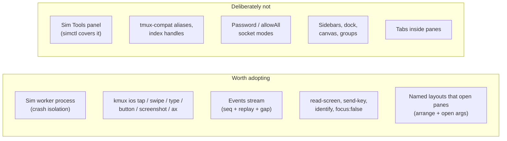
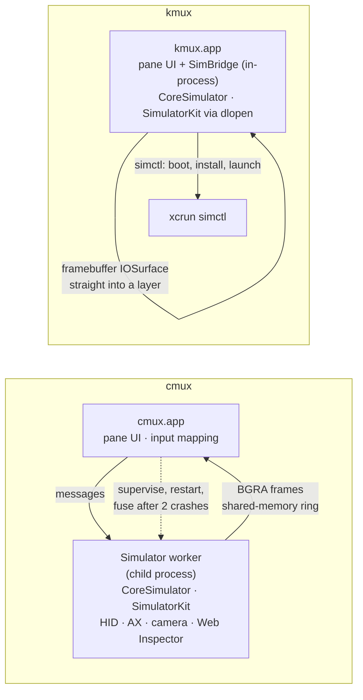
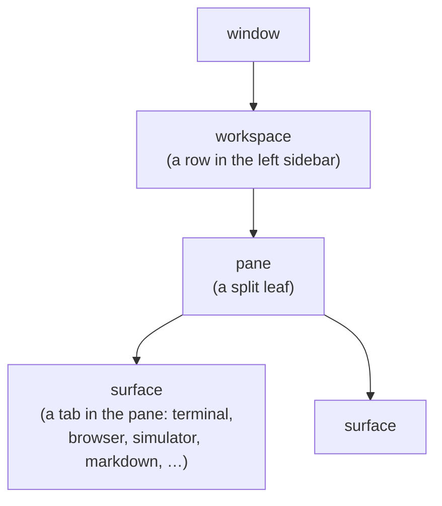
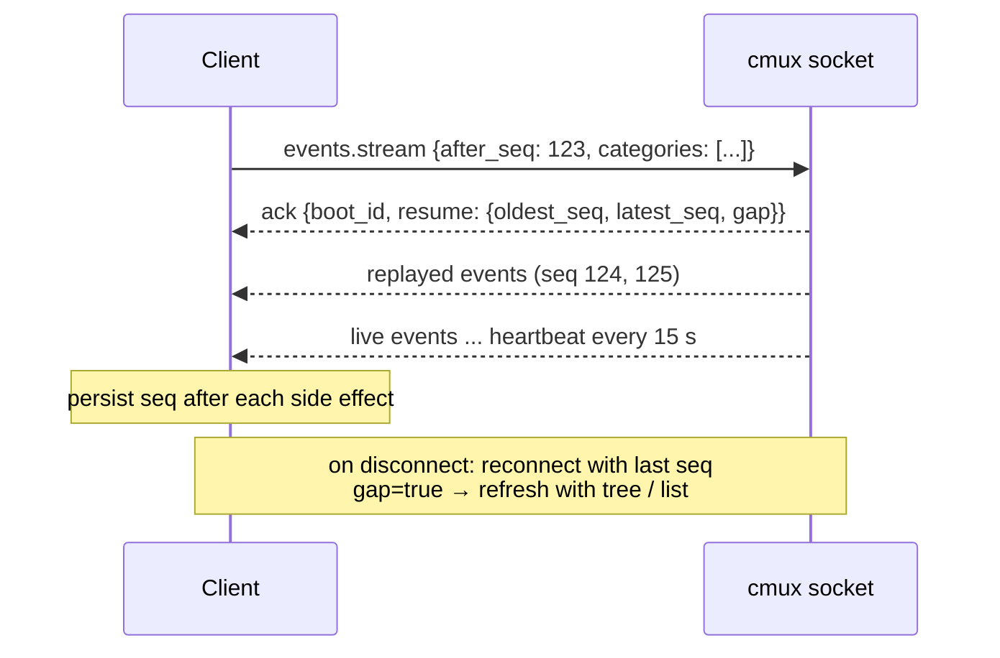
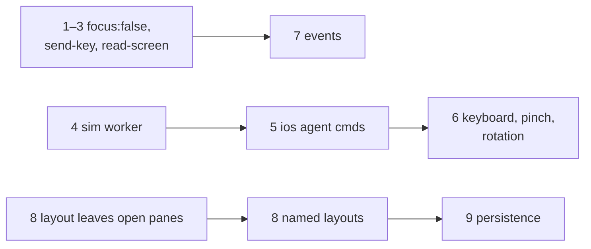

# cmux deep dive: simulator, API/CLI and layout

> Research for the kmux roadmap, 2026-10-09. Follows [cmux-comparison.md](cmux-comparison.md), which was broad and shallow; this one goes deep on three areas and says what kmux should take from each. It recommends; it doesn't decide. Questions for you are in [section 6](#6-questions-for-you).

## Table of Contents

1. [Summary](#1-summary)
2. [iOS Simulator](#2-ios-simulator)
3. [API and CLI](#3-api-and-cli)
4. [Layout](#4-layout)
5. [Recommendations in order](#5-recommendations-in-order)
6. [Questions for you](#6-questions-for-you)
7. [Glossary](#7-glossary)
8. [Sources and how each fact was checked](#8-sources-and-how-each-fact-was-checked)

**How facts are marked.** Each claim about cmux comes from one of four places, marked where it matters:

| Mark | Source |
|------|--------|
| **[help]** | I ran the installed cmux CLI's `--help` (cmux.app **0.64.25**, in /Applications). No cmux GUI was launched. |
| **[docs]** | cmux's own markdown docs and README on `main` (read 2026-10-09), or cmux.com. |
| **[clean-room]** | A separate subagent read cmux's source and reported behaviour in plain words. I did not see their code. |
| **[general]** | General knowledge, not checked against cmux. |

Facts about kmux come from this worktree (spec v0.7, `crates/kmux`, `apps/kmux`).

---

## 1. Summary

**The earlier comparison was wrong about one thing that matters:** cmux *does* have an embedded iOS Simulator pane now, and a bigger one than kmux's. It runs the private Simulator frameworks in a supervised **worker process**, forwards keyboard, multi-touch, hardware buttons and rotation, and gives agents a `cmux simulator` / `cmux ios` CLI to tap, swipe, type, screenshot and read the accessibility tree **[help] [docs]**. kmux's pane is single-touch, Home-only, and loads those frameworks into the app itself.

The other two areas confirm and sharpen the earlier picture: cmux's API is a very large JSON-RPC surface (hundreds of methods) with a proper **event stream**, and its layout system has **saved named layouts**, layout JSON for new workspaces, panes that hold tabs, a freeform canvas mode, a dock and custom sidebars.

| Area | cmux in one line | kmux today | Verdict for kmux |
|------|------------------|------------|------------------|
| **Simulator** | Embedded pane, out-of-process worker, full input, agent CLI, a large "Tools" panel | Embedded pane, in-process, single touch + Home, no agent commands | **Adopt** crash isolation, agent commands (tap/swipe/type/button/screenshot/accessibility), keyboard, multi-touch, rotation. **Skip** the Tools panel and the device toolbar. |
| **API/CLI** | ~200 CLI commands and subcommands, JSON-RPC over a socket, 5 access modes incl. password, a resumable event stream, caller context via env | 17 commands, NDJSON over a per-instance user-only socket, no events | **Adopt** events, read-screen, send-key, `identify`, no-focus creation, a short agent guide, overload/timeout replies. **Skip** tmux aliases, indexes as handles, password/allowAll modes, AppleScript. |
| **Layout** | Workspaces in a sidebar; panes hold tabs; binary splits with a ratio; layout JSON; `layout save/open`; canvas; dock; groups; session restore with agent resume | Windows › tabs › n-ary fractional splits; `arrange`; persistence decided, not built | **Adopt** named layouts that *create* panes (an extension of `arrange`), a re-open policy, and cmux's restore safety rules. **Skip** sidebars, panes-with-tabs, canvas, dock, groups. |



---

## 2. iOS Simulator

### 2.1 What cmux has

| Aspect | cmux | Mark |
|--------|------|------|
| Embedding | A native pane renders live Simulator frames; one booted iPhone or iPad per pane. Created from File › New Simulator Pane, the command palette, `cmux new-pane --type simulator` or `new-surface --type simulator`. | [docs] [help] |
| Process model | All private-framework work (CoreSimulator, SimulatorKit, Indigo HID, accessibility, camera, Web Inspector) runs in a **supervised child process**. The worker resolves the framebuffer's GPU sync and writes packed BGRA frames into a permission-restricted, versioned **shared-memory ring**. The app maps it read-only, copies stable frames off the main thread into immutable images, and never hands Core Animation memory the worker owns. The worker is the cmux binary relaunched in a worker mode, talking over pipes with size-capped, length-prefixed messages, in its own process group so it dies with the app. Frames are presented at the display's refresh rate (default 60, up to 120). Each private entry point is checked before use, so a changed Xcode disables one feature instead of crashing. Techniques credited to serve-sim, Baguette and Meta's idb. | [docs] [clean-room] |
| Crash handling | First worker crash: restart the device session. Second in a row: a fuse trips, the pane keeps its last safe frame and offers **Recover** (also `simulator.recover` over RPC). Closing the pane cleans up input, capture helpers and shared memory. | [docs] |
| Device choice | A device picker in the pane's **toolbar** (booted devices first; defaults to the first booted one); booting uses `simctl boot` + `bootstatus` with a 180 s timeout **[clean-room]**; cmux remembers the device's identifier. If it disappears, restore needs an explicit choice. `cmux ios select <udid>` binds a pane to a device. | [docs] [help] |
| Mouse input | Click/drag = tap/swipe/drag. **Option-drag = two-finger pinch**, Option-Shift-drag = two-finger pan, scroll wheel = paced touch scroll. | [docs] |
| Keyboard | Physical keyboard forwarded, including modifier chords. | [docs] |
| Buttons, rotation | Rendered device buttons and Tools: Home, app switcher, Lock, Siri, side button. Rotation from the toolbar; input follows the displayed orientation. Device bezels drawn from device metadata. | [docs] |
| Agent CLI | `cmux simulator` (alias `cmux ios`): `type`, `tap x y [x2 y2]`, `swipe`, `gesture <json>` (1–256 ordered normalized touch events), `multitouch`, `button`, `rotate`, `memory-warning`, `ca` (Core Animation diagnostics), `camera`, `permissions`, `ui`, `accessibility` (bounded native accessibility tree), `foreground` (frontmost app), `event-log`, Web Inspector `targets/attach/send/highlight/release`. `ios` adds `list`, `context [--udid]`, `screenshot` (up to 8 devices at once). Coordinates are **normalized 0–1**. Every command waits for the worker's correlated result. | [help] |
| Tools panel | Native panel: list/install/launch/terminate apps, open URLs, add photos/videos, pasteboard; memory warning, software keyboard, status-bar override, appearance and accessibility settings; Core Animation overlays; location and replayed routes; permissions incl. push; screenshot, video recording, logs; **camera injection** (image, looping video or host camera into the app); accessibility tree browser; raw Web Inspector to Safari/WKWebView. Stated aim: parity with Evan Bacon's **serve-sim**. | [docs] |
| Phone streaming | The cmux iOS app can mirror a Mac's simulator pane over the network (HEVC/H.264, "latest frame wins", input ahead of video). Out of scope for kmux. | [docs] |

### 2.2 How the two are built



**What the difference means.** kmux shows the device's IOSurface directly in a layer, which is zero-copy and fast (61 fps, 35–39 ms tap-to-screen in the spike). But a crash or hang in a private Simulator framework — the code most likely to break with a new Xcode — takes **every terminal in that kmux instance** down with it. You and your agents work inside kmux, so that is the worst failure kmux can have. cmux pays for isolation with a copy per frame.

**A middle path [general]:** an IOSurface can be shared across processes (by Mach port, or over XPC). A kmux worker could hand the app the device's surface and keep it zero-copy, while the private-framework calls and the HID path live in the worker. If the surface itself turns out to be unsafe to share (cmux deliberately avoids letting Core Animation touch worker-owned memory, which hints they hit problems), fall back to cmux's copy approach. This needs a spike.

### 2.3 Side by side

| | cmux | kmux | Gap matters? |
|---|---|---|---|
| Embedded framebuffer | Yes, copied from a worker | Yes, zero-copy, in-process | — |
| Crash isolation | Worker + restart + fuse + Recover | None | **Yes** — a sim crash kills all terminals |
| Device boot / app install & launch | Device picker; install/launch in Tools | `simctl` boot/install/launch from `open` args; `restart` relaunches | kmux's is more scriptable |
| Touch | Single, multi (pinch, pan), scroll | Single touch | Medium |
| Keyboard | Yes | No | **Yes** for any app with a text field |
| Buttons | Home, app switcher, Lock, Siri, side | Home (⇧⌘H) | Low–medium |
| Rotation | Yes | No | Medium (layout testing) |
| Agent control | tap/swipe/gesture/type/button/rotate/screenshot/accessibility/foreground | None | **Yes** — agents can't test iOS work in kmux |
| Device chrome (bezel, toolbar) | Yes | No (chromeless; device and app named below the screen) | No — conflicts with kmux's no-chrome rule |
| Tools panel | Large | None | No (see 2.4) |

### 2.4 For kmux

**Add:**

1. **A worker process for the private frameworks**, with restart on crash and a fuse, so a broken Xcode or simulator can't take down terminals. Spike zero-copy IOSurface sharing first. *High priority: it protects the session you and your agents live in.*
2. **Agent commands on iOS panes**, in one family: `kmux ios tap|swipe|type|button|rotate|screenshot|ax PANE …`, with **normalized 0–1 coordinates** (independent of pane size and zoom), each waiting for the result. `screenshot` and `ax` (accessibility tree) are what let an agent check its own iOS work, the same reason `read-screen` is kmux's top gap for terminals. *High.*
3. **Keyboard forwarding** while an iOS pane has focus, with kmux's own shortcuts still winning. Already on the spec's "not yet" list. *High.*
4. **Multi-touch via Option-drag, scroll as touch scroll, rotation.** Copy cmux's mouse mapping; it's the obvious one. *Medium.*
5. **Show the device UDID** in `kmux list` (and `kmux ios context`-style lookup from inside a pane), so agents can run any `xcrun simctl` command against the right device themselves. *Cheap.*

**Deliberately not:**

- **The Tools panel** (location routes, camera injection, permissions, status bar, appearance, recording, logs, media). `xcrun simctl` already does nearly all of it (`location`, `privacy`, `status_bar`, `ui`, `io recordVideo`, `addmedia`, `pbcopy`, `openurl`) **[general]**, and with item 5 an agent can call it directly. Native UI for each would be a large surface to keep working across Xcode releases. Camera injection and Web Inspector are the only parts simctl lacks; wait for someone to ask.
- **A device toolbar, bezels and on-screen buttons.** They break kmux's no-chrome rule. Device choice stays in `open --device` and a Pane-menu item.
- **Streaming the simulator to a phone.** A different product.

---

## 3. API and CLI

### 3.1 Object model and handles



cmux's **workspace** is roughly kmux's **tab**; a cmux **pane** holds several **surfaces** shown as tabs within the pane; a cmux surface is roughly a kmux pane **[help] [docs]**.

Every command that takes a window, workspace, pane or surface accepts a **UUID**, a **short ref** (`window:1`, `workspace:2`, `pane:3`, `surface:4`) or an **index**. Output uses refs unless `--id-format uuids|both` **[help]**. The v2 protocol treats IDs as the stable handles and indexes as ephemeral **[docs]**. A ref is minted the first time an object is seen, numbered per kind, and **never reused**; the counter can be saved so a ref from an earlier run never points at a different object **[clean-room]**. That makes refs equivalent to kmux's `p3`/`t1`/`w1` IDs.

Inside a cmux terminal, `CMUX_WORKSPACE_ID`, `CMUX_SURFACE_ID` and `CMUX_TAB_ID` are set, and **every** command defaults to the caller's workspace/surface, so an agent's commands act on its own workspace unless told otherwise **[help]**.

### 3.2 Command surface

The installed 0.64.25's top-level help lists about 150 commands plus about 45 `browser` subcommands, and more (`layout`, `canvas`, `workspace-group`, `paste`, `agent message`, …) only appear under their own `--help` or in the CLI contract **[help] [docs]**. Grouped:

| Family | Examples | Rough size |
|--------|----------|-----------|
| Windows, workspaces | `list-windows`, `new-workspace --layout`, `workspace-action pin/rename/set-color`, `reorder-workspaces`, `workspace-group …` | ~30 |
| Panes, surfaces, layout | `new-split`, `new-pane --type terminal\|browser\|simulator`, `new-surface`, `move-surface`, `split-off`, `drag-surface-to-split`, `swap-pane`, `break-pane`, `join-pane`, `resize-pane -L/-R/-U/-D`, `tree`, `layout save/open`, `canvas …` | ~30 |
| Input and reading | `send`, `send-key`, `paste`, `read-screen [--scrollback --lines N --selection]`, `read-selection`, `capture-pane`, `pipe-pane` | ~10 |
| Attention | `notify`, `list-notifications`, `jump-to-unread`, `set-status`, `set-progress`, `log`, `trigger-flash`, `todo` | ~20 |
| Browser | `browser snapshot/click/fill/type/eval/wait/screenshot/cookies/storage/console/…` | ~50 subcommands |
| Simulator | `simulator …`, `ios …` (see 2.1) | ~25 subcommands |
| Agents and sessions | `hooks setup`, `claude-teams`, `sessions`, `restore-session`, `surface resume`, `vault`, `agent message` | ~20 |
| tmux compatibility | `capture-pane`, `resize-pane`, `swap-pane`, `break-pane`, `join-pane`, `wait-for`, `set-hook`, `bind-key`, `set-buffer`, `paste-buffer`, `respawn-pane`, `display-message`, `next-window`, … | ~20 |
| Remote, cloud, misc | `ssh`, `mosh`, `local-tmux`, `vm …`, `cloud …`, `remotes`, `sudo`, `themes`, `feedback` | ~30 |
| Escape hatch | `rpc <method> [json]` calls any v2 method | 1 |
| Discovery | `capabilities`, `identify`, `guide` / `--skill`, `docs api`, `help <topic>` | — |

cmux also ships an AppleScript dictionary (`cmux.sdef`: new window/tab, split, focus, input text, …) **[help: file in the bundle]**.

### 3.3 Socket protocol

| | cmux | kmux |
|---|---|---|
| Socket | `~/.local/state/cmux/cmux.sock` by default (the CLI also probes `/tmp/cmux.sock` and per-uid names); `CMUX_SOCKET_PATH` overrides **[help]**. cmux.com still says `/tmp/cmux.sock` — the site lags the app. | `~/Library/Application Support/kmux/kmux[-NAME].sock`, one per instance |
| Framing | One JSON object per line | Same |
| Request | `{"id","method":"workspace.list","params":{}}` | `{"id","cmd":"list","args":{}}` |
| Reply | `{"id","ok":true,"result":{…}}` / `{"id","ok":false,"error":{"code","message"}}` | `{"id","ok":true,…}` / `{"id","ok":false,"error":{"code","message"}}` |
| Method names | Dotted namespaces. `capabilities` advertises **~476 methods** plus ~33 `simulator.*` handled separately. Largest: browser 102, vm 71, workspace 66, mobile 42, surface 35, auth 17, terminal 14, notification 14, window 13, agent 13, canvas 12, pane 9 **[clean-room]** | Flat verbs; 14 protocol commands |
| Old protocol | A v1 space-separated text protocol, still kept for compatibility **[docs]** | None |
| Overload | Never blocks: replies `overloaded` (`retryable`, `retry_after_ms`, reason) when its connection pool is full, and `timeout` (deadline 10 s, says whether the command ran) when the main thread doesn't get to it **[docs]** | Not specified |

**Access control.** cmux's socket has modes **[docs]**: *off*; *cmux processes only* (the default: only descendants of cmux may connect); an *automation* mode; *password* (`--password`, `CMUX_SOCKET_PASSWORD`, or one saved in Settings); and *allowAll* (world-accessible socket, environment override only). How they work **[clean-room]**:

| Mode | Who may connect |
|------|-----------------|
| `off` | Nobody |
| `cmuxOnly` (default) | A process whose parent chain (up to 128 levels, from the socket's peer PID) reaches cmux. Terminals that a multiplexer re-parented away from cmux get in with a signed token cmux puts in `CMUX_SOCKET_CAPABILITY`. |
| `automation` | Any process of the same user |
| `password` | Anyone presenting the password |
| `allowAll` | Other macOS users too |

The socket file is mode 0600 and connections are rate-limited per client. cmux's own threat model says plainly that workspaces and panes are **not** a security boundary and that automation access is "powerful" **[docs]**.

kmux's socket file is readable only by the user, which is the real boundary on macOS: any process running as you can already read your files, attach to your processes and drive your apps **[general]**.

### 3.4 Events

cmux has a resumable event stream **[docs] [help]**:



- The request **takes over the connection**; no other commands on it.
- Each event: `seq` (process-local, +1 each), `boot_id` (changes on restart), `name` (e.g. `pane.focused`, `surface.created`, `workspace.selected`, `notification.created`), `category`, `source`, timestamp, the window/workspace/pane/surface IDs, and a `payload`.
- Replay buffer: 4,096 events in memory; frames capped at 16 KiB; a subscriber that falls 1,024 events behind is dropped with `slow_consumer`. Also written to `~/.cmuxterm/events.jsonl` (16 MiB, rotated).
- Lifecycle events come from the **model**, so UI actions, CLI commands, shortcuts and restore all produce the same events, the same principle as kmux's "UI and protocol go through one core".

### 3.5 How agents use it

| Mechanism | What it does | Mark |
|-----------|--------------|------|
| `cmux guide` / `cmux --skill` | Prints a short Markdown guide (find your target with `identify`/`tree`/`capabilities`; read the screen before and after `send`; use `--focus false`). Works with no app running. | [help] |
| Caller context | `CMUX_*` env vars make every command default to the agent's own workspace and surface. `identify` prints server identity plus the caller's location; `tree` marks "◀ here". | [help] |
| Read before write | `read-screen --scrollback --lines N`, `read-selection` | [help] |
| No focus stealing | Creation commands default to `--focus false`; terminals made over the socket never auto-focus the text box "so background automation does not steal keyboard focus". | [help] [docs] |
| Hooks | `cmux hooks setup` installs hooks for Claude Code, Codex, OpenCode and others; they feed notifications, sidebar status and session-resume IDs. | [docs] |
| Sync | `wait-for NAME` / `wait-for -S NAME`: named tokens, like tmux's. | [help] |
| Agent-to-agent | `agent message` delivers a message through the recipient's hooks, never as keystrokes. | [docs] |

### 3.6 For kmux

**Add:**

1. **Events.** Take cmux's contract nearly whole: `subscribe` takes over the connection, an `ack` with `boot_id` and a resume `gap` flag, a bounded in-memory replay keyed by `seq`, heartbeats, `slow_consumer`. Start with the events kanna needs: pane state changes (`starting/running/exited/failed`), pane/tab/window opened/closed/moved, focus, layout changed. Skip the on-disk log. This replaces polling `list` and fills the spec's "events can be added later". *High.*
2. **`read-screen`** (visible text, `--scrollback`, `--lines N`) on terminal panes. Already gap #1 in the earlier comparison. *High.*
3. **`send-key`** (`enter`, `ctrl+c`, arrows) and `send --no-enter`. Today `send` always types a line and presses Return, which can't answer a y/n prompt cleanly or interrupt a process. *High, cheap.*
4. **`focus: false` on `open`, `move`, `arrange`.** Today a new pane always takes focus and makes its window key. With agents driving the instance you are typing in, that steals your keyboard mid-word. See question 2. *High, cheap.*
5. **`kmux identify`**: the instance, socket and the caller's pane/tab/window from `KMUX_PANE`, and a "here" marker in `kmux list`. *Cheap.*
6. **`kmux guide`**: a one-screen "how an agent should use kmux" text, alongside `commands --json`. *Cheap.*
7. **Overload and timeout replies.** If the main thread is stuck (a modal, a long layout), reply `timeout` with `ran: true/false` instead of hanging the client. *Medium.*

**Deliberately not:**

- **tmux-compatible aliases** (`capture-pane`, `break-pane`, `join-pane`, `swap-pane`, `display-message`, …). They double the surface and fight kmux's one-table, discoverable CLI. `move` already covers break, join and swap.
- **Indexes as handles.** An index changes when anything opens or closes, so an agent can act on the wrong pane. kmux's short IDs (`p3`), never reused while running, are already both short and stable. (cmux keeps UUIDs as the "stable" form for this reason.)
- **Password and allowAll socket modes, and a "descendants only" mode.** Same-user processes can already do anything kmux could do for them, so these add configuration without adding a boundary. kmux's per-instance, user-only socket is the right default. Revisit only if kmux ever listens on a network.
- **A second, text protocol and a raw `rpc` escape hatch.** kmux has one protocol and its `raw` command already sends any request.
- **AppleScript.** No one has asked, and the socket covers scripting.
- **Cloud, VMs, vault, feed, billing, teams.** Different product.

---

## 4. Layout

### 4.1 cmux's layout model

| Concept | cmux | kmux |
|---------|------|------|
| Top level | Window › **workspaces** listed in a vertical **left sidebar** with git branch, PR, ports, status, notifications | Window › **tabs** in a tab bar |
| Splits | **Binary** split tree (the Bonsplit library); each split has a direction and a divider position from 0.1 to 0.9 in layout JSON **[docs]**. Minimum pane 100×100 pt; an "equalize splits" action, optionally on every new split; `pane.resize` takes a relative amount (px or cells) or an absolute target (px, cells or %) **[clean-room]** | **N-ary** splits; every child has a fraction; siblings share proportionally; snapping to ¼ ⅓ ½ ⅔ ¾ |
| Pane contents | A pane holds **several surfaces as tabs** (terminal, browser, simulator, markdown, diff, agent session, …) | A pane shows one thing |
| Resize | `resize-pane -L/-R/-U/-D --amount N` (tmux style) | `resize PANE SIZE` (a fraction) |
| Declarative layout | `new-workspace --layout <json>` and workspace entries in `cmux.json` | `arrange` (existing panes only) |
| Saved layouts | `cmux layout save NAME`, `list`, `get`, `open NAME --cwd DIR`, `delete` **[help]** | None |
| Freeform canvas | A workspace can switch to a 2D canvas: free-placed, resizable panes on a scrolling surface, snapping, align/distribute/tidy, spatial focus, fit-all overview; switching back restores the split tree **[docs] [help]** | None |
| Right sidebar / Dock | Modes: files, find, vault, sessions, feed, **dock** (a second split area of terminals and browsers on the right), cloud, custom **[help] [docs]** | None |
| Custom sidebars | SwiftUI-like files in `~/.config/cmux/sidebars`, interpreted at runtime, bound to live state, hot-reloaded; templates gallery **[docs]** | None |
| Workspace groups | Collapsible named sections of workspaces in the sidebar, with an anchor workspace, pinning, colours, icons **[docs]** | None |
| Zoom and moves | Zoom one pane; drag tabs between panes, onto pane edges (new split) and across windows; `swap-pane`, `break-pane`, `join-pane` **[clean-room] [help]** | `zoom` toggles one pane over the tab |

### 4.2 Layout JSON and named layouts

cmux's layout tree **[docs: custom-commands] [help: new-workspace]**:

```json
{ "direction": "vertical", "split": 0.65, "children": [
    { "direction": "horizontal", "children": [
        { "pane": { "surfaces": [ { "type": "terminal", "command": "npm run dev", "cwd": "./web" } ] } },
        { "pane": { "surfaces": [ { "type": "browser", "url": "http://localhost:3000" } ] } } ] },
    { "pane": { "surfaces": [ { "type": "terminal", "name": "logs", "command": "tail -f log", "env": {"X":"1"} } ] } }
] }
```

- Split nodes: `direction`, exactly two `children`, `split` (0.1–0.9, default 0.5).
- Pane leaves: `surfaces`, each with `type` (`terminal`/`browser` in config), `name`, `focus`, `command` or `url`, `cwd` (relative to the workspace), `env`.
- In `cmux.json`, a **workspace command** wraps this with `name`, `cwd`, `color`, `env`, `setup`, and a **`restart` policy** for when a workspace of that name already exists: `new`, `confirm`, `recreate` or `ignore` (just switch to it). Project files (`.cmux/cmux.json`, searched upward) override the user's `~/.config/cmux/cmux.json`. They appear in the command palette.
- `cmux layout save NAME` captures the current workspace; `layout open NAME --cwd DIR` re-creates it somewhere else. Layouts are stored in `layouts.json` beside the user's `cmux.json`, each with a description; paths are saved relative to the workspace folder so they can be re-rooted. Only the selected tab of each pane is kept **[clean-room]**.

kmux's `arrange` tree is already richer on sizes (n-ary, fractions, percentages, leftover sharing), but it only **places existing panes**. It can't say "a terminal running X here, a web pane on Y there".

### 4.3 Session restore

| | cmux **[docs]** | kmux (decided, not built) |
|---|---|---|
| Layout, cwd | Yes | Yes |
| Scrollback | Best effort, text only | No (new terminals) |
| Browser | URL and history | Reload URL |
| Simulator | Remembers device ID; asks if it's gone | Relaunch app |
| Agent resume | Yes, via hooks' saved session IDs, for ~13 agents | No (kanna's job) |
| Live processes | No (opt into `local-tmux` for that) | No (kanna's job) |
| Format | Versioned snapshot `~/Library/Application Support/cmux/session-<bundle id>.json` with a `-previous` backup and history; **autosaved every 8 s**; a newer schema is refused. Caps: 12 windows, 128 workspaces per window, 512 panels per workspace **[clean-room]** | — |
| Also restored | Divider positions, tab selection, font size, scrollback up to 4,000 lines / 400k chars, text-box drafts, browser zoom/profile/devtools, markdown paths, the Dock, sidebar status **[clean-room]** | — |
| Import from a file | `restore-session --from FILE` treats it as **untrusted**: layout, cwd, scrollback and http(s) tabs come back; **nothing runs automatically**; control sequences in scrollback and env vars are dropped | — |
| Auto-run consent | Resume commands set over the socket are stored but only auto-run once the user approves a signed command prefix | — |

### 4.4 For kmux

**Add:**

1. **Layouts that open panes.** Let a layout-tree leaf carry `open` arguments (`type`, `cmd`, `cwd`, `url`, `path`, `app`, `device`, `name`, `history`) as well as naming an existing pane. One tree format then serves `arrange`, a new `kmux layout open`, and persistence. Keep kmux's n-ary fractional sizes; don't copy cmux's binary 0.1–0.9 ratio. *High: it's what makes a project's "dev server + site + phone" setup one command.*
2. **Named layouts:** `kmux layout save NAME [--tab T]`, `list`, `show`, `open NAME [--cwd DIR] [--window W]`, `delete`. Saved from the live tree, with relative cwds so `--cwd` can re-root them. *Medium–high.*
3. **A re-open policy** on `layout open`: if a tab from that layout is already open, `focus` it (default), `recreate` it, or open a `new` one. Agents re-running a setup script then don't pile up duplicates. *Cheap.*
4. **cmux's restore safety rules, when persistence is built:** a schema version that refuses newer files, and nothing auto-runs from a file kmux didn't write itself. kmux's restore re-runs each terminal's command, so an imported or tampered layout is a way to run commands; treat it as untrusted. *Cheap if designed in.*

**Deliberately not:**

- **A sidebar of workspaces, groups, status and PRs.** kmux is chromeless by decision. Status belongs in tab titles or badges (earlier comparison, item 6), and project grouping is better as kmux instances.
- **Tabs inside panes.** It adds a third level (window › tab › pane › tab), a tab bar per pane — chrome — and makes every command ask "which surface?". kmux's tabs plus zoom cover the use.
- **Canvas mode.** Interesting for many agents at once, but it's a second layout engine with its own hosting problems (cmux notes web content clips differently there). Revisit if tabs stop scaling.
- **Dock and custom (interpreted SwiftUI) sidebars.** Large surfaces, against no-chrome; a terminal pane running a TUI does the dock's job.
- **tmux-style `resize -L/-R --amount N`.** Fractions are clearer for agents; people drag.
- **Project config files that run commands** (`.cmux/cmux.json` style) — not in kmux. If wanted, that belongs to kanna, which already owns projects. See question 3.

---

## 5. Recommendations in order

| # | What | Area | Size | Why now |
|---|------|------|------|---------|
| 1 | `focus: false` on open/move/arrange | API | S | Agents in your instance steal your keyboard today |
| 2 | `send-key`, `send --no-enter` | API | S | Agents can't answer prompts or interrupt cleanly |
| 3 | `read-screen` | API | M | Agents can't check terminal output |
| 4 | Simulator worker process (spike zero-copy first) | Sim | L | A sim crash takes every terminal down |
| 5 | `kmux ios tap/swipe/type/button/screenshot/ax` + UDID in `list` | Sim | M | Agents can't test iOS work |
| 6 | iOS keyboard, Option-drag pinch, rotation | Sim | M | Basic usability of the pane |
| 7 | Events stream | API | M | Replaces polling; kanna benefits |
| 8 | Layout leaves with `open` args; `layout save/open` with re-open policy | Layout | M | One-command project setups; same format as persistence |
| 9 | Persistence with schema version and untrusted-import rule | Layout | M | Already decided; adds cmux's safety lessons |
| 10 | `identify`, `guide`, overload/timeout replies | API | S | Polish for agents |



---

## 6. Questions for you

1. **iOS ambitions.** Is the iOS pane for *you to look at*, or also for *agents to test with*? If the latter, items 4–5 jump the queue.
2. **Focus default.** Should protocol requests default to *not* taking focus (cmux's choice), with the UI unchanged? Or keep today's behaviour and add an opt-out flag?
3. **Who owns project layouts?** Should named layouts live in kmux (`~/Library/Application Support/kmux/layouts/`), or should kanna own per-project setups and just call `arrange`/`open`? This decides whether item 8 is "layout leaves open panes" only (kmux) or also `layout save/open` (kmux) vs a kanna feature.
4. **Is a sim crash taking down kmux acceptable for now?** If yes, item 4 can wait until the pane is used more.

---

## 7. Glossary

| Term | Meaning |
|------|---------|
| **Surface** | cmux: one thing shown in a pane (terminal, browser, simulator, …). A pane can hold several, as tabs. Roughly a kmux pane. |
| **Workspace** | cmux: a named set of panes, shown as a row in the left sidebar. Roughly a kmux tab. |
| **Ref** | cmux's short handle, such as `surface:4`. |
| **Bonsplit** | The split-view library cmux uses for its split tree. |
| **Canvas mode** | cmux's freeform layout: panes placed anywhere on a scrolling 2D surface. |
| **Dock** | cmux's right-sidebar split area for terminals and browsers. |
| **Worker process** | A child process that does risky work so that its crash doesn't crash the app. |
| **IOSurface** | A macOS GPU/shared-memory image buffer; the simulator's screen is one. |
| **HID / Indigo** | The private interfaces the Simulator uses to receive touches and button presses. |
| **simctl** | `xcrun simctl`, Apple's public command-line tool for simulators. |
| **Accessibility tree** | The structured list of on-screen UI elements (role, label, frame) that assistive tech reads; lets an agent "see" an app without pixels. |
| **Event stream** | A connection on which the server pushes changes as they happen, instead of clients polling. |
| **seq / boot_id** | An event's sequence number, and an ID that changes whenever the app restarts, so a client knows when its saved position is meaningless. |
| **Replay / gap** | Re-sending events a reconnecting client missed; a *gap* means some were lost and the client must re-read full state. |
| **Restart policy** | What to do when opening a named layout that is already open: focus, recreate or make a new one. |
| **serve-sim** | Evan Bacon's open-source tool that serves a simulator to a browser with device tools; cmux's Tools panel aims for parity with it. |

---

## 8. Sources and how each fact was checked

- **[help]** `/Applications/cmux.app/Contents/Resources/bin/cmux` 0.64.25: `--help`, and `--help` for `simulator`, `ios`, `new-pane`, `new-surface`, `new-workspace`, `layout`, `canvas`, `events`, `rpc`, `identify`, `tree`, `read-screen`, `send-key`, `resize-pane`, `split-off`, `workspace-action`, `tab-action`, `workspace-group`, `right-sidebar`, `sidebar`, `restore-session`, `sessions`, `wait-for`, `markdown`; and `cmux guide`. The app bundle's resource list (`CmuxSimulator_CmuxSimulatorWorker.bundle`, `cmux.sdef`).
- **[docs]** github.com/manaflow-ai/cmux `main`: `README.md`, `docs/simulator-pane.md`, `docs/ios-simulator-streaming-v2.md`, the three CmuxSimulator package overview docs, `docs/cli-contract.md`, `docs/v2-api-migration.md`, `docs/events.md`, `docs/security/threat-model.md`, `docs/canvas-layout-design.md`, `docs/workspace-groups.md`, `docs/dock.md`, `docs/custom-sidebars.md`, `docs/configuration.md`; cmux.com/docs/api and cmux.com/docs/custom-commands.
- **[clean-room]** One subagent read cmux's source (and the Bonsplit library) at `main` and reported behaviour only, on: the simulator worker, input and tools, socket auth, refs, method counts, the split model, saved layouts and session restore.
- **kmux:** `docs/kmux-spec.md` v0.7, `crates/kmux/src/commands.rs`, `apps/kmux/Sources/SimBridge/SimBridge.m`, `apps/kmux/Sources/Kmux/IosPaneView.swift`.

**Not confirmed:**

- The docs on `main` may be ahead of the installed 0.64.25 (e.g. `help <topic>` groups are documented but the installed CLI rejects `help navigate`).
- I didn't run anything against a live cmux socket (no GUI launched), so `capabilities`, `docs api` and exact method counts are from help and docs, not the running server.
- Whether sharing the simulator's IOSurface across processes is safe and fast is **[general]** and needs a spike.
