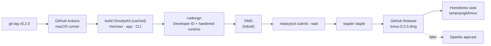
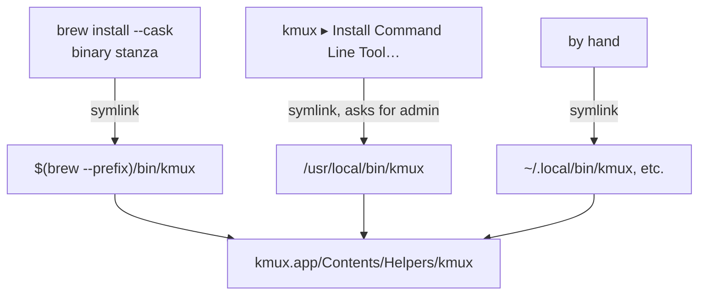
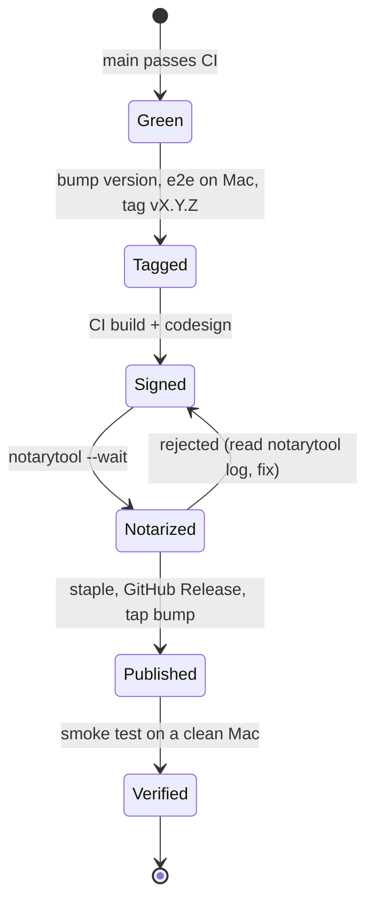

# kmux — Distribution: Build, Sign, Ship, Update

> Research for the roadmap item "we should add a build system for distribution", 2026-10-09. It recommends a plan. The decisions only you can make are in [section 11](#11-questions-for-you).
>
> **How sure we are.** Claims marked **[verified]** were checked on this machine (macOS 26.2, Xcode 26.6) or in the kmux and pinned Ghostty sources. Claims marked **[general]** come from general knowledge of Apple's tooling, Homebrew and GitHub Actions; check them when building the pipeline. Unmarked claims are about kmux's own code.

## Table of Contents

1. [Summary](#1-summary)
2. [At a glance](#2-at-a-glance)
3. [Signing and the hardened runtime](#3-signing-and-the-hardened-runtime)
4. [Notarization and stapling](#4-notarization-and-stapling)
5. [Packaging: DMG and Homebrew cask](#5-packaging-dmg-and-homebrew-cask)
6. [Installing the CLI](#6-installing-the-cli)
7. [Updates: Sparkle or Homebrew only](#7-updates-sparkle-or-homebrew-only)
8. [Versions and the build ID](#8-versions-and-the-build-id)
9. [CI on GitHub Actions](#9-ci-on-github-actions)
10. [Release checklist](#10-release-checklist)
11. [Questions for you](#11-questions-for-you)
12. [Glossary](#12-glossary)
13. [Sources](#13-sources)

---

## 1. Summary

kmux today builds an unsigned `target/kmux.app` and a separate `target/release/kmux` CLI. Nobody else can install that easily: Gatekeeper blocks an unsigned app downloaded from the internet, and the CLI has to be found and put on the `PATH` by hand.

**Recommendation:**

1. **Sign** with a Developer ID, with the **hardened runtime** on and **no code-signing exceptions**. Loading Xcode's private simulator frameworks does *not* need `disable-library-validation`: they're signed by Apple, and library validation accepts Apple's code. **[verified]**, see [3.2](#32-the-ios-pane-question-dlopen-of-xcodes-private-frameworks).
2. **Notarize** the DMG with `notarytool` and **staple** the ticket to both the DMG and the app.
3. **Ship a DMG** on GitHub Releases, and a **Homebrew cask** in our own tap (`tampopogk/homebrew-kmux`) that points at that DMG.
4. **Put the CLI inside the app** (`kmux.app/Contents/Helpers/kmux`). The cask links it onto the `PATH`; the app gets an "Install Command Line Tool…" menu item for DMG users.
5. **Updates: Homebrew first, Sparkle later.** Start with `brew upgrade` plus a cheap "a new version is out" check against GitHub Releases. Add Sparkle when there are users who don't use Homebrew.
6. **Version from git tags** (`v0.2.0` gives `CFBundleShortVersionString` 0.2.0), a monotonic `CFBundleVersion` (the commit count), and a **build ID** (`0.2.0+6c20bb8a1f2e`) stamped into the app and the CLI so stale-build detection can compare them.
7. **CI:** one tag-triggered GitHub Actions workflow on a macOS arm64 runner, Xcode pinned with `xcode-select`, and GhosttyKit cached by Ghostty commit + Zig version + Xcode version. Secrets for signing and notarization are inputs; nothing in the repo.

`scripts/package-kmux.sh` (added with this paper) already does step 3's DMG layout and step 4's CLI placement, **unsigned**, for local testing.



---

## 2. At a glance

| Topic | Recommendation | Why | Confidence |
|---|---|---|---|
| Signing identity | Developer ID Application certificate, from CI secrets | The only identity Gatekeeper trusts outside the App Store | [general] |
| Hardened runtime | On (`codesign -o runtime`) for the app and the CLI | Notarization requires it | [general] |
| Code-signing exceptions | **None** | Apple-signed Xcode frameworks load fine under library validation; nothing kmux runs needs JIT or unsigned memory | [verified] for dlopen; [verified] Ghostty ships none |
| Privacy entitlements | Apple Events, camera, microphone, contacts, calendars, location, photos (as Ghostty does) | Programs run in a terminal ask through the terminal app; without them the prompt never appears | [verified] Ghostty's set; [general] the reason |
| Notarization | `notarytool submit --wait` with an App Store Connect API key | `altool` is retired | [general] |
| Package | DMG (UDZO) with the app, an Applications link | Familiar; can be stapled; works for Homebrew too | [verified] `hdiutil` builds it |
| Homebrew | Cask in our own tap first | The main cask repo has notability rules | [general] |
| CLI | Inside the app at `Contents/Helpers/kmux`; cask `binary` stanza; menu item | One binary, always the same build as the app | [verified] layout signs and verifies (ad hoc) |
| Updates | Homebrew + update notice now; Sparkle later | Sparkle adds a framework, an EdDSA key and an appcast | [general] |
| Version | Tag → short version; commit count → `CFBundleVersion`; build ID | Sparkle and macOS compare `CFBundleVersion`; stale-build detection compares build IDs | design |
| Architecture | arm64 only at first (open question) | GhosttyKit is already universal, but merman and the Swift build are host-only | [verified] `lipo` on GhosttyKit; merman script |
| CI runner | GitHub-hosted macOS arm64, Xcode 26.6 pinned | Matches what upstream Ghostty releases with | [verified] Ghostty's workflow |

---

## 3. Signing and the hardened runtime

### 3.1 What gets signed

Code is signed **inside out**: every nested executable first, then the bundle, so the bundle's seal covers the signed contents. `codesign --deep` is discouraged for signing (it applies one set of options and entitlements to everything) **[general]**.

| Item | Path in bundle | Signed with |
|---|---|---|
| CLI | `Contents/Helpers/kmux` | Developer ID, `-o runtime`, `--timestamp`, no entitlements |
| Sparkle (later) | `Contents/Frameworks/Sparkle.framework` and its helpers | Developer ID, `-o runtime` (Ghostty signs each Sparkle helper separately) **[verified]** in Ghostty's `release-tag.yml` |
| App | `kmux.app` (main executable `Contents/MacOS/kmux`) | Developer ID, `-o runtime`, `--timestamp`, `--entitlements kmux.entitlements` |

GhosttyKit, merman and swift-markdown are linked **statically** into the app executable (GhosttyKit and KmuxMerman are static-library xcframeworks), so there are no embedded frameworks to sign today.

```sh
# Inputs, never in the repo: KMUX_SIGN_IDENTITY="Developer ID Application: … (TEAMID)"
codesign --force --timestamp -o runtime -s "$KMUX_SIGN_IDENTITY" kmux.app/Contents/Helpers/kmux
codesign --force --timestamp -o runtime -s "$KMUX_SIGN_IDENTITY" \
         --entitlements apps/kmux/kmux.entitlements kmux.app
codesign --verify --strict --deep kmux.app      # verifying with --deep is fine
```

### 3.2 The iOS pane question: dlopen of Xcode's private frameworks

iOS panes (`SimBridge.m`) `dlopen` two private frameworks at run time:

- `/Library/Developer/PrivateFrameworks/CoreSimulator.framework/CoreSimulator`
- `SimulatorKit.framework` inside the selected Xcode (`Contents/SharedFrameworks` on Xcode 27, `Contents/Developer/Library/PrivateFrameworks` before).

The hardened runtime turns on **library validation**: the process may only load code signed by Apple or by the same team as the app. The question was whether these frameworks count as "signed by Apple", or whether kmux needs `com.apple.security.cs.disable-library-validation`.

**What their signatures say [verified]:**

| Framework | Identifier | Team ID | Designated requirement |
|---|---|---|---|
| CoreSimulator | `com.apple.CoreSimulator` | `59GAB85EFG` | `identifier "com.apple.CoreSimulator" and anchor apple` |
| SimulatorKit (Xcode 26.6) | `com.apple.SimulatorKit` | `59GAB85EFG` | `identifier "com.apple.SimulatorKit" and anchor apple` |

`anchor apple` means Apple's own signing certificate, which library validation accepts.

**The experiment [verified].** A small C program that `dlopen`s its arguments, signed three ways (ad hoc, since no Developer ID was used for this research), loading CoreSimulator, SimulatorKit, and a dylib we built and ad-hoc signed ourselves:

| Signed as | CoreSimulator | SimulatorKit | Our own dylib |
|---|---|---|---|
| No hardened runtime | loads | loads | loads |
| Hardened runtime | **loads** | **loads** | **refused**: "mapping process and mapped file (non-platform) have different Team IDs" |
| Hardened runtime + `disable-library-validation` | loads | loads | loads |

The third column proves library validation was really being enforced; the first two show Apple-signed private frameworks pass it. A Developer ID-signed kmux has a team ID instead of none, which doesn't change the rule for Apple-signed code.

**So: no `disable-library-validation`.** Leaving it off is better for security (no one can inject a dylib into kmux) and avoids a question during notarization.

Not covered by the experiment: Xcode 27's `SharedFrameworks/SimulatorKit` (not installed here; it's in Xcode, so it will be Apple-signed, but check once), and the full iOS pane flow in a Developer ID-signed build. Add the iOS e2e case (`scripts/e2e-kmux.sh` with `KMUX_E2E_IOS=1`) to the release checklist.

Notarization scans for malware and checks signing; it does **not** review private API use, which is an App Store rule **[general]**.

### 3.3 Other hardened-runtime exceptions

| Entitlement | Needed? | Reason |
|---|---|---|
| `cs.allow-jit` | No | Nothing in-process JITs. WKWebView's JavaScript runs in WebKit's own processes **[general]**. |
| `cs.allow-unsigned-executable-memory` | No | Same; Zig and Swift code is ahead-of-time compiled. Ghostty's release build ships without it **[verified]**. |
| `cs.disable-library-validation` | No | See 3.2. |
| `cs.allow-dyld-environment-variables` | No | Only matters if users inject `DYLD_*` into kmux itself; shells started by kmux are separate processes, not affected **[general]**. |
| `cs.disable-executable-page-protection` | No | Never. |

### 3.4 Privacy entitlements, for programs run inside kmux

A terminal is the "responsible process" for what runs in it: when `osascript` or a camera tool runs in a kmux pane, macOS asks on kmux's behalf **[general]**. Under the hardened runtime, the app must carry the matching entitlement or the request fails without a prompt, and the Info.plist needs a usage string for each.

Ghostty's release entitlements **[verified]** (`macos/Ghostty.entitlements` at the pinned commit) are exactly these, and kmux should copy them:

```xml
<key>com.apple.security.automation.apple-events</key><true/>
<key>com.apple.security.device.audio-input</key><true/>
<key>com.apple.security.device.camera</key><true/>
<key>com.apple.security.personal-information.addressbook</key><true/>
<key>com.apple.security.personal-information.calendars</key><true/>
<key>com.apple.security.personal-information.location</key><true/>
<key>com.apple.security.personal-information.photos-library</key><true/>
```

Ghostty's Info.plist also has `NS…UsageDescription` strings ("A program running within Ghostty would like to …") for Apple Events, Bluetooth, calendars, camera, contacts, local network, location, microphone, motion, photos, reminders, speech recognition and system administration **[verified]**. `build-kmux.sh` should write the same keys with "kmux".

kmux is **not sandboxed** (a terminal can't be), so no `app-sandbox` entitlement.

---

## 4. Notarization and stapling

**[general]** throughout.

1. Build the DMG from the signed app, then sign the DMG itself (`codesign -s "$KMUX_SIGN_IDENTITY" --timestamp kmux.dmg`).
2. Submit and wait:
   ```sh
   xcrun notarytool submit kmux-0.2.0.dmg --wait \
     --key "$NOTARY_KEY_PATH" --key-id "$NOTARY_KEY_ID" --issuer "$NOTARY_ISSUER_ID"
   ```
   Use an **App Store Connect API key** (a `.p8` file plus key ID and issuer ID) rather than an Apple ID and app-specific password: it's made for CI and can be revoked alone. On failure, `notarytool log <id>` says which file failed.
3. Staple the ticket so Gatekeeper can check offline: `xcrun stapler staple kmux.app` (before making the final DMG) or `xcrun stapler staple kmux-0.2.0.dmg`. Ghostty staples both **[verified]**. Simplest order: sign app → make DMG → sign DMG → notarize DMG → staple DMG; then also staple the app by notarizing a zip of it if you ship one.
4. Check: `spctl -a -vv -t install kmux-0.2.0.dmg` and, after copying the app out, `spctl -a -vv kmux.app` ("source=Notarized Developer ID").

Typical notarization takes minutes; budget 30 for CI timeouts.

---

## 5. Packaging: DMG and Homebrew cask

### 5.1 DMG

| Choice | Pick | Notes |
|---|---|---|
| Tool | `hdiutil` | Built in. `create-dmg` (npm, used by Ghostty) adds a background image and icon layout; nice later, not needed. |
| Format | UDZO (zlib), HFS+ | Opens on every supported macOS. ULFO/ULMO compress better but are newer **[general]**. |
| Contents | `kmux.app`, `Applications` symlink | Drag to install. |
| Name | `kmux-<version>.dmg` (release), `kmux-<version>-<commit>-unsigned.dmg` (local) | |

`scripts/package-kmux.sh` builds the local, **unsigned** version **[verified]**: it copies `target/kmux.app`, adds the CLI at `Contents/Helpers/kmux`, signs both **ad hoc** so the bundle verifies, adds an Applications link and an "UNSIGNED - READ ME.txt", and writes `target/dist/kmux-<version>-<commit>-unsigned.dmg`. It never touches `target/kmux.app`. A release script would add Developer ID signing, notarization and stapling around the same layout.

### 5.2 Homebrew cask

A cask installs a prebuilt app; a formula builds from source. A formula is impractical (Zig, Xcode, private Ghostty build), so: **cask**.

```ruby
cask "kmux" do
  version "0.2.0"
  sha256 "…"
  url "https://github.com/tampopogk/kmux/releases/download/v#{version}/kmux-#{version}.dmg"
  name "kmux"
  desc "Native macOS terminal multiplexer"
  homepage "https://github.com/tampopogk/kmux"
  depends_on macos: ">= :sequoia"
  depends_on arch: :arm64          # until there's a universal build
  app "kmux.app"
  binary "#{appdir}/kmux.app/Contents/Helpers/kmux"
  zap trash: ["~/Library/Application Support/kmux", "~/Library/Preferences/dev.kanna.kmux.plist"]
end
```

- **Where:** our own tap, `github.com/tampopogk/homebrew-kmux`, installed with `brew install tampopogk/kmux/kmux`. The main `homebrew/cask` repo wants a project with some notability (stars, users) and a stable release history **[general]**; apply later.
- **Bumping:** the release workflow can open a PR or push to the tap with the new version and SHA-256 (needs a token for the tap repo as a CI secret).
- **Quarantine:** casks download with quarantine like a browser does, so the app must be notarized **[general]**.

---

## 6. Installing the CLI

Ship **one** CLI binary, inside the app, and offer three ways to get it on the `PATH`.



| Option | For | Notes |
|---|---|---|
| Cask `binary` stanza | Homebrew users | Free; the link follows the app on upgrade. |
| "Install Command Line Tool…" menu item | DMG users | As VS Code does ("Shell Command: Install 'code' command in PATH"). `/usr/local/bin` may not exist and is root-owned on Apple Silicon, so this needs an admin prompt (`osascript … with administrator privileges` is the simple way) **[general]**. Offer `~/.local/bin` if the user declines. |
| Manual symlink | Everyone | Documented in the DMG's README. |

**Why `Contents/Helpers/`:** it's Apple's place for helper tools in a bundle, and `Contents/MacOS/kmux` is taken by the app, which on a case-insensitive disk also rules out any `KMUX`-like name there. Code in `Contents/Resources` is sealed as data, not as code, and is a common notarization stumble **[general]**. The ad-hoc layout signs and verifies with `codesign --verify --strict` **[verified]**.

**One change to the CLI makes the bundle self-consistent.** Today `kmux-client` starts the app by bundle ID (`open -b dev.kanna.kmux`) unless `KMUX_APP` is set. When the CLI runs from inside a bundle (its resolved path ends in `.app/Contents/Helpers/kmux`), it should start *that* app. Then a CLI and app from the same release always pair up, which is also what stale-build detection wants.

---

## 7. Updates: Sparkle or Homebrew only

| | Homebrew only (+ notice) | Sparkle 2 |
|---|---|---|
| Who it serves | Homebrew users; DMG users update by hand | Everyone |
| In the app | A check of the GitHub Releases API ("kmux 0.3.0 is out"), at most daily, off by default or on with a setting | `SPUStandardUpdaterController`, a "Check for Updates…" item, the update UI |
| Build work | None | Sparkle.framework embedded in `Contents/Frameworks` (SwiftPM builds an executable, not a bundle, so `build-kmux.sh` copies the framework and sets the rpath `@executable_path/../Frameworks`), its helpers signed one by one |
| Secrets | None new | An EdDSA private key to sign updates (CI secret); public key in Info.plist (`SUPublicEDKey`) |
| Hosting | GitHub Releases | Plus an `appcast.xml` (GitHub Pages or a release asset), generated by Sparkle's `generate_appcast` |
| Cask | `auto_updates false` | `auto_updates true`, so `brew upgrade` leaves it to Sparkle |
| Risk | Users stay on old versions | A lost EdDSA key strands users on the old key; a compromised one ships malware |

All **[general]**, except that Ghostty uses Sparkle and signs its helpers (`Downloader.xpc`, `Installer.xpc`, `Autoupdate`, `Updater.app`) separately before the app **[verified]**.

**Recommendation:** Homebrew + notice for the first releases. Add Sparkle when DMG users are a meaningful share, or before any wider announcement. The CLI and the app updating separately is not a concern, since the CLI lives in the app.

---

## 8. Versions and the build ID

### 8.1 The numbers

| Field | Source | Example | Used by |
|---|---|---|---|
| `CFBundleShortVersionString` | Latest tag `vX.Y.Z` (`git describe --tags --abbrev=0`), else `Cargo.toml`'s workspace version | `0.2.0` | Finder, About box, cask |
| `CFBundleVersion` | `git rev-list --count HEAD` | `412` | macOS and Sparkle, which require it to increase **[general]** |
| `KmuxBuildID` (Info.plist) | `<short version>+<12-char commit>[-dirty]` | `0.2.0+6c20bb8a1f2e` | stale-build detection, `kmux --version`, bug reports |
| CLI version | `CARGO_PKG_VERSION` today | `0.1.0` | should report the same build ID |

Today `build-kmux.sh` hard-codes `0.1.0` for both bundle versions, and `kmux --version` prints `kmux 0.1.0` from Cargo **[verified]**.

**Single source of truth:** the git tag. The release workflow checks that the tag matches `Cargo.toml`'s version, so the two can't drift.

### 8.2 Build ID, coordinated with stale-build detection

Proposed names, for the main session to confirm or change:

| Where | Name | How it's set |
|---|---|---|
| Environment at build time | `KMUX_BUILD_ID` | Computed once by a helper in `scripts/env.sh` (`kmux_build_id`), exported to both builds; CI may override |
| Info.plist | `KmuxBuildID` | Written by `build-kmux.sh` |
| Swift | `Bundle.main.object(forInfoDictionaryKey: "KmuxBuildID")` | |
| Rust CLI | `option_env!("KMUX_BUILD_ID")`, with `build.rs` computing it if unset (and `cargo:rerun-if-changed=.git/HEAD`) | |
| Protocol | a `build` field in the app's identify/status reply | so the CLI can compare |
| CLI output | `kmux --version` → `kmux 0.2.0 (build 0.2.0+6c20bb8a1f2e)` | |

**The dirty-tree problem.** A commit hash doesn't change while you edit. For local development, where stale builds actually happen, a dirty build should get a distinct ID: `0.2.0+6c20bb8a1f2e-dirty.<timestamp>` (build time, seconds). Two dirty builds then never compare equal, which errs on the side of "stale" — the safe side for a warning. Releases are always clean.

---

## 9. CI on GitHub Actions

### 9.1 Runner and Xcode

| Choice | Pick | Why |
|---|---|---|
| Runner | GitHub-hosted macOS arm64 (`macos-26` if available, else `macos-15`) | Free for public repos. Ghostty releases on a Tahoe (macOS 26) runner from Namespace **[verified]**; GitHub's image names change, check the current list **[general]** |
| Xcode | Pin: `sudo xcode-select -s /Applications/Xcode_26.6.app` | Ghostty's release workflow pins Xcode 26.6 at our era **[verified]**, and Zig's macOS build calls the SDK through it |
| Zig | `scripts/env.sh` already downloads and checksums Zig 0.16.0 | No setup action needed **[verified]** |
| Rust | `rust-toolchain.toml` (1.99) via rustup, which runners have | |
| Architecture | arm64 | See 11 for universal |

### 9.2 Caching

GhosttyKit is the slow part (a full Zig build of Ghostty); merman and Cargo are next. All of them are pure functions of pinned inputs, so cache them by those inputs:

| Cache | Path | Key |
|---|---|---|
| GhosttyKit | `target/ghosttykit` | `ghosttykit-${KMUX_GHOSTTY_COMMIT}-zig${KMUX_ZIG_VERSION}-xcode${XCODE}-${hash(scripts/build-ghosttykit.sh)}` |
| Zig toolchain | `target/zig-0.16.0` | `zig-0.16.0-arm64` |
| Zig package cache | `~/.cache/zig` | Ghostty commit (only needed on a GhosttyKit miss) |
| merman | `target/merman`, `target/kmux-merman` | `merman-${hash(Cargo.lock, crates/kmux-merman/**, rust-toolchain.toml)}` |
| Cargo | `~/.cargo/registry`, `target/release` | `Swatinem/rust-cache` |
| SwiftPM | `target/kmux-build` | `hash(apps/kmux/Package.resolved)` (sources rebuild anyway) |

With GhosttyKit cached, a release build is the Swift and Rust compile plus about 5–30 minutes of notarization. `build-kmux.sh` already skips GhosttyKit when the xcframework exists **[verified]**, so a restored cache just works.

**Cache safety:** GitHub scopes caches by branch, and a tag build can read the default branch's caches but not those of PR branches **[general]**. So a PR can't poison a release's GhosttyKit. For extra safety, the release job could rebuild GhosttyKit on a miss only and never save from PRs.

### 9.3 Workflows

| Workflow | Trigger | Does |
|---|---|---|
| `ci.yml` | push, PR | build app + CLI, unit tests, `test-kmux-protocol.sh`; unsigned `package-kmux.sh` as an artifact |
| `release.yml` | tag `v*` | check tag = `Cargo.toml` version; build; sign; DMG; notarize; staple; GitHub Release; bump the tap |

`e2e-kmux.sh` needs a GUI session and (for iOS) a simulator runtime; hosted runners have a GUI session, but simulator runtimes and screen capture are slow and flaky there **[general]**. Run e2e on your Mac as a release step at first.

### 9.4 Secrets (inputs only)

Named here so the workflow can be written; their values are never in the repo and were not looked at for this research.

| Secret | Use |
|---|---|
| `MACOS_CERT_P12_BASE64`, `MACOS_CERT_PASSWORD` | Developer ID Application certificate, imported into a temporary keychain per job |
| `MACOS_KEYCHAIN_PASSWORD` | Password for that temporary keychain |
| `KMUX_SIGN_IDENTITY` | e.g. `Developer ID Application: Name (TEAMID)` |
| `NOTARY_KEY_P8`, `NOTARY_KEY_ID`, `NOTARY_ISSUER_ID` | App Store Connect API key for `notarytool` |
| `TAP_TOKEN` | Push to `tampopogk/homebrew-kmux` |
| `SPARKLE_ED_PRIVATE_KEY` | Later, with Sparkle |

The release job should run only on tags in the main repo (`if: github.repository == 'tampopogk/kmux'`), so forks never see them.

---

## 10. Release checklist

**Once (setup)**

- [ ] Apple Developer Program membership; create a Developer ID Application certificate.
- [ ] App Store Connect API key for notarization.
- [ ] Add the CI secrets (9.4).
- [ ] Create `tampopogk/homebrew-kmux`.
- [ ] Add `apps/kmux/kmux.entitlements` (3.4), usage strings in Info.plist, the build ID (8), CLI in `Contents/Helpers` (6) to `build-kmux.sh`.
- [ ] "Install Command Line Tool…" menu item; CLI starts its own bundle's app.

**Each release**

- [ ] `main` is green in CI.
- [ ] Bump the workspace version in `Cargo.toml`; update the changelog.
- [ ] On your Mac: `scripts/e2e-kmux.sh` including iOS (`KMUX_E2E_IOS=1`), on the oldest supported macOS if you can.
- [ ] Tag `vX.Y.Z` and push the tag.
- [ ] CI: build → sign → DMG → notarize → staple → release → tap bump.
- [ ] Download the DMG in a browser (so it's quarantined) on a clean Mac or user account; open it; drag to Applications; it launches with no Gatekeeper warning.
- [ ] `spctl -a -vv /Applications/kmux.app` shows "Notarized Developer ID".
- [ ] `kmux --version` from the cask and from the menu-installed link print the same build ID as the About box.
- [ ] An iOS pane opens (proves the private frameworks still load when signed).
- [ ] `brew upgrade --cask kmux` from the previous version works.



---

## 11. Questions for you

1. **Apple Developer account:** is there one (personal or a company), and in whose name should the Developer ID be? The certificate name appears in Gatekeeper dialogs.
2. **Architectures:** arm64 only, or universal (arm64 + x86_64)? GhosttyKit's static library is already universal (`lipo`: x86_64 arm64) **[verified]**, so universal means building merman and the CLI for both (`lipo` them together) and `swift build --arch arm64 --arch x86_64`. Ghostty ships universal.
3. **Updates:** Homebrew + notice first (recommended), or Sparkle from the first release?
4. **Tap:** is `tampopogk/homebrew-kmux` the right home, or should it live under another org?
5. **Bundle ID:** keep `dev.kanna.kmux` for the public app? Changing it after release loses users' preferences and TCC grants, so decide before the first release.
6. **Build ID format:** do `KMUX_BUILD_ID` / `KmuxBuildID` / `0.2.0+<commit>[-dirty.<time>]` suit the stale-build detection being built now?
7. **Oldest macOS:** `LSMinimumSystemVersion` is 15.0. Is that the promise for releases?

---

## 12. Glossary

| Term | Meaning |
|---|---|
| **Developer ID** | Apple's certificate for signing apps distributed outside the Mac App Store. |
| **Gatekeeper** | The macOS check that runs on first launch of downloaded software and blocks unsigned or un-notarized apps. |
| **Quarantine** | An extended attribute (`com.apple.quarantine`) that browsers and Homebrew put on downloads; it triggers Gatekeeper. |
| **Hardened runtime** | A code-signing option (`-o runtime`) that turns on protections such as library validation; required for notarization. |
| **Library validation** | A hardened-runtime rule: the process may load only libraries signed by Apple or by its own team. |
| **Entitlement** | A signed key-value claim in the app's signature that grants or relaxes a capability. |
| **Designated requirement** | The rule in a signature saying what counts as "the same code" (e.g. `anchor apple`: signed by Apple itself). |
| **Notarization** | Uploading signed software to Apple for an automated malware and signing check; Apple returns a ticket. |
| **Stapling** | Attaching the notarization ticket to the app or DMG so Gatekeeper can check it offline. |
| **notarytool** | The Xcode command-line tool for notarization (`xcrun notarytool`). |
| **DMG** | A macOS disk image file; UDZO is its compressed read-only format. |
| **Cask** | A Homebrew recipe that installs a prebuilt macOS app; a **tap** is a third-party repo of recipes. |
| **Sparkle** | The standard open-source auto-update framework for Mac apps outside the App Store; an **appcast** is its update feed. |
| **EdDSA** | The signature scheme Sparkle uses to check that an update came from the developer. |
| **Build ID** | A string naming exactly which source a build came from, used to tell whether two builds match. |
| **TCC** | Transparency, Consent and Control: the macOS privacy permission system (camera, contacts, Apple Events…). |
| **Responsible process** | The app macOS holds accountable (and prompts for) when a child process asks for a TCC permission. |

---

## 13. Sources

Verified on this machine or in source:

- `codesign -dvv` and `codesign -d -r-` on CoreSimulator and SimulatorKit (Xcode 26.6, macOS 26.2).
- The dlopen experiment in 3.2 (clang, `codesign -s - -o runtime`, with and without `disable-library-validation`).
- Ghostty at the pinned commit `a806905e`: `macos/Ghostty.entitlements`, `macos/GhosttyReleaseLocal.entitlements`, `macos/Ghostty.xcodeproj` usage strings, `.github/workflows/release-tag.yml` (Xcode 26.6, Sparkle helper signing, `notarytool`, `stapler`).
- kmux: `scripts/build-kmux.sh`, `scripts/build-merman.sh`, `scripts/env.sh`, `apps/kmux/Sources/SimBridge/SimBridge.m`, `crates/kmux-client/src/client.rs`, `crates/kmux/src/main.rs`.
- `scripts/package-kmux.sh` run locally on a fresh worktree build: 14 MB DMG; it mounts with the app, the CLI (`kmux --version` runs from `Contents/Helpers`), the README and the Applications link; `codesign --verify --strict --deep` passes; `spctl` rejects it, as an unsigned build should.

General knowledge, to re-check against current docs when implementing:

- Apple: "Notarizing macOS software before distribution", "Hardened Runtime", "Placing content in a bundle", `notarytool` man page.
- Homebrew: Cask Cookbook (`binary`, `auto_updates`, `zap`), "Acceptable Casks" (notability).
- Sparkle 2 documentation (EdDSA keys, `generate_appcast`, sandboxed vs non-sandboxed helpers).
- GitHub Actions: runner images, `actions/cache` scoping rules.
