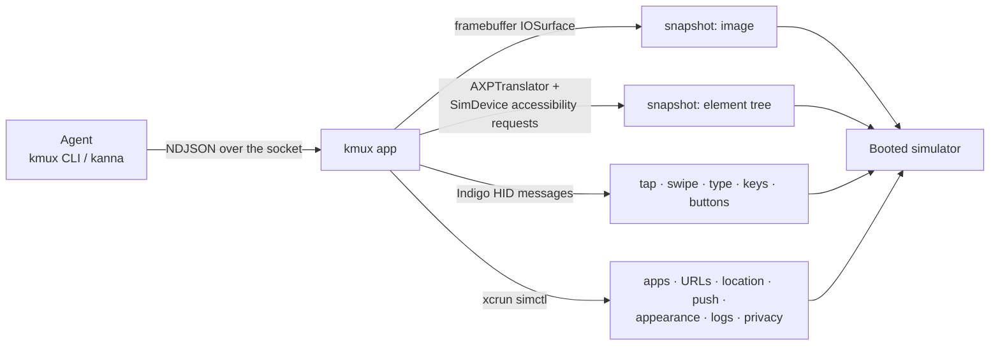
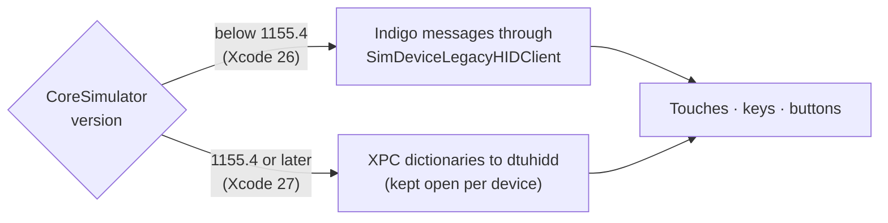
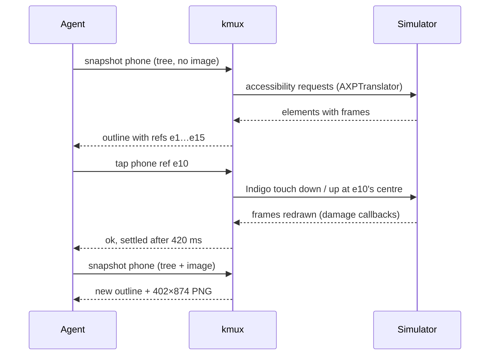
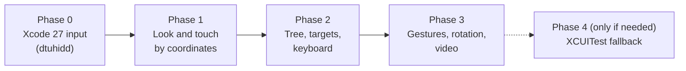

# Agent control of iOS panes

> Research for the kmux roadmap item "methods for agent to interact with iOS simulator", 2026-10-09.
> Checked on this Mac: Xcode 26.6 (17F113), iOS 26.5 runtime, iPhone 17, macOS 26.2 (Darwin 25.2).
> **Verified** means run or inspected on this Mac. **Docs** means read in a project's docs or source (links at the end). **General knowledge** means neither: treat it as likely, not settled.

## Table of contents

1. [Summary and recommendation](#1-summary-and-recommendation)
2. [What an agent needs](#2-what-an-agent-needs)
3. [What kmux has today](#3-what-kmux-has-today)
4. [How it can be done](#4-how-it-can-be-done)
5. [How other tools do it](#5-how-other-tools-do-it)
6. [Proposed protocol and CLI](#6-proposed-protocol-and-cli)
7. [Pane screenshots and the `snapshot` command](#7-pane-screenshots-and-the-snapshot-command)
8. [Phased plan](#8-phased-plan)
9. [Risks](#9-risks)
10. [Open questions](#10-open-questions)
11. [Glossary](#11-glossary)
12. [Sources](#12-sources)

---

## 1. Summary and recommendation

**Recommendation:** build agent control **into kmux itself**, on the same private frameworks the iOS pane already loads, and use `simctl` for everything Apple offers officially. Don't depend on idb, AXe, Maestro or Appium.

| Finding | Evidence |
|---------|----------|
| **The accessibility tree is reachable from kmux's own process**, without installing anything in the simulator: CoreSimulator's `SimDevice sendAccessibilityRequestAsync:…` plus macOS's private `AccessibilityPlatformTranslation` (`AXPTranslator`). A 90-line probe dumped Safari's tree with roles, labels, identifiers, values and frames in points. | **Verified.** 15 elements; the first call took 3.3 s, later calls 60–350 ms; a hit test took 26 ms. This is the route idb and AXe use. |
| **Input works the way idb does it on Xcode 26** (Indigo HID messages). Keyboard, buttons, scroll and multi-touch are separate Indigo functions in the framework kmux already loads. | **Verified** that `IndigoHIDMessageForKeyboardArbitrary`, `…ForKeyboardNSEvent`, `…ForButton`, `…ForScrollEvent` and the two-point mouse message are exported by SimulatorKit in Xcode 26.6. Not yet tried. |
| **On Xcode 27 that input path stops working**: the simulator drops legacy Indigo messages (keys and buttons always, touches sometimes). The new path is the `dtuhidd` service over XPC. kmux needs it before agent input can be relied on, and probably for its own clicks already. | From idb's source (docs). **Not verified**: only Xcode 26.6 is installed here. |
| **Screenshots should come from the pane's IOSurface**, not a window capture: full device resolution (1206×2622), works while the pane is hidden or small, and needs no screen-recording permission. | **Verified** the surface's size and format with `simctl io enumerate`; `simctl io screenshot` produces the same image in 130 ms. |
| **`simctl` covers the app and device chores** (install, launch, terminate, open URL, location, push, appearance, privacy, status bar, pasteboard, logs, video) but **has no input, no accessibility and no rotation.** | **Verified** from `simctl help` on Xcode 26.6. |
| **XCUITest-based tools (Maestro, Appium) are a different, heavier route**: they install a test-runner app in the simulator and talk HTTP to it. Seconds to start, and an extra moving part. Not needed for kmux. | Maestro 2.10.0 is installed here and **verified** to bundle `maestro-driver-iosUITests-Runner`; the rest from docs. |

The single most useful thing for agents is **element targeting**: "tap the button labelled Edit", resolved by kmux from the tree, instead of guessing coordinates from a screenshot. The second is **settling**: kmux sees every frame the simulator draws, so it can reply only once the screen has stopped changing.



---

## 2. What an agent needs

An agent works in a loop: **look, decide, act, check**. Each step maps to a capability.

| Step | Capability | Why it matters | Priority |
|------|-----------|----------------|:--------:|
| Look | **Element tree** with labels, identifiers, values, roles and frames | Reliable targets and text without OCR. Cheap in tokens compared with images. | 1 |
| Look | **Screenshot** at a known scale | Layout, colours, images, things with no accessibility label. | 1 |
| Act | **Tap**, long-press, swipe/drag, scroll | Most UI. | 1 |
| Act | **Type text** and press keys (Return, Tab, Delete, arrows, ⌘ shortcuts) | Forms, search, login. Not supported today. | 1 |
| Act | **Open a URL or deep link**, launch, terminate, reinstall the app | Jump straight to the screen under test; reset state. | 1 |
| Check | **Wait** until the screen settles, or until an element appears | Avoids sleeping and flaky timing. | 1 |
| Check | **Logs** of the app | Errors and prints that the UI doesn't show. | 2 |
| Act | Hardware buttons: Home, lock, side, Siri, volume | Leaving the app, lock-screen flows. | 2 |
| Set up | Location, push notifications, permissions, appearance, text size, status bar | Testing features that depend on them; avoiding permission prompts. | 2 |
| Act | Pinch, rotate, edge swipes, shake | Maps, photos, landscape layouts, the home gesture. | 3 |
| Check | Video recording | Showing a human what happened. | 3 |

---

## 3. What kmux has today

| Capability | Status | Where |
|-----------|--------|-------|
| Show the screen | ✅ Framebuffer IOSurface in a layer, up to 61 frames/s | `SimBridge.m` (`KSimScreen`), `IosPaneView.swift` |
| One-finger touch | ✅ Mouse down, drag and up become touch began, moved, ended | `KSimScreen touch:at:` |
| Home button | ✅ ⇧⌘H, and `debug.ios` with `home: true` | `KSimScreen pressHome` |
| Tap from a client | ⚠️ Only `debug.ios` with `x`, `y` as fractions of the screen | `AppController.swift` |
| Boot, install, launch, relaunch | ✅ Through `simctl` | `Simulator` in `IosPaneView.swift` |
| Screenshot | ⚠️ Only `debug.snapshot`, a whole-window capture used to check panes are drawn | `Snapshot.swift` |
| Keyboard, other buttons, tree, logs, URLs, settings | ❌ | — |

---

## 4. How it can be done

### 4.1 Screenshots

| Option | Resolution | Cost | Notes |
|--------|-----------|------|-------|
| **Copy the pane's IOSurface** (recommended) | Device pixels, 1206×2622 on iPhone 17 (**verified**) | Lock, copy 12.7 MB of BGRA, encode PNG. Estimated tens of ms (general knowledge). | Already in hand: `KSimScreen` holds the surface. Works when the pane is hidden, zoomed out or behind other windows. No permission prompt. |
| `xcrun simctl io UDID screenshot -` | Device pixels | 130 ms per call (**verified**) | Simple fallback, and works with no pane open. Can mask the rounded corners. |
| Window capture (`debug.snapshot`) | Whatever size the pane is drawn at | Fast | Shows kmux's drawing, not the device. Wrong tool for agents. |

**Scale matters to agents.** Images sent to a model are usually downscaled, and the tree's frames are in **points** (402×874 on iPhone 17, a 3× screen, **verified**). Offer the screenshot at **point scale** by default, so a pixel in the image is a point in the tree and in tap coordinates. Full resolution stays available.

### 4.2 Element tree

**Verified route** (what idb and AXe use; probe in this research, not committed):

1. Load `/System/Library/PrivateFrameworks/AccessibilityPlatformTranslation.framework` and take `AXPTranslator.sharedInstance`.
2. Give it a **bridge delegate**. Its `accessibilityTranslationDelegateBridgeCallbackWithToken:` returns a block that forwards each `AXPTranslatorRequest` to the device with `-[SimDevice sendAccessibilityRequestAsync:completionQueue:completionHandler:]` and returns the response. Two more delegate methods convert frames and give the root parent.
3. `frontmostApplicationWithDisplayId:0 bridgeDelegateToken:` gives the frontmost app; `macPlatformElementFromTranslation:` turns it into an object that answers the standard macOS accessibility methods: `accessibilityRole`, `accessibilityLabel`, `accessibilityValue`, `accessibilityIdentifier`, `accessibilityFrame`, `accessibilityChildren`.
4. `objectAtPoint:displayId:bridgeDelegateToken:` answers "what is at this point" (a hit test).

What the probe printed for Safari's start page (abridged):

```text
AXApplication label=Safari frame={0,0,402,874}
  AXGroup id=StartPageCollectionView frame={0,0,402,874}
    AXStaticText label=Favorites frame={16,82,123,26}
    AXButton label=Apple id=favoritesItemIdentifierContent frame={16,118,72,94}
    AXButton label=Edit id=customizationsSheetButton frame={166,395,71,34}
  AXButton label=Back id=BackButton frame={34,792,48,48}
  AXTextField label=Address value=Search or enter website id=TabBarItemTitle frame={137,806,132,20}
```

| Property | Result |
|----------|--------|
| Needs anything installed in the simulator | No |
| Needs the app to be built for testing | No; any app, including Apple's |
| Frames | Points, from the screen's top left (**verified**) |
| Speed | First call 3.3 s (the simulator's accessibility server waking up), then 60–350 ms for 15 elements; hit test 26 ms (**verified**) |
| Scope | The **frontmost app**. Whether system alerts, the keyboard and SpringBoard appear needs a spike. |
| Frameworks | `AXPTranslator` ships with **macOS** (`/System/Library/PrivateFrameworks`), `SimDevice` with **Xcode** (`CoreSimulator`). Either can change. |
| Element actions | `AXPTranslator` also has `processActionRequest:` and `processSetAttribute:` (**verified** the selectors exist). Pressing an element or setting a text field's value through accessibility could be an alternative to synthetic touches. Not tried. |

The other route, **XCUITest** (an Apple test-runner app running inside the simulator, as Maestro and Appium do), gets a similar tree through XCTest's own snapshot API. It is better documented by its users but costs a runner app, an `xcodebuild` session and seconds of start-up. See [section 5](#5-how-other-tools-do-it).

### 4.3 Input

Up to Xcode 26, all through `SimDeviceLegacyHIDClient`, which kmux already uses. Function names are **verified** as exported by Xcode 26.6's SimulatorKit; arguments beyond the mouse and button messages come from idb's usage (docs) and still need trying. **On Xcode 27 the same events go to `dtuhidd` instead** ([section 5](#5-how-other-tools-do-it)): kmux should hide both behind one input interface and choose by CoreSimulator version.



| Input | Indigo function | Notes |
|-------|----------------|-------|
| Tap, long-press, drag, swipe | `IndigoHIDMessageForMouseNSEvent` | Today's path. Long-press = hold between down and up. A swipe = down, a series of moves over a duration, up. Points are fractions of the screen. |
| Two-finger gestures (pinch, rotate) | Same function, with its **second point** argument | How Simulator.app's ⌥-drag works (general knowledge). Untested. |
| Edge swipes (the home gesture, Control Center) | The mouse message's `edge` argument | The spike got an app switch once; going home by swipe didn't work. SimulatorKit's `SimDigitizerInputView.TouchEvent` has an `edge` field (**verified** symbol), which is how Simulator.app does it. Needs a spike. |
| Scroll | `IndigoHIDMessageForScrollEvent` | A trackpad-style scroll; a swipe works too. |
| Keys | `IndigoHIDMessageForKeyboardArbitrary(usage, direction)` | HID usage codes (a = 4, Return = 40, …), with Shift for capitals. Modifiers for ⌘ shortcuts. |
| Text | Keys, one per character | ASCII on a US layout. Other text: put it on the pasteboard (`simctl pbcopy`) and press ⌘V (general knowledge: a user paste doesn't show iOS's "Allow Paste" prompt). |
| Buttons | `IndigoHIDMessageForButton(button, down/up, target)` | Home works. Lock, side, Siri and Apple Pay are other button codes (idb). Volume: Simulator.app has volume actions; mechanism unknown. |
| Rotation | Not Indigo. Simulator.app sends a "purple" GSEvent (`-[SimDevice(GSEventsPrivate) sendPurpleEvent:]`, **verified** by name in Simulator.app) | Needs a spike. No `simctl` command. |
| Shake | `simctl spawn UDID notifyutil -p com.apple.UIKit.SimulatorShake` | General knowledge. |

### 4.4 Device and app chores: `simctl`

All **verified** present in `simctl help` on Xcode 26.6. kmux already shells out to `simctl` for boot, install and launch.

| Need | `simctl` |
|------|----------|
| Install / uninstall / list apps | `install`, `uninstall`, `listapps`, `appinfo` |
| Launch / terminate | `launch [--terminate-running-process] [--console]`, `terminate` |
| Open a URL or deep link | `openurl UDID URL` |
| Logs | `spawn UDID log stream --predicate …` or `log show --last 30s` (**verified** `log show` works); `launch --console` for an app's stdout and stderr |
| Location | `location set LAT,LON`, `run SCENARIO`, `start` along waypoints, `clear` |
| Push notification | `push UDID BUNDLE payload.json` |
| Permissions | `privacy grant/revoke/reset SERVICE BUNDLE` (avoids permission prompts) |
| Appearance, contrast, text size | `ui appearance light/dark`, `ui increase_contrast`, `ui content_size` |
| Status bar | `status_bar override --time 9:41 …` |
| Pasteboard | `pbcopy`, `pbpaste` |
| Video | `io recordVideo` (stop with SIGINT) |
| Reset | `erase`, `keychain reset` |

---

## 5. How other tools do it

Facts below come from a research subagent that read each project's source at HEAD (2026-10-08/09) and docs (**docs**), except where marked. Only Maestro is installed on this Mac (2.10.0, **verified**); idb, AXe, XcodeBuildMCP and Appium are not.

| Tool | Tree from | Input through | Installs anything in the simulator | Start-up and speed | Licence | Maintenance |
|------|-----------|---------------|:----:|--------------------|---------|-------------|
| **idb**, `--api ax` (default for reads) | Host side: `AXPTranslator` + `SimDevice sendAccessibilityRequestAsync` (the route verified above). One XPC round trip per attribute. | Indigo through `SimDeviceLegacyHIDClient` up to Xcode 26; **`dtuhidd` over XPC on Xcode 27** | No | None to start; cost grows with attributes read | MIT | Very active since Aug 2026 (v1.6.8, 2026-10-08), after no releases 2022–2026 |
| **idb**, `--api axbridge` (default for actions) | Its own helper binary spawned inside the simulator, using XCTAutomationSupport and AXRuntime: the whole tree in one call, ~30 ms warm for 167 elements. Turns on device-wide automation mode and leaves it on. | Accessibility "press", or the HID paths above | A helper process (no app) | One spawn, then fast | MIT | As above |
| **AXe** | idb's host-side route (links idb's FBSimulatorControl from a fork) | idb's HID, with a broker process that keeps one HID connection per device | No | One process per command | MIT | v1.8.0, 2026-07-20; Xcode 27 issues open (#71: short-lived taps dropped) |
| **XcodeBuildMCP**, renamed **MobileBuildMCP** (getsentry) | Calls AXe. `snapshot_ui` returns refs (`e1`, `e2`, …) and a screen hash. | Calls AXe; screenshots via `simctl io screenshot`, downscaled to JPEG | No | AXe's, plus MCP | MIT | v2.7.1, 2026-09-23 |
| **Maestro** | `XCUIElement.snapshot()` in an XCUITest runner app; raises XCTest's private max depth | XCTest private `_XCT_synthesizeEvent` / `_XCT_sendString` | Yes, a test runner (HTTP server on port 22087) | Seconds to tens of seconds (120 s cap) | Apache-2.0 | Active (cli-2.11.0, 2026-09-29) |
| **Appium XCUITest / WebDriverAgent** | XCTest private `XCAXClient_iOS` snapshot (`/source`) | `XCSynthesizedEventRecord` through XCTest's event synthesizer | Yes, WebDriverAgent (prebuilt for simulators, no signing) | Minutes to build once; ~5–20 s prebuilt (general knowledge); big trees take seconds | Apache-2.0 (driver), BSD (WDA) | Active |
| **Xcode 27 `mcpbridge`** | `DeviceInteractionSynthesize` returns a screenshot and a tree with frames, labels and hit points | Same tool: taps, swipes, text, buttons, orientation | Unknown | Unknown | Apple, proprietary; beta; only through Xcode's agent bridge | New (second-hand reports) |
| **simctl / devicectl** | None | None | No | — | Apple | Xcode 27's `devicectl` adds orientation, location and appearance for simulators (second-hand) |

What kmux should take from them:

- **The host-side tree route is the standard one.** idb and AXe use exactly what the probe verified. idb's in-simulator helper exists for detail the host route misses (web views, some composite views) and for speed on big screens; consider it only if the host route falls short.
- **Xcode 27 breaks kmux's input path.** idb's source says that from CoreSimulator 1155.4 (Xcode 27) the simulator **drops** legacy Indigo messages sent through `SimDeviceLegacyHIDClient`: buttons and keys always, touches on some boots or now and then. The replacement is the `dtuhidd` service inside the simulator, reached through `-[SimDevice lookup:error:]` for `com.apple.coredevice.feature.remote.hid.digitizer` and libxpc's `_4sim` calls, with digitizer, keyboard and button messages sent as XPC dictionaries. The connection must stay open: a short-lived one loses its first events. **Not verified here** (this Mac has only Xcode 26.6). kmux's README already notes that Xcode 27 moved SimulatorKit, so kmux on Xcode 27 is probably affected today.
- **Buttons** are HID consumer-page codes on the new path: Home 0x40, lock/side 0x30, Siri 0xCF, volume up 0xE9 and down 0xEA, and 0xB8 toggles the software keyboard. **Rotation** goes through GSEvents on the PurpleWorkspacePort, which matches what Simulator.app's strings show.
- **Text** is typed as US-layout key presses with Shift for capitals (idb's `KEY_MAP`).
- **Pinch** works by giving the mouse message a second point and patching both touch positions (idb `ui pinch`).
- **Agent guidance that works** (MobileBuildMCP): refs from a snapshot, a fresh snapshot after anything that changes the screen, a screen hash to skip unchanged snapshots, batches for several taps on one screen, and "don't guess coordinates from screenshots". The proposal below follows it.
- **Stability:** every major Xcode release has broken someone's HID or accessibility plumbing. idb's Xcode 27 fixes landed in days to weeks; one of them (#947) was for a sandboxed Mac app, the closest case to kmux.
- **Licences:** idb, AXe and MobileBuildMCP are MIT, so kmux may learn from them and copy code with credit in `NOTICE`. The spec's clean-room rule applies to cmux.

---

## 6. Proposed protocol and CLI

### 6.1 Principles

- **Generic verbs, typed panes.** kmux's commands are verbs that act on a pane (`send`, `navigate`). New verbs (`tap`, `type`, `key`, `swipe`) should be named so that web panes can support them later; a pane type that doesn't fails with `wrong_type`, as `navigate` does today.
- **Reuse before adding.** `navigate --url` on an iOS pane opens a URL or deep link. `restart` already relaunches the app.
- **Points, from the top left**, the same space as the tree's frames, for every coordinate. Replies say the screen's size in points and its scale.
- **Targets, not just coordinates.** Anything that takes a point also takes an element: `ref` (from the last snapshot), `id` (accessibility identifier) or `label`. kmux resolves it from a fresh tree and taps the centre of its frame. No match fails with `not_found` and the closest labels; several matches fail with the candidates, unless `index` picks one.
- **Settle by default.** After an action, kmux waits until no new frame has arrived for 300 ms (at most 5 s) before replying, using the damage callback it already receives. `settle: false` replies at once. The reply says how long it waited.
- **One escape hatch.** A `sim` command passes device settings through to `simctl`, so the long tail doesn't need new protocol.

### 6.2 Commands

| `cmd` | `args` | What it does |
|-------|--------|--------------|
| `snapshot` | `pane`, `image?` (`points` default / `pixels` / `none`), `tree?` (default true for ios), `path?` | See [section 7](#7-pane-screenshots-and-the-snapshot-command). |
| `tap` | `pane`, a target (`x`+`y`, or `ref` / `id` / `label`, `index?`), `hold?` (ms; long-press), `count?` (double-tap) | Touch down and up. |
| `swipe` | `pane`, `from` (point or target), `to` (point) or `direction` (`up`/`down`/`left`/`right`) + `distance?`, `duration?` (ms, default 300), `edge?` | A drag. A `direction` with no `from` swipes across the middle of the screen (scrolling). `edge` starts an edge gesture (phase 3). |
| `pinch` | `pane`, `center?`, `scale` (e.g. 2 = zoom in), `duration?` | Two-finger pinch (phase 3). |
| `type` | `pane`, `text`, `enter?` | Types into whatever has focus. With a target, taps it first. |
| `key` | `pane`, `key` (`return`, `tab`, `delete`, `escape`, `up`, …, or a character), `mods?` (`cmd`, `shift`, `alt`, `ctrl`) | One key press, e.g. ⌘A. |
| `button` | `pane`, `button` (`home`, `lock`, `side`, `siri`, `apple-pay`, `volume-up`, `volume-down`), `hold?` | A hardware button. |
| `wait` | `pane`, a target, `gone?`, `timeout?` (default 10 s) | Until the element appears (or disappears). |
| `app` | `pane`, `action` (`launch` / `terminate` / `install` / `uninstall` / `list`), `app?` (bundle ID or `.app`), `args?`, `env?` | Defaults to the pane's own app. |
| `navigate` | `pane`, `url` | iOS panes: `simctl openurl` (web pages and deep links). |
| `logs` | `pane`, `last?` (e.g. `30s`), `app?` (default the pane's), `predicate?`, `level?` | Recent unified log lines, as text. Not a stream (no events yet). |
| `sim` | `pane`, `setting` (`location` / `push` / `privacy` / `appearance` / `content-size` / `contrast` / `status-bar` / `pasteboard` / `orientation` / `shake`), `value` | Device settings, mostly through `simctl`. `orientation` is phase 3. |

Every reply includes `settled_ms` when it waited, and errors use the existing codes: `wrong_type` (not an ios pane, or a verb the pane type lacks), `not_found` (no such element), `bad_request` (ambiguous element, bad key name), `start_failed` is unchanged. One new code is worth adding: **`unsupported`** when this Xcode's private frameworks lack something (for example the accessibility bridge), so agents can fall back to screenshots.

Example exchange:

```json
{"id":7,"cmd":"tap","args":{"pane":"phone","label":"Edit"}}
{"id":7,"ok":true,"element":{"ref":"e10","role":"button","label":"Edit","id":"customizationsSheetButton","frame":[166,395,71,34]},"at":[201.5,412],"settled_ms":420}
```

### 6.3 CLI

```text
kmux snapshot phone                      # tree as an outline, image saved to a temp file, path printed
kmux snapshot phone --image pixels --out shot.png --no-tree
kmux tap phone --label Edit              # or --id BackButton, --ref e3, or --at 201,412
kmux tap phone --at 201,412 --hold 800   # long-press
kmux swipe phone --direction up          # scroll down the page
kmux swipe phone --from 200,700 --to 200,200 --duration 500
kmux type phone "hello world" --enter
kmux key phone a --mods cmd
kmux button phone lock
kmux wait phone --label "Welcome" --timeout 20s
kmux navigate phone --url myapp://settings/profile
kmux app phone terminate                 # the pane's own app
kmux logs phone --last 30s
kmux sim phone location 37.33,-122.01
kmux sim phone appearance dark
kmux sim phone privacy grant photos
```

Output for people prints the tree as an indented outline with refs, one element per line (as above); `--json` prints the reply.

### 6.4 Not proposed

- **Shelling out to idb or AXe.** Same private frameworks, plus a dependency, a Python or Swift toolchain, and a process start per call. kmux already holds a warm connection to the device.
- **An XCUITest runner.** Seconds to start, an app to install, and `xcodebuild` in the loop. Worth it only if the accessibility bridge turns out to miss things agents need (see [10](#10-open-questions)).
- **OCR.** The tree gives text exactly; the screenshot covers the rest.

---

## 7. Pane screenshots and the `snapshot` command

Another branch (`rq/pane-snapshot`) is adding a `snapshot` command; nothing is committed there yet, so this section proposes how iOS panes fit, not how `snapshot` must work.

| Pane type | Image | Structure |
|-----------|-------|-----------|
| `term` | The rendered terminal | Its text (as `debug.text` today) |
| `web` | The page | The accessibility or DOM outline (cmux's browser pane does this) |
| `md` | The rendered page | Its text |
| **`ios`** | **The device framebuffer** from the IOSurface, at point or pixel scale, **not** the kmux window | **The accessibility tree**, with `ref`s that `tap`, `swipe`, `type` and `wait` accept |

Rules for iOS panes:

- The image comes from the device, so it is right even when the pane is small, zoomed out, in a hidden tab or behind other windows. It has no kmux label, border or rounded mask.
- `image: points` (default) gives one image pixel per point (402×874 on iPhone 17); `pixels` gives the device's full resolution; `none` skips the image, which is the cheap path an agent should use most of the time.
- Each `snapshot` numbers the elements (`e1`, `e2`, …) and keeps the frames. A `ref` is valid until the next snapshot of that pane; using a stale one fails with a hint to snapshot again.
- The reply includes `width`, `height` (points), `scale`, the front app's bundle ID, and `settled_ms`.
- `debug.snapshot` (window capture plus ink check) stays as it is: it tests kmux's drawing, a different job.



---

## 8. Phased plan



| Phase | Scope | Size | Depends on |
|-------|-------|------|------------|
| **0. Xcode 27 input** | Check whether kmux's touches and Home work on Xcode 27. If not (idb says they don't, reliably), add the `dtuhidd` transport behind one input interface, chosen by CoreSimulator version, with a long-lived connection per device. Needed for the pane itself, not just agents. | Small to medium, needs Xcode 27 | — |
| **1. Look and touch** | `snapshot` image from the IOSurface (points / pixels); `tap` with `x`/`y` and `hold`; `swipe`; `button home`; settling; `navigate` for URLs and deep links; `app` launch / terminate / install / list; `logs`; `sim` for location, push, privacy, appearance, content size, status bar, pasteboard. Protocol cases and e2e on a headless simulator. | Small: mostly `simctl` and the existing touch path | The shared `snapshot` command |
| **2. Tree, targets, keyboard** | The accessibility bridge (as the probe); `snapshot` tree with refs; targets (`ref`, `id`, `label`, `index`) on `tap`, `swipe`, `type`, `wait`; `wait`; `type` and `key` through Indigo keyboard messages, with the pasteboard for non-ASCII text; `button` lock / side / Siri; the `unsupported` error. Also lets kmux users type into the pane from the Mac keyboard. | Medium | Phase 1 |
| **3. Gestures and the rest** | `pinch` (two-point touches); edge swipes (home gesture); `sim orientation` (GSEvent spike); shake; volume buttons; `record` video; later, events for "screen changed" or "log line matched" once kmux has events. | Medium, with spikes | Phase 2 |
| **4. XCUITest fallback** | Only if phase 2 finds gaps (for example system alerts or web views inside apps not in the tree). A runner app in the simulator, as Maestro and Appium do. | Large | Evidence from phase 2 |

Each phase ends with an agent using the CLI cold on a real app (as the spec does for the CLI), plus `kmux-bench` numbers for snapshot and tap latency.

---

## 9. Risks

| Risk | Likelihood | Mitigation |
|------|-----------|------------|
| Xcode 27 drops legacy Indigo input | High (idb's source says so); not checked here | Phase 0: the `dtuhidd` transport. |
| An Xcode update changes CoreSimulator or SimulatorKit (selectors, Indigo signatures) | Medium; it happens with most major releases (SimulatorKit moved in Xcode 27, and the input channel changed) | The pane already fails clearly when a selector is missing; do the same per feature (`unsupported`), keep `probe.m`-style probes, and run e2e on each new Xcode beta. |
| A macOS update changes `AccessibilityPlatformTranslation` | Low to medium; it is a system framework used by Accessibility Inspector | Same; the screenshot path keeps working without it. |
| Tree misses some content (system alerts, keyboards, web content, custom-drawn views) | Unknown | Spike in phase 2; `privacy grant` avoids most permission alerts; screenshots cover the rest. |
| The first tree request is slow (3.3 s here) | Verified | Warm the bridge when the pane starts. |
| Indigo keyboard depends on the simulator's keyboard layout | Medium | Fix the layout to US, or type through the pasteboard. |
| Agents act on stale refs | Medium | Refs expire at the next snapshot; targets by `id`/`label` re-resolve every time. |

---

## 10. Open questions

1. **Coordinates:** points (proposed, matches the tree and iOS) or fractions of the screen (what `debug.ios` takes today)?
2. **Verb names:** generic verbs shared with web panes later (`tap`, `type`, `key`, `swipe`), as proposed, or an `ios` command group (`kmux ios tap …`)?
3. **Settling by default:** is waiting up to 5 s after every action acceptable, or should it be opt-in?
4. **Should `send` on an iOS pane type text and press Return**, to match terminals, in addition to `type`?
5. **Logs:** recent lines only for now (no events), or also a `--follow` stream on its own connection?
6. **Phase 4:** acceptable to install a test-runner app in the user's simulator if the bridge falls short, or never?
7. **Xcode 27:** is it installed anywhere kmux is used? Phase 0 needs it to test the `dtuhidd` transport, and kmux's current clicks may already be failing there.
8. **Xcode 27's own `mcpbridge`** offers agents taps, text and a tree through Xcode. Should kmux stay independent of it (proposed), or defer to it when it's available?

---

## 11. Glossary

| Term | Meaning |
|------|---------|
| **simctl** | Apple's command-line tool for simulators (`xcrun simctl`), part of Xcode. Public and supported. |
| **CoreSimulator** | Apple's private framework that manages simulator devices; `SimDevice` is one device. |
| **SimulatorKit** | Apple's private framework behind Simulator.app's screen and input. |
| **Indigo / Indigo HID** | The simulator's input message format: touches, keys, buttons, sent to the device by SimulatorKit. |
| **dtuhidd** | The input service inside the simulator that Xcode 27 uses in place of legacy Indigo messages, reached over XPC. |
| **XPC** | Apple's inter-process messaging. |
| **HID usage code** | The USB standard number for a key (a = 4, Return = 40). |
| **IOSurface** | A shared block of image memory; the simulator draws its screen into one. |
| **Framebuffer** | The image of the device's screen. |
| **Accessibility tree** | The tree of UI elements an app exposes for VoiceOver: role, label, value, identifier, frame. |
| **AXPTranslator** | The class in macOS's private `AccessibilityPlatformTranslation` framework that turns iOS accessibility data into macOS accessibility objects. |
| **Accessibility identifier** | A stable ID a developer sets on a view (`accessibilityIdentifier`), the best target for tests. |
| **Point** | iOS's layout unit; one point is 3 pixels on iPhone 17. |
| **XCTest / XCUITest** | Apple's test framework, and its UI-testing part that drives apps from a separate runner process. |
| **Test runner** | An app that runs XCUITests inside the simulator; Maestro and WebDriverAgent run one as an HTTP server. |
| **Settle** | Waiting until the screen stops changing after an action. |
| **Ref** | A short name (`e10`) for an element in the last snapshot. |
| **GSEvent / purple event** | An older private event channel to the simulated device, used by Simulator.app for rotation. |
| **Deep link** | A URL (`myapp://…`) that opens a specific screen in an app. |

---

## 12. Sources

| What | Where |
|------|-------|
| idb source (accessibility: `FBSimulatorAX/`; HID: `FBSimulatorControl/HID/`, including `SimulatorHIDTransportSelection.swift` and `SimulatorDTUHIDConnection.swift`) | https://github.com/facebook/idb |
| idb accessibility backends | https://fbidb.io/idb/accessibility |
| AXe | https://github.com/cameroncooke/AXe |
| MobileBuildMCP (was XcodeBuildMCP) | https://github.com/getsentry/MobileBuildMCP |
| Maestro | https://github.com/mobile-dev-inc/Maestro |
| WebDriverAgent, Appium XCUITest driver | https://github.com/appium/WebDriverAgent, https://github.com/appium/appium-xcuitest-driver |
| Xcode 27 Device Hub and `devicectl` (second-hand) | https://bitrise.io/blog/post/wwdc-2026-device-hub-and-what-it-means-for-ci-cd |
| Xcode 27 `mcpbridge` (second-hand) | https://redalemeden.com/derived-data/2026/what-new-in-xcode-27-mcp-bridge/, https://www.avanderlee.com/ai-development/using-xcode-27s-agent-skills-in-claude-codex-and-cursor/ |
| On this Mac | `xcrun simctl help …`; `nm -gU` on SimulatorKit; `strings` on CoreSimulator, SimulatorKit and Simulator.app; the ObjC runtime on `AXPTranslator`; an accessibility probe (`ax.m`, 90 lines, kept out of the repo) run on the booted iPhone 17; `simctl io screenshot` and `enumerate`; `~/.maestro/lib/maestro-ios-driver.jar` |
