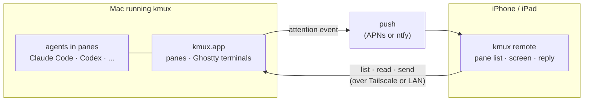
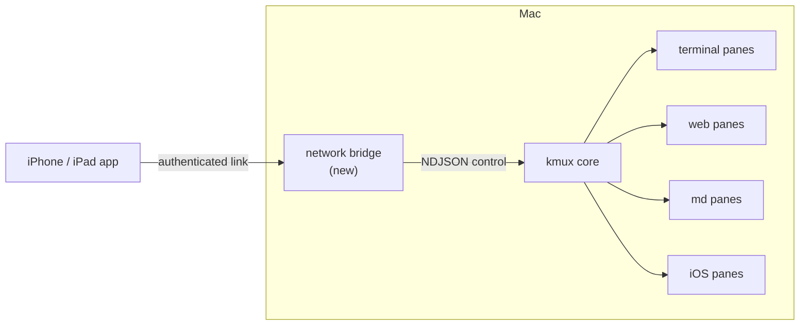
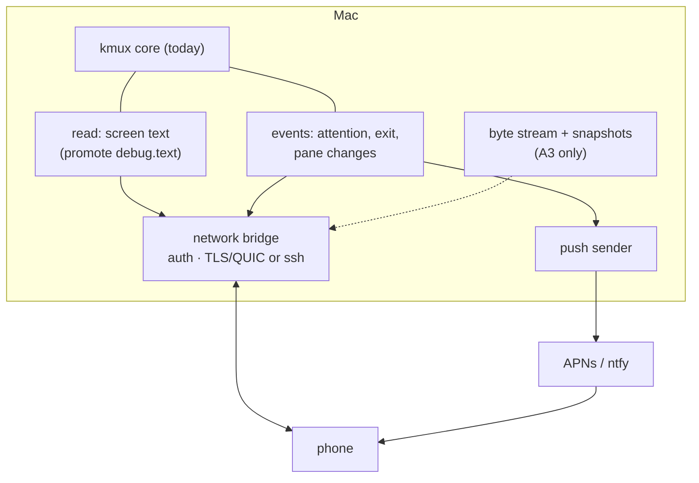
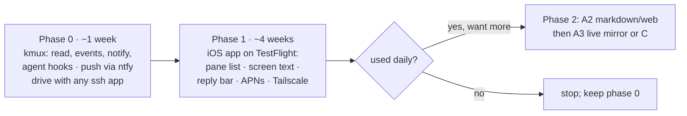

# kmux on iPad and iPhone: A Discussion Paper

> Research for the kmux roadmap item *"an iPad or iPhone app would also be cool, but needs discussion"*, 2026-10-09. This paper prepares that discussion; it doesn't make the decision. [Section 9](#9-recommendation-the-smallest-valuable-first-version) gives the default we'd pick, and [section 10](#10-questions-only-you-can-answer) lists what only you can decide.
>
> **Read with:** [client-server.md](client-server.md). Its questions 3 (iPad/iPhone scope) and 6 (network security) are the same questions this paper expands.
>
> **Evidence markers:** ✔ = verified here (read in this repo, kanna-v3/v2, or a fetched public page, listed in [Sources](#12-sources)). ◇ = general knowledge, not re-checked for this paper; worth confirming before design work.

## Table of Contents

1. [Summary](#1-summary)
2. [Who it's for and what it solves](#2-who-its-for-and-what-it-solves)
3. [Three shapes of app](#3-three-shapes-of-app)
4. [What kmux has today that a mobile app could use](#4-what-kmux-has-today-that-a-mobile-app-could-use)
5. [Building blocks](#5-building-blocks)
   - 5.1 [Mac-side pieces](#51-mac-side-pieces)
   - 5.2 [Terminal rendering on iOS](#52-terminal-rendering-on-ios)
   - 5.3 [Networking](#53-networking)
   - 5.4 [Auth and security](#54-auth-and-security)
   - 5.5 [Apple platform constraints](#55-apple-platform-constraints)
6. [Prior art](#6-prior-art)
7. [The options compared](#7-the-options-compared)
8. [Effort and risks](#8-effort-and-risks)
9. [Recommendation: the smallest valuable first version](#9-recommendation-the-smallest-valuable-first-version)
10. [Questions only you can answer](#10-questions-only-you-can-answer)
11. [Glossary](#11-glossary)
12. [Sources](#12-sources)

---

## 1. Summary

| | |
|---|---|
| **The real use case** | Your agents run on the Mac in kmux. You walk away. An agent stops to ask a question or wants permission, and nobody answers for an hour. A phone app's main job is to **tell you, show you enough to decide, and let you answer**. Full terminal work on a phone is secondary. |
| **Best fit** | Option A, a **remote client for the Mac's kmux**, starting as an "agent inbox": a pane list, each pane's screen as text, push notifications when an agent needs you, and quick replies. Live, colour-accurate terminal mirroring comes later. |
| **Not recommended** | Option B, a standalone ssh/mosh mux. The market is crowded (Blink, Termius, Moshi, VVTerm and others), and kmux's distinctive panes (iOS simulator, kmux-owned terminals) don't carry over. |
| **Biggest technical gap** | kmux's terminals live inside the app, and **upstream Ghostty gives no stream of a terminal's output bytes**. A live remote view needs that stream. Screen *text* is already readable today (`debug.text`), so a text-first v1 needs no Ghostty fork. |
| **Biggest product risk** | Overlap. Claude Code's own Remote Control, Happy, Moshi and cmux's iOS beta already let you approve agent prompts from a phone. kmux's edge has to be *mux-wide* (every agent and pane, any CLI agent) and *kanna-aware* (tasks, specs, markdown review). |
| **Smallest valuable v1** | Phase 0 needs no iOS code: add `read` and attention events to kmux, push through ntfy or Pushover, and drive kmux from any ssh app over Tailscale. Phase 1 is a native SwiftUI app on TestFlight over Tailscale with screen text, quick replies, markdown view and APNs pushes. See [section 9](#9-recommendation-the-smallest-valuable-first-version). |

---

## 2. Who it's for and what it solves

**Who:** primarily you, a developer running several coding agents in kmux on a Mac (or a Mac Studio), away from it for minutes to hours. Secondarily, other kmux and kanna users with the same habit. An iPad user with a keyboard who wants to *work*, not just check in, is a third, smaller group.

| # | Problem | A laptop solves it? | Phone/iPad value |
|---|---------|--------------------|------------------|
| 1 | **An agent is blocked on a question or permission and you don't know.** | Only if it's open in front of you | **High**: a push notification is the whole point |
| 2 | **Answering it**: "yes", "1", "use the second approach", "continue". | Yes, but you have to go to it | **High**: short replies are what phones are good at |
| 3 | **Checking progress**: is the build green, is the agent still going, what did it change? | Yes | **Medium–high**: read-only, glanceable |
| 4 | **Reviewing a spec or plan** an agent wrote (markdown, mermaid), with comments back to the agent | Yes, better | **Medium**: reading on an iPad is pleasant; kanna-v3's spec markup is the model |
| 5 | **Looking at the running web app** an agent is building | Yes | **Medium**: needs the Mac's dev server reachable ([5.3](#53-networking)) |
| 6 | **Real terminal work** (editing, long sessions) | Yes, much better | **Low on iPhone, medium on iPad with a keyboard** |
| 7 | **Starting new work** (open a task, launch an agent) | Yes | **Medium**: one sentence of dictation can start an agent |

**Reading the table:** rows 1–3 are where a phone beats a laptop, because the phone is always with you. None of them needs a pixel-perfect terminal.

---

## 3. Three shapes of app

### Option A: remote client for the Mac's kmux

The phone shows and drives the panes of a kmux running on your Mac.

| Level | What the phone gets | What kmux needs |
|---|---|---|
| **A1. Agent inbox** | Pane list, each terminal's **screen as text**, attention badges, push, send a line or a key, approve prompts | `read` command, attention events, a network path, push |
| **A2. Rich views** | A1 + native **markdown** panes (same file, rendered on the phone), **web** panes pointed at the Mac's dev server | Serve file contents; reach the dev server |
| **A3. Live terminal mirror** | Real-time, colour-accurate terminal with scrollback, keyboard and selection | A **byte stream** per terminal + snapshots ([5.1](#51-mac-side-pieces)); an iOS terminal view ([5.2](#52-terminal-rendering-on-ios)) |
| **A4. Simulator mirror** | The Mac's iOS-simulator pane as video, with touches | Encode the IOSurface frames kmux already has (◇ VideoToolbox) |

### Option B: standalone mux on iOS

kmux's tabs and splits on an iPad, with terminals that are ssh/mosh sessions (iOS has no local shell; [5.5](#55-apple-platform-constraints)). Web and markdown panes would work (WKWebView, native text). iOS-simulator panes can't exist on iOS.

This is a full ssh/mosh client with a mux UI on top. Its value over Blink, Termius or Moshi is the layout model and the web and markdown panes, not the terminals.

### Option C: kanna companion

Not a terminal app. It shows **kanna's** world: tasks, agents and their status, notifications, and **markdown and spec review** with comments sent back to the agent (kanna-v3 had spec markup; kanna-v4's roadmap lists it again). It might show a terminal as text when needed, but chat-like views come first. kanna-v3's ideas doc proposed a **chat view on mobile** built from Claude Code's JSONL transcript and hooks, with no terminal at all ✔.

**How the options relate:** A1 and C mostly overlap. A1 is the *mux-level* version (any pane, any agent), and C is the *task-level* version (needs kanna to hold state). A natural path is to build A1 and grow it into C as kanna gains a server.

---

## 4. What kmux has today that a mobile app could use

| Asset | Status | Use on mobile |
|---|---|---|
| NDJSON control protocol with `list`, `open`, `send`, `focus`, `close`, `navigate`, ... | ✔ built | The phone's command set, unchanged |
| `debug.text`: a terminal pane's **viewport text**, via upstream `ghostty_surface_read_text` | ✔ built, debug-only (`AppController.swift`, `TerminalSurfaceView.viewportText()`) | Promote to a real `read` command. This is the core of A1 |
| `debug.snapshot`: pane screenshots | ✔ built, debug-only | Thumbnails of any pane, web and iOS included |
| `KmuxCore`: model, JSON, socket server | ✔ imports only Foundation/Darwin, no AppKit | Model and JSON types are reusable in an iOS client |
| `KmuxMarkdown`, `KmuxDiagram` | ✔ AppKit-linked; tables use `NSTextTable`, which (◇) has no UIKit equivalent | Port needed: diagrams (Core Graphics + Core Text) port easily; tables need a different layout on iOS |
| `kmux-client` (Rust) | ✔ built | A Rust core could be shared with an iOS app, but a SwiftUI client speaking NDJSON directly is simpler |
| Events | ✔ **none**: clients poll `list` | Need events or polling for attention; polling over the network costs battery |
| Attention signals (OSC 9/777 desktop notifications, bell) | ✔ not handled (kmux's Ghostty action callback handles child-exited and mux actions only) | Must add: this is what fires a push |
| Network listener | ✔ none: Unix socket only, user-only permissions | Must add a bridge ([5.1](#51-mac-side-pieces)) |

**Takeaway:** an A1 client is mostly *exposing what already exists*, plus events and a network path. A3 is a different order of work.

---

## 5. Building blocks

### 5.1 Mac-side pieces

| Piece | Needed for | Size | Notes |
|---|---|---|---|
| **`read` command** (screen text, optionally scrollback lines) | A1+ | Small | Already exists as `debug.text`. Text only: no colours. |
| **Events** (`subscribe`: attention, bell, exit, pane opened/closed, title) | A1+ | Medium | Already "can be added later" in the spec. Also closes a cmux gap ([cmux-comparison](cmux-comparison.md) rank 2 and 4). |
| **Attention sources** | A1+ | Small–medium | OSC 9/777 notifications from Ghostty (◇ upstream exposes a desktop-notification action), the bell, and agent hooks (Claude Code `Notification`/`Stop` hooks running `kmux notify`). Hooks give the *reason* ("needs permission to run `rm`"), which is what makes the push useful. |
| **Network bridge** | A1+ | Small (ssh) to large (own QUIC) | See [5.3](#53-networking). Simplest: none. The phone runs `kmux` commands over ssh. |
| **Push sender** | A1+ | Small | From the Mac straight to APNs, or to ntfy/Pushover ([5.5](#55-apple-platform-constraints)). |
| **Byte stream + snapshots** | A3 | **Large** | Upstream Ghostty has no output tap; kanna-v3 forked it for exactly this ✔ ([client-server.md](client-server.md) option B). Alternatives below. |

**Getting a byte stream without forking Ghostty (A3), three routes:**

| Route | How | Cost |
|---|---|---|
| **Fork Ghostty** (kanna-v3's external I/O) | ✔ worked in v3 | The spec chose upstream to avoid this |
| **Wait for upstream** | Superlogical builds a libghostty-based server mux; an output/external-I/O API may land upstream (◇ not confirmed) | Unknown timing |
| **PTY tap shim** (idea, untested) | Each terminal pane runs its command under a small `kmux-tap` process, the way `script`, dtach and abduco work: Ghostty's PTY talks to the tap, the tap owns an inner PTY for the shell, forwards bytes both ways, copies output to a ring buffer for remote clients, and passes window-size changes through. | One more process and a few µs per pane; terminal queries still answered by Ghostty; must be invisible to the shell (◇ `TERM`, job control and resize need care). Bonus: the same tap could keep the shell alive across a kmux restart, which is the core of client-server option B. |

**Grid size:** a mirror shows the Mac's grid (for example 200×60). The phone can't resize it without changing the Mac's view, so the phone must **pan and zoom**, or show a reflowed text view. The kanna-v3 spike lists "viewport panning when another client owns a wider grid" as required work ✔.

### 5.2 Terminal rendering on iOS

Only A3 and option B need a real terminal view. A1 shows text in a native text view.

| Route | Status | Pros | Cons |
|---|---|---|---|
| **libghostty-vt + own Metal renderer** (kanna-v3 spike) | ✔ Builds for iOS from upstream `libghostty-vt` with no patches; on an iPhone 15 Pro both renderers held 60 fps with p95 frames under 5 ms at 120×50 | Upstream; same terminal state engine as the Mac | ✔ Renderer is a prototype: ASCII-only in Metal, one scalar per cell, no shaping, fallback fonts, IME, selection handles or accessibility. That's the bulk of the work. |
| **Patched full Ghostty for iOS** | ✔ Upstream **removed** the full iOS build in August 2026; only `libghostty-vt` still builds for iOS. Third-party apps (VVTerm, gterm, libghostty-spm) carry patches | Ghostty's real renderer, shaping and fonts | A fork to maintain, the thing kmux decided to avoid |
| **xterm.js in a WKWebView** | ✔ Kanna v2's mobile app (Expo, React Native) did this | Quick, mature | Breaks kmux's native-UI rule if applied to the app as a whole (◇ the rule is written for macOS panes; your call whether it binds a mobile client); kanna-v3 recorded fidelity bugs and large snapshots from translating Ghostty state to xterm |
| **SwiftTerm** (◇ MIT, used by some iOS ssh apps) | Mature Swift terminal view | Native, fast to adopt | A second terminal engine, different from the Mac's |

**Touch and input work, needed whichever renderer:** word-first selection with large handles, scrollback vs app-mouse gestures, momentum and a return-to-live control, software and hardware keyboards, an accessory key row (Esc, Ctrl, arrows, Tab), IME, paste, and readable font sizes ✔ (spike section 4–5).

### 5.3 Networking

| Path | How | Works away from home | Effort for us | Notes |
|---|---|---|---|---|
| **LAN** | Bonjour discovery + direct TCP/QUIC | ✗ | Small | ◇ iOS asks for "Local Network" permission |
| **Tailscale (or WireGuard), user-installed** | Phone and Mac on the same tailnet; the app connects to the Mac's tailnet address | ✓ | **None** | ✔ cmux's iOS app relies on exactly this and does no networking itself. ✔ iOS allows one active VPN, so it clashes with a work VPN |
| **Embedded Tailscale** (◇ `tsnet`/libtailscale in the app) | The app joins the tailnet itself, no VPN profile | ✓ | Medium | Avoids the one-VPN limit; adds a Go library and a login flow |
| **ssh / mosh** | The phone runs `kmux ...` over ssh (any ssh app, or the app's own ssh) | ✓ with Tailscale or port forwarding | **None** for phase 0 | ssh keys are the auth; mosh survives sleep and network switches |
| **Own relay** (iroh, kanna-v3's plan) | ✔ v3 chose iroh: QUIC, hole punching, relay fallback, per-device keys, end-to-end encrypted | ✓ without user setup | **Large** | A server to run; the right answer for a product others install, overkill for v1 |

**Dev-server web panes on the phone:** the Mac's `localhost:3000` isn't the phone's. Either the dev server listens on the tailnet address, or the bridge forwards ports (kanna-v3 designed a TCP port forward over its connection ✔).

### 5.4 Auth and security

A network path into kmux is **remote code execution by design**: `open --cmd` and `send` run anything. The security bar is ssh's ([client-server.md](client-server.md) section 6).

| Approach | Auth | Encryption | Notes |
|---|---|---|---|
| **ssh** | User's ssh keys (in the phone's Secure Enclave or keychain) | ssh | Strongest default with zero new crypto. macOS Remote Login must be on. |
| **Tailscale ACLs + per-device token** | Tailnet identity, plus a token paired by QR code | WireGuard | The tailnet only proves "a device on my tailnet"; a pairing token still limits it to *my phone* |
| **Own pairing** (kanna-v3 style) | Per-device keys created at pairing, revocable | TLS/QUIC end to end; relays see ciphertext only | Most work; needed for an own relay |

**Further rules for any option:** read-only and read-write pairings (a "watch only" device can't `send`); confirm before `open --cmd` from the phone; Face ID before sending; audit log of remote commands on the Mac; **push payloads leak screen content** to Apple, and to the push vendor if one is used. cmux offers a "hide content" mode for this ✔. Agent prompts often contain code and secrets.

### 5.5 Apple platform constraints

| Constraint | What it means | Source |
|---|---|---|
| **No local shell on iOS** | Apps can't fork/exec arbitrary binaries. a-Shell (WebAssembly and built-in commands) and iSH (x86 emulation) work around it; neither runs real macOS tools | ◇ |
| **App Review on "executing code"** | ◇ Guideline 2.5.2 limits downloading and running code; ssh clients (Blink, Termius) and a remote client are fine because code runs elsewhere | ◇ |
| **Background limits** | ◇ An app is suspended seconds after it leaves the screen; sockets close. No persistent connection in the background. The app must reconnect and re-read state on return. **Notifications must come from push**, not a live socket | ◇ |
| **Push (APNs)** | ◇ Needs an Apple Developer account (99 USD/year) and an APNs key. The sender can be the **Mac itself** (APNs is an HTTPS/2 API with a signed JWT). Fine for a personal build with your own key; for an app others install, the key can't ship in their kmux, so a tiny push service is needed (cmux sends notification text via its servers ✔). | ◇ / ✔ |
| **Push without an app** | ◇ ntfy (self-hostable), Pushover and Bark are existing iOS apps that receive pushes from a simple HTTP POST. Zero iOS code. | ◇ |
| **Live Activities and Apple Watch** | ◇ Lock-screen status for a running agent, updatable by push. Moshi ships this ✔ | ◇ / ✔ |
| **TestFlight** | ◇ Internal testers (up to 100, team members) need no review; external testers (up to 10,000) need a light beta review; builds expire after 90 days | ◇ |
| **Distribution** | ◇ App Store review for public release. cmux ships its iOS app as a TestFlight beta only ✔ | ◇ / ✔ |
| **iPad specifics** | ◇ Hardware keyboards (⌘ shortcuts work), Stage Manager windows, external displays. An iPad with a keyboard makes option B or A3 far more useful than on an iPhone | ◇ |
| **Building** | ✔ kanna-v3's spike built `libghostty-vt` for device and simulator; iOS is static-link only and needs a macOS build host | ✔ |

---

## 6. Prior art

### Terminal apps on iOS

| App | What it is | Terminal engine | Agent features | Price | Lesson for kmux |
|---|---|---|---|---|---|
| **Blink Shell** | ssh/mosh client, open source | ◇ hterm (web-based) | ✔ none | ✔ Blink+ 19.99 USD/yr; ✔ the 2026 move to subscription angered users | Great keyboard support sets the bar for iPad; pricing changes hurt |
| **Termius** | Cross-platform ssh with sync | ◇ own | ✔ none | ✔ Pro ~10 USD/mo | Host and key sync across devices |
| **Prompt 3** (Panic) | Polished ssh client | ◇ own | ✔ none; ✔ ssh only | ✔ 19.99 USD once | Polish matters; minimal features are fine |
| **a-Shell** | Local Unix-like shell via WebAssembly | ◇ | — | ◇ free | Local "shell" on iOS is possible only in limited form |
| **iSH** | Local Alpine Linux via x86 emulation | ◇ | — | ◇ free | Same; slow, and App Review once pulled it (◇ 2020) |
| **Moshi** | ssh/mosh client built **for coding agents** | ◇ | ✔ hooks (`moshi-hook`) for Claude Code, Codex, OpenCode, Cursor and others send approvals, questions and turn-completions to an **Agents feed**, push, **Live Activities**, Apple Watch; voice input; diff viewer; localhost web preview; tmux/Zellij pickers | ✔ free tier; Pro 7.99 USD/mo, 199 USD lifetime | **The closest competitor to A1.** Proves the "agent inbox + push + hooks" design and that people pay for it |
| **Moshline, Moshpit** | ✔ Similar agent-oriented ssh/mosh apps ("fleet inbox for sessions and approvals"; tmux control mode) | ◇ | ✔ inbox, approvals | ◇ | The category is getting crowded fast |
| **VVTerm** | ✔ ssh client on **libghostty** for iOS and macOS (Feb 2026) | ✔ patched full libghostty | ◇ | ◇ | Ghostty on iOS is shippable with patches |

### Remote coding-agent clients

| Product | How it works | Lesson |
|---|---|---|
| **Claude Code Remote Control** (Anthropic) | ✔ `claude remote-control` shows a QR code; the phone (Claude app or browser) drives the running session: read output, send messages, **approve permissions**, push when it needs you. Research preview, Feb 2026 | Covers rows 1–2 of [section 2](#2-who-its-for-and-what-it-solves) **for Claude Code only**. kmux must add value beyond one agent |
| **Happy (Happy Coder)** | ✔ Open source (MIT) iOS/Android/web client for Claude Code, Codex, Gemini CLI; a CLI wrapper on the Mac; end-to-end encrypted relay (TweetNaCl) that sees only ciphertext; push when an agent needs input | Agent-level (structured), not terminal-level; E2E relay is achievable at small scale |
| **cmux iOS** (TestFlight beta) | ✔ Pairs with the Mac app (same cmux account); mirrors terminals in real time; **no networking of its own**: Tailscale, WireGuard or LAN; terminal stream goes phone ⇄ Mac directly; notification text goes via cmux servers to APNs, with a "hide content" option; early access only with a paid edition | **The closest analogue to option A.** Validates "lean on Tailscale" for v1 |
| **Kanna v2 mobile** (ours) | ✔ Expo/React Native app, xterm.js in a web view, LAN or a relay VM, Firebase | We've built one before; v3 recorded what went wrong (xterm translation, TCP relay latency) |
| **kanna-v3 plan** (ours) | ✔ Slices 5/5b/5c: iroh QUIC with relay fallback, per-device keys with E2E encryption, then a libghostty-vt Metal renderer on iOS | The full-scale design if we go all the way |

---

## 7. The options compared

| | A1 agent inbox | A3 live mirror | B standalone mux | C kanna companion |
|---|---|---|---|---|
| Solves "agent is waiting" (rows 1–2) | ✓ | ✓ | ✗ (unless you ssh in and look) | ✓ |
| Glance at progress (row 3) | ✓ text | ✓ full | ~ | ✓ structured |
| Spec/markdown review (row 4) | A2 | A2 | ✓ local files only via ssh | ✓ (its core) |
| Real terminal work (row 6) | ✗ | ✓ | ✓ | ✗ |
| Needs Mac-side kmux work | Small–medium | Large | None | In kanna, medium–large |
| Needs a Ghostty fork or tap | No | Yes (or shim) | No (libghostty-vt) | No |
| iOS terminal renderer | No | Yes | Yes | No |
| Works with any CLI agent | ✓ | ✓ | ✓ | Agents kanna knows |
| Differentiation vs prior art | Medium: mux-wide, multi-agent, kmux panes | Medium (cmux has it) | Low | **High** if kanna has unique task/spec features |
| Depends on decisions elsewhere | Events in kmux | client-server.md B/C | — | kanna gaining a server |

---

## 8. Effort and risks

Estimates are rough, for one experienced developer working with agents, and assume Tailscale for networking. ◇ They are judgement, not measurement.

| Option | Effort | Main risks |
|---|---|---|
| **Phase 0** (no app): `read`, events, `kmux notify`, agent hooks, push via ntfy/Pushover; drive with an ssh app | **~1 week** | Low. Push content leaks screen text to a third party unless self-hosted ntfy |
| **A1** native SwiftUI app: pairing, pane list, screen text, reply bar and quick keys, APNs from the Mac, TestFlight | **~3–5 weeks** on top of phase 0 | Overlap with Claude Remote Control and Moshi; background/push plumbing; the security of a network listener |
| **A2** markdown and web on the phone | **+2–3 weeks** | Porting `KmuxMarkdown` tables off `NSTextTable`; dev-server reachability |
| **A3** live mirror | **+2–4 months** | Byte stream needs a Ghostty fork or a PTY-tap shim (untested); iOS renderer completeness (fonts, shaping, IME, selection); grid panning UX |
| **A4** simulator mirror | **+3–6 weeks** | Encoding latency; private-framework fragility already present on the Mac side |
| **B** standalone mux | **~3–6 months** to be competitive | Crowded market; ssh/mosh implementation and key management; differentiation |
| **C** kanna companion | **~1–2 months** after kanna has a server and events | Blocked on kanna's own roadmap (kanna-v4 is a CLI today ✔) |
| **Own relay + E2E** (any option, "anywhere without Tailscale") | **+1–2 months** | Operating a service; kanna-v3 already designed it (iroh) |

**Cross-cutting risks:**

- **Overlap with first-party tools.** Anthropic's Remote Control and the agent vendors' own apps will keep improving. A kmux app wins only by being agent-agnostic and mux-wide.
- **Security.** A remote command channel into a dev machine is a high-value target. Start with ssh or tailnet plus pairing, never an open port.
- **Maintenance.** An iOS app is a second platform: Xcode updates, App Review, TestFlight expiry every 90 days.
- **Spec drift.** The NDJSON protocol becomes a network API with older phone builds talking to newer Macs. `capabilities` already gives version negotiation ✔.

---

## 9. Recommendation: the smallest valuable first version

**Default, unless you say otherwise:** build **option A1, in two phases**, and treat A3, B and C as later decisions.

**Phase 0: useful with no iOS code (and good for kmux anyway)**

1. Promote `debug.text` to **`read`** (`pane`, optional `lines` of scrollback).
2. Add **events** (`subscribe`) with at least `attention`, `bell` and `exited`. This closes the cmux gap noted in [cmux-comparison.md](cmux-comparison.md).
3. Add **`kmux notify --pane P "message"`** and handle Ghostty's desktop-notification action (OSC 9/777).
4. Ship **Claude Code and Codex hook snippets** that call `kmux notify` with the reason ("permission: Bash(rm -rf build)").
5. A tiny **push forwarder** (in the app or as `kmux watch --push ntfy://...`) that posts attention events to ntfy or Pushover, with a "hide content" option.
6. From the phone: any ssh app over Tailscale runs `kmux list`, `kmux read p3`, `kmux send p3 "yes"`.

**Phase 1: native app, personal TestFlight**

- SwiftUI, iPhone and iPad, one Mac to start.
- **Network:** Tailscale (user-installed), connecting to an **ssh-tunnelled** or **token-paired** bridge on the Mac. Pairing by QR code shown in kmux.
- **Screens:** Macs → panes, with attention badges first → a pane's screen text (monospace, pinch to zoom, refreshed on events) → a reply bar with quick keys (`y`, `n`, `1`–`3`, Esc, Ctrl-C, Enter) and dictation.
- **Push:** APNs sent by the Mac with your own developer key. Tapping a push opens that pane.
- **Security:** Face ID before sending, read-only pairing option, a log of remote commands on the Mac.
- **Not in v1:** colours, live streaming, scrollback beyond `read`, web panes, iOS panes, own relay, App Store.

**Why this one:** it addresses the rows that a phone beats a laptop on (1–3); it needs **no Ghostty fork and no terminal renderer**; phase 0 alone is valuable and strengthens kmux on the desktop (events and reading panes are the top cmux gaps); and it leaves A3 to wait for upstream libghostty or the PTY-tap experiment.

---

## 10. Questions only you can answer

1. **Who is it for:** you alone (personal TestFlight, your own APNs key, Tailscale assumed), or kmux/kanna users at large (App Store, a push service, likely a relay)?
2. **kmux or kanna:** should the phone app belong to **kmux** (panes, any agent), to **kanna** (tasks, specs, agents), or start as kmux and become kanna's? This mirrors client-server.md question 2.
3. **How much terminal:** is screen-as-text plus replies enough for the first version, or is a live colour terminal on the phone a must-have from the start?
4. **iPhone, iPad or both first?** iPhone suits the "agent is waiting" case; iPad with a keyboard suits real work and review.
5. **Network:** is "install Tailscale" acceptable for v1? Is ssh as the transport and auth acceptable, or do you want kanna-v3's own pairing and relay from the start?
6. **Push privacy:** may notification text (which can include code or commands) pass through Apple, or a third party such as ntfy.sh or Pushover? Or generic text only?
7. **Native-UI rule:** does kmux's "only web panes are web views" rule bind a mobile client too? It decides whether xterm.js or a web/PWA client is acceptable as a stepping stone.
8. **Overlap:** given Claude Code Remote Control, Happy and Moshi, which agents and workflows do you actually need covered that those don't cover?
9. **Remote actions:** should the phone be allowed to **start** things (`open --cmd`, new agents), or only answer and stop?
10. **Ghostty:** if A3 becomes a priority before upstream offers an output API, would you rather try the PTY-tap shim, or carry a Ghostty fork again?

---

## 11. Glossary

| Term | Meaning |
|---|---|
| **APNs** | Apple Push Notification service. The only way to wake an iPhone with a notification when the app isn't running. |
| **Attention event** | A signal that a pane needs a person: an agent asking a question or permission, a bell, a desktop notification escape code. |
| **Agent hooks** | Commands an agent runs at moments such as "waiting for permission" or "turn finished" (Claude Code hooks, for example). |
| **Bridge** | A process or listener on the Mac that accepts network connections and passes requests to kmux's Unix socket. |
| **Byte stream** | The raw output bytes a program writes to its terminal; needed to mirror a terminal live with colours. |
| **libghostty-vt** | Ghostty's terminal-state library (parsing and screen state, no drawing). The only part of upstream Ghostty that builds for iOS. |
| **Live Activity** | An iOS lock-screen and Dynamic Island widget that shows ongoing status and can be updated by push. |
| **mosh** | A remote-shell protocol over UDP that survives sleep and network changes and syncs screen state. |
| **ntfy / Pushover / Bark** | Existing apps and services that deliver push notifications to a phone from a simple HTTP request. |
| **OSC 9 / OSC 777** | Terminal escape codes a program prints to ask the terminal to show a desktop notification. |
| **PTY tap** | A small process between the terminal and the shell that forwards bytes and keeps a copy (like `script`, dtach, abduco). |
| **Relay** | A server both devices connect out to, so they can talk when neither can reach the other directly. |
| **Snapshot** | A copy of a terminal's current screen, sent so a new viewer can start without replaying history. |
| **Tailscale / tailnet** | A WireGuard-based private network across your devices; a tailnet is one such network. |
| **TestFlight** | Apple's beta distribution for iOS apps. Internal testers need no review; builds expire after 90 days. |
| **Viewport text** | The characters visible on a terminal's screen, without colours or styles. |

---

## 12. Sources

**This repo (✔):** `docs/kmux-spec.md` (sections 7, 8.1), `docs/research/client-server.md`, `docs/research/cmux-comparison.md`, `apps/kmux/Package.swift`, `apps/kmux/Sources/Kmux/AppController.swift` (`debug.text`, `debug.snapshot`), `apps/kmux/Sources/Kmux/Terminal/TerminalSurfaceView.swift` (`viewportText()`), `apps/kmux/Sources/Kmux/Terminal/GhosttyRuntime.swift`, `apps/kmux/Sources/KmuxMarkdown/MarkdownRenderer.swift` (`NSTextTable`).

**kanna (✔):** kanna-v3 worktree `task-9a38409e`: `docs/research/ios-ghostty-spike.md`, `spikes/ios-terminal/README.md`, `docs/plan.md` (slices 5, 5b, 5c), `docs/specs/kanna3.md` (Remote path, Kanna v2's stream path), `docs/ideas.md` (mobile chat view, iOS rendering, relay). Kanna v2 mobile: `~/.kanna/repos/kanna/apps/mobile/package.json` (Expo, React Native, xterm.js, Firebase). kanna-v4: `docs/roadmap.md`, `docs/kanna-spec.md`.

**Public pages (✔ fetched or searched 2026-10-09):**

- cmux iOS docs: <https://cmux.com/docs/ios.md> (public docs, not source code).
- Moshi comparison of iOS terminals for coding agents: <https://getmoshi.app/articles/best-ios-terminal-app-coding-agent>; Blink alternatives: <https://getmoshi.app/articles/blink-shell-alternatives>.
- Moshline and Moshpit on the App Store: <https://apps.apple.com/app/id6758267438>, <https://apps.apple.com/app/id6799896801>.
- Claude Code Remote Control: <https://noqta.tn/en/news/anthropic-claude-code-remote-control-mobile-2026>, <https://pasqualepillitteri.it/en/news/316/claude-code-remote-control-mobile>.
- Happy: <https://github.com/slopus/happy>.
- VVTerm: <https://www.everydev.ai/tools/vvterm>.
- Tailscale on iOS and other VPNs: <https://tailscale.com/kb/1291/ios-vpn-on-demand>, <https://tailscale.com/docs/reference/faq/other-vpns>.

**General knowledge (◇), worth re-checking before design:** App Review guideline 2.5.2 wording, iOS background suspension rules, APNs provider API and key handling, TestFlight limits, ntfy/Pushover/Bark behaviour, embedded Tailscale (`tsnet`/libtailscale) on iOS, SwiftTerm, Ghostty's desktop-notification action in the embedding API, the terminal engines behind Blink/Termius/Prompt, and iSH's App Store history.
