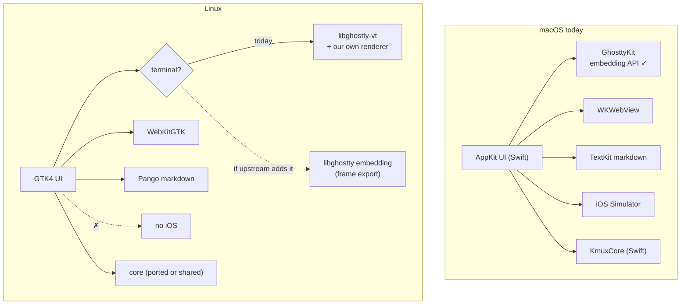
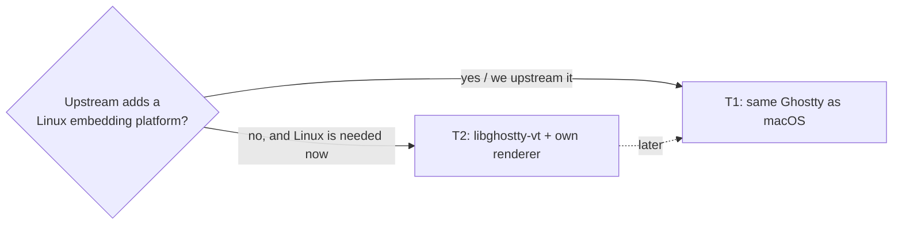
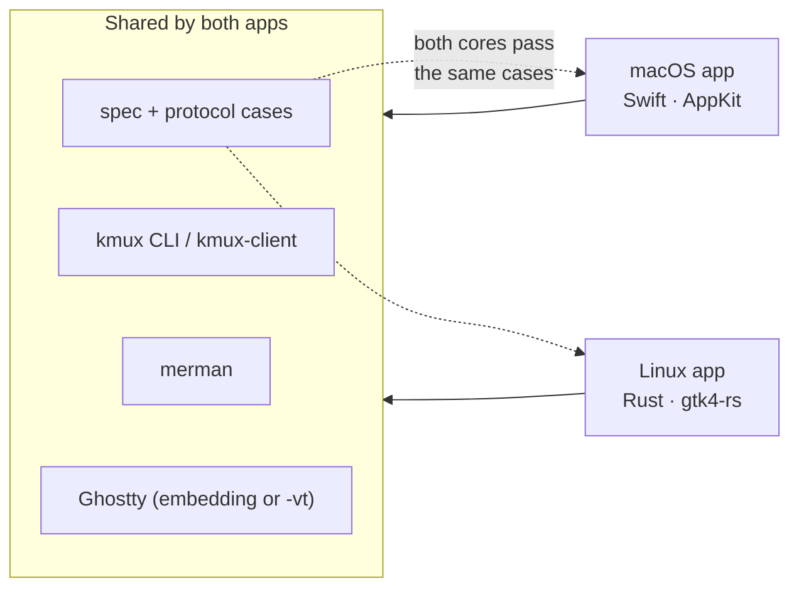
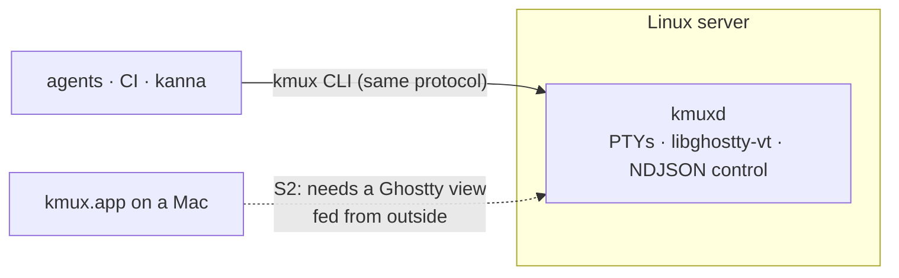

# kmux on Linux: A Discussion Paper

> Research for the roadmap item *"if ghostty can run on linux then we can (except for iOS simulator)"*, 2026-10-09. The recommendation is in [section 9](#9-recommendation) and the questions only you can answer are in [section 10](#10-questions-for-you). Nothing here is implemented.

**How to read the evidence:** **[verified]** means checked in a file: Ghostty at the pinned commit `a806905e` (`~/work/kmux/target/ghostty-source`, 2026-10-01), kmux's sources, or kanna-v3's `vendor/libghostty-rs`. **[general]** means general knowledge, not checked here. Re-check it before building on it.

## Table of Contents

1. [Summary](#1-summary)
2. [Ghostty on Linux](#2-ghostty-on-linux)
3. [Terminal options on Linux](#3-terminal-options-on-linux)
4. [KmuxCore and the CLI on Linux](#4-kmuxcore-and-the-cli-on-linux)
5. [UI toolkit options](#5-ui-toolkit-options)
6. [Each pane type on Linux](#6-each-pane-type-on-linux)
7. [What is shared and what is rewritten](#7-what-is-shared-and-what-is-rewritten)
8. [Fit with client/server](#8-fit-with-clientserver)
9. [Recommendation](#9-recommendation)
10. [Questions for you](#10-questions-for-you)
11. [Glossary](#11-glossary)
12. [Sources](#12-sources)

---

## 1. Summary

The premise is half right. **Ghostty runs on Linux, but the part of Ghostty that kmux uses doesn't.**

- **The Ghostty app runs on Linux.** It's a first-class GTK4 + libadwaita app. **[verified]**
- **The embedding API that kmux uses doesn't support Linux.** That's `ghostty.h`: GhosttyKit's `ghostty_app_*` and `ghostty_surface_*`. Its only platforms are `MACOS` (an `NSView`) and `IOS` (a `UIView`). On any other OS, creating a surface fails with `UnsupportedPlatform`. Ghostty's build even says the library "is NOT libghostty… just the glue between Ghostty GUI on macOS and the full Ghostty GUI core". **[verified]**
- **libghostty-vt does run on Linux.** It's the cross-platform library that upstream supports, but it has **no renderer**: you draw the terminal yourself. Its functionality is described as stable, but the API is still changing. **[verified]**
- **Upstream is moving in a helpful direction.** At this commit, the Linux OpenGL renderer draws off-screen and *exports finished frames* (DMABUF or CPU pixels) for the app to show. A Linux embedding platform that hands those frames to a host would be a small, natural upstream addition, but it doesn't exist yet. **[verified]**
- **Everything except the terminal has a clear Linux path:**
  - **KmuxCore:** compiles with small fixes.
  - **CLI:** needs two small changes.
  - **Web panes:** WebKitGTK.
  - **Mermaid layout:** merman is portable Rust.
  - **Markdown:** needs a new native renderer (Pango). That is real work, but bounded.
  - **iOS:** none.

**Recommendation in one line:** don't build a Linux UI yet. Make the core and CLI portable now (about 2 days), and decide on a Linux app once you know what Linux is for ([Q1](#10-questions-for-you)) and whether upstream gains a Linux embedding path. If it's built, build it in **Rust with gtk4-rs**, not Swift. Details are in [section 9](#9-recommendation).

---

## 2. Ghostty on Linux

| Piece | Linux status | Evidence |
|-------|--------------|----------|
| **Ghostty app (GTK apprt)** | ✓ Full app: GTK4 + libadwaita, OpenGL ≥ 4.3 through EGL, D-Bus single instance, Flatpak support, splits and tabs | `src/apprt/gtk/`, `src/build/SharedDeps.zig` links `gtk4` and `libadwaita-1`, `OpenGL.zig` `MIN_VERSION 4.3` **[verified]** |
| **Ghostty's own IPC** | Only `new-window`, `new-tab`, `toggle-quick-terminal` over D-Bus. Nothing that could place splits or add non-terminal panes. | `src/apprt/gtk/ipc/` **[verified]** |
| **Embedding API (`ghostty.h`, GhosttyKit)** | ✗ Platform union is `macos{nsview}` / `ios{uiview}` only; both are `void` off Darwin, so `ghostty_surface_new` returns `UnsupportedPlatform`. The build *can* emit `ghostty-internal.so` on Linux, but without a platform to render into it is unusable for a GUI. | `src/apprt/embedded.zig` lines 381–437, `build.zig` lines 213–240 **[verified]** |
| **Linux renderer** | Draws off-screen with EGL and **exports each frame** as a DMABUF (zero-copy GPU buffer) or CPU pixels. Ghostty's GTK `RenderSurface` widget shows those frames; it replaced `GtkGLArea`. | `src/renderer/OpenGL.zig` `present()`, `src/renderer/Dmabuf.zig`, `src/apprt/gtk/class/render_surface.zig` **[verified]** |
| **libghostty-vt** | ✓ macOS, Linux, Windows, WebAssembly. Terminal state, scrollback, reflow, a render-state iterator for custom renderers, key, mouse and paste encoding, snapshots, search, selection. Header: *"incomplete, work-in-progress API… definitely going to change"*. README: functionality "extremely stable", API "in flux", not yet versioned. | `include/ghostty/vt.h`, `README.md` **[verified]** |
| **libghostty-vt from Rust** | kanna-v3 vendors `libghostty-rs`: `libghostty-vt-sys` plus a safe wrapper (`Terminal`, `RenderState`, `KeyEncoder`, `MouseEncoder`). It builds Ghostty with Zig 0.16 from a pinned `jemdiggity/ghostty` commit, or `GHOSTTY_SOURCE_DIR`. | `vendor/libghostty-rs/README.md` **[verified]** |
| **Reference terminals on libghostty-vt** | Ghostling (C) and `ghostling_rs` (Rust, macroquad) are minimal terminals that draw the grid themselves. | README, `example/ghostling_rs` **[verified]** |

**What this means:** "Ghostty runs on Linux" is true of the app, not the library kmux uses. Third-party docs claiming that libghostty embedding supports Linux with OpenGL don't match the source at our pin. **[verified against source]**

---

## 3. Terminal options on Linux

This is the decision that drives the rest.

| Option | What | Upstream Ghostty only? | Quality | Effort (rough) | Risk |
|--------|------|------------------------|---------|----------------|------|
| **T1. libghostty embedding, Linux platform** | Add a third `ghostty_platform_e`, e.g. "host presents frames". The host gets each exported DMABUF (or pixels) through a callback and shows it, for example as a `GdkDmabufTexture`. Input goes through the existing `ghostty_surface_key` and mouse calls. | Only if upstream takes it; otherwise **a fork** (the spec's red line) | Identical to Ghostty: same renderer, config, shaders, fonts | 1–3 weeks to write; upstream review time unknown | Upstream's appetite and timing. The plumbing exists, so the code is mostly glue. |
| **T2. libghostty-vt + our own renderer** | Own the PTY; feed bytes to libghostty-vt; draw cells from `RenderState` with Pango/HarfBuzz into GTK (GSK or GL). | ✓ Yes, today | Ghostty's emulation, our rendering. Ligatures, emoji, kitty graphics, IME, selection and shaders are ours to do. | 4–8 weeks to good; longer to Ghostty-level polish | Rendering quality and latency become our problem; the API is still changing |
| **T3. Link Ghostty's GTK widget** | Reuse `apprt/gtk/class/surface.zig` inside our app | ✗ It's tied to Ghostty's `Application` class: a fork | Identical | Weeks, then forever | Rebasing a fork of Ghostty's UI layer |
| **T4. VTE** | GNOME's terminal widget (`vte-2.91-gtk4`) **[general]** | — not Ghostty | Mature, but not Ghostty: different config, rendering and behaviour | Days | Breaks the spec's "Ghostty terminals" decision |

**Lean:** T1 if upstream will have it. Ask in a Ghostty discussion before writing code. Fall back to T2 only if Linux is wanted before that. T2 also has a second use as the server side of client/server (section 8), so its work isn't wasted.

---

## 4. KmuxCore and the CLI on Linux

KmuxCore is 1,130 lines in 7 files. It imports only Foundation, plus `Darwin` in one file. I checked it by reading, not by building: no Linux Swift toolchain or running Docker was available.

| File | Linux issue | Fix | Evidence |
|------|-------------|-----|----------|
| `SocketServer.swift` | `import Darwin` | `#if canImport(Glibc) import Glibc` | **[verified]** |
| `SocketServer.swift` | `SO_NOSIGPIPE` doesn't exist on Linux | Ignore `SIGPIPE` at startup, or `send(…, MSG_NOSIGNAL)` | **[verified]** use; **[general]** Linux API |
| `SocketServer.swift` | `SOCK_STREAM` is an enum in Glibc's Swift import | `Int32(SOCK_STREAM.rawValue)` | **[general]** |
| `SocketServer.swift` | `Thread`, `DispatchSemaphore`, `Task { @MainActor }` | Available in swift-corelibs-foundation and Dispatch. **But** the main actor runs on Dispatch's main queue, which a GTK (GLib) main loop doesn't drain on its own. It needs glue, such as a GLib source that drains the main queue, or a custom main executor. | **[verified]** use; **[general]** the integration problem |
| `Instance.swift` | `applicationSupportDirectory` gives `~/.local/share` on Linux, not `~/Library/…` | Use `$XDG_RUNTIME_DIR/kmux/` for sockets, which is the standard home for per-user sockets | **[verified]** use; **[general]** mapping |
| Everything else | `JSONEncoder`/`JSONDecoder`, `CharacterSet`, `FileManager`, `ProcessInfo`, `NSString` paths | All in corelibs-foundation | **[verified]** use; **[general]** availability |

**The Rust CLI and `kmux-client`:**

- **Socket directory:** `socket_dir()` hard-codes `~/Library/Application Support/kmux`. It needs the same XDG rule as the core. **[verified]**
- **Auto-start:** this launches the app with `/usr/bin/open`, so Linux needs a plain `exec` of the kmux binary. **[verified]**
- **Everything else** is portable Rust.

**Verdict:** KmuxCore is portable in about a day's work. The one real risk is main-actor and GLib main-loop integration, and only if the Linux UI is also Swift.

---

## 5. UI toolkit options

| Option | Shares with macOS | Terminal fit | Maturity | Verdict |
|--------|-------------------|--------------|----------|---------|
| **U1. Swift + GTK4 bindings** (SwiftGtk or swift-adwaita, generated from GObject introspection; Adwaita for Swift is SwiftUI-like) **[general; search results]** | KmuxCore as is; markdown parsing (swift-markdown supports Linux **[general]**); diagram scene code after replacing `CGPath`/`CGColor` | C API from Swift, as on macOS | Community bindings, small user base; main-loop glue needed; Swift-on-Linux build and packaging to learn | Possible, highest risk per line |
| **U2. Rust + gtk4-rs (+ webkit6, libadwaita crates)** | The protocol cases (`tests/kmux-protocol/`) and the CLI/`kmux-client` crate. The core (1,130 lines) is re-written in Rust and held to the same cases, as the JS reference model already is. | **Best:** `libghostty-rs` already exists (kanna-v3), merman is called directly with no C bridge, and DMABUF textures are a gtk4-rs call | gtk-rs is the official, widely used binding **[general]** | **Recommended** |
| **U3. Zig, inside Ghostty's GTK apprt** | Ghostty's whole GTK app | Native | It's Ghostty's code | A fork of Ghostty's UI. ✗ |
| **U4. Ghostty's GTK app + kmux as a server beside it** | — | Ghostty owns the terminals | — | Ghostty's IPC can only open windows and tabs (section 2), so kmux couldn't arrange splits, host web or markdown panes, or `send`. That isn't kmux. ✗ |
| **U5. A TUI** (as cmux-tui does) | Protocol | libghostty-vt in a terminal | — | Loses web, markdown and diagrams, which are kmux's reason to exist. ✗ for the app; maybe for headless (section 8) |

**Why U2 over U1:** the shared code is small; the core is 19% of the 6,000-line app. Almost everything on Linux is new UI code either way, so the language should suit the platform's libraries.

- In Rust, the CLI, client, merman, libghostty-vt bindings and GTK bindings are all first-class.
- In Swift on Linux, each of those is a risk.
- Two cores are kept honest by the shared protocol cases, the way the JS model and the Swift core are today.

**[judgement]**

---

## 6. Each pane type on Linux

| Pane | macOS | Linux | Gaps and notes | Effort (rough) |
|------|-------|-------|----------------|----------------|
| `term` | GhosttyKit `NSView` | T1 (frames from libghostty) or T2 (libghostty-vt + own renderer); see section 3 | Shortcuts from the Ghostty config still apply; ⌘ becomes Ctrl/Ctrl+Shift by Linux convention | T1 1–3 wk + upstream; T2 4–8 wk |
| `web` | `WKWebView` | **WebKitGTK 6.0** (the GTK4 API): load, navigation callbacks, back/forward list, JavaScript evaluation, separate web processes, as on macOS **[general]** | Same engine family as WKWebView, so pages behave similarly. "Waiting for localhost" and the floating Open URL field are ours to redo. | ~1 wk |
| `md` | swift-markdown → `NSAttributedString` → read-only TextKit view; tables are TextKit text tables; magnification zoom | **A new renderer:** parse with cmark-gfm (`comrak` or `pulldown-cmark` in Rust), lay out blocks with **Pango**, draw with `GtkSnapshot`. Zoom is a scale transform on the snapshot, which gives "plain magnification" naturally. | `GtkTextView` was considered: it has no tables (they'd be embedded widgets) and no magnification, so a custom block renderer fits the spec better. Selection and copy across blocks is the fiddly part. The Native UI rule rules out a web view. | 2–4 wk |
| Mermaid | merman layout → `DiagramScene` (`CGPath`, `CGColor`) → Core Graphics; labels measured with Core Text through merman's host-measurement hook | merman as is (Rust). Measure labels with Pango through the same hook. Draw the scene with Cairo or `GskPath`. | The scene builders (Flowchart, Sequence, State, about 420 lines) port almost line for line. Only the path, colour and text types change. | ~1 wk |
| `ios` | SimulatorKit, CoreSimulator, IOSurface | **None.** The simulator only exists on macOS with Xcode. | `capabilities` should simply not list `ios`. Remote streaming from a Mac is client/server territory. | — |

**Behaviour that changes on Linux, whatever the toolkit:**

- **Wayland doesn't let apps place or stack their own windows.** **[general]** The `--bg` rule (spec 3.5: "windows go just behind the front window") and focus-stealing behaviour can't be honoured exactly. `--bg` would become "don't take focus", which is best effort.
- **Packaging:** a `.deb`/`.rpm` or AppImage is simplest. Flatpak's sandbox makes shells run inside the sandbox unless they're spawned on the host (`flatpak-spawn --host`). Ghostty has dedicated Flatpak code for this (`src/os/flatpak.zig`). **[verified file exists; general on details]**
- **Menus:** GTK4 apps use a header-bar menu rather than a global menu bar, so the spec's menus map to a primary menu plus shortcuts.

---

## 7. What is shared and what is rewritten

| Piece | Lines today | With U2 (Rust/GTK) | With U1 (Swift/GTK) |
|-------|-------------|--------------------|---------------------|
| Protocol, behaviour (`docs/kmux-spec.md`, `tests/kmux-protocol/`, reference model) | — | **Shared** | **Shared** |
| CLI + `kmux-client` (Rust) | — | **Shared** (socket dir + launcher fix) | **Shared** (same fix) |
| KmuxCore (model, layout, fractions, socket) | 1,130 | Re-written (~1 wk), held to the protocol cases | **Shared** (~1 day of fixes + main-loop glue) |
| merman bridge (`crates/kmux-merman`) | — | merman used directly | **Shared** |
| KmuxDiagram (scene builders + drawing) | ~1,080 | Ported (~1 wk incl. drawing) | Partly shared after removing CoreGraphics types |
| KmuxMarkdown | ~870 | New renderer (2–4 wk) | Parser shared; renderer new (2–4 wk) |
| App UI: windows, tabs, splits, dragging, shortcuts, menus (`Kmux/`) | ~1,800 | New (2–3 wk) | New (2–3 wk) |
| Terminal view | ~560 | New: T1 or T2 | New: T1 or T2 |
| Web pane | ~170 | New (~1 wk) | New (~1 wk) |
| iOS pane, SimBridge | ~390 | — | — |
| CI and packaging | — | New (~1 wk) | New (~1–2 wk, Swift-on-Linux toolchain) |

**Rough total** for a Linux app at feature parity minus iOS: **2–3 months** with T1, or **3–4 months** with T2, for one engineer. **[estimate]** The difference between U1 and U2 is small in effort. They differ mostly in risk, which favours U2.

---

## 8. Fit with client/server

This connects to [client-server.md](client-server.md), options B and C.

| Shape | What runs on Linux | What runs on the Mac | Needs | Value |
|-------|--------------------|----------------------|-------|-------|
| **S1. Linux desktop app** | The whole kmux GUI (sections 5–7) | — | Section 9's plan | Linux desktop users |
| **S2. Headless Linux server, Mac client** | `kmuxd`: PTYs + **libghostty-vt** terminal state + the control protocol (+ a binary byte stream) | kmux.app showing remote terminals | A Ghostty view on the Mac **fed from outside**. That's the same blocker as client/server option B: a fork today. Plus remote auth (option C). | Remote attach to a Linux box. Web panes would need port forwarding; iOS panes stay local. |
| **S3. Headless Linux kmux for agents and CI** | `kmuxd` with terminals only: `open`, `send`, `list`, plus reading a pane's text through libghostty-vt's formatter | Nothing (or the CLI over ssh) | libghostty-vt (works today) | Agents and CI on Linux servers, with the same CLI and protocol as on the Mac |

**The useful overlap:** T2's half that has no UI is exactly the server side of S2 and S3. That's a Rust daemon holding PTYs and libghostty-vt, which kanna-v3 already built for Linux (`keeper`, `kanna3d`). So if Linux is wanted mainly for **servers**, S3 is the cheapest real Linux kmux (about 2–3 weeks **[estimate]**) and a step towards client/server. It doesn't need a GUI toolkit decision at all.

---

## 9. Recommendation

**Whether:**

- **A Linux GUI:** not now. Nothing in kmux's current users or roadmap needs it. The terminal, which is the core of kmux, has no upstream-only way to look like Ghostty on Linux today.
- **Linux at all:** yes, cheaply. The core and CLI should stop assuming macOS, so Linux isn't closed off.

**When:**

| Trigger | Then |
|---------|------|
| Now | **Phase 0, about 2 days:** make the core and CLI portable (section 4). That means `Glibc`/`SIGPIPE`, XDG socket directory, a launcher without `open`. Add a Linux CI job that builds KmuxCore and runs the protocol cases. No UI. |
| You want kmux for agents/CI on Linux servers | **Phase 1, S3, about 2–3 weeks:** a headless `kmuxd` in Rust on libghostty-vt, with terminals only, the same protocol and the same CLI. |
| Upstream Ghostty gains, or accepts from us, a Linux embedding platform (T1) **and** Linux desktop use is wanted | **Phase 2, the GUI, about 2–3 months:** Rust + gtk4-rs, WebKitGTK, a Pango markdown renderer, merman diagrams, no iOS. |
| Linux desktop is urgent before T1 exists | Phase 2 with T2 (our own renderer on libghostty-vt), about 1 month more, accepting non-identical rendering. |

**How:** don't fork Ghostty, which keeps the spec's decision. Ask upstream first about a "host presents exported frames" platform for `ghostty.h`. The renderer already exports frames, so we could offer the patch. Write the Linux app in Rust, and keep the macOS app and the Linux app in lockstep through `tests/kmux-protocol/`, not through shared Swift.

---

## 10. Questions for you

1. **What is Linux for?**
   - A **desktop app** for Linux users (S1).
   - **Headless** kmux on Linux servers for agents and CI (S3).
   - A **server you attach to from the Mac** (S2).

   This is the same question as client-server Q5, and the answer changes the plan completely.
2. **Is a non-identical terminal acceptable on Linux**, rendered by us on libghostty-vt (T2)? Or must it be Ghostty's own renderer (T1, waiting on upstream)?
3. **Should we open an upstream Ghostty discussion** proposing a Linux embedding platform, and offer to write it?
4. **Language for a Linux app:** is Rust (gtk4-rs) acceptable for a second UI, given that the macOS app stays Swift?
5. **Should Phase 0 happen now**, so the core, CLI and a Linux CI job stop assuming macOS?

---

## 11. Glossary

| Term | Meaning |
|------|---------|
| **apprt** | Ghostty's "application runtime": the platform layer (GTK app, macOS embedding, browser) chosen at build time. |
| **Embedding API / GhosttyKit** | `ghostty.h`: the C API a host app uses to put full Ghostty terminals (with rendering) in its own views. kmux's macOS app uses it. |
| **libghostty-vt** | Ghostty's cross-platform terminal-state library: parses output, keeps the screen and scrollback, encodes input. No drawing. |
| **GTK4 / libadwaita** | The GNOME UI toolkit and its design-system library. Ghostty's Linux app uses both. |
| **gtk4-rs** | The official Rust bindings for GTK4. |
| **WebKitGTK** | WebKit for GTK. Version 6.0 is the GTK4 API. |
| **Pango / HarfBuzz** | Linux text layout and font shaping libraries. |
| **GSK / GtkSnapshot** | GTK4's scene-graph renderer and the API widgets use to draw into it. |
| **EGL** | The API that creates OpenGL contexts without a window system. Ghostty's Linux renderer uses it to draw off-screen. |
| **DMABUF** | A Linux handle to a GPU buffer that can be shared between processes and APIs without copying. Ghostty exports each rendered frame as one. |
| **XDG_RUNTIME_DIR** | The per-user directory for sockets and runtime files on Linux (usually `/run/user/<uid>`). |
| **Wayland** | The modern Linux display protocol. Apps can't position or stack their own windows. |
| **Flatpak** | A sandboxed Linux app packaging format. |
| **VTE** | GNOME's terminal widget library, used by GNOME Terminal. |
| **T1–T4, U1–U5, S1–S3** | This paper's labels for the terminal, UI toolkit and deployment options. |

---

## 12. Sources

- **Ghostty at `a806905e`** (pinned in `scripts/env.sh`), read at `~/work/kmux/target/ghostty-source`:
  - `include/ghostty.h`, `src/apprt.zig`, `src/apprt/embedded.zig`, `src/apprt/gtk/`, `src/apprt/gtk/ipc/`, `src/apprt/gtk/class/render_surface.zig`
  - `src/renderer/backend.zig`, `src/renderer/OpenGL.zig`, `src/renderer/Dmabuf.zig`
  - `include/ghostty/vt.h`, `build.zig`, `src/build/SharedDeps.zig`, `README.md`, `example/`
- **kanna-v3:** `vendor/libghostty-rs/README.md` (`~/.kanna/repos/kanna-v3/.kanna-worktrees/task-9a38409e`).
- **kmux:**
  - `apps/kmux/Package.swift`, `apps/kmux/Sources/**`
  - `crates/kmux-client/src/client.rs`, `crates/kmux-merman/`
  - `docs/kmux-spec.md`, [client-server.md](client-server.md), [cmux-comparison.md](cmux-comparison.md) (cmux-tui's Linux support comes only from there)
- **Web:**
  - [Writing GNOME Apps with Swift (swift.org)](https://swift.org/blog/adwaita-swift/)
  - [Swift Package Index: gtk](https://swiftpackageindex.com/keywords/gtk)
  - [GTK4 binding for Swift (GNOME Discourse)](https://discourse.gnome.org/t/gtk4-binding-for-swift/5421)
  - [Mintlify: libghostty embedding docs](https://www.mintlify.com/ghostty-org/ghostty/api/embedding). Its "Linux/OpenGL" claim isn't borne out by the source at our pin.
- **General knowledge, not checked here:**
  - WebKitGTK 6.0's API
  - VTE
  - Wayland window placement
  - Flatpak host spawning
  - corelibs-foundation directory mapping
  - Glibc's Swift import of `SOCK_STREAM`
  - gtk4-rs maturity
