# Native Mermaid Renderers: Bake-off

*2026-10-09. Reproduce with `spikes/mermaid-bakeoff/run.sh`.*

kmux's markdown pane is going native ([spec, Native UI](../kmux-spec.md#81-decided)), so it can't draw mermaid diagrams with mermaid.js in a web view. This compares the four open-source renderers that draw mermaid without a browser, against mermaid.js itself, on the diagrams in our own docs.

**Recommendation: [merman](https://github.com/Latias94/merman).** It is the only candidate whose output matches mermaid.js: same layout, same sizes, all labels. The others draw their own interpretation, and break on our larger diagrams. We'd use merman for parsing and layout, and draw natively ourselves (see [8](#8-recommendation); built as described in [7](#7-building-it)). Its code is huge and almost certainly agent-written, but disciplined; as built into kmux it adds 7.6 MB ([6](#6-code-quality-and-size), [7](#7-building-it)).

## Table of Contents

1. [At a Glance](#1-at-a-glance)
2. [The Candidates](#2-the-candidates)
3. [How We Tested](#3-how-we-tested)
4. [Results](#4-results)
5. [Fitting Into a Native App](#5-fitting-into-a-native-app)
6. [Code Quality and Size](#6-code-quality-and-size)
7. [Building It](#7-building-it)
8. [Recommendation](#8-recommendation)
9. [Glossary](#9-glossary)

---

## 1. At a Glance

| | merman | mmdr | Selkie | BeautifulMermaid |
|---|:---:|:---:|:---:|:---:|
| Renders our 38 diagrams | ✅ 38/38 | ✅ 38/38 | ✅ 38/38 | ✅ 38/38 |
| Renders the 12 other types | ✅ 12/12 | ✅ 12/12 | ✅ 12/12 | ❌ 5/12 |
| Looks like mermaid.js | ✅ near-identical | ❌ own layout and style | ❌ own layout, long labels unwrapped | ❌ own style; image upside down on macOS |
| Readable on our complex diagrams | ✅ | ⚠️ overlaps | ⚠️ overlaps, very wide | ⚠️ tiny, unwrapped |
| Active | ✅ daily | ✅ | ⚠️ quiet since May | ❌ one-off drop |
| Swift | Swift package over a Rust library (build the xcframework yourself) | Rust only | Rust only | Pure Swift package |
| Size (stripped CLI) | 38 MB, all types; **4–7 MB** for the 3 types we use | 6.4 MB | 3.9 MB | 6.7 MB |

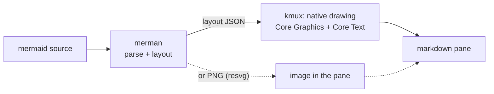

---

## 2. The Candidates

Repo metadata, 2026-10-09:

| | merman | mermaid-rs-renderer (mmdr) | BeautifulMermaid | Selkie |
|---|---|---|---|---|
| Repo | [Latias94/merman](https://github.com/Latias94/merman) | [1jehuang/mermaid-rs-renderer](https://github.com/1jehuang/mermaid-rs-renderer) | [lukilabs/beautiful-mermaid-swift](https://github.com/lukilabs/beautiful-mermaid-swift) | [btucker/selkie](https://github.com/btucker/selkie) |
| Language | Rust, with Swift, Kotlin, Python, Wasm bindings | Rust | Swift | Rust |
| Stars / forks | 580 / 38 | 1,758 / 106 | 363 / 24 | 31 / 5 |
| Last push | 2026-10-08 | 2026-10-04 | 2026-04-27 | 2026-07-07 |
| Pace | 100 commits in the last 8 days, ~6,000 total | 100 commits May–Sep | 7 commits total | quiet since May |
| Latest release | v0.8.0 (2026-10-06) | v0.3.1 (2026-07-06) | 1.0.4 (2026-04-27) | v0.3.0 (2026-02-07) |
| Contributors | 16 (one main author) | 7 | 1 | 2 |
| Recent crate downloads | 111k | 135k | — | 2.4k |
| License | Apache-2.0 | MIT | MIT | MIT |
| Goal | Parity with mermaid.js (tracks Mermaid 12.1.0 at a pinned commit; checks against upstream SVG goldens) | Speed | A restyled mermaid ("beautiful-mermaid"), 6 types | Port of mermaid.js, graded by an eval against it |

---

## 3. How We Tested

- **Corpus (50 diagrams).** All 38 distinct mermaid diagrams in our docs (kmux, kanna-v4, kanna-v3): 29 flowcharts, 5 sequence diagrams, 4 state diagrams. Plus one sample of each of 12 other kinds: class, ER, Gantt, pie, mindmap, timeline, gitGraph, journey, XY chart, quadrant, and flowchart and sequence diagrams using more features. In `spikes/mermaid-bakeoff/corpus/`.
- **Reference.** mermaid.js 12.1.0 (the current release) in headless Chromium.
- **Candidates.** Each renders a PNG at its native path: merman 0.8.0 `render -f png --scale 2` (its resvg pipeline), mmdr `-e png`, Selkie `render -e png` (both 1x; neither has a scale option), BeautifulMermaid's `renderPNG` at scale 2. Each also writes an SVG, used for the label check and for vector timings.
- **Speed.** Best of 3 runs per diagram. For the CLIs, start-up is measured with a trivial diagram and subtracted (merman 20 ms, mmdr 8 ms, Selkie 12 ms). BeautifulMermaid and mermaid.js are timed in-process, warm.
- **Fidelity.** Labels: share of the words in mermaid.js's SVG also present in the candidate's SVG. Shape: aspect-ratio difference from mermaid.js. And by eye: every diagram side by side (`target/bakeoff/out/composites/`).

---

## 4. Results

### 4.1 Numbers

| | mermaid.js | merman | mmdr | Selkie | BeautifulMermaid |
|---|---:|---:|---:|---:|---:|
| Rendered | 50/50 | **50/50** | 50/50 | 50/50 | 43/50 |
| Median time to PNG (ms) | — | 18.1 | 18.0 | 12.6 | 10.6 |
| Median time to vector (ms) | 7.9 (SVG, in browser) | 1.5 (SVG) | 11.5 (SVG) | 0.2 (SVG) | 2.2 (layout + Core Graphics) |
| Labels present (mean) | — | **99.7%** | 97.4% | 99.2% | 97.8% |
| Aspect ratio vs mermaid.js (median difference) | 0 | **1.3%** | 30% | 28% | 43% |
| Diagrams with aspect off by >25% | — | **1** | 28 | 27 | 33 |

All of them are fast enough: every diagram in our docs renders in well under a frame's budget once you leave out process start-up. Rasterizing to PNG is most of the PNG time. The one "missing label" for merman, mmdr and Selkie is gitGraph's random commit ID, which differs every run.

BeautifulMermaid rejects Gantt, gitGraph, journey, mindmap, pie, quadrant and timeline (`invalidHeader`).

### 4.2 By eye

**merman** draws the same layout as mermaid.js on all 50 diagrams: the same node positions, edge routes and sizes. Its PNG (resvg) path loses some styling: subgraph fills and some `classDef` colours come out grey, sequence-diagram note backgrounds are missing, and one label in a parallelogram (`[/kmux CLI/]`) is blank. Edge labels that mermaid.js wraps sometimes stay on one line. These are drawing issues, not layout ones.

**mmdr** has its own look: larger rounded nodes and its own routing. Simple diagrams are fine. Complex state diagrams overlap, one diagram shows raw source text (`st["Staging…`), and the timeline drops an item.

**Selkie** doesn't wrap long labels, so many of our flowcharts become very wide strips of tiny text. State diagrams overlap and fall back to a serif font. Its chart-like types (pie, quadrant, XY, gantt) are close to mermaid.js.

**BeautifulMermaid** draws in its own style and doesn't wrap labels. On macOS, its `renderImage`/`renderPNG` output is flipped vertically. That's a bug in its AppKit drawing path, and would need fixing before use.

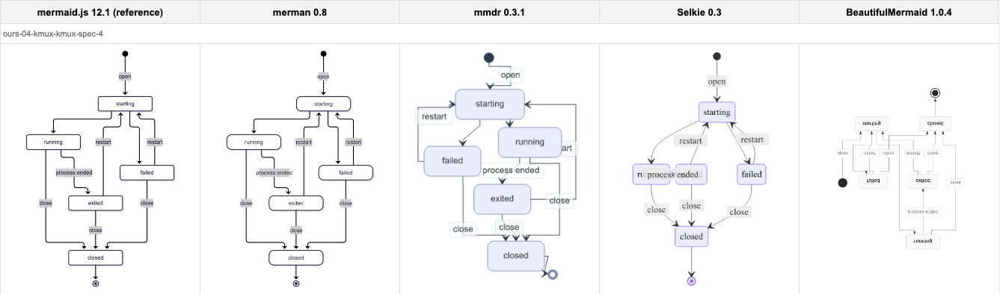

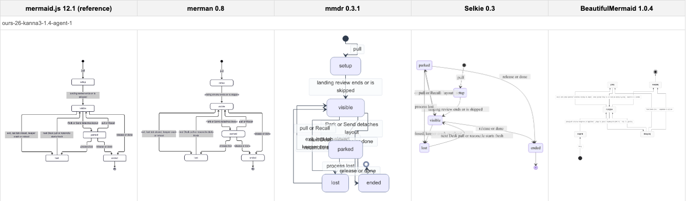

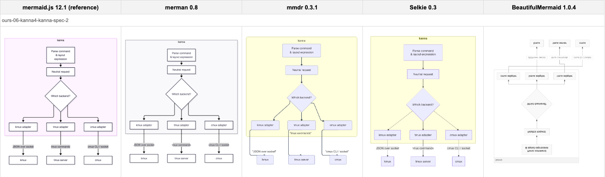

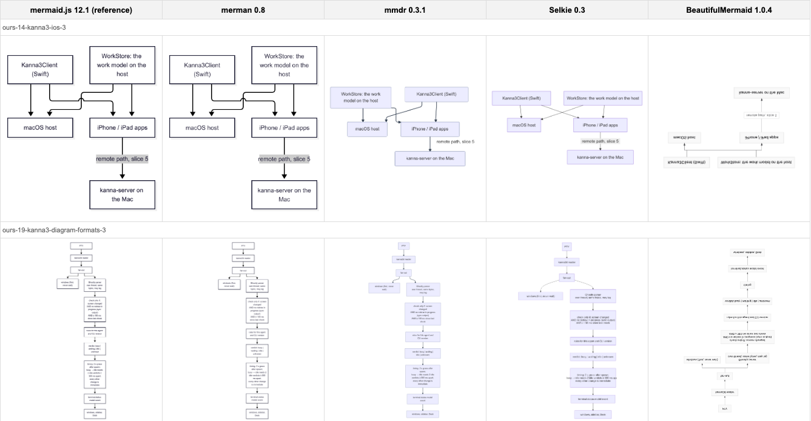

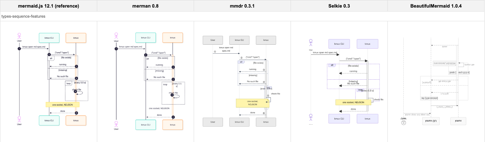

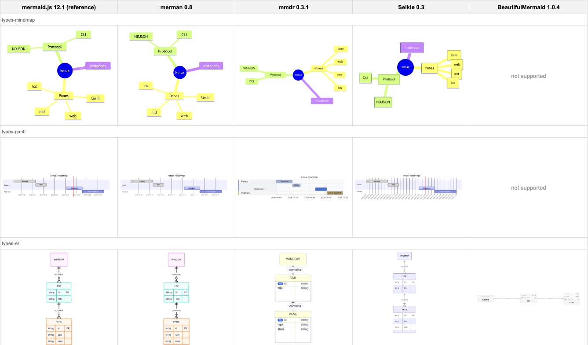

---

## 5. Fitting Into a Native App

A native pane needs to draw the diagram without a web view, crisp at any zoom (pinch included).

| | How it would draw in kmux | Crisp when zoomed | Effort |
|---|---|---|---|
| merman → **layout JSON → our own drawing** | merman parses and lays out (≈7 ms incl. start-up via the CLI); kmux draws nodes, edges and labels with Core Graphics and Core Text, in our own theme | ✅ vector, redrawn at any scale | Medium: a drawer per diagram type; flowchart, sequence and state cover all our docs |
| merman → **PNG (resvg)** | Build merman's xcframework with its export feature; show the image | ⚠️ raster; re-render at the new scale when zoom settles (≈20 ms), as kanna-v3 did for diagrams | Small |
| merman → **SVG → NSImage** | macOS can load the SVG itself | ❌ macOS draws it wrongly (below) | — |
| BeautifulMermaid | Pure Swift; draws with Core Graphics | ✅ vector | Small to adopt, but 6 types, its own style, flipped on macOS |
| mmdr / Selkie | Rust libraries; we'd write the C/Swift bridge | Raster or SVG | Medium, for worse output |

**macOS can't draw merman's SVG.** `NSImage` loads all 50 SVGs (84 ms median), but arrow markers become black wedges, colours are lost, boxes turn dashed and text falls back to a serif font:

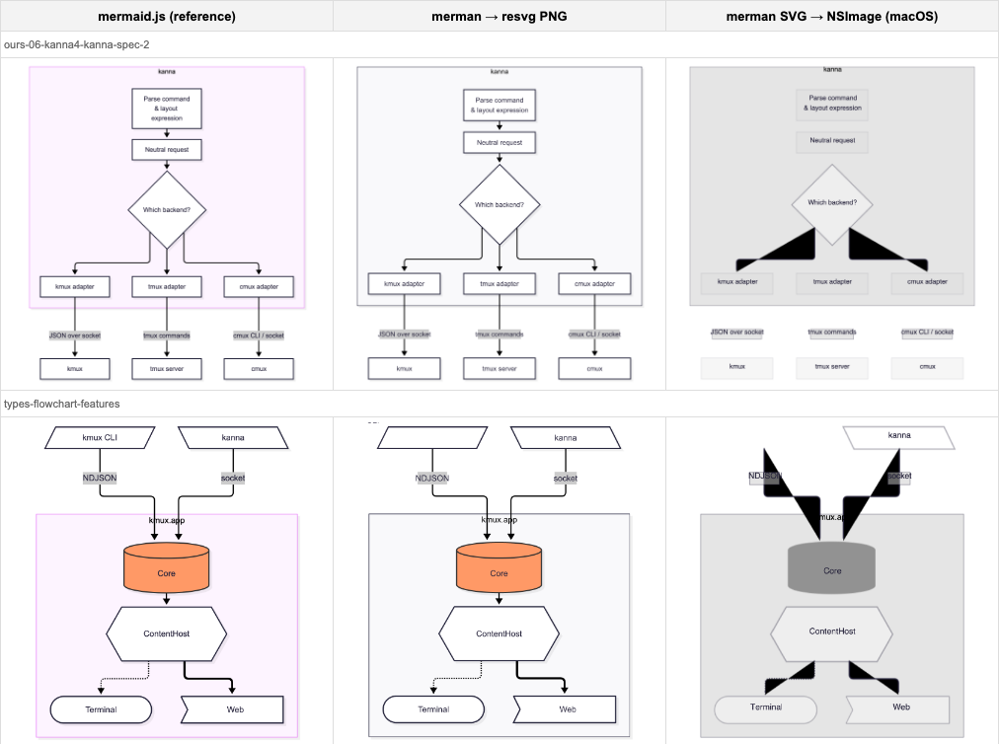

**merman's Swift package** is real but early. The repo has a `Package.swift` and a generated UniFFI binding (`Merman.swift`, `renderSvg`, `execute`, cancellation, deadlines). There is no published binary: you build `Merman.xcframework` with `scripts/build-apple-xcframework.sh`, which needs Rust 1.95 (we have 1.93). The default xcframework includes SVG, ASCII and layout, but leaves out PNG, JPEG and PDF export; a custom build can add them. The API is versioned (`bindingApiVersionV7`) and still moving quickly.

---

## 6. Code Quality and Size

### 6.1 Code quality

merman is enormous for what it does, and almost certainly written mostly by coding agents, but it is disciplined: idiomatic Rust, documented, tested against mermaid.js, linted and fuzzed. The risk is less the code than its size and its single maintainer.

| Measure | merman 0.8.0 |
|---------|--------------|
| Rust, all crates | ≈ 970,000 lines (27 crates); ≈ 495,000 in library code outside tests and tooling |
| Generated code | ≈ 30,000 lines (LALRPOP parsers for flowchart, sequence, class, ER and state, plus binding tables). The rest is written by hand or agent. |
| Crates kmux would use | `merman-core` (parsing, 98k lines), `merman-render` (layout and SVG, 175k), `dugong` + `dugong-graphlib` (a port of the dagre layout library, 15k) |
| Repo size | 324 MB checked out: 200 MB of fixtures (3,766 SVG goldens, 4,194 `.mmd` inputs), 15 MB of docs (84 plans, 56 "workstreams") |
| Dependencies | 584 crates in `Cargo.lock` (the whole workspace, including LSP, WASM, Python, Node and Android bindings) |
| `unsafe` | Forbidden in `merman-core` and `merman-render` (`#![forbid(unsafe_code)]`); 126 uses confined to the C FFI crate |
| Panic sites in library code | 546 `unwrap()`, 1,090 `expect()`, 139 `panic!`, 124 `unreachable!`; the ones sampled guard internal invariants, with messages ("a self-loop helper node is present after insertion"), not bad input. The C FFI wraps calls in `catch_unwind`. |
| Very long functions | ≈ 34 over 400 lines; `layout_flowchart_with_model` is ≈ 865 |
| Tests | Parity tests against upstream mermaid SVG goldens (`xtask compare`), per-feature diagram tests, doc tests; `cargo nextest` in CI |
| CI | 23 workflows: `cargo fmt --check`, `clippy -D warnings`, tests, weekly fuzzing (7 targets: parse, render, SVG, FFI…), `cargo audit`, performance runs |
| History | One author, ≈ 6,000 commits since February 2026, ≈ 100 a week, through PRs with conventional commit messages. An `AGENTS.md` sets rules for agents ("prefer source-backed convergence over pixel hacks"). The pace and the volume of plans and reports point to agent-driven development. |

**Reading the parts we'd use:**

- **Parsing** is generated LALRPOP grammars with hand-written lexers, closely following mermaid's own Jison grammars. Readable, with source spans kept for editor diagnostics.
- **Layout** (`dugong`) is a module-by-module port of dagre (`acyclic`, `rank`, `order`, `position`…), which makes it easy to check against the original.
- **Text measurement** is a `TextMeasurer` trait with many browser-imitating variants (`getBBox`, `getBoundingClientRect`, tspan widths) because it chases mermaid.js's exact numbers. It is over-engineered, but the **Swift binding exposes a host measurer** (`MermanTextMeasurer`), so kmux can measure labels with Core Text. That answers the text-measurement risk in [5](#5-fitting-into-a-native-app).
- **Structure** shows its origin: thorough, defensive, deeply abstracted (operation control, cancellation, capability descriptors everywhere), with some huge functions. It's fine to call, hard to change. We would not want to patch it locally; fixes should go upstream.

**What it means for us:** the bus factor is one. If the author stops, nobody else knows 500,000 lines of agent-written Rust. Mitigations: pin an exact version, build it ourselves from a pinned tag, use only layout (the smallest, most stable surface), and keep the drawing code ours. If merman goes away, the pinned version keeps working; dugong (15k lines) is small enough to fork.

### 6.2 Size

What each would add to kmux. The CLIs include their own command-line code; the merman probes are a minimal program that lays out one diagram (`spikes/mermaid-bakeoff/size-probe`, release, LTO, stripped, arm64), less the 0.3 MB of an empty Rust program.

| What | Size |
|------|-----:|
| **merman, flowchart + sequence + state, layout only** | **7.2 MB** |
| …same, optimised for size (`opt-level = "z"`, panics abort) | 3.5 MB |
| merman, every diagram type + SVG + ELK layout (its default) | 18.0 MB |
| merman CLI release (everything: PNG/PDF export, fonts, LSP, ASCII) | 38.1 MB stripped (43.4 MB as shipped) |
| mmdr CLI | 6.4 MB stripped |
| Selkie CLI | 3.9 MB (already stripped) |
| BeautifulMermaid, in a tiny Swift CLI | 6.7 MB stripped |
| mermaid.min.js 12.1.0 (needs a web view) | 5.5 MB |
| For scale: kmux.app today (GhosttyKit included) | 16 MB |

Panics must stay unwinding (not aborting) inside an app, so the realistic cost is **about 4–7 MB**: similar to the alternatives and to mermaid.js, but 25–45% of kmux.app's 16 MB. Most of it is merman's mermaid-compatible configuration, theming and text machinery, which every diagram type carries.

---

## 7. Building It

*Built 2026-10-09 as `KmuxDiagram` in `apps/kmux`. Reproduce the comparison with `spikes/mermaid-bakeoff/compare-native.py`.*

We followed the recommendation: merman lays the diagram out, and kmux draws it.

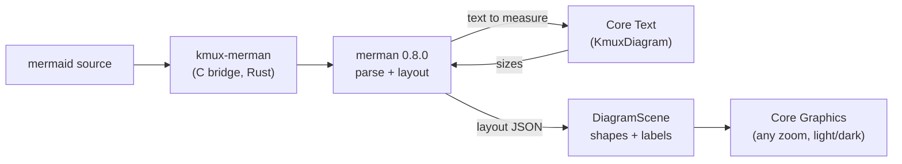

| Piece | Where | What it does |
|-------|-------|--------------|
| C bridge | `crates/kmux-merman` | One call: source in, layout JSON out. Panics are caught there and returned as errors. |
| Build | `scripts/build-merman.sh` | Builds the bridge with Rust 1.95 (`--locked`, merman pinned to `=0.8.0`) into `target/merman/KmuxMerman.xcframework`. `build-kmux.sh` runs it; it's a no-op when nothing changed. |
| Text measurement | `KmuxDiagram/Text.swift` | merman's host measurer calls back into Core Text, so boxes are sized for the font kmux draws with. Drawing wraps and spaces lines with the same code. |
| Drawing | `KmuxDiagram/Flowchart.swift`, `Sequence.swift`, `State.swift` | Shapes, edges and arrowheads, subgraphs, `classDef`/`style` colours; actors, messages, notes, frames (`alt`, `loop`, …), activations, autonumbers; states, start/end, composites. |
| View | `KmuxDiagram/DiagramView.swift` | An `NSView` that sizes itself to the diagram × zoom and redraws as vectors. Unsupported types and errors show a message and the source. |
| Checks | `kmux-diagram` tool, `KmuxDiagramTests`, `debug.diagram`, e2e §8b | Render the corpus to PNG; label, size and fit checks; the same path inside the app. |

### 7.1 Results against mermaid.js

| Measure | Result |
|---------|--------|
| Drawn | 40/40 flowchart, sequence and state diagrams (all 38 from our docs, plus 2 feature samples). The 10 other types report themselves as unsupported, as intended. |
| Labels present | 100% in every diagram |
| Size vs mermaid.js | within 25% in all 40 |
| Labels shrunk to fit their box | 0 (every label fits at the size merman measured) |
| Layout, warm | median 1.3 ms, p90 2.2 ms, max 4.1 ms |
| Drawing, warm (2× bitmap, no encoding) | median 1.4 ms, p90 3.0 ms, max 3.9 ms |
| Size added to kmux | 7.6 MB stripped (merman, its dependencies and the bridge) |

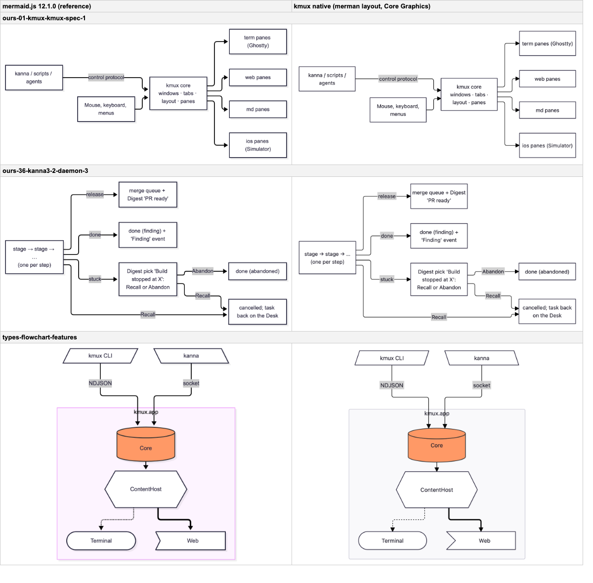

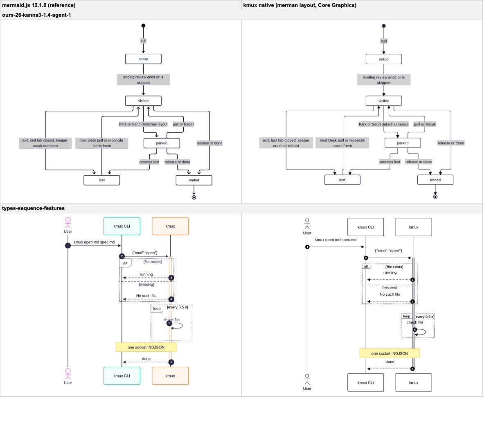

### 7.2 Differences and open problems

- **Colours.** Mermaid 12's default theme gives each sequence actor and subgraph its own pastel colour. kmux draws them neutral (white, light grey), matching the rest of the page in light and dark. `classDef` and `style` colours are honoured.
- **Wrapping.** Core Text text is narrower than the browser's, so a few labels wrap differently (e.g. "term panes (Ghostty)" fits on one line natively). Diamonds sometimes wrap where mermaid doesn't.
- **ELK.** merman's default flowchart look routes edges with ELK, the same as mermaid 12. Dropping ELK would save 1.3 MB (6.3 MB instead of 7.6 MB) but change how flowchart edges are routed, so we keep it.
- **Bounds.** merman's layout bounds are computed before the host measurer widens boxes, so kmux sizes the scene from what it draws instead. Worth reporting upstream.
- **Not yet.** Other diagram types (class, ER, Gantt, pie, …), clickable nodes (`click`), icons and images in nodes, markdown inside labels beyond bold/italic/code, and themes from `%%{init}%%`.

## 8. Recommendation

**Use merman** for parsing and layout. It's the only one that matches mermaid.js, it covers every diagram type, it's very active, and it's Apache-2.0.

**Draw natively** from merman's layout, in kmux's own Core Graphics and Core Text code. That keeps the pane fully native, crisp under pinch and zoom, and themed with the rest of the page (light and dark). Start with flowchart, sequence and state, which cover all 38 diagrams in our docs. Other types fall back to merman's PNG, or to showing the source with a note.

What we'd need to build or upstream:

- Build `Merman.xcframework` in kmux's build script (pinned version, Rust 1.95 via rustup), like GhosttyKit.
- **Text measurement:** use the binding's host measurer (`MermanTextMeasurer`) so merman sizes boxes with Core Text, in the font kmux draws with.
- **Pin and contain it:** an exact version, built from source at a pinned tag; only the flowchart, sequence and state features and layout output (≈ 4–7 MB); panics left unwinding, caught at the boundary. The bus factor is one, so the drawing code stays ours and the dependency stays narrow.
- The drawers: flowchart (shapes, edge routes and markers, subgraphs, `classDef`), sequence (actors, messages, notes, `alt` and `loop` boxes), state.
- If we use the PNG fallback: report the resvg styling gaps upstream (subgraph fill, note background, parallelogram label).

Not recommended: BeautifulMermaid (narrow, off-style, inactive, flipped on macOS); mmdr and Selkie (fast, but their layouts don't match mermaid and break on our larger diagrams).

---

## 9. Glossary

| Term | Meaning |
|------|---------|
| **mermaid / mermaid.js** | A text format for diagrams, and the JavaScript library that draws it. The reference here. |
| **Parity** | Producing the same output as mermaid.js. |
| **Layout** | Working out where every node, edge and label goes. The hard part of a renderer. |
| **resvg** | A Rust library that draws SVG into a bitmap, without a browser. |
| **Raster / vector** | A raster image is pixels (blurs when enlarged); vector drawing is shapes, redrawn sharp at any size. |
| **UniFFI / xcframework** | UniFFI generates Swift bindings for a Rust library; an xcframework packages the compiled library for Apple platforms. |
| **Core Graphics / Core Text** | macOS's native 2D drawing and text layout. |
| **Bus factor** | How many people would have to leave before nobody can maintain a project. |
| **LTO** | Link-time optimisation: the compiler optimises the whole program at link time, dropping unused code. |
| **Panic (unwind / abort)** | A Rust crash. Unwinding lets the caller catch it; aborting ends the whole process, which in an app means kmux quits. |
| **Headless Chromium** | A browser with no window, used here only to draw the mermaid.js reference. |
