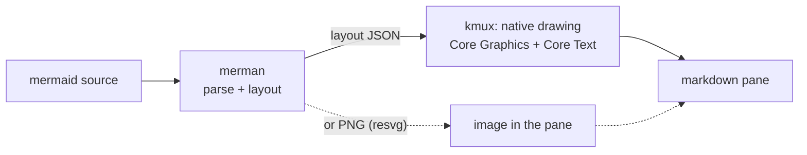

# Native Mermaid Renderers: Bake-off

*2026-10-09. Reproduce with `spikes/mermaid-bakeoff/run.sh`.*

kmux's markdown pane is going native ([spec, Native UI](../kmux-spec.md#81-decided)), so it can't draw mermaid diagrams with mermaid.js in a web view. This compares the four open-source renderers that draw mermaid without a browser, against mermaid.js itself, on the diagrams in our own docs.

**Recommendation: [merman](https://github.com/Latias94/merman).** It is the only candidate whose output matches mermaid.js: same layout, same sizes, all labels. The others draw their own interpretation, and break on our larger diagrams. We'd use merman for parsing and layout, and draw natively ourselves (see [6](#6-recommendation)).

## Table of Contents

1. [At a Glance](#1-at-a-glance)
2. [The Candidates](#2-the-candidates)
3. [How We Tested](#3-how-we-tested)
4. [Results](#4-results)
5. [Fitting Into a Native App](#5-fitting-into-a-native-app)
6. [Recommendation](#6-recommendation)
7. [Glossary](#7-glossary)

---

## 1. At a Glance

| | merman | mmdr | Selkie | BeautifulMermaid |
|---|:---:|:---:|:---:|:---:|
| Renders our 38 diagrams | ✅ 38/38 | ✅ 38/38 | ✅ 38/38 | ✅ 38/38 |
| Renders the 12 other types | ✅ 12/12 | ✅ 12/12 | ✅ 12/12 | ❌ 5/12 |
| Looks like mermaid.js | ✅ near-identical | ❌ own layout and style | ❌ own layout, long labels unwrapped | ❌ own style; image upside down on macOS |
| Readable on our complex diagrams | ✅ | ⚠️ overlaps | ⚠️ overlaps, very wide | ⚠️ tiny, unwrapped |
| Active | ✅ daily | ✅ | ⚠️ quiet since May | ❌ one-off drop |
| Swift | Swift package over a Rust library (build the xcframework yourself) | Rust only | Rust only | Pure Swift package |

---

## 2. The Candidates

Repo metadata, 2026-10-09:

| | merman | mermaid-rs-renderer (mmdr) | BeautifulMermaid | Selkie |
|---|---|---|---|---|
| Repo | [Latias94/merman](https://github.com/Latias94/merman) | [1jehuang/mermaid-rs-renderer](https://github.com/1jehuang/mermaid-rs-renderer) | [lukilabs/beautiful-mermaid-swift](https://github.com/lukilabs/beautiful-mermaid-swift) | [btucker/selkie](https://github.com/btucker/selkie) |
| Language | Rust, with Swift, Kotlin, Python, Wasm bindings | Rust | Swift | Rust |
| Stars / forks | 580 / 38 | 1,758 / 106 | 363 / 24 | 31 / 5 |
| Last push | 2026-10-08 | 2026-10-04 | 2026-04-27 | 2026-07-07 |
| Pace | 100 commits in the last 8 days, ~6,000 total | 100 commits May–Sep | 7 commits total | quiet since May |
| Latest release | v0.8.0 (2026-10-06) | v0.3.1 (2026-07-06) | 1.0.4 (2026-04-27) | v0.3.0 (2026-02-07) |
| Contributors | 16 (one main author) | 7 | 1 | 2 |
| Recent crate downloads | 111k | 135k | — | 2.4k |
| License | Apache-2.0 | MIT | MIT | MIT |
| Goal | Parity with mermaid.js (tracks Mermaid 12.1.0 at a pinned commit; checks against upstream SVG goldens) | Speed | A restyled mermaid ("beautiful-mermaid"), 6 types | Port of mermaid.js, graded by an eval against it |

---

## 3. How We Tested

- **Corpus (50 diagrams).** All 38 distinct mermaid diagrams in our docs (kmux, kanna-v4, kanna-v3): 29 flowcharts, 5 sequence diagrams, 4 state diagrams. Plus one sample of each of 12 other kinds: class, ER, Gantt, pie, mindmap, timeline, gitGraph, journey, XY chart, quadrant, and flowchart and sequence diagrams using more features. In `spikes/mermaid-bakeoff/corpus/`.
- **Reference.** mermaid.js 12.1.0 (the current release) in headless Chromium.
- **Candidates.** Each renders a PNG at its native path: merman 0.8.0 `render -f png --scale 2` (its resvg pipeline), mmdr `-e png`, Selkie `render -e png` (both 1x; neither has a scale option), BeautifulMermaid's `renderPNG` at scale 2. Each also writes an SVG, used for the label check and for vector timings.
- **Speed.** Best of 3 runs per diagram. For the CLIs, start-up is measured with a trivial diagram and subtracted (merman 20 ms, mmdr 8 ms, Selkie 12 ms). BeautifulMermaid and mermaid.js are timed in-process, warm.
- **Fidelity.** Labels: share of the words in mermaid.js's SVG also present in the candidate's SVG. Shape: aspect-ratio difference from mermaid.js. And by eye: every diagram side by side (`target/bakeoff/out/composites/`).

---

## 4. Results

### 4.1 Numbers

| | mermaid.js | merman | mmdr | Selkie | BeautifulMermaid |
|---|---:|---:|---:|---:|---:|
| Rendered | 50/50 | **50/50** | 50/50 | 50/50 | 43/50 |
| Median time to PNG (ms) | — | 18.1 | 18.0 | 12.6 | 10.6 |
| Median time to vector (ms) | 7.9 (SVG, in browser) | 1.5 (SVG) | 11.5 (SVG) | 0.2 (SVG) | 2.2 (layout + Core Graphics) |
| Labels present (mean) | — | **99.7%** | 97.4% | 99.2% | 97.8% |
| Aspect ratio vs mermaid.js (median difference) | 0 | **1.3%** | 30% | 28% | 43% |
| Diagrams with aspect off by >25% | — | **1** | 28 | 27 | 33 |

All of them are fast enough: every diagram in our docs renders in well under a frame's budget once you leave out process start-up. Rasterizing to PNG is most of the PNG time. The one "missing label" for merman, mmdr and Selkie is gitGraph's random commit ID, which differs every run.

BeautifulMermaid rejects Gantt, gitGraph, journey, mindmap, pie, quadrant and timeline (`invalidHeader`).

### 4.2 By eye

**merman** draws the same layout as mermaid.js on all 50 diagrams: the same node positions, edge routes and sizes. Its PNG (resvg) path loses some styling: subgraph fills and some `classDef` colours come out grey, sequence-diagram note backgrounds are missing, and one label in a parallelogram (`[/kmux CLI/]`) is blank. Edge labels that mermaid.js wraps sometimes stay on one line. These are drawing issues, not layout ones.

**mmdr** has its own look: larger rounded nodes and its own routing. Simple diagrams are fine. Complex state diagrams overlap, one diagram shows raw source text (`st["Staging…`), and the timeline drops an item.

**Selkie** doesn't wrap long labels, so many of our flowcharts become very wide strips of tiny text. State diagrams overlap and fall back to a serif font. Its chart-like types (pie, quadrant, XY, gantt) are close to mermaid.js.

**BeautifulMermaid** draws in its own style and doesn't wrap labels. On macOS, its `renderImage`/`renderPNG` output is flipped vertically. That's a bug in its AppKit drawing path, and would need fixing before use.

---

## 5. Fitting Into a Native App

A native pane needs to draw the diagram without a web view, crisp at any zoom (pinch included).

| | How it would draw in kmux | Crisp when zoomed | Effort |
|---|---|---|---|
| merman → **layout JSON → our own drawing** | merman parses and lays out (≈7 ms incl. start-up via the CLI); kmux draws nodes, edges and labels with Core Graphics and Core Text, in our own theme | ✅ vector, redrawn at any scale | Medium: a drawer per diagram type; flowchart, sequence and state cover all our docs |
| merman → **PNG (resvg)** | Build merman's xcframework with its export feature; show the image | ⚠️ raster; re-render at the new scale when zoom settles (≈20 ms), as kanna-v3 did for diagrams | Small |
| merman → **SVG → NSImage** | macOS can load the SVG itself | ❌ macOS draws it wrongly (below) | — |
| BeautifulMermaid | Pure Swift; draws with Core Graphics | ✅ vector | Small to adopt, but 6 types, its own style, flipped on macOS |
| mmdr / Selkie | Rust libraries; we'd write the C/Swift bridge | Raster or SVG | Medium, for worse output |

**macOS can't draw merman's SVG.** `NSImage` loads all 50 SVGs (84 ms median), but arrow markers become black wedges, colours are lost, boxes turn dashed and text falls back to a serif font:

**merman's Swift package** is real but early. The repo has a `Package.swift` and a generated UniFFI binding (`Merman.swift`, `renderSvg`, `execute`, cancellation, deadlines). There is no published binary: you build `Merman.xcframework` with `scripts/build-apple-xcframework.sh`, which needs Rust 1.95 (we have 1.93). The default xcframework includes SVG, ASCII and layout, but leaves out PNG, JPEG and PDF export; a custom build can add them. The API is versioned (`bindingApiVersionV7`) and still moving quickly.

---

## 6. Recommendation

**Use merman** for parsing and layout. It's the only one that matches mermaid.js, it covers every diagram type, it's very active, and it's Apache-2.0.

**Draw natively** from merman's layout, in kmux's own Core Graphics and Core Text code. That keeps the pane fully native, crisp under pinch and zoom, and themed with the rest of the page (light and dark). Start with flowchart, sequence and state, which cover all 38 diagrams in our docs. Other types fall back to merman's PNG, or to showing the source with a note.

What we'd need to build or upstream:

- Build `Merman.xcframework` in kmux's build script (pinned version, Rust 1.95 via rustup), like GhosttyKit.
- **Text measurement:** merman sizes nodes with its own font metrics. If kmux draws with the system font, labels may not fit their boxes. We'd either draw with the font merman measures with, or ask merman to measure with ours (a measurer hook in its constructor services, possibly upstream).
- The drawers: flowchart (shapes, edge routes and markers, subgraphs, `classDef`), sequence (actors, messages, notes, `alt` and `loop` boxes), state.
- If we use the PNG fallback: report the resvg styling gaps upstream (subgraph fill, note background, parallelogram label).

Not recommended: BeautifulMermaid (narrow, off-style, inactive, flipped on macOS); mmdr and Selkie (fast, but their layouts don't match mermaid and break on our larger diagrams).

---

## 7. Glossary

| Term | Meaning |
|------|---------|
| **mermaid / mermaid.js** | A text format for diagrams, and the JavaScript library that draws it. The reference here. |
| **Parity** | Producing the same output as mermaid.js. |
| **Layout** | Working out where every node, edge and label goes. The hard part of a renderer. |
| **resvg** | A Rust library that draws SVG into a bitmap, without a browser. |
| **Raster / vector** | A raster image is pixels (blurs when enlarged); vector drawing is shapes, redrawn sharp at any size. |
| **UniFFI / xcframework** | UniFFI generates Swift bindings for a Rust library; an xcframework packages the compiled library for Apple platforms. |
| **Core Graphics / Core Text** | macOS's native 2D drawing and text layout. |
| **Headless Chromium** | A browser with no window, used here only to draw the mermaid.js reference. |
