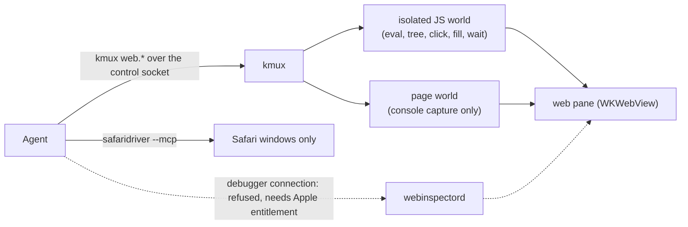
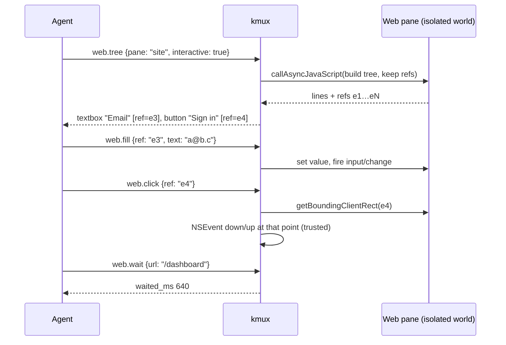

# Web Pane Access for Agents

> Research for the kmux roadmap item "improve webview access for agents", 2026-10-09. Nothing here is built.
> Every claim is tagged: **[verified]** means I checked it on this Mac (macOS 26.2, Safari 26.2, Xcode 26.6) with small test programs; **[source]** means it comes from a published document listed in [section 9](#9-sources); **[general]** means it is general knowledge that I didn't check.

## Table of Contents

1. [Summary and Recommendation](#1-summary-and-recommendation)
2. [Can Agents Use Apple's Tools on kmux's Web Views?](#2-can-agents-use-apples-tools-on-kmuxs-web-views)
3. [What WKWebView Lets kmux Do Itself](#3-what-wkwebview-lets-kmux-do-itself)
4. [Proposed Commands](#4-proposed-commands)
5. [Compared with Safari MCP, Playwright MCP and cmux](#5-compared-with-safari-mcp-playwright-mcp-and-cmux)
6. [Security](#6-security)
7. [Recommended First Set](#7-recommended-first-set)
8. [Open Questions](#8-open-questions)
9. [Sources](#9-sources)
10. [Glossary](#10-glossary)

---

## 1. Summary and Recommendation

**The user's hope doesn't work out.** An agent can't reach kmux's web views through Apple's inspector, because macOS only lets Apple-signed Safari attach to them. Safari's MCP server drives Safari windows only. So if kmux wants agents to see and drive its web panes, **kmux has to provide that access through its own control protocol**. That turns out to be easy: WKWebView already has everything needed except network capture.

| Question | Answer | Basis |
|---|---|---|
| Can an agent attach to kmux's web views through `webinspectord` (the Develop menu's back end)? | **No.** The debugger side needs a private Apple entitlement. Without it, webinspectord drops the connection and logs "did not have entitlement". | [verified] |
| Can Safari's MCP server drive them? | **No.** It only drives Safari windows it opens itself. It isn't even in this Mac's Safari 26.2 (`safaridriver --mcp` is rejected as an unrecognised option). It shipped in Safari 27. | [verified] + [source] |
| Can the "Safari Web Inspector Bridge" MCP server? | **No.** It reaches iOS devices through ios-webkit-debug-proxy (USB / lockdown). It can't reach Mac apps. | [source] |
| Should kmux still set `isInspectable`? | **Yes.** It's one line, and it lets a *person* open Safari's Web Inspector on a kmux web pane. Agents gain nothing from it. | [verified] + [general] |
| Can kmux do it natively? | **Yes.** The isolated JavaScript world, async eval, snapshots and trusted clicks all worked in a test app running in the background. | [verified] |
| Recommended first set | `isInspectable` on; plus `web.eval`, `web.tree` (accessibility snapshot with refs), `web.click`, `web.fill`, `web.wait` and `web.console`; screenshots go through the planned `snapshot` command. | [section 7](#7-recommended-first-set) |



---

## 2. Can Agents Use Apple's Tools on kmux's Web Views?

### 2.1 How Safari's Develop menu attaches

| Part | What it does | Basis |
|---|---|---|
| `webinspectord` | A per-user launch agent with two XPC services: `com.apple.webinspector`, where apps register their inspectable web views, and `com.apple.webinspector.debugger`, where debuggers connect. | [verified] (its launchd plist) |
| An app's web view | Registers with `com.apple.webinspector` when `isInspectable` is true (macOS 13.3+). | [source] |
| Safari | Holds `com.apple.private.webinspector.remote-inspection-debugger`, which lets it connect as a debugger. | [verified] (`codesign -d --entitlements`) |
| `safaridriver` | Holds `com.apple.private.webinspector.driver-client`. | [verified] |

### 2.2 What I tried

1. **A test app** (Swift, AppKit) with one inspectable WKWebView in a window placed off-screen and ordered to the back, run in the background and stopped by PID. It loaded and reported `isInspectable=true`. [verified]
2. **An unentitled XPC client.** It connected to `com.apple.webinspector.debugger` and sent WebKit's "get listing" message. The connection was dropped at once, and webinspectord logged:
   `Debugger Connection from PID (28178) did not have entitlement.` [verified]
3. **The same client on the app-side service** (`com.apple.webinspector`). webinspectord treated the client as an *app*: it asked the client for *its* listing of web views. That service is where web views register, so it can't be used to inspect others. [verified]

Entitlements starting with `com.apple.private.` can't be given to third-party code on a normal Mac. [general] Apple forum threads say the same about the inspector entitlements. [source] There is **no supported way** for a third-party process to inspect a Mac app's web views. I found no open-source tool that does it either. [source]

### 2.3 Safari MCP and the Bridge

| | Safari MCP (`safaridriver --mcp`) | Safari Web Inspector Bridge |
|---|---|---|
| Ships in | Safari 27 (2026-09-17) and Safari Technology Preview 247+; **not** in Safari 26.2 [verified] | Open source, third party |
| Targets | Safari windows that the agent session opens, marked with a banner | WKWebViews on iOS devices with `isInspectable` |
| How it gets in | Safari's private automation channel; the user must turn on "Allow remote automation and external agents" | ios-webkit-debug-proxy → usbmuxd → the device's lockdown `webinspector` service |
| kmux web panes? | **No** | **No** (Mac apps aren't supported) |
| Basis | [source] [verified] | [source] |

**Exception: iOS panes.** The iOS Simulator runs its own webinspectord, which listens on a plain Unix socket (`com.apple.webinspectord_sim.socket`) with no entitlement check. ios-webkit-debug-proxy and Appium use it. [source] So an inspectable WKWebView inside an app running in a kmux iOS pane, or Mobile Safari there, *can* be reached by those tools. One report says the socket may be missing under Xcode 27. [source] This is outside this document's scope and belongs with the iOS agent-control research.

### 2.4 What this means

Waiting for Apple doesn't help kmux. Apple's direction is "agents drive Safari", not "agents inspect any web view". **Safari MCP is still useful alongside kmux**: when an agent just needs *a* browser rather than the pane the user is looking at, it can use Safari 27. kmux's job is the pane the user is looking at.

---

## 3. What WKWebView Lets kmux Do Itself

kmux's web pane today (`apps/kmux/Sources/Kmux/WebPaneView.swift`) is a plain WKWebView with the default website data store. It doesn't set `isInspectable`. Agents can only read the page's text, through `debug.web` (`document.body.innerText`). [verified]

Results from the test apps (all [verified]: off-screen window, accessory app, run in the background):

| Building block | Result | Consequence |
|---|---|---|
| Eval in a named **WKContentWorld** (`kmux-agent`) | Sees the page's DOM (`#x` text read fine) but not the page's JavaScript globals (`window.secret` was `undefined`). | Agent scripts can't be seen or broken by the page, and they can't clobber the page's code. |
| `callAsyncJavaScript` in that world | `await` worked and returned `document.title`. | `web.eval` can run async code and is the basis for `web.wait`. |
| Message handler scoped to the isolated world | The page saw `typeof webkit.messageHandlers.iso === "undefined"`. | The page can't post to kmux's agent-side channel. |
| `console` wrapped in the **isolated** world | Missed the page's `console.log` calls. | **Console capture has to be injected into the page world.** |
| `console` wrapped in the **page** world, with a page-world handler | Caught `boot` and `clicked …`. The page *can* see that handler. | Works, but the page could fake or flood console entries, so the buffer must be bounded. |
| `element.click()` from JS | Delivered with `event.isTrusted === false`. | Some sites ignore untrusted clicks. |
| A real `NSEvent` mouse down/up at the element's centre | `isTrusted === true`, even with the window off-screen and behind. | Clicks can be real, like `debug.click` today. |
| `takeSnapshot` | Returned a 400×300 image while the window was off-screen. | Element screenshots work without bringing anything forward. |
| Resource Timing read from the isolated world | Listed the `fetch` and `img` loads and the navigation entry. `responseStatus` was empty. | Basic network listing (URL, type, timing, size) is possible without touching the page. Status codes, headers and bodies are not. |
| The WKWebView's NSAccessibility tree, read in-process | Only one `AXGroup`, with no children. | The accessibility snapshot must be **computed in JavaScript** (roles and accessible names), not read from AppKit. Playwright does the same. [general] |

Other things that matter:

- **No console or network API.** WKWebView and macOS 26's `WebPage` have neither. [source] The fuller route is private WebKit SPI (`_WKResourceLoadDelegate`), which could break in any update. [general] It isn't recommended for a first version.
- **Frames.** Eval runs in the main frame unless a `WKFrameInfo` is given. kmux only learns frames from navigation and message callbacks. The first version is main frame only (cross-origin iframes later). [general]
- **Hidden panes.** A pane in a background tab has no window, so real NSEvent clicks can't reach it. JS fallbacks still work. [general]

---

## 4. Proposed Commands

### 4.1 Shape

- **Protocol:** a `web.` prefix (like the existing `debug.` commands). Every command takes `pane`. A non-web pane gets `wrong_type`, and a pane still starting or failed gets `bad_request`, as in the `snapshot` cases.
- **CLI:** one command group, `kmux web VERB PANE …`, so `kmux help` grows by a single line and `kmux help web` lists the verbs.
- **Targets:** `ref` (from `web.tree`, e.g. `e12`) **or** `selector` (CSS). Refs are the default way to target elements, because they come from what the agent just read.
- **Worlds:** everything runs in the isolated world `kmux-agent`, except console capture and `web.eval` with `world: "page"`.
- **Reply size:** text, tree and eval results are capped (e.g. 256 KB) with `truncated: true`, so a huge page can't overflow an agent's context.

### 4.2 Commands

| `cmd` | `args` | Reply | Notes |
|---|---|---|---|
| `web.eval` | `pane`, `js`, `world?` (`isolated` default / `page`), `args?` (JSON), `timeout?` (ms, default 5000) | `{ value }` (JSON) or a `js_error` error | Runs through `callAsyncJavaScript`, so `js` is a function body: `return`, `await` and `args` work. |
| `web.tree` | `pane`, `selector?` (subtree), `interactive?` (only things you can act on), `depth?` | `{ url, title, tree, refs }`: the tree as indented `role "name" [ref=e12]` lines, like Playwright's | Refs belong to the latest tree. They become `stale_ref` after a navigation or a newer `web.tree`. |
| `web.click` | `pane`, `ref` or `selector`, `button?`, `clicks?` | `{ trusted }` | Scrolls the element into view, then sends a real NSEvent at its centre if the pane is on screen; otherwise uses a JS click and replies `trusted: false`. It must **not** move kmux's focus to the pane. |
| `web.fill` | `pane`, `ref` or `selector`, `text`, `submit?` | `{}` | Sets the value through the native setter and fires `input` and `change` (as Playwright's fill does), so it works on hidden panes and never takes the keyboard. |
| `web.press` | `pane`, `key` (e.g. `Enter`, `Meta+a`) | `{}` | A real key event to the web view. *Later:* it needs the web view to be first responder, which conflicts with not stealing focus. |
| `web.wait` | `pane`, one of `selector`, `text`, `url` (substring), `js` (truthy), `load: true`; `state?` (`visible` / `attached` / `hidden`), `timeout?` (default 10000) | `{ waited_ms }` or a `timeout` error | Polls in the isolated world (MutationObserver, plus checks on navigation). |
| `web.console` | `pane`, `since?` (sequence number), `clear?`, `level?` | `{ entries: [{ seq, level, text, source?, time }], dropped }` | Covers `console.*`, uncaught errors and unhandled rejections. The page-world script is installed at document start. Each pane keeps a ring buffer of the last 1000 entries. |
| `web.network` | `pane`, `since?` | `{ document: { url, status }, entries: [{ url, type, start, duration, size }] }` | *Later.* Resource Timing plus the main document's status from the navigation delegate. Bodies and headers would need a page-world fetch/XHR wrapper or private SPI. |
| `snapshot` (planned on `rq/pane-snapshot`) | adds `selector?` / `ref?` for web panes | as planned | The element's box becomes the `region`. `text: true` on a web pane replaces `debug.web`. **No separate web screenshot command.** |

### 4.3 How it flows



### 4.4 CLI examples

```text
$ kmux web tree site --interactive
- textbox "Email" [ref=e3]
- button "Sign in" [ref=e4]
$ kmux web fill site e3 'a@b.c'
$ kmux web click site e4
$ kmux web wait site --url /dashboard
$ kmux web eval site 'return document.title'
"Dashboard"
$ kmux web console site --level error
[12:31:04] error  TypeError: x is undefined (app.js:41)
$ kmux snapshot site --selector '#chart' --path chart.png
```

A bare argument after the pane that looks like `e12` is a ref; anything else is a selector. `--ref` and `--selector` make it explicit.

---

## 5. Compared with Safari MCP, Playwright MCP and cmux

✅ has it · ◐ partly · — no. Safari MCP and Playwright MCP are from their docs [source]. cmux is from its public docs only [source]; no cmux source was read.

| Capability | Safari MCP (17 tools) | Playwright MCP | cmux browser | kmux proposed |
|---|---|---|---|---|
| Navigate, back, forward | ✅ `navigate_to_url` | ✅ | ✅ | ✅ existing `navigate` |
| Eval JS | ✅ `evaluate_javascript` | ✅ `browser_evaluate` | ✅ `eval` | ✅ `web.eval`, **isolated by default** |
| Page text / DOM | ✅ `get_page_content` (Markdown, HTML, JSON) | ◐ via snapshot | ✅ `get text/html` | ✅ `snapshot --text`; DOM via `web.eval` |
| Accessibility snapshot with refs | ◐ numeric node IDs | ✅ aria YAML, `[ref=eN]` | ✅ `snapshot` (format not documented) | ✅ `web.tree` |
| Click / type | ✅ `page_interactions` | ✅ click, type, fill, press, hover, drag | ✅ many verbs | ◐ click, fill (press, hover later) |
| By selector or by ref | node IDs | ref or selector | selector (refs mentioned) | ref or selector |
| Wait | ◐ `wait_for_navigation` | ✅ `browser_wait_for` | ✅ `wait` (selector, text, URL, JS) | ✅ `web.wait` |
| Console | ✅ | ✅ | ✅ `console`, `errors` | ✅ `web.console` |
| Network | ✅ list and full request | ✅ list and one request | — not documented | Later; timing and URLs only at first |
| Screenshot | ✅ | ✅ | ✅ | ✅ `snapshot` (+ element) |
| Dialogs | ✅ | ✅ | ✅ | Later |
| Cookies / storage | — | ✅ (opt-in) | ✅ | Later |
| Viewport / media emulation | ✅ | ✅ | — | Later (the pane's size is the layout's) |
| Tabs | ✅ | ✅ | ✅ | n/a: one page per pane; use `open` |
| Targets | Safari windows it opened | its own Chromium/WebKit/Firefox | its own panes | **the panes the user is looking at** |

What kmux gets that the others don't: the agent tests **the same pane the user is watching**, next to the dev server's terminal and the iOS pane, with no second browser. What it gives up: Playwright's real network interception and multi-engine support. An agent that needs those should use Playwright MCP or Safari MCP alongside kmux.

---

## 6. Security

### 6.1 Who may call these commands

| Layer | Today | Proposal | Basis |
|---|---|---|---|
| Socket file | `0600`: only the user's processes can connect | Keep | [verified] `SocketServer.swift` |
| Which processes | Any process run by the user | **Unchanged for the first set** (see below). Later, an optional cmux-style mode that only accepts processes started inside kmux panes, by checking the peer's PID (`LOCAL_PEERPID`) and its ancestry. kanna would need an exception. | [general]; cmux's modes are [source] |
| Per pane | — | `kmux open web --no-agent` (protocol: `agent: false`) turns off `web.*` for a pane, e.g. one where the user is logged in to something sensitive. The console script is then not injected either. | proposal |
| Per instance | — | A setting to turn `web.*` off for the whole instance. | proposal |

**Why not stricter by default?** Any process that can reach the socket can already `send` a command line to a terminal pane and run anything as the user. It can also read kmux's WebKit data directory on disk, cookies included. [general] `web.eval` adds no power the caller doesn't already have. It mostly adds convenience, plus one new risk: acting *as the logged-in user* on a site open in a pane. The per-pane switch and a private profile (below) cover that.

### 6.2 Page isolation

| Risk | Mitigation | Basis |
|---|---|---|
| The page sees or tampers with agent scripts | Everything except console capture runs in the `kmux-agent` content world. The page can't see its globals or its message handler. | [verified] |
| The page drives kmux | **No message handler ever maps to a control command.** The page-world console handler only appends text to a bounded per-pane buffer. | proposal |
| The page fakes or floods console output | A ring buffer (1000 entries, each capped in size); `dropped` is counted. Entries are data, never instructions. | proposal |
| The agent's page-world eval breaks the page | `world: "page"` is opt-in, per call. | proposal |
| Prompt injection through page text | Out of kmux's hands. Replies are data, and the docs for agents should say so. Size caps limit the damage. | [general] |
| Shared logins across panes | All panes use the default data store today. Add `kmux open web --private` (a non-persistent data store per pane) for agent work; keep the default for the user's own panes. | [verified] that today's panes use `.default()`; the rest is a proposal |
| `isInspectable` exposes panes | Only Safari, with the Develop menu turned on, on this Mac, can attach. That is the user's own choice. | [source] [general] |

---

## 7. Recommended First Set

In this order, each step useful on its own:

1. **`isInspectable = true`** on web panes. One line. A person can then debug a pane with Safari's Web Inspector.
2. **`snapshot` for web panes** (already being built): text replaces `debug.web`; add `selector`/`ref` for an element's region.
3. **`web.eval`**: isolated world by default, async, JSON result, timeout, size cap. On its own it covers the long tail (DOM queries, `location`, storage).
4. **`web.tree`** with refs, **`web.click`** and **`web.fill`**: the core of the snapshot → act → check loop agents already know from Playwright MCP.
5. **`web.wait`**: without it, agents fall back to sleeping, which is flaky.
6. **`web.console`**: the most-asked question when a page breaks ("what's in the console?").

Plus the `--no-agent` per-pane switch and the reply size caps from the start.

**Later:** `web.network` (Resource Timing and the document's status first), `web.press` and hover, dialogs, `--private` profiles, iframes, cookies and storage, and perhaps a `kmux mcp` stdio server that exposes these as MCP tools.

**Test plan** (for whoever builds it): shared protocol cases for argument checks and `wrong_type`. The e2e script serves a local page that logs to the console, has a form, and navigates on submit. It drives tree → fill → click → wait → console against a background kmux on a private socket.

---

## 8. Open Questions

1. **Should the agent commands be on by default** for every web pane, with `--no-agent` to opt out, or off until a pane opts in?
2. **Private profiles:** should panes opened by agents (or from kanna) default to a non-persistent data store, so they never touch the user's logins?
3. **Socket access:** do you want a cmux-style "only processes started inside kmux" mode, and should kanna be exempt from it?
4. **MCP:** should kmux ship a `kmux mcp` stdio server, or should kanna expose these commands to its agents?
5. **Focus:** when an agent clicks in a pane, kmux should *not* focus that pane or bring the window forward. Is that right, even for the visible pane?
6. **Network depth:** is URL, type, timing and document status enough, or are request and response bodies needed (a page-world fetch/XHR wrapper, or private WebKit SPI)?

---

## 9. Sources

- WebKit blog, Safari MCP server: https://webkit.org/?p=18136
- Apple, "Connecting an AI agent to Safari": https://developer.apple.com/documentation/safari-developer-tools/connecting-an-ai-agent-to-safari
- Safari MCP write-ups: https://azukiazusa.dev/en/blog/safari-mcp-server, https://ai.rud.is/posts/2026-07-02-safari-now-has-a-built-in-mcp-server-and-its-actually-good, https://byteiota.com/safari-27-ships-a-native-mcp-server-heres-what-to-do/
- Safari Web Inspector Bridge: https://github.com/andesco/safari-web-inspector-bridge, https://glama.ai/mcp/servers/andesco/safari-web-inspector-bridge
- ios-webkit-debug-proxy: https://github.com/google/ios-webkit-debug-proxy
- inspect-webkit (desktop Safari can't be listed from userland): https://github.com/EvanBacon/inspect-webkit
- Simulator inspector socket under Xcode 27: https://github.com/quern-dev/quern/issues/184
- Apple forums on inspector entitlements: https://developer.apple.com/forums/thread/745027, https://developer.apple.com/forums/thread/125603
- WebKit for SwiftUI (`WebPage`): https://wwdcnotes.com/documentation/wwdc25-231-meet-webkit-for-swiftui/
- Playwright MCP: https://github.com/microsoft/playwright-mcp; aria snapshots: https://playwright.dev/docs/aria-snapshots
- cmux public docs: https://cmux.com/docs/browser-automation, https://cmux.com/docs/api, the README at https://github.com/manaflow-ai/cmux
- Checked on this Mac: `launchctl print gui/$UID`, `/System/Library/LaunchAgents/com.apple.webinspectord.plist`, `codesign -d --entitlements` on Safari, safaridriver and webinspectord, `safaridriver --mcp`, webinspectord's log, and three throwaway test programs (an inspectable WKWebView app and an XPC client). They lived in a temporary directory and are not committed.

---

## 10. Glossary

| Term | Meaning |
|---|---|
| **Accessibility snapshot / tree** | A text outline of a page as assistive technology sees it: each element's role (button, textbox…) and accessible name. Agents read it instead of raw HTML. |
| **Content world (WKContentWorld)** | A separate JavaScript namespace in the same page. Scripts in it share the DOM with the page but not its variables or functions. The page's own scripts run in the **page world**. |
| **Entitlement** | A signed permission in an app's code signature. Ones named `com.apple.private.*` are reserved for Apple's own software. |
| **isInspectable** | A WKWebView property (macOS 13.3+) that lets Safari's Web Inspector attach to that web view. |
| **MCP** | Model Context Protocol: a standard way to offer tools to AI agents, usually as a small server over stdio. |
| **Ref** | A short ID such as `e12` that names an element from the latest accessibility snapshot, so later commands can target it. |
| **Resource Timing** | A browser API (`performance.getEntriesByType('resource')`) that lists the page's loads with timing and sizes, but not their contents. |
| **Trusted event** | A DOM event that came from real input (`event.isTrusted === true`), rather than from a script. Some sites ignore untrusted ones. |
| **webinspectord** | The macOS background service that connects inspectable web views to Safari's Web Inspector. |
| **XPC** | macOS's mechanism for messages between processes, used by webinspectord. |
