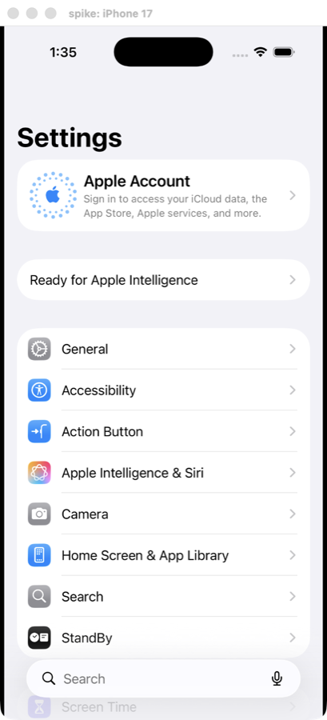

# Spike: the iOS Simulator inside a kmux pane

**Question:** can kmux show a simulator's screen in its own view and send it
touches, without Simulator.app? **Answer: yes.** Xcode 26.6, iOS 26.5, iPhone 17.



## How

| Need | Private API (loaded with `dlopen`, called through the ObjC runtime) |
|------|------|
| Find and boot a device | `SimServiceContext` → `defaultDeviceSetWithError:` → `devices` (CoreSimulator). Boot headless with `xcrun simctl boot UDID`: no Simulator.app window. |
| The screen | `device.io.ioPorts` → each port's `descriptor`. The one answering `framebufferSurface` with `state.displayClass == 0` is the main display. `framebufferSurface` is an `IOSurface` (1206×2622 BGRA) that goes straight into a `CALayer`'s `contents`. |
| Frame updates | `registerCallbackWithUUID:damageRectanglesCallback:` fires per update; we call the layer's `setContentsChanged`. `registerCallbackWithUUID:ioSurfacesChangeCallback:` says when to fetch a new surface (e.g. rotation). |
| Touches | `IndigoHIDMessageForMouseNSEvent(point, NULL, 0x32, eventType, size, edge)` from SimulatorKit, with the point as a fraction of the screen and size 1×1, sent with `SimDeviceLegacyHIDClient` `sendWithMessage:freeWhenDone:completionQueue:completion:`. Down, dragged and up map to touch began, moved and ended. |

Apple's own `SimDisplayView` (SimulatorKit) wasn't usable: it renders only
once Swift-only properties are wired up. The framebuffer route above is what
Facebook's idb uses, and the protocols involved (`SimDisplayIOSurfaceRenderable`,
`SimDisplayRenderable`) are stable across recent Xcodes.

| Home button | `IndigoHIDMessageForButton(0, 1 down / 2 up, 0x33)` (three ints; values as in idb). ⇧⌘H in the spike, as in Simulator.app. Works. |
| Swipes from an edge | The last argument of the mouse message is an edge. A bottom swipe with edge 2 switched apps once; with other values it was an ordinary drag. Going home by swiping up doesn't work yet: Simulator.app sends edge gestures through its digitizer input view, which this spike doesn't use. Use ⇧⌘H. |

## Measurements

| What | Result |
|------|--------|
| Attach to a booted device and show its screen | ~0.1 s |
| Frame rate while the screen changes | up to 61 frames/s |
| Sending a touch | 0.2–0.4 ms |
| Tap → first screen update (app launch animation) | 35–39 ms (3 runs) |
| The window behind other apps | still updates, so a background kmux keeps showing it |

## Not covered yet (for the real ios pane)

- Booting from kmux (CoreSimulator `bootWithOptions:error:`, or `simctl boot`), installing and launching the app (`simctl install` / `launch`), failing with the list of devices.
- Keyboard: `IndigoHIDMessageForKeyboardNSEvent` exists next to the mouse one.
- Home and other hardware buttons: `IndigoHIDMessageForButton`.
- Scroll gestures, two-finger touches (the second point argument), rotation.
- Private APIs can change with Xcode: the pane should fail clearly if a selector is missing.

## Run it

```sh
clang -fobjc-arc -framework AppKit -framework QuartzCore sim.m -o /tmp/sim
xcrun simctl boot UDID
/tmp/sim --udid UDID --front                         # click to tap
/tmp/sim --udid UDID --tap 0.83,0.51 --capture a.png # scripted, stays behind other windows
```

`probe.m`, `ioprobe.m` and `protoprobe.m` list the private classes, ports and
protocols, for when an Xcode update changes them.
